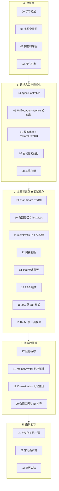

# 00 主链路学习路线

## 一句话结论

AGI-saber Java 版的主链路可以浓缩为一句话：**HTTP 请求进 AgentController → UnifiedAgentService 调度 → 记忆召回 + 路由判断 → 调用 LLM/工具 → 回答返回 + 后台记忆沉淀。**

---

## 1. 先建立全局地图



---

## 2. 如果只为面试，重点看这 8 个

| 优先级 | 文件 | 为什么 |
|---|---|---|
| ★★★ | 02-完整时序图 | 面试官最常问"一个请求进来后发生了什么" |
| ★★★ | 05-UnifiedAgentService 初始化 | StartUp 准备了什么，展示了架构全貌 |
| ★★★ | 09-chatStream 主流程 | 整个系统的调度中心 |
| ★★★ | 11-memPrefix 上下文构建 | 记忆系统如何进入 LLM prompt |
| ★★★ | 12-路由判断 | chat/tool/react/rag 四种模式怎么切换 |
| ★★★ | 15-单工具 tool 模式 | 最简单完整的工具调用链路 |
| ★★★ | 16-ReAct 模式 | 最复杂的多工具编排链路，展示架构深度 |
| ★★ | 10-短期记忆与 histMsgs | memPrefix 的搭档 |

---

## 3. 学习顺序建议

```text
第 1 天：建地图
  → 00 学习路线（本文）
  → 01 系统全景图
  → 02 完整时序图（仔细看！）
  → 03 核心对象总览

第 2 天：初始化
  → 04 AgentController 请求入口
  → 05 UnifiedAgentService 初始化
  → 06 数据库恢复
  → 07 知识图谱初始化
  → 08 工具注册

第 3 天：主回答链路（核心！）
  → 09 chatStream 主流程
  → 10 短期记忆与 histMsgs
  → 11 memPrefix 上下文构建
  → 12 路由判断

第 4 天：四种模式
  → 13 chat 普通聊天模式
  → 14 RAG 模式
  → 15 单工具 tool 模式
  → 16 ReAct 多工具模式

第 5 天：回答后与面试复习
  → 17~20 回答后处理
  → 21 完整例子跑一遍
  → 22 常见面试题
  → 23 简历说法
```

---

## 4. 读代码最短路径

用 IDE 打开这 5 个文件，按顺序看：

| 优先级 | 文件 | 重点看什么 |
|---|---|---|
| 必看 | `AgentController.java` | `/api/chat` 和 `/api/chat/stream` 两个入口方法 |
| 必看 | `UnifiedAgentService.java` | `init()` 初始化装配、`processStream()` 主调度 |
| 必看 | `ChatRouter.java` | `decideMode()` 四种模式的判断条件 |
| 必看 | `ToolModeHandler.java` | `run()` 五步走：decide → 取工具 → 补参数 → 执行 → LLM 总结 |
| 建议看 | `ReActLoop.java` | Planner → GraphRuntime 的编排调度 |

---

## 5. 实操任务

用 IDE 在 `UnifiedAgentService.processStream` 打断点，追踪一次请求：

```text
1. stm.add("user", query)          — 用户消息进短期记忆
2. infra.saveChatHistory(...)      — 聊天记录落库
3. buildMemorySystemPrefix(...)    — 偏好 + 长期记忆拼成 memPrefix
4. ChatRouter.decideMode(...)      — 判断走 chat/tool/react/rag
5. 根据 mode 走不同 Handler
6. stm.add("assistant", answer)    — 助手回答进短期记忆
7. memoryWriter.writeAfterReply(...) — 后台沉淀长期记忆
```

你能跑通这 7 个点，就能讲清主链路。

---

## 6. 阅读每个文件时的心法

打开任何一篇文档，按这个顺序看：

```text
第 1 步：看"一句话结论"
    → 30 秒理解这个模块干什么

第 2 步：看"它在主链路里的位置"
    → 搞清楚它的上游是谁、下游是谁

第 3 步：看"源码逐段讲解"
    → 跟着代码走，理解每一行做了什么

第 4 步：看"真实举例：它在流程中怎么运行"
    → 把这个模块放回主链路，看输入输出

第 5 步：看"完整例子跑一遍"
    → 跟着变量走，确认自己真的懂了

第 6 步：看"面试怎么说"
    → 把理解转化成面试表达
```

---

## 7. 和其他学习材料的关系

```text
01-memory-system/   → 深入讲解记忆系统四类记忆的写入、去重、召回、整理
02-tool-react-system/ → 深入讲解工具对象模型、注册、路由、单工具、ReAct、竞速

00-main-chain-learning/（本文档夹）
    → 把上面两个体系串起来
    → 从"一次请求"的视角讲完整链路
    → 面试导向：不追求百科全完，追求"能讲清楚"
```
