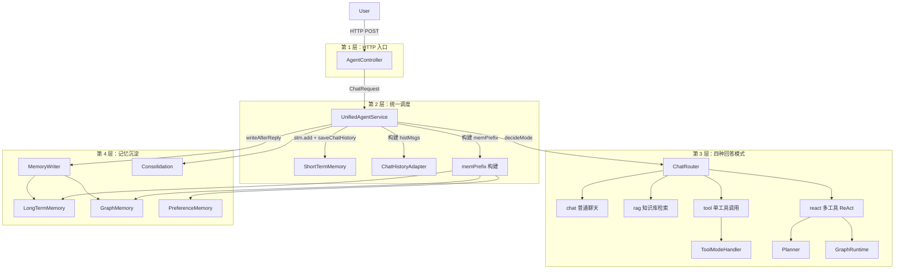
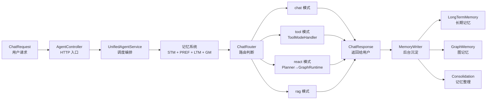

# 01 系统全景图

## 一句话结论

AGI-saber 把一次用户请求拆成 4 个层次：HTTP 入口 → 调度编排 → 回答模式 → 记忆沉淀，四层各司其职，上层不关心下层实现。

---

## 它在主链路里的位置

这是整个系统的全局地图。它不像其他文档讲某一小段代码，而是告诉你"系统有哪几层、每层干什么、关键对象是什么"。

```text
学习路线  →  01 系统全景图（本文）→  02 完整时序图  →  03 核心对象
    ↑                                                    ↓
    └─────────────────── 后面深入每个模块 ──────────────────┘
```

先看全景图再看细节，不会迷路。

---

## 为什么需要它

当有人说"AGI-saber 怎么工作的"，你不能上来就讲 `ShortTermMemory.add` 的细节。你需要先画出四层结构：

```text
问：这个系统怎么工作的？
答：分四层——
  第 1 层：AgentController 接收 HTTP 请求
  第 2 层：UnifiedAgentService 统一调度
  第 3 层：四种回答模式（chat/tool/react/rag）
  第 4 层：记忆系统在幕后做写入和整理
```

没有全景图，你就只能把代码一行行念给人家听。

---

## 对应源码位置

| 层级            | 核心文件                       | 核心方法                                             |
| ------------- | -------------------------- | ------------------------------------------------ |
| 第 1 层 HTTP 入口 | `AgentController.java`     | `chat()`, `chatStream()`                         |
| 第 2 层 调度编排    | `UnifiedAgentService.java` | `init()`, `processStream()`, `processInternal()` |
| 第 3 层 路由判断    | `ChatRouter.java`          | `decideMode()`                                   |
| 第 3 层 单工具     | `ToolModeHandler.java`     | `run()`                                          |
| 第 3 层 多工具规划   | `Planner.java`             | `planGraph()`                                    |
| 第 3 层 图执行引擎   | `GraphRuntime.java`        | `execute()`                                      |
| 第 4 层 回复后写入   | `MemoryWriter.java`        | `writeAfterReply()`                              |
| 第 4 层 短期记忆    | `ShortTermMemory.java`     | `add()`, `getMessages()`                         |
| 第 4 层 长期记忆    | `LongTermMemory.java`      | `storeClassified()`, `recall()`                  |
| 第 4 层 偏好记忆    | `PreferenceMemory.java`    | `extractAndSave()`, `buildContext()`             |
| 第 4 层 图记忆     | `GraphMemory.java`         | `storeClassified()`, `recall()`                  |

---

## 先看对象长什么样

整个系统有 7 个关键对象在四层之间流动。

### ChatRequest——HTTP 请求体

```java
ChatRequest req = new ChatRequest();
req.query = "查上海天气并搜索小雨出门建议";
req.mode = null;            // 不指定，让系统自动判断
req.selectedTools = null;   // 不指定工具
req.useRag = false;
req.needLongMemory = true;
```

这是用户从浏览器或者 API 客户端发来的请求。它只表达"用户想要什么"，不关心后端怎么实现。

### ChatResponse——HTTP 响应体

```java
ChatResponse resp = new ChatResponse();
resp.query = "查上海天气并搜索小雨出门建议";
resp.answer = "上海今天小雨，出门建议带伞...";
resp.mode = "react";           // 最终走的模式
resp.steps = 3;                // 执行了多少步骤
resp.toolCall = null;
resp.extractedInfo = null;
```

系统处理完以后，把结果填入这个对象，然后返回给前端。`mode` 字段在调试和日志里非常有用——可以看出路由决策的结果。

### ConversationMessage——短期记忆里的一条消息

```java
ConversationMessage msg = new ConversationMessage(
    "user",                     // 谁说的
    "查上海天气并搜索小雨出门建议",  // 说了什么
    "14:35:21"                  // 什么时候说的
);
```

只在 `ShortTermMemory.messages` 列表和 `chat_history` 表里出现。

### MemoryItem——一条长期记忆

```java
MemoryItem item = new MemoryItem();
item.id = "mem_001";
item.content = "用户叫小李";
item.importance = 0.85;
item.embedding = new float[]{0.12, -0.34, 0.56, ...};  // 256 维向量
item.score = 0.92;            // 本次召回的相似度得分
item.category = "personal_info";
item.tags = List.of("姓名", "用户信息");
item.slotHint = "user_name";
item.createdAt = "2026-06-22T14:30:00";
item.updatedAt = "2026-06-22T14:30:00";
```

在长时记忆系统（LTM）和记忆力写入器中创建，被召回后放入 `memPrefix` 进入 LLM system prompt。

### Tool——一个工具的定义

```java
Tool tool = new Tool();
tool.name = "get_weather";
tool.description = "获取城市天气信息";
tool.parameters = List.of(
    new ToolParam("city", "string", true, "城市名称")
);
tool.execute = params -> {
    String city = params.get("city");
    return "上海今天小雨，23°C";
};
```

`Tool` 在启动时注册到 `ts`（工具库 Map），被 `ToolModeHandler` 或 `GraphRuntime` 调用。

### ToolCallResult——一次工具调用的记录

```java
ToolCallResult result = new ToolCallResult();
result.toolName = "get_weather";
result.params = Map.of("city", "上海");
result.toolResult = "上海今天小雨，23°C";
```

记录"谁调了哪个工具、传了什么参数、返回了什么"。这些信息在 LLM 综合生成回答时会作为 observation 传入。

### Node——任务图中的一个节点

```java
Node node = new Node();
node.id = "n1";
node.type = "tool";
node.name = "查询天气";
node.toolName = "get_weather";
node.params = Map.of("city", "上海");
node.dependsOn = new ArrayList<>();    // 没有依赖
node.raceGroup = "";                   // 不参与竞速
```

由 `Planner` 创建，由 `GraphRuntime` 执行。多个 Node 组成一张任务 DAG。

---

## 核心流程图

### 四层架构总览



### 数据流动方向



---

## 源码逐段讲解

### 7.1 第 1 层：AgentController——HTTP 入口

```java
@RestController
@RequestMapping("/api")
public class AgentController {
    @Autowired
    private ChatApplicationService chatService;

    @PostMapping("/chat")
    public ChatResponse chat(@RequestBody ChatRequest req) { ... }

    @PostMapping("/chat/stream")
    public void chatStream(@RequestBody ChatRequest req,
                           HttpServletResponse response) { ... }
}
```

`AgentController` 是整个系统的最外层。它只做三件事：

```text
① 接收 HTTP POST 请求
    ↓
② 把 JSON 反序列化成 ChatRequest 对象
    ↓
③ 调用 ChatApplicationService 处理
    ↓
④ 把 ChatResponse 序列化回 JSON 返回
```

**为什么需要这个层？** 因为入口可能不止 HTTP。如果以后需要支持 WebSocket、gRPC、或者消息队列入口，只需要在对应的 Controller/Handler 里调用同样的 `ChatApplicationService`。入口和业务逻辑分离。

`/chat` 和 `/chat/stream` 的区别：

| 接口 | 返回方式 | 适用场景 |
|---|---|---|
| `/chat` | 一次性返回完整 JSON | 简单请求、非流式前端 |
| `/chat/stream` | SSE (Server-Sent Events) 逐条推送 | 实时展示工具调用过程 |

---

### 7.2 第 2 层：ChatApplicationService——业务门面

```java
@Service
public class ChatApplicationService {
    @Autowired
    private UnifiedAgentService agentService;

    public ChatResponse chat(ChatRequest req) {
        ChatResponse resp = new ChatResponse();
        agentService.processInternal(req.query, req, resp, null);
        return resp;
    }

    public void chatStream(ChatRequest req, Consumer<StreamEvent> onEvent) {
        agentService.processStream(req, onEvent);
    }
}
```

这一层在 `AgentController` 和 `UnifiedAgentService` 之间。它负责：

```text
把 Controller 的 HTTP 格式转成 Service 需要的回调格式（onEvent）
```

**为什么需要它？** 因为 `UnifiedAgentService.processStream` 需要传一个 `Consumer<StreamEvent>` 作为事件回调——在流式场景下，每个步骤产生的事件都要推给前端。如果 Controller 直接依赖 `UnifiedAgentService`，Controller 就得知道怎么处理流式回调。加这一层隔离，Controller 只关心 HTTP 请求/响应。

❌ 如果 `Controller` 直接注入 `UnifiedAgentService`：

```java
// 耦合：Controller 既管 HTTP 又管流式回调
agentService.processStream(req, event -> {
    // SSE 推送逻辑写在这里
    // 以后改成 WebSocket 得改 Controller
});
```

✅ 有了 `ChatApplicationService`，Controller 不需要知道 `onEvent` 是什么：

```java
// 解耦：Controller 只调用一个方法
chatService.chatStream(req, event -> ssePush(event));
```

---

### 7.3 第 2 层核心：UnifiedAgentService——调度中心

```java
@Component
public class UnifiedAgentService {
    private ShortTermMemory stm;
    private PreferenceMemory pref;
    private LongTermMemory ltm;
    private GraphMemory gm;
    private MemoryWriter memoryWriter;
    private Map<String, Tool> tools;  // 工具库
    private InfrastructureService infra;
    private AppConfig cfg;
}
```

这是整个系统最核心的类。它持有所有子系统的实例。

`processStream` 是主调度方法，执行顺序为：

```text
① 工具过滤（如果前端选了指定工具）
    ↓
② stm.add("user", query) + 保存聊天历史
    ↓
③ 异步提取偏好（不阻塞）
    ↓
④ 同步规则提取偏好
    ↓
⑤ 构建 memPrefix（偏好 + 长期记忆 + 图记忆）
    ↓
⑥ 构建 histMsgs（短期记忆转 LLM 格式）
    ↓
⑦ ChatRouter.decideMode 判断模式
    ↓
⑧ 根据 mode 走不同 Handler
    ↓
⑨ stm.add("assistant", answer)
    ↓
⑩ MemoryWriter.writeAfterReply 后台沉淀
    ↓
⑪ Consolidation 检查
```

**为什么 UnifiedAgentService 不直接调 LLM？** 因为它只做"调度"——它决定用什么方式回答，但不自己执行。具体执行交给第 3 层的 Handler（ToolModeHandler、ReActLoop 等）。这也是"编排"和"执行"分离的架构模式。

---

### 7.4 第 3 层：模式选择与执行

四种模式：

```java
String mode = ChatRouter.decideMode(query, explicit, useRag,
                                     selectedTools, ragLoaded);

switch (mode) {
    case "chat"  -> /* 直接 LLM 回答 */;
    case "tool"  -> ToolModeHandler.run(query, ts, memPrefix, histMsgs);
    case "react" -> /* Planner + GraphRuntime + LLM 综合 */;
    case "rag"   -> /* 只走知识库检索 */;
}
```

路由决策链（详细流程在 `ChatRouter.java` 中）：

```text
explicit 模式？
    ↓ 是
    selectedTools 非空？ → react
    useRag？        → rag
    兜底            → chat

非 explicit 模式？
    ↓
needReAct(query)？  → react（命中 ≥2 类子任务）
needTool(query)？   → tool（命中 1 类子任务）
needRAG(query)？    → rag（知识库已加载且非工具问题）
兜底                → chat（普通聊天）
```

**为什么 tool 用 `ToolModeHandler` 而 react 用 `Planner + GraphRuntime`？**

| 模式 | 执行引擎 | 为什么 |
|---|---|---|
| tool | `ToolModeHandler.run` | 只有 1 个工具，不需要规划——直接选一个工具执行 |
| react | `Planner → GraphRuntime` | 多个工具，需要规划依赖、并发竞速、结果聚合 |

所以 `ToolModeHandler` 的代码比 `GraphRuntime` 简单得多——它只有"选工具 → 补参数 → 执行 → 总结"四步。

---

### 7.5 第 4 层：记忆沉淀

```java
memoryWriter.writeAfterReply(query, answer);
```

这条调用在回答返回给用户之后异步执行。它做的事情：

```text
writeAfterReply(query, answer)
    ↓
LLM classify(answer)     → 判断回答是否包含可记忆信息
    ↓
提取记忆片段              → 从回答中拆分出事实
    ↓
storeClassified 写入长期记忆  → 保存到 PostgreSQL
storeClassified 写入图记忆    → 保存节点关系到 Neo4j
    ↓
needConsolidation()?     → 是否需要整理
    ↓ 是
consolidate() / graphAwareConsolidate()
    ↓
syncConsolidationToDB()
```

**`writeAfterReply` 是异步的。** 用户不会等这步——回答已经返回了，后台自己慢慢处理。所以即使记忆写入失败，用户也不会感知到延迟。

**为什么内存实系统放在第 4 层？** 因为记忆系统不是一个"回答模式"——它在回答之前（召回偏光/长期记忆到 `memPrefix`）和回答之后（写入新的记忆）都出现。它贯穿请求前、请求中、请求后，所以单独放一层。

---

### 7.6 启动初始化

系统启动时，`UnifiedAgentService.init()` 做这些事情：

```java
@PostConstruct
public void init() {
    restoreFromDB();              // 从数据库恢复短期记忆
    graphMemory.init();           // 初始化图记忆（Neo4j 连接/会话）
    registerTools();              // 注册内置工具到工具库
    registerMcpTools();           // 注册 MCP 工具
    memoryWriter.init();          // 初始化 MemoryWriter 的后台线程池
}
```

启动顺序很重要：

```text
① restoreFromDB
    从 chat_history 表加载最近聊天 → 写入 ShortTermMemory
    依赖：数据库连接可用

② graphMemory.init()
    初始化 Neo4j 图数据库连接
    依赖：GraphMemory 实例已创建

③ registerTools + registerMcpTools
    把所有工具（内置 + MCP）注册到 tools Map
    依赖：ToolRegistry 和 MCP 客户端

④ memoryWriter.init()
    启动后台写入线程
    依赖：LongTermMemory、GraphMemory、LLM 都可用
```

如果顺序颠倒，比如在 `restoreFromDB` 之前调 `registerTools`，系统也能工作——加载聊天历史和注册工具没有依赖关系。但 `memoryWriter.init()` 必须在 LTM 和 GM 初始化之后调用。

---

## 真实举例：它在流程中怎么运行

以"查上海天气"为例，看看四层各做了什么：

```text
第 1 层：AgentController
    ← 收到 HTTP POST /api/chat/stream
    ← body: {"query": "查上海天气"}
    → 调用 chatService.chatStream(req, onEvent)

第 2 层：UnifiedAgentService
    ← stm.add("user", "查上海天气")
    ← pref.extractAndSave("查上海天气") → 没提取到偏好
    ← buildMemorySystemPrefixWithCtx → 召回长期记忆（若有）
    ← ChatRouter.decideMode → "tool"
    ← 推 StreamEvent(mode="tool") 给前端

第 3 层：ToolModeHandler
    ← decideTool("查上海天气") → "get_weather"
    ← fillParams("get_weather", query) → {city: "上海"}
    ← execute 并得到结果
    ← LLM 总结："上海今天小雨，23°C，建议带伞。"
    → 推 StreamEvent(answer=...) 给前端

第 4 层：MemoryWriter
    ← writeAfterReply("查上海天气", "上海今天小雨...")
    ← LLM classify → "没有可保存的记忆"
    ← 跳过写入
```

三层各有职责，互不干扰。

---

## 关键判断条件

| 判断点 | 在哪里 | 条件 | true→ | false→ |
|---|---|---|---|---|
| 流式请求 | `AgentController` | HTTP header 或 URL 含 stream | 走 chatStream | 走 chat |
| 路由模式 | `ChatRouter.decideMode` | needReAct == true | react | 继续判断 |
| 路由模式 | `ChatRouter.decideMode` | needTool == true | tool | 继续判断 |
| 路由模式 | `ChatRouter.decideMode` | needRAG == true | rag | chat |
| 工具选择 | `ToolModeHandler` | 关键词命中 | 选对应工具 | 兜底 LLM |

---

## 容易混淆的点

### 1. `ChatRouter` 不在第 1 层

有些人以为"路由"应该在入口层（第 1 层），但实际上是 `UnifiedAgentService` 在第 2 层调 `ChatRouter`。原因：路由需要依赖第 2 层构建好的上下文（`memPrefix`、`histMsgs`、`selectedTools`）。

### 2. `MemoryWriter` 不是第 3 层的 Handler

`MemoryWriter` 不是回答模式。它独立于 chat/tool/react/rag——无论走哪种模式，回答后都会调 `writeAfterReply`。只是 `writeAfterReply` 内部判断"这次回答有没有值得保存的记忆"。

### 3. 第 4 层和第 2 层有交叉

第 2 层的 `buildMemorySystemPrefixWithCtx` 会调第 4 层的 `PreferenceMemory.buildContext()` 和 `LongTermMemory.recall()`。这说明四层不是严格线性的——第 2 层在回答前使用第 4 层的能力。

### 4. `ChatApplicationService` 不是多余的

它做了一件重要的事：把流式回调从 HTTP 层解耦出来。如果没有它，`AgentController` 需要知道 `Consumer<StreamEvent>` 的实现细节。

---

## 和其他模块的关系

### 和 `01-memory-system/` 的关系

记忆系统文档夹（`01-memory-system/`）深入讲解第 4 层的内部实现。全景图告诉你"系统有记忆模块，它在请求前做召回、请求后做写入"，记忆系统的文档告诉你"短期记忆怎么滑动窗口、长期记忆怎么写进去、图记忆的节点和边怎么管理"。

### 和 `02-tool-react-system/` 的关系

工具与 ReAct 文档夹（`02-tool-react-system/`）深入讲解第 3 层的内部实现。全景图告诉你"有单工具和 ReAct 两种模式"，工具系统的文档告诉你"工具怎么注册、路由怎么判断、Planner 怎么规划 DAG、GraphRuntime 怎么执行竞速"。

---

## 如果要改这个功能，改哪里

| 需求 | 修改位置 | 怎么改 | 影响范围 |
|---|---|---|---|
| 新增 HTTP 入口（如 WebSocket） | `AgentController` 或新 Controller | 新增方法调 `ChatApplicationService` | 仅第 1 层 |
| 新增回答模式 | `ChatRouter.decideMode` + 新 Handler | 加判断条件 + 新 Handler 类 | 第 2+3 层 |
| 改变记忆写入逻辑 | `MemoryWriter` 或 `LongTermMemory` | 修改 `writeAfterReply` 或 `storeClassified` | 仅第 4 层 |
| 改变 memPrefix 构建 | `UnifiedAgentService.buildMemorySystemPrefixWithCtx` | 修改怎么召回偏光/长期记忆 | 第 2+4 层交叉 |
| 修改启动顺序 | `UnifiedAgentService.init` | 调整 @PostConstruct 里的调用顺序 | 仅第 2 层初始化 |
| 新增工具类型 | `Tool` 对象模型 + 注册代码 | 实现 `execute` 方法 | 第 3 层 |

---

## 面试怎么说

完整回答：

```text
AGI-saber 的系统架构分四层。

第 1 层是 AgentController，处理 HTTP POST 请求，把 JSON 反序列化成 ChatRequest，然后调用 ChatApplicationService。

第 2 层是 UnifiedAgentService，是整个系统的调度中心。它先写入短期记忆，然后构建系统提示词前缀（召回偏好和长期记忆），再通过 ChatRouter 判断走哪种回答模式。

第 3 层是四种回答模式：chat 是普通聊天直接调 LLM；tool 是单工具调用走 ToolModeHandler；react 是多工具编排走 Planner + GraphRuntime；rag 是知识库检索。

第 4 层是记忆沉淀系统。回答返回后，MemoryWriter 在后台异步写入长期记忆和图记忆，并检查是否需要 consolidation 整理。

四层之间通过 ChatRequest/ChatResponse、ConversationMessage、MemoryItem、Tool 这七个核心对象传递数据。
```

短版：

```text
四层架构：HTTP 入口 → 统一调度 → 回答模式（chat/tool/react/rag）→ 记忆沉淀。各层关注点分离，第 2 层 UnifiedAgentService 是核心调度器。
```

---

## 自检题

1. 系统分为哪四层？每层的核心类是什么？
2. `ChatRouter.decideMode` 在哪一层调用？为什么不在第 1 层？
3. `MemoryWriter.writeAfterReply` 是同步还是异步？为什么？
4. 启动时 `UnifiedAgentService.init()` 的调用顺序是什么？
5. tool 模式和 react 模式分别用什么执行引擎？为什么不同？
6. `ChatApplicationService` 存在的目的是什么？
7. 第 2 层和第 4 层在哪里有交叉调用？
8. 系统的 7 个核心对象分别是什么？各自在哪层创建/消费？
9. 如果要新增一个"什么模式"，需要改哪些文件？
10. 前端显式选择了工具，走 tool 还是 react？
