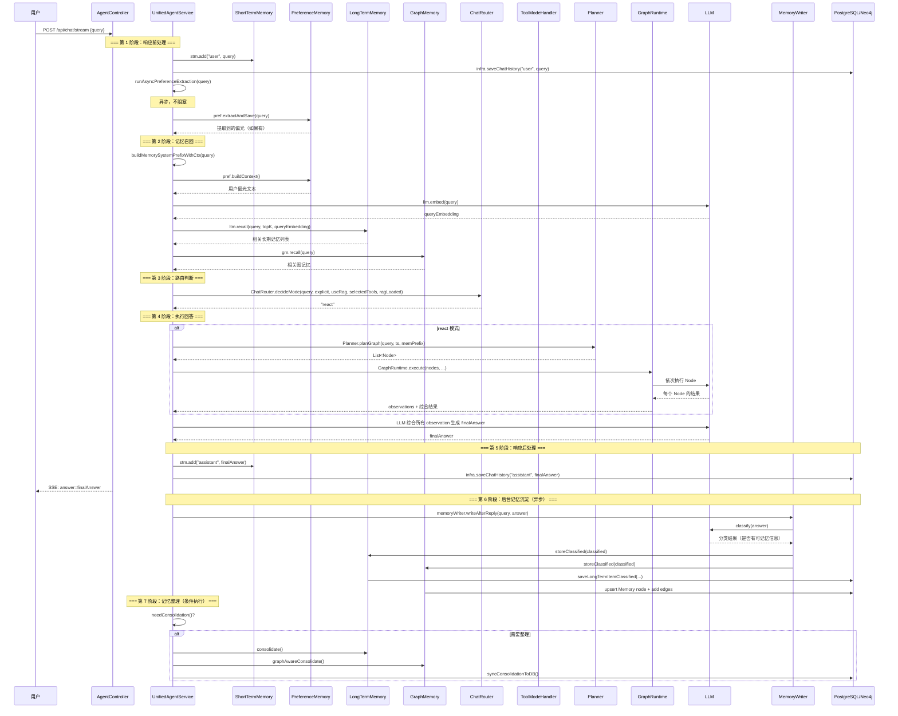

# 02 一次请求完整时序图

## 一句话结论

一次完整的请求分 11 步：用户消息进来 → 短期记忆写入 → 偏好提取 → 记忆召回 → 路由判断 → 回答执行 → 回答写入 → 后台记忆沉淀 → 记忆整理。面试官最常问的就是"一个请求进来后发生了什么"。

---

## 它在主链路里的位置

这是整个主链路文档集**最重要的一篇**。面试 90% 的场景都会用到这里的知识。

```text
00 学习路线 → 01 系统全景图（全局地图）
                ↓
           02 完整时序图（本文）← 面试必看
                ↓
           03 核心对象（数据流）
                ↓
        04~20 每个模块深入
```

你可以把本文当作一篇"导游图"——读其他文档时随时回来看，确认当前模块在第几步。

---

## 为什么需要它

如果没有这张图，你会陷入"读了一大堆代码但串不起来"的困境。

```text
读了 ShortTermMemory → 知道它怎么滑动窗口
读了 PreferenceMemory → 知道它怎么提取偏光
读了 ChatRouter → 知道它怎么判断模式
读了 ToolModeHandler → 知道它怎么执行工具

但面试官问"用户发了一句话，系统全流程是什么样的"——
你脑子里的知识是碎片化的，串不起来。
```

**本文就是用来把这些碎片串成一条线的。**

---

## 对应源码位置

| 步骤 | 文件 | 方法 |
|---|---|---|
| 请求入口 | `AgentController.java` | `chatStream()` |
| 业务门面 | `ChatApplicationService.java` | `chatStream()` / `chat()` |
| 主调度 | `UnifiedAgentService.java` | `processStream()` / `processInternal()` |
| 短期记忆写入 | `ShortTermMemory.java` | `add()` |
| 聊天历史保存 | `ChatHistoryRepository.java` | `save()` |
| 偏好规则提取 | `PreferenceMemory.java` | `extractAndSave()` |
| 偏光异步提取 | `UnifiedAgentService.java` | `runAsyncPreferenceExtraction()` |
| memPrefix 构建 | `UnifiedAgentService.java` | `buildMemorySystemPrefixWithCtx()` |
| 记忆召回 | `LongTermMemory.java` | `recall()` |
| 图记忆召回 | `GraphMemory.java` | `recall()` |
| 短期转 LLM 格式 | `ChatHistoryAdapter.java` | `buildHistory()` |
| 路由判断 | `ChatRouter.java` | `decideMode()` |
| 单工具执行 | `ToolModeHandler.java` | `run()` |
| 多工具规划 | `Planner.java` | `planGraph()` |
| 图执行 | `GraphRuntime.java` | `execute()` |
| 回复后写入 | `MemoryWriter.java` | `writeAfterReply()` |
| 记忆整理 | `UnifiedAgentService.java` | `consolidate()` / `syncConsolidationToDB()` |

---

## 先看对象长什么样

在全流程中，每一步的"输入"和"输出"都是特定对象。看懂对象才能看懂流程。

### 请求开始时

```java
// 用户发来的请求体
ChatRequest req = new ChatRequest();
req.query = "查上海天气并搜索小雨出门建议";
req.mode = null;                    // 不指定，自动判断
req.selectedTools = List.of("get_weather", "search_web");
req.useRag = false;
req.needLongMemory = true;
```

### 请求处理中

```java
// Step 1 之后：短期记忆里有了一条用户消息
stm.messages = [
    ConversationMessage{
        role = "user",
        content = "查上海天气并搜索小雨出门建议",
        timestamp = "14:35:21"
    }
];

// Step 3 之后：偏好记忆里可能多了记录
pref.context = {
    "城市": "上海",
    "回答风格": "中文"
};

// Step 4 之后：memPrefix 构建好了
memPrefix = """
【用户偏好】
- 回答语言: 中文

【相关记忆】
- (无)
""";

// Step 6 之后：路由判断出了模式
mode = "react";
```

### 请求结束时

```java
// Step 8 之后：短期记忆里多了助手回答
stm.messages = [
    ConversationMessage{role="user", content="查上海天气并搜索小雨出门建议", ...},
    ConversationMessage{role="assistant", content="上海今天小雨...", ...}
];

// Step 9 之后：长期记忆里多了新条目
MemoryItem saved = new MemoryItem();
saved.content = "用户曾查询上海小雨天气时的出行信息";
saved.importance = 0.65;
saved.category = "user_activity";
```

---

## 核心流程图

### 完整时序图（mermaid 多泳道）



### 文本版完整流程（带步骤编号）

```text
用户发送 query
    ↓
========================================
第 1 阶段：响应前处理（Steps 1-4）
========================================
                                    执行顺序  是否阻塞
Step 1  stm.add("user", query)              1    是
Step 2  infra.saveChatHistory("user", query)  2    是
Step 3  runAsyncPreferenceExtraction(query)   3    否（异步）
Step 4  pref.extractAndSave(query)            4    是
    ↓
========================================
第 2 阶段：记忆召回（Steps 5-6）
========================================
Step 5  buildMemorySystemPrefixWithCtx(query)
    5a  pref.buildContext()                   5a   是
    5b  llm.embed(query)                      5b   是
    5c  ltm.recall(query, topK, embedding)    5c   是
    5d  gm.recall(query)                      5d   是
    ↓
Step 6  ChatHistoryAdapter.buildHistory(stm, query)  6  是
    ↓
========================================
第 3 阶段：路由判断（Step 7）
========================================
Step 7  ChatRouter.decideMode(...)            7    是
    → 返回 "react"（本例中）
    ↓
========================================
第 4 阶段：执行回答（Steps 8-10）
========================================
Step 8  （以 react 为例）
    8a  Planner.planGraph(query, ts, memPrefix) → List<Node>
    8b  GraphRuntime.execute(nodes, ...)
    8c  每个 Node 按拓扑序执行
    8d  LLM 综合所有 observation
                                    8a-8d   是
    ↓
========================================
第 5 阶段：响应后处理（Steps 9-11）
========================================
Step 9  stm.add("assistant", answer)          9    是
Step 10 infra.saveChatHistory("assistant", answer) 10 是
    ↓
========================================
第 6 阶段：后台记忆沉淀（Step 12）——异步
========================================
Step 11 memoryWriter.writeAfterReply(query, answer) 11  否（异步）
    11a LLM classify(answer)
    11b storeClassified → LongTermMemory
    11c storeClassified → GraphMemory
    11d saveLongTermItemClassified → PostgreSQL
    ↓
========================================
第 7 阶段：记忆整理（Step 13）——条件执行
========================================
Step 12 needConsolidation()?
    12a consolidate() / graphAwareConsolidate()
    12b syncConsolidationToDB()
```

---

## 源码逐段讲解

### Step 1-2：用户消息进短期记忆 + 保存聊天历史

```java
stm.add("user", query);               // Step 1
infra.saveChatHistory("user", query); // Step 2
```

这两行紧挨着，但行为不同：

```text
Step 1 → 内存操作，微秒级完成
Step 2 → 数据库 INSERT，毫秒级完成（网络 I/O + 磁盘 I/O）
```

**先写内存再写数据库的原因：** 如果先写数据库再写内存，数据库失败时内存也写不进去。先写内存保证"即使后续步骤失败，当前请求的上下文也能用"。

❌ 如果反过来：

```java
infra.saveChatHistory("user", query); // 先写 DB
stm.add("user", query);               // 再写内存
// DB 写成功，但内存写失败（比如 OOM）
// → LLM 看不到当前用户消息
// → 重启后数据库有这条记录，但 UI 上用户不能立即看到
```

**为什么分两步而不是一步？** 因为内存和数据库是不同的存储介质。内存给当前请求快速读取，数据库给重启恢复用。职责不同。

---

### Step 3：异步提取偏光

```java
private void runAsyncPreferenceExtraction(String query) {
    CompletableFuture.runAsync(() -> {
        try {
            pref.llmExtract(query);  // 用 LLM 抽取偏光
        } catch (Exception e) {
            log.warn("异步提取偏光失败: {}", e.getMessage());
        }
    });
}
```

**这是异步的！** `CompletableFuture.runAsync` 会让这段代码在 ForkJoinPool 的另一个线程执行，不阻塞当前主线程。

```text
主线程：stm.add → saveChatHistory → pref.extractAndSave → ...
                                              ↑
异步线程：                                   ↑
pref.llmExtract(query)  ← 在另一个线程慢慢跑    ↑
                                              ↑
主线程不等异步线程，继续往下走                    ↑
                                              ↑
异步线程可能在主线程回答返回后才完成偏光提取       ↑
```

**为什么提取偏光要异步？** 因为 `llmExtract` 需要调 LLM——LLM 调用可能耗时 2-5 秒。如果同步等待，用户的回答会延迟 2-5 秒。而偏光提取的结果**本轮不一定要用**——就算提取到了新的偏光，`memPrefix` 构建时也不包含异步提取的结果。所以异步提取只是为了"尽早开始"不影响主线程。

**代价：** 异步提取结果在当前请求中不可见。`memPrefix` 只包含同步规则提取的偏光。异步提取的结果只影响**后续**请求。

---

### Step 4：同步规则提取偏光

```java
String[] extracted = pref.extractAndSave(query);
if (extracted != null) {
    resp.setExtractedInfo("已记住：" + extracted[0] + " = " + extracted[1]);
}
```

这是同步的、轻量级的偏光提取。用的不是 LLM，而是关键词规则：

```java
// PreferenceMemory.extractAndSave 内部
if (query.contains("我喜欢")) {
    // 提取"我喜欢 XXX"中的 XXX
    // 保存到偏光 Map
}
if (query.contains("我叫")) {
    // 提取姓名
}
```

**为什么有两条提取偏光的路径？**

| 路径 | 是否 LLM | 耗时 | 结果在本轮可用？ |
|---|---|---|---|
| `pref.extractAndSave(query)` | 否 | 微秒级 | 是 |
| `runAsyncPreferenceExtraction(query)` | 是 | 秒级 | 否（影响后续请求） |

两条路径分工：规则提取快速处理明确句式（"我叫..."、"我喜欢..."），LLM 提取作为补充，处理自然表达。

---

### Step 5：构建 memPrefix（记忆上下文）

```java
private String buildMemorySystemPrefixWithCtx(String query) {
    StringBuilder sb = new StringBuilder();

    // 5a：偏光上下文
    String prefCtx = pref.buildContext();
    if (!prefCtx.isEmpty()) {
        sb.append("【用户偏好】\n").append(prefCtx).append("\n\n");
    }

    // 5b：长期记忆召回
    float[] queryEmbedding = llm.embed(query);
    List<MemoryItem> ltmItems = ltm.recall(query, topK, queryEmbedding);
    if (!ltmItems.isEmpty()) {
        sb.append("【相关长期记忆】\n");
        for (MemoryItem item : ltmItems) {
            sb.append("- ").append(item.getContent()).append("\n");
        }
        sb.append("\n");
    }

    // 5c：图记忆召回
    List<MemoryItem> graphItems = gm.recall(query);
    if (!graphItems.isEmpty()) {
        sb.append("【相关图记忆】\n");
        for (MemoryItem item : graphItems) {
            sb.append("- ").append(item.getContent()).append("\n");
        }
    }

    return sb.toString();
}
```

**三步召回的详细流程：**

```text
5a: pref.buildContext()
    遍历偏光 Map → 拼成文本块
    假设偏光里有 {回答语言=中文, 城市=上海}
    输出：回答语言: 中文\n城市: 上海

5b: ltm.recall(query, topK, queryEmbedding)
    需要先调 LLM 做 embedding
    llm.embed(query) → float[256] 向量
    然后去 PostgreSQL 做向量相似度查询
    SELECT * FROM long_term_memory
    ORDER BY embedding <=> ?  -- 余弦距离
    LIMIT topK
    返回：score 最高的 topK 条 MemoryItem

5c: gm.recall(query)
    Neo4j 图数据库查询
    找到与 query 相关的记忆节点
    返回邻居节点扩展后的 MemoryItem
    （可能包含"查天气"相关的节点 → 扩展出"天气偏好"）
```

**为什么叫 `memPrefix`？** 因为它会被放到 system prompt 的最前面，作为 LLM 回答时的背景知识：

```text
system prompt:
    【用户偏好】          ← memPrefix
    回答语言: 中文
    城市: 上海

    【相关长期记忆】
    - 用户叫小李

    你是一个简洁的AI助手。 ← basePrompt
    结合你掌握的用户信息，使回答更个性化。
```

---

### Step 6：构建 histMsgs

```java
List<Map<String, String>> histMsgs =
    ChatHistoryAdapter.buildHistory(stm, query);
```

```text
stm.messages 里的 ConversationMessage 列表
    ↓
ChatHistoryAdapter.buildHistory
    ↓
过滤掉非 user/assistant 角色的消息
    ↓
去掉 timestamp
    ↓
转成 {"role": "...", "content": "..."} 格式
    ↓
检查最后一条是不是当前 query（防御性兜底）
    ↓
返回 List<Map<String, String>>
```

**`memPrefix` 和 `histMsgs` 是 LLM 的两个输入来源：**

| 变量 | 内容来源 | 放到 LLM 的哪里 |
|---|---|---|
| `memPrefix` | 偏光 + LTM 召回 + GM 召回 | system prompt（背景） |
| `histMsgs` | 短期记忆最近聊天 | messages（对话历史） |

```text
LLM 的输入 = systemPrompt(memPrefix + basePrompt) + messages(histMsgs)
```

---

### Step 7：路由判断

```java
String mode = ChatRouter.decideMode(query, explicit, useRag,
                                     selectedTools, ragLoaded);
```

以"查上海天气并搜索小雨出门建议"为例：

```text
query = "查上海天气并搜索小雨出门建议"
explicit = false（用户没指定 mode）
useRag = false
selectedTools = null
ragLoaded = false

decideMode 执行：
    ① explicit = false → 走非 explicit 分支
    ② needReAct(query)
        "时间"/"几点" → 没命中 → count=0
        "天气" → 命中 → count=1
        "总结"/"汇总" → 没命中 → count=1
        "查"/"搜索" → 命中"查" → count=2
        count >= 2 → true → return "react"
    → mode = "react"
```

---

### Step 8-9：ReAct 路径（Planner + GraphRuntime）

```java
// 简化的 React 路径代码
List<Node> nodes = planner.planGraph(query, ts, memPrefix);
// PlanGraph 返回：[n1=get_weather(city=上海), n2=search_web(query=小雨出门建议)]

TaskGraph taskGraph = new TaskGraph(nodes);
GraphRuntime runtime = new GraphRuntime(toolExecutor, subAgentExecutor);
GraphResult result = runtime.execute(taskGraph);
// 返回所有节点的执行结果和 observations

// LLM 综合生成最终回答
String finalAnswer = llm.chat(systemPrompt + observations, histMsgs);
```

**Planner 做了什么：**

```text
输入：query + ts + memPrefix
    ↓
PLAN_PROMPT + query + 可用工具列表 → 发给 LLM
    ↓
LLM 返回 JSON 节点列表
    ↓
解析 JSON → List<Node>
    ↓
（解析失败则降级到规则规划 → rulePlanNodes）
    ↓
输出：List<Node>

Node 例：
n1: {type="tool", tool="get_weather", params={city="上海"}, dependsOn=[]}
n2: {type="tool", tool="search_web", params={query="小雨出门建议"}, dependsOn=["n1"]}
```

**GraphRuntime 做了什么：**

```text
输入：List<Node>
    ↓
按拓扑排序：n1（无依赖）→ n2（依赖 n1）
    ↓
第 1 层：执行 n1（get_weather）
    → toolExecutor.execute("get_weather", {city="上海"})
    → 返回："上海今天小雨，23°C"
    → 保存到 observations
    ↓
第 2 层：n2 的依赖 n1 已完成，执行 n2（search_web）
    → toolExecutor.execute("search_web", {query="小雨出门建议"})
    → 返回："建议带伞，穿上防水鞋"
    → 保存到 observations
    ↓
输出：observations（包含每个工具的结果）
```

**LLM 综合：** 把所有 observations 拼到最终 prompt 里，让 LLM 生成连贯的最终回答：

```text
LLM 看到的最后 prompt：
system: ...
    你调用了以下工具并得到结果：
    n1 get_weather → 上海今天小雨，23°C
    n2 search_web → 建议带伞，穿上防水鞋

user: 查上海天气并搜索小雨出门建议

LLM 回答：上海今天小雨，23°C。建议带伞出门，穿上防水鞋。
```

---

### Step 10-11：助手回答进短期记忆 + 保存

```java
stm.add("assistant", finalAnswer);
infra.saveChatHistory("assistant", finalAnswer);
```

和 Step 1-2 对称——用户消息进来时写一次，助手回答生成后写一次。

```text
当前短期记忆状态（第 2 轮对话）：
messages = [
    ConversationMessage{role="user", content="你好", ...},    ← 第 1 轮
    ConversationMessage{role="assistant", content="你好！", ...},
    ConversationMessage{role="user", content="查上海天气并搜索小雨出门建议", ...},  ← 第 2 轮
    ConversationMessage{role="assistant", content="上海今天小雨...", ...}
]
```

---

### Step 12：MemoryWriter 后台记忆沉淀

```java
memoryWriter.writeAfterReply(query, finalAnswer);
```

这是异步的。和 Step 3 的异步不同，这里的异步是**回答已经返回给用户之后**执行——用户不会感知。

```java
// MemoryWriter.writeAfterReply 的简化逻辑
public void writeAfterReply(String query, String answer) {
    threadPool.submit(() -> {
        // ① 分类：判断回答是否包含可记忆信息
        ClassificationResult cr = llm.classify(query, answer);

        if (cr.hasMemories()) {
            // ② 提取记忆片段
            List<ClassifiedMemoryItem> items = cr.getMemories();

            for (ClassifiedMemoryItem item : items) {
                // ③ 写入长期记忆（到 PostgreSQL）
                ltm.storeClassified(item, ...);
                // ④ 写入图记忆（到 Neo4j）
                gm.storeClassified(item, ...);
            }
        }
    });
}
```

**LLM classify 做了什么：**

```java
// 给 LLM 的 prompt 大致是：
"""
判断以下回答是否包含需要长期保存的用户信息。

回答：上海今天小雨，23°C。建议带伞出门，穿上防水鞋。

输出 JSON：
{
    "hasMemories": false,
    "memories": []
}
"""
```

这个例子里，回答"上海今天小雨"是实时天气信息——过时就没用了。LLM 应该分类为"没有可保存的记忆"。

但如果用户说"我叫小李"，助手回答"好的，我记住了"，LLM classify 会输出：

```json
{
    "hasMemories": true,
    "memories": [
        {
            "content": "用户叫小李",
            "category": "personal_info",
            "importance": 0.85
        }
    ]
}
```

---

### Step 13：Consolidation 记忆整理

```java
// UnifiedAgentService 在回答流程中或者定时检查
if (needConsolidation()) {
    consolidate();
    syncConsolidationToDB();
}
```

`needConsolidation()` 的判断条件：

```text
① 距离上次整理超过一定时间（如 1 小时）
② 或者新增记忆数量超过阈值（如 20 条）
③ 或者强制整理标记被触发
```

`consolidate()` 做的事情：

```text
① 合并相似记忆
    两条 MemoryItem 内容相似度 > 阈值 → 合并成一条
    （"用户叫小李" + "姓名是李小明" → "用户叫李小明"）

② 调整重要性
    经常被召回的 → 提高 importance
    很久未被召回的 → 降低 importance
    低于阈值的 → 标记为待删除

③ 图记忆感知整理（graphAwareConsolidate）
    利用知识图谱结构：
    如果两个节点通过同一路径连接 → 可能语义相关 → 合并
    孤立节点（没有边）→ 降级重要性
```

---

## 真实举例：它在流程中怎么运行

假设配置：

```java
shortTermMaxTurns = 5;
ragLoaded = false;
```

用户在第 10 轮对话时发送：

```text
"查上海天气，并搜索小雨出门建议"
```

### 完整流程运行

```text
Step 1: stm.add("user", "查上海天气，并搜索小雨出门建议")
    → 短期记忆新增一条 user 消息
    → 检查是否超过 maxTurns*2=10 条
    → 前 9 轮加起来 18 条 > 10 → 删掉最早 8 条（第 1-4 轮）
    → 保留第 5-10 轮 + 本轮

Step 2: infra.saveChatHistory("user", ...)
    → INSERT INTO chat_history (role, content) VALUES ('user', '查上海天气...')
    → chat_history 表新增一条记录

Step 3: runAsyncPreferenceExtraction(query)
    → 异步线程调 LLM 尝试从"查上海天气，并搜索小雨出门建议"提取偏光
    → 大概率提取不到偏光（这个是任务查询，不是表达偏好）
    → 即使提取到，也要下一轮才生效

Step 4: pref.extractAndSave(query)
    → 规则检查："我喜欢" ×、"我叫" ×、"我的城市" ×
    → 没提取到 → 返回 null → extractedInfo 不设置

Step 5: buildMemorySystemPrefixWithCtx(query)
    5a: pref.buildContext()
        → 假设之前提取过"城市: 上海"
        → 输出："回答语言: 中文\n城市: 上海"
    5b: llm.embed(query) → float[256]
        ltm.recall(query, topK=5, embedding)
        → 召回 3 条长期记忆（可能是之前查询过天气的记录）
    5c: gm.recall(query)
        → Neo4j 查询，扩展出相关节点
        → 可能扩展出"雨天出行"相关记忆
    → 拼成 memPrefix

Step 6: ChatHistoryAdapter.buildHistory(stm, query)
    → 短期记忆里最近 10 条消息（第 5-10 轮 + 本轮）
    → 转成 histMsgs（每个 Map: {role, content}）

Step 7: ChatRouter.decideMode()
    → needReAct = true（"查"+"天气"→ count >= 2）
    → mode = "react"

Step 8: Planner.planGraph(query, ts, memPrefix)
    → LLM 规划出：
      n1: get_weather(city=上海)
      n2: search_web(query=小雨出门建议)
    → n2.dependsOn = ["n1"]

Step 9: GraphRuntime.execute(taskGraph)
    → 执行 n1 → 天气结果
    → 执行 n2 → 搜索建议
    → LLM 综合 → finalAnswer

Step 10: stm.add("assistant", finalAnswer)
Step 11: infra.saveChatHistory("assistant", finalAnswer)

Step 12: memoryWriter.writeAfterReply(query, finalAnswer)
    → LLM classify：
      回答涉及实时天气 → hasMemories=false
    → 不写入长期记忆和图记忆

Step 13: needConsolidation()
    → 距上次整理 < 1 小时，且新增记忆 < 20 条
    → false → 跳过整理
```

### 返回给用户的内容

```text
上海今天小雨，23°C。
小雨天气出门建议：
- 带伞
- 穿防水鞋
- 开车注意路滑
```

---

## 关键判断条件

| 阶段 | 判断点 | 条件 | true→ | false→ |
|---|---|---|---|---|
| 路由 | `needReAct` | count >= 2 | react | 继续判断 |
| 路由 | `needTool` | 命中任一类子任务 | tool | rag/chat |
| 路由 | `explicit` | 前端指定 mode | 按指定走 | 关键词判断 |
| 记忆写入 | `hasMemories` | LLM 分类为有 | 写入 LTM+GM | 跳过 |
| 整理 | `needConsolidation` | 超时或超量 | 执行整理 | 跳过 |

---

## 容易混淆的点

### 1. `runAsyncPreferenceExtraction` 是本轮异步

很多人以为"异步 = 不执行"，但实际上异步只是"不阻塞当前线程"。LLM 提取偏光确实会执行，但执行结果在当前请求中看不到。

```text
时间线：
t0: 用户发送 query
t1: stm.add + saveChatHistory
t2: runAsyncPreferenceExtraction（提交到线程池，立即返回）
t3: pref.extractAndSave（同步执行）
t4: buildMemorySystemPrefixWithCtx（此时异步还没完成）
t5: 回答返回
t6: 异步线程完成 LLM 提取 → 保存到偏光

→ 本轮 memPrefix 不包含异步提取结果
→ 下一轮请求时，memPrefix 会包含
```

### 2. `memPrefix` 只包含同步召回的记忆

不仅仅异步偏光提取——所有异步操作的结果都不在 `memPrefix` 中。只有同步执行的 `pref.extractAndSave`、`ltm.recall`、`gm.recall` 的结果会进入 `memPrefix`。

### 3. `writeAfterReply` 不等于"马上写"

`writeAfterReply` 是提交到线程池，但线程池可能排队。如果短时间内有大量请求，后台线程可能来不及处理。但这不是问题——用户已经收到回答了，记忆写入可以慢慢来。

### 4. consolidation 不是每次请求都执行

```text
needConsolidation 返回 true 的条件比较严格：
- 至少间隔 1 小时
- 或者至少新增 20 条记忆
```

所以大多数中小型请求不会触发 consolidation。

### 5. Step 6（buildHistory）和 Step 1（stm.add）的先后关系

```text
Step 1: stm.add("user", query) → 短期记忆有了当前 query
Step 6: buildHistory(stm, query) → 把短期记忆转成 histMsgs
```

先 add 再 buildHistory 的顺序很重要。如果先 buildHistory 再 add，LLM 看不到当前用户消息。

---

## 和其他模块的关系

本文把其他所有模块串联成一个 11 步流程：

| 步骤 | 对应文档 |
|---|---|
| Step 1-2 短期记忆写入 | `01-memory-system/02-短期记忆-ShortTermMemory.md` |
| Step 3-4 偏光提取 | `01-memory-system/03-偏好记忆-PreferenceMemory.md` |
| Step 5b 长期记忆召回 | `01-memory-system/07-长期记忆召回-score计算.md` |
| Step 5c 图记忆召回 | `01-memory-system/09-图记忆召回与邻居扩展.md` |
| Step 6 短期转 LLM 格式 | `01-memory-system/02-短期记忆-ShortTermMemory.md` |
| Step 7 路由判断 | `02-tool-react-system/04-路由判断-ChatRouter.md` |
| Step 8 多工具规划 | `02-tool-react-system/07-Planner多工具规划.md` |
| Step 9 图执行 | `02-tool-react-system/08-GraphRuntime执行并发竞速.md` |
| Step 11 记忆沉淀 | `01-memory-system/10-MemoryWriter回复后写入.md` |
| Step 12 记忆整理 | `01-memory-system/11-Consolidation记忆整理.md` |

---

## 如果要改这个功能，改哪里

| 改什么 | 影响哪些步骤 | 修改位置 |
|---|---|---|
| 去掉异步偏光提取 | Step 3 | 删掉 `runAsyncPreferenceExtraction` 调用 |
| 让异步偏光提取结果在本轮可用 | Step 5 | 在 `buildMemorySystemPrefixWithCtx` 前 `join()` 异步任务 |
| 不保存聊天历史 | Step 2, 10 | 删掉 `infra.saveChatHistory` 调用 |
| 新增第五种回答模式 | Step 7 | `ChatRouter.decideMode` + 新 Handler |
| 改为总是走 ReAct | Step 7 | 固定返回 "react" |
| 不要记忆沉淀 | Step 11 | 删掉 `memoryWriter.writeAfterReply` 调用 |
| 每次请求都整理 | Step 12 | 让 `needConsolidation` 总是返回 true |

---

## 面试怎么说

完整回答：

```text
一次完整请求分七个阶段 11 步。

第一阶段是响应前处理：先 ShortTermMemory.add 写入用户消息，同时保存到 chat_history 表。然后异步调 LLM 提取偏光（不阻塞），同步用规则提取明确偏光。

第二阶段是记忆召回：调用 buildMemorySystemPrefixWithCtx，依次构建偏光上下文、调 LLM 做 embedding、从 LongTermMemory 和 GraphMemory 召回相关记忆，拼成 memPrefix。同时短期记忆转成 histMsgs。

第三阶段是路由：ChatRouter.decideMode 用关键词匹配判断走 chat/tool/react/rag。

第四阶段是执行：以 react 为例，Planner 把问题拆成 DAG 节点列表，GraphRuntime 按拓扑序执行节点并竞速，LLM 综合所有 observation 生成最终回答。

第五阶段是响应后处理：助手回答写入短期记忆和 chat_history 表。

第六阶段是后台记忆沉淀：MemoryWriter.writeAfterReply 异步分类回答并写入长期记忆和图记忆。

第七阶段是记忆整理：检查 needConsolidation，条件满足时执行 consolidate 和 syncConsolidationToDB。
```

短版：

```text
11 步：写入用户短期记忆 + 保存聊天历史 → 异步偏光提取 → 同步规则偏光提取 → 记忆召回构建 memPrefix → 短期记忆转 histMsgs → 路由判断 → 按模式执行（如 react 走 Planner+GraphRuntime）→ LLM 综合 → 写入助手短期记忆 → MemoryWriter 后台沉淀 → 条件执行 consolidation。
```

---

## 自检题

1. 前 5 步的执行顺序是什么？哪一步是异步的？
2. `buildMemorySystemPrefixWithCtx` 内部做了哪几件事？
3. `memPrefix` 和 `histMsgs` 分别放在 LLM 请求的哪里？
4. `runAsyncPreferenceExtraction` 的结果在本轮请求中能用吗？为什么？
5. `MemoryWriter.writeAfterReply` 是同步还是异步？和 Step 3 的异步有什么不同？
6. 什么情况下 `needConsolidation` 返回 true？
7. 路由判断的顺序是什么？为什么 needReAct 在 needTool 之前？
8. react 模式下 Planner 和 GraphRuntime 分别做了什么？
9. 如果用户 query 是"天气怎么样"，最终会走什么模式？为什么？
10. 请按顺序说出 11 步的名称。
