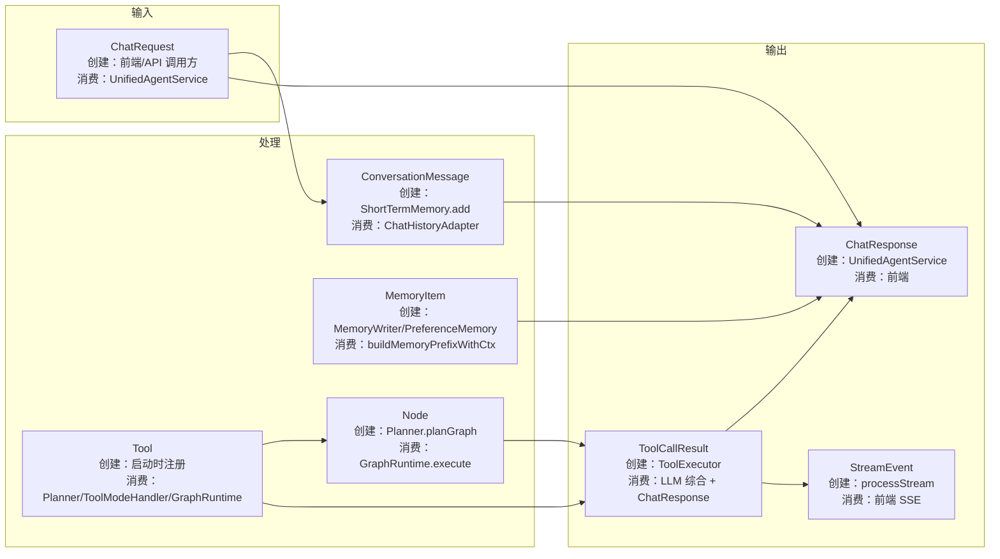
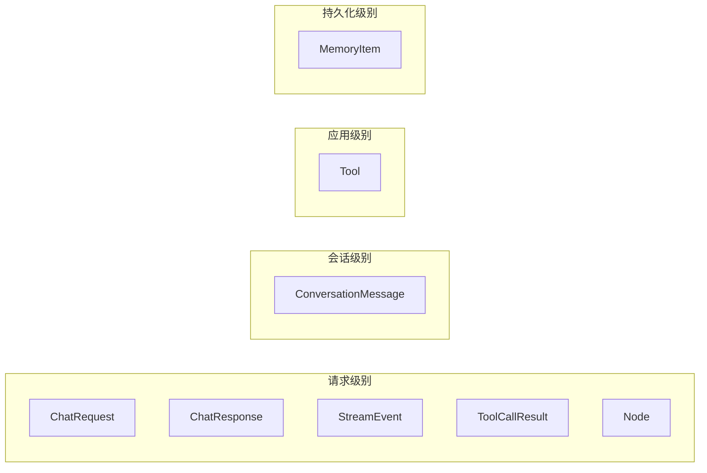

# 03 核心对象总览

## 一句话结论

整个系统有 7 个核心对象，在四层架构之间流动。看懂它们，你就看懂了所有模块的数据输入输出。

---

## 它在主链路里的位置

`01-系统全景图` 告诉你架构的四层架构，`02-一次请求完整时序图` 告诉你 11 步流程。本文告诉你**每一步之间传递的是什么对象**。

```text
01 系统全景图（架构） → 02 完整时序图（流程）
                              ↓
                         03 核心对象总览（数据流）← 本文
                              ↓
                     理解每段代码的输入输出
```

---

## 为什么需要它

看代码时会遇到大量对象名：

```java
ChatRequest req;
ChatResponse resp;
ConversationMessage msg;
MemoryItem item;
Tool tool;
ToolCallResult result;
StreamEvent event;
Node node;
```

如果不清楚每个对象的字段、由谁创建、被谁消费，就会出现：

```text
❌ 以为 ChatRequest 传给 LLM 了 → 实际上只传到 UnifiedAgentService
❌ 以为 MemoryItem 直接传给 LLM → 实际上被拼成 memPrefix 文本
❌ 以为 StreamEvent 是最终回答 → 实际上它只是中间过程推送
```

**本文帮你理清每个对象的生命周期。**

---

## 对应源码位置

| 对象 | 定义文件 | 核心包 |
|---|---|---|
| `ChatRequest` | `ChatRequest.java` | model |
| `ChatResponse` | `ChatResponse.java` | model |
| `ConversationMessage` | `ConversationMessage.java` | model |
| `MemoryItem` | `MemoryItem.java` | model/memory |
| `Tool` | `Tool.java` | model/tool |
| `ToolCallResult` | `ToolCallResult.java` | model/tool |
| `Node` | `Node.java` | model/react |
| `StreamEvent` | `StreamEvent.java` | model/stream |

---

## 先看对象长什么样

### ChatRequest——用户请求体

```java
{
    "query": "查上海天气并搜索小雨出门建议",
    "mode": null,                   // 不指定 mode
    "selectedTools": null,          // 不指定工具
    "useRag": false,                // 不启用 RAG
    "needLongMemory": true          // 需要长期记忆
}
```

**字段说明：**

| 字段 | 类型 | 默认值 | 含义 |
|---|---|---|---|
| `query` | String | 必填 | 用户问题正文 |
| `mode` | String | null | 显式指定模式：chat/tool/react/rag |
| `selectedTools` | List\<String\> | null | 显式指定要用的工具名列表 |
| `useRag` | boolean | false | 是否启用知识库检索 |
| `needLongMemory` | boolean | true | 是否需要长期记忆 |

**由谁创建：** 前端或 API 调用方，发送 HTTP POST 时在请求体里传递。

**由谁消费：** `AgentController.chat()` / `chatStream()` 接收，传给 `ChatApplicationService`，最终到 `UnifiedAgentService.processStream`。

**生命周期：**

```text
HTTP 请求
    ↓ 反序列化
ChatRequest 对象（Java 堆内存）
    ↓ 传给 UnifiedAgentService
从中读取 query、mode、selectedTools 等
    ↓
方法返回后被 GC 回收
```

**关键理解：** `ChatRequest` 只用于第 1、2 层。它不会传给 LLM、不会传给 Tool、不会进入记忆系统。

---

### ChatResponse——响应体

```java
{
    "query": "查上海天气并搜索小雨出门建议",
    "answer": "上海今天小雨，23°C。出门建议带伞...",
    "mode": "react",
    "steps": 3,
    "toolCall": {
        "toolName": "get_weather",
        "params": {"city": "上海"},
        "toolResult": "上海今天小雨，23°C"
    },
    "extractedInfo": null,
    "memoryCount": 0,
    "error": null
}
```

**字段说明：**

| 字段 | 类型 | 含义 | 是否一定有值 |
|---|---|---|---|
| `query` | String | 原始用户问题（回显） | 是 |
| `answer` | String | 最终 LLM 生成的回答 | 是（正常流程） |
| `mode` | String | 系统最终使用的模式 | 是 |
| `steps` | int | 执行了多少子步骤 | 是（最少 1） |
| `toolCall` | ToolCallResult | 单工具调用记录 | 仅 tool 模式 |
| `extractedInfo` | String | 本次提取到的偏光 | 有时有 |
| `memoryCount` | int | 本次新写的长期记忆条数 | 有时有 |
| `error` | String | 错误信息 | 出错时有 |

**由谁创建：** `UnifiedAgentService.processInternal` 开头 `new ChatResponse()`。

**由谁消费：** 最终序列化成 JSON 返回给前端。

**生命周期：**

```text
UnifiedAgentService.processInternal 开头 new ChatResponse()
    ↓
过程中逐步填充 setQuery → setAnswer → setMode → setSteps ...
    ↓
返回给 AgentController
    ↓
序列化成 JSON → HTTP 响应
```

**关键理解：** `ChatResponse` 的重头是 `answer` 字段——前端用它来展示给用户。其他字段（mode, steps, toolCall）用于调试和日志。

---

### ConversationMessage——一条聊天消息

```java
ConversationMessage{
    role = "user",
    content = "查上海天气并搜索小雨出门建议",
    timestamp = "14:35:21"
}
```

**字段说明：**

| 字段 | 类型 | 例子 | 说明 |
|---|---|---|---|
| `role` | String | "user" / "assistant" | 谁说了这句话 |
| `content` | String | "查上海天气并搜索小雨出门建议" | 消息正文 |
| `timestamp` | String | "14:35:21" | 加入短期记忆时的时间 |

**由谁创建：** `ShortTermMemory.add(role, content)` 内部 `new ConversationMessage(...)`。

**由谁消费：** `ChatHistoryAdapter.buildHistory(stm, query)` 读取并转成 `List<Map<String, String>>`。

**生命周期：**

```text
ShortTermMemory.add()
    ↓
new ConversationMessage → 追加到 messages 列表
    ↓
ChatHistoryAdapter.buildHistory 读取
    ↓
转存为 Map（timestamp 被去掉）
    ↓
当消息不被删除的情况下（滑动窗口），一直在 messages 列表中
    ↓
被最新消息挤出窗口后，不再被引用
    ↓
等待 GC
```

**关键理解：** `ConversationMessage` 只在第 2 层（短期记忆）中出现。它**不会**直接传给 LLM——而是被 `ChatHistoryAdapter` 转成 `Map` 后再传。`timestamp` 字段在 LLM 看来不存在。

**❌ 如果你在短期记忆相关代码外看到 `ConversationMessage`——思考一下这里是否合理。** 长期记忆用的是 `MemoryItem`，工具调用用的是 `ToolCallResult`。

---

### MemoryItem——一条长期记忆

```java
MemoryItem{
    id = "mem_a1b2c3d4",
    content = "用户叫小李",
    importance = 0.85,
    embedding = float[256]{0.12, -0.34, 0.56, ...},
    score = 0.92,                  // 本次召回的相似度
    category = "personal_info",
    tags = ["姓名", "用户信息"],
    slotHint = "user_name",
    createdAt = "2026-06-22T14:30:00",
    updatedAt = "2026-06-22T14:30:00"
}
```

**字段说明：**

| 字段 | 类型 | 示例 | 说明 |
|---|---|---|---|
| `id` | String | "mem_a1b2c3d4" | 唯一标识，去重时使用 |
| `content` | String | "用户叫小李" | 记忆正文 |
| `importance` | double | 0.85 | 重要度 [0, 1]，影响召回优先级 |
| `embedding` | float[] | 256 维向量 | 用于语义相似度召回 |
| `score` | double | 0.92 | 本次召回时的相似度得分（0~1，越高越相关） |
| `category` | String | "personal_info" | 分类：personal_info / user_activity / preference / fact |
| `tags` | List\<String\> | ["姓名", "用户信息"] | 标签，辅助分类 |
| `slotHint` | String | "user_name" | 槽位提示，用于工具参数补全 |
| `createdAt` | String | ISO 时间 | 创建时间 |
| `updatedAt` | String | ISO 时间 | 最后更新时间 |

**由谁创建：**

```text
路径 1：PreferenceMemory.extractAndSave → 创建 MemoryItem
路径 2：MemoryWriter.writeAfterReply → LLM classify → storeClassified → 创建 MemoryItem
路径 3：Consolidation.merge → 合并后创建新 MemoryItem
```

**由谁消费：**

```text
消费 1：LongTermMemory.recall → 召回到 memPrefix
消费 2：GraphMemory.recall → 召回到 memPrefix
消费 3：Consolidation.merge → 读取已有记忆做合并
消费 4：buildMemorySystemPrefixWithCtx → 把 content 拼成文本
```

**生命周期（最复杂的对象）：**

```text
创建（写入时）
    ↓
storeClassified 处理
    ↓
写入 PostgreSQL（saveLongTermItemClassified）
    ↓
同时写入 Neo4j（作为节点）
    ↓
    可能被召回多次：
    recall → 放入 memPrefix → 拼进 system prompt → 给 LLM
    ↓
    可能被 consolidation 处理：
    merge（相似合并）→ 调整 importance → 删除低重要度
    ↓
长期存在，不被 GC
    （应用重启后仍可从数据库加载）
```

**`score` 这个字段容易误解：** `score` 不是在 `MemoryItem` 数据库表里的固定字段——它是在召回时临时计算的。每次 `recall` 时，把 query embedding 和每个 MemoryItem 的 embedding 做余弦相似度计算，动态填入 `score`。所以同一个 MemoryItem 在不同请求中的 `score` 可能不同。

**`importance` 和 `score` 的区别：**

```text
importance = 0.85  → 这条记忆本身很重要（写入时 LLM 判断的）
score = 0.92       → 这条记忆和当前 query 相似度很高（计算出来的）

❌ 不要混用：importance 是"绝对值"，score 是"相对于当前 query 的相似度"
```

---

### Tool——工具定义

```java
Tool{
    name = "get_weather",
    description = "获取城市天气信息",
    parameters = [
        ToolParam{name="city", type="string", required=true, description="城市名称"},
        ToolParam{name="date", type="string", required=false, description="日期"}
    ],
    execute = (params) -> "上海今天小雨，23°C"
}
```

**字段说明：**

| 字段 | 类型 | 示例 | 说明 |
|---|---|---|---|
| `name` | String | "get_weather" | 工具唯一标识名 |
| `description` | String | "获取城市天气信息" | 给 LLM/Planner 看的描述 |
| `parameters` | List\<ToolParam\> | [{name, type, required}] | 参数定义列表 |
| `execute` | Function | lambda | 实际执行逻辑（函数接口） |

**ToolParam 结构：**

| 字段 | 类型 | 示例 | 说明 |
|---|---|---|---|
| `name` | String | "city" | 参数名 |
| `type` | String | "string" | 参数类型：string / number / boolean |
| `required` | boolean | true | 是否必填 |
| `description` | String | "城市名称" | 参数说明 |

**由谁创建：**

```text
路径 1：启动时注册（内置工具）
    ToolRegistry.registerBuiltins()
    → new Tool("get_time", ...)
    → new Tool("get_weather", ...)
    → new Tool("search_web", ...)
    → new Tool("rag_search", ...)
    → new Tool("exec_command", ...)
    → 加入 tools Map

路径 2：启动时注册（MCP 工具）
    McpClient.listTools()
    → 每个 MCP Tool 包装成 Tool 对象
    → 加入 tools Map
```

**由谁消费：**

```text
消费 1：ChatRouter.needTool / needReAct → 判断关键词是否匹配工具
消费 2：Planner.planGraph → 构造 toolLines 给 LLM 做规划
消费 3：ToolModeHandler.run → 选工具、补参数、调用 execute
消费 4：GraphRuntime.execute → 每个 Node 绑定到对应 Tool，调用 execute
消费 5：filterTools → 前端选了工具时，从全量 tools 中过滤出子集
```

**`execute` 字段为什么是函数而不是方法？**

```java
tool.execute = params -> {
    String city = params.get("city");
    return callWeatherApi(city);
};
```

因为 `Tool` 只是一个数据对象 + 行为定义。不同的工具有不同的执行逻辑——`get_weather` 调天气 API，`search_web` 调搜索引擎，`exec_command` 调沙箱 Shell。如果用继承，需要给每个工具建一个子类。用 `Function` 字段（策略模式），一个 `Tool` 类就够了。

**❌ 不要把 `tool.execute` 写成同步阻塞 I/O：**

```java
// ❌ 错误：调远程 API 时阻塞了当前线程
tool.execute = params -> {
    String result = httpClient.send(request, HttpResponse.BodyHandlers.ofString());
    return result;
};
```

实际上这没问题——工具执行本来就应该是同步的。问题是 "谁在调 execute"：如果在 `GraphRuntime` 的线程池里调，阻塞是预期的；如果在主线程里调（`ToolModeHandler` 当前就是），阻塞会延迟用户等待时间。

**❌ 如果 execute 抛异常而没有 catch：**

```java
tool.execute = params -> {
    URL url = new URL("https://api.weather.com/");  // MalformedURLException
    return ...;
};
```

`execute` 是 `Function` 接口，其 `apply` 方法声明上没有 throws 子句——但 Java 允许运行时异常穿透。如果抛出的是 `RuntimeException`，调用方（`GraphRuntime` / `ToolModeHandler`）需要捕获。当前代码的 `ToolExecutor` 中有 try-catch。

---

### ToolCallResult——一次工具调用记录

```java
ToolCallResult{
    toolName = "get_weather",
    params = {"city": "上海"},
    toolResult = "上海今天小雨，23°C"
}
```

**字段说明：**

| 字段 | 类型 | 示例 | 说明 |
|---|---|---|---|
| `toolName` | String | "get_weather" | 调了什么工具 |
| `params` | Map\<String, String\> | {"city": "上海"} | 实际传的参数 |
| `toolResult` | String | "上海今天小雨，23°C" | 工具返回的结果 |

**由谁创建：**

```text
ToolModeHandler.run 内部
    → ToolExecutor.execute(tool, params)
    → 创建 ToolCallResult 并填充结果

GraphRuntime.execute 内部
    → 每个 Node 执行后
    → 创建 ToolCallResult 并填充结果
```

**由谁消费：**

```text
消费 1：ToolModeHandler.run → 把 toolResult 作为 LLM 的 observation
消费 2：GraphRuntime → 把 toolResult 放入 observations 列表
消费 3：LLM 综合 → observations 拼到最终 prompt 中
消费 4：ChatResponse.toolCall → 写入响应体，给前端展示
```

**ToolCallResult 和 Node 的关系：**

```text
Node 表示"计划要做的事"（规划阶段）
    ↓ 执行
ToolCallResult 表示"实际做完了"（执行阶段）
```

所以 `Planner` 创建 `Node`，`GraphRuntime` 创建 `ToolCallResult`。

---

### Node——任务图节点

```java
Node{
    id = "n1",
    type = "tool",
    name = "查询上海天气",
    toolName = "get_weather",
    params = {"city": "上海"},
    dependsOn = [],               // 没有依赖
    raceGroup = ""                // 不参与竞速
}

Node{
    id = "n2",
    type = "tool",
    name = "搜索小雨出门建议",
    toolName = "search_web",
    params = {"query": "小雨出门建议"},
    dependsOn = ["n1"],           // 依赖 n1 完成
    raceGroup = "search"          // 和同组节点竞速
}
```

**字段说明：**

| 字段 | 类型 | 示例 | 说明 |
|---|---|---|---|
| `id` | String | "n1" | 节点唯一标识，用于 dependsOn 引用 |
| `type` | String | "tool" / "sub_agent" | 节点类型：工具调用或子 Agent |
| `name` | String | "查询上海天气" | 人类可读的名称 |
| `toolName` | String | "get_weather" | 对应 `ts` 中的工具名 |
| `params` | Map\<String, String\> | {"city": "上海"} | 传给工具的参数 |
| `dependsOn` | List\<String\> | ["n1"] | 依赖的节点 id 列表 |
| `raceGroup` | String | "search" | 竞速组名：同组工具功能等价，选最快结果 |

**由谁创建：**

```text
Planner.planGraph(query, ts, memPrefix)
    ↓
LLM 或规则规划
    ↓
返回 List<Node>
    ↓
每个元素是一个 Node
```

**由谁消费：**

```text
GraphRuntime.execute(taskGraph)
    ↓
TaskGraph 把 List<Node> 包装成 DAG
    ↓
按拓扑序逐层执行
    ↓
每个 Node 的 toolName 对应 ts 中的一个 Tool
    ↓
Node.params 作为 Tool.execute 的入参
```

**`dependsOn` 的拓扑排序规则：**

```text
Node 列表：n1, n2 (n2.dependsOn = ["n1"])

GraphRuntime 的执行顺序：
第 1 层：n1（dependsOn 为空，可以立即执行）
第 2 层：n2（依赖 n1，等 n1 完成后执行）

如果 n1 和 n2 都是 dependsOn=[]：
第 1 层：n1, n2（两者可以并行执行！）
```

**`raceGroup` 的竞速规则：**

```text
Node 列表：
  n1: {tool="search_web",  raceGroup="search"}
  n2: {tool="rag_search",  raceGroup="search"}  ← 同组

GraphRuntime 同时发起 n1 和 n2：
  → n1 返回 "search_web 结果"（先完成）
  → n2 还在执行 → 忽略 n2 的结果
  → 使用 n1 的结果作为 observation
```

**为什么 n2 的 raceGroup 是 "search"？** 因为 `search_web` 和 `rag_search` 都搜索功能——一个搜网页，一个搜知识库。两者功能等价但数据来源不同。竞速可以在同一时间内获得两边的结果，取最快的一个。

**`type = "sub_agent"` 的节点：** 不是调工具，而是调另一个 Agent 实例。这种节点的 `toolName` 实际上是 `subAgentName`（如 "research_agent"），执行逻辑也不同。

---

### StreamEvent——SSE 事件

```java
// 路由事件
StreamEvent{
    type = "mode",
    data = "react"
}

// 规划事件
StreamEvent{
    type = "plan",
    data = "n1: get_weather(city=上海), n2: search_web(query=小雨出门建议)"
}

// 工具调用事件
StreamEvent{
    type = "tool_call",
    data = "get_weather(city=上海)"
}

// 工具结果事件
StreamEvent{
    type = "tool_result",
    data = "上海今天小雨，23°C"
}

// 最终回答事件
StreamEvent{
    type = "answer",
    data = "上海今天小雨，23°C。出门建议带伞..."
}

// 错误事件
StreamEvent{
    type = "error",
    data = "工具 get_weather 执行失败：API 超时"
}

// 完成事件
StreamEvent{
    type = "done",
    data = ""
}
```

**由谁创建：** `UnifiedAgentService.processStream` 在流程各步骤中创建并推送。

**由谁消费：** 前端 SSE 接口逐条接收并展示（例如在 UI 上逐步显示"正在选择工具... → 正在调用... → 正在生成回答..."）。

**StreamEvent 的类型列表：**

| type | 含义 | 何时推送 |
|---|---|---|
| `mode` | 路由结果 | 路由判断完成后 |
| `plan` | 任务规划 | Planner 完成后 |
| `tool_call` | 开始调工具 | 每个工具执行前 |
| `tool_result` | 工具执行完毕 | 每个工具执行后 |
| `answer` | 最终回答 | LLM 综合完成后 |
| `error` | 错误 | 任何步骤出错时 |
| `done` | 流程结束 | 所有步骤完成后 |

**关键理解：** `StreamEvent` 不是给 LLM 看的，也不是给后端逻辑用的。它是专门给前端的"进度提示"。所以它的内容是人类可读的文本，而不是结构化数据。

---

## 核心流程图

### 7 个对象的创建和消费链



### 对象生命周期对比（按持久度）



| 生命周期 | 对象 | 说明 |
|---|---|---|
| 请求级别 | ChatRequest, ChatResponse, StreamEvent, ToolCallResult, Node | 一次请求结束后被 GC |
| 会话级别 | ConversationMessage | 当前会话期间存在，被窗口挤出后 GC |
| 应用级别 | Tool | 启动时注册，运行时不变，应用重启后重建 |
| 持久化级别 | MemoryItem | 写入 PostgreSQL，重启后可恢复 |

---

## 源码逐段讲解

### 7.1 ChatRequest——请求对象的完整构造

```java
public class ChatRequest {
    private String query;              // 用户问题：唯一必填字段
    private String mode;               // 可选：chat/tool/react/rag
    private List<String> selectedTools; // 可选：用户显式选择的工具名列表
    private boolean useRag;            // 可选：是否启用知识库
    private boolean needLongMemory;    // 可选：是否需要长期记忆，默认 true
}
```

**`mode` 字段不是路由结果的唯一决定因素。** 虽然叫 `mode`，但它的实际作用只是"explicit 模式"的输入——当 `mode != null` 时，`ChatRouter.decideMode` 会走 `explicit` 分支。但最终 `ChatResponse.mode` 可能和 `ChatRequest.mode` 不一致：

```text
// 用户指定 tool 模式，但系统发现需要 ReAct：
req.mode = "tool";
explicit = true;
selectedTools = ["get_weather", "search_web"];

decideMode(query, explicit, ...):
    explicit = true
    selectedTools 非空 → return "react"

resp.mode = "react";  // 和 req.mode 不同！
```

**`needLongMemory` 字段控制是否进行记忆召回。** 如果设为 false：

```text
buildMemorySystemPrefixWithCtx(query):
    if (!req.needLongMemory) {
        return "";  // 跳过所有记忆召回，memPrefix 为空
    }
    // 正常召回偏光 + 长期记忆 + 图记忆
```

这个字段在前端可以让用户选择"这次对话不要用我的历史记忆"。

---

### 7.2 ChatResponse——响应体构造

```java
public class ChatResponse {
    private String query;           // 回显原始 query —— 方便前端/日志确认
    private String answer;          // LLM 最终回答 —— 核心输出
    private String mode;            // 实际走的模式 —— 调试用
    private int steps;              // 执行步骤数 —— 性能/调试
    private ToolCallResult toolCall; // 单工具调用记录（tool 模式专用）
    private String extractedInfo;   // 本次提取的偏光 —— 给用户反馈
    private int memoryCount;        // 本次新增记忆条数 —— 调试/统计
    private String error;           // 错误信息 —— 兜底
}
```

**`steps` 字段在不同模式下的值：**

```text
chat 模式：steps = 1（只调了一次 LLM）
tool 模式：steps = 3（选工具 + 执行 + LLM 总结）
react 模式：steps = 执行的 Node 数量 + 1（LLM 综合）

如果 react 有 2 个 Node：steps = 3
如果 react 有 5 个 Node：steps = 6
```

**`toolCall` 字段只在 tool 模式有值：**

```text
tool 模式：
    ChatResponse.toolCall = ToolCallResult{toolName, params, toolResult}
    → 前端可以用这个字段展示"调用了什么工具、结果如何"

react 模式：
    ChatResponse.toolCall = null
    → react 模式有多个工具调用，没有一个"唯一的"toolCall
    → toolCall 放在这里不符合 react 的语义
```

---

### 7.3 MemoryItem——长期记忆核心对象

```java
public class MemoryItem {
    private String id;
    private String content;
    private double importance;
    private float[] embedding;
    private double score;         // 召回时动态计算，不是数据库永久字段
    private String category;
    private List<String> tags;
    private String slotHint;
    private String createdAt;
    private String updatedAt;
}
```

**id 的生成策略：**

```java
// 使用内容哈希作为 id（去重依赖）
String id = DigestUtils.md5Hex(item.getContent());
```

```text
输入："用户叫小李"
    ↓ MD5 哈希
输出："a1b2c3d4e5f6..."

好处：相同内容的记忆有相同 id → 天然去重
风险：MD5 冲突概率极低但非零；且如果内容稍有不同（"用户叫小李" vs "用户名字叫小李"）→ 不同 id → 重复
```

**`slotHint` 字段的用途：** 用于工具参数补全。

```java
// 假设 MemoryItem 有 slotHint = "user_name", content = "小李"

// ToolModeHandler.fillParams 时：
for (ToolParam p : tool.getParameters()) {
    if (p.getName().equals("city") && pref.contains("city")) {
        params.put("city", pref.get("city"));
    }
    // 如果有 slot 匹配的记忆：
    if (item.getSlotHint() != null && item.getSlotHint().equals("user_name")) {
        // 可以用用户姓名自动填充工具参数
    }
}
```

这个场景在实际代码中不常见，但 `slotHint` 的存在说明系统有"从记忆自动填充工具参数"的能力预留。

---

### 7.4 Tool——工具对象详解

```java
public class Tool {
    private String name;
    private String description;
    private List<ToolParam> parameters;
    private Function<Map<String, String>, String> execute;
}
```

**工具注册流程：**

```java
// UnifiedAgentService.init 中
@PostConstruct
public void init() {
    registerTools();      // 注册内置工具
    registerMcpTools();   // 注册 MCP 工具
}

private void registerTools() {
    tools = new HashMap<>();

    // 内置工具 1：get_time
    tools.put("get_time", new Tool("get_time", "获取当前时间",
        List.of(new ToolParam("timezone", "string", false, "时区")),
        params -> {
            String tz = params.getOrDefault("timezone", "Asia/Shanghai");
            return ZonedDateTime.now(ZoneId.of(tz)).toString();
        }
    ));

    // 内置工具 2：get_weather
    tools.put("get_weather", new Tool("get_weather", "获取城市天气信息",
        List.of(new ToolParam("city", "string", true, "城市名称")),
        params -> {
            String city = params.get("city");
            return callWeatherApi(city);
        }
    ));

    // 内置工具 3：search_web
    tools.put("search_web", new Tool("search_web", "搜索互联网",
        List.of(new ToolParam("query", "string", true, "搜索关键词")),
        params -> callSearchApi(params.get("query"))
    ));

    // 内置工具 4：rag_search
    tools.put("rag_search", new Tool("rag_search", "从知识库检索",
        List.of(new ToolParam("query", "string", true, "搜索关键词")),
        params -> callRagApi(params.get("query"))
    ));

    // 内置工具 5：exec_command
    tools.put("exec_command", new Tool("exec_command", "执行终端命令",
        List.of(new ToolParam("command", "string", true, "要执行的命令")),
        params -> executeInSandbox(params.get("command"))
    ));
}
```

**注意 `get_time` 的 `timezone` 参数 `required=false`。** 这表示前端/LLM 可以不传时区，默认用 `Asia/Shanghai`。这种设计降低了调用方的复杂度。

**MCP 工具的包装：**

```java
private void registerMcpTools() {
    McpClient mcp = new McpClient(cfg.getMcpUrl());
    List<McpTool> mcpTools = mcp.listTools();
    for (McpTool mt : mcpTools) {
        tools.put(mt.getName(), new Tool(
            mt.getName(),
            mt.getDescription(),
            mt.getParameters(),  // ToolParam 格式可能不同，需要转换
            params -> {
                // 调 MCP 服务器的 tool execution 端点
                return mcp.execute(mt.getName(), params);
            }
        ));
    }
}
```

MCP 工具和内置工具的区别：MCP 工具的 `execute` 不是本地函数，而是远程调用 MCP 服务器的 API。所以 MCP 工具的执行有时间延迟和网络错误风险。

---

### 7.5 Node——任务图节点详解

```java
public class Node {
    private String id;           // 唯一标识，如 "n1", "n2"
    private String type;         // "tool" 或 "sub_agent"
    private String name;         // 人类可读名称
    private String toolName;     // 工具名，对应 ts 中的 key
    private Map<String, String> params; // 工具参数
    private List<String> dependsOn; // 依赖的节点 id 列表
    private String raceGroup;    // 竞速组，同组节点并行执行取最快结果
}
```

**`type` 字段的两种取值：**

| type | execute 逻辑 | toolName 含义 |
|---|---|---|
| `"tool"` | `toolExecutor.execute(toolName, params)` | `ts` 中的工具名 |
| `"sub_agent"` | `subAgentExecutor.execute(toolName, params)` | `SubAgentRegistry` 中的 Agent 名 |

**`raceGroup` 和 `dependsOn` 是否互斥？**

```text
dependsOn = ["n1"]  → 等 n1 完成才能执行
raceGroup = "search" → 和其他同组节点并行竞速

两者可以共存吗？
Node{
    dependsOn = ["n1"],
    raceGroup = "search"
}

逻辑：先等 n1 完成 → 然后和同组节点一起竞速执行

可以共存，但不常见。大多数情况下：
- 有依赖的节点：dependsOn 非空，raceGroup 为空
- 竞速的节点：dependsOn 为空，raceGroup 非空
```

---

## 真实举例：它在流程中怎么运行

以"查上海天气并搜索小雨出门建议"为例，追踪每个对象的出现。

### 阶段 1：请求进来

```text
HTTP POST /api/chat/stream
body: {"query": "查上海天气并搜索小雨出门建议"}

↓ 反序列化

ChatRequest{
    query = "查上海天气并搜索小雨出门建议",
    mode = null,
    selectedTools = null,
    useRag = false,
    needLongMemory = true
}
```

### 阶段 2：内存实系统写入

```text
stm.add("user", "查上海天气并搜索小雨出门建议")

↓ 创建

ConversationMessage{
    role = "user",
    content = "查上海天气并搜索小雨出门建议",
    timestamp = "14:35:21"
}
→ 追加到 stm.messages 列表
```

### 阶段 3：记忆召回

```text
buildMemorySystemPrefixWithCtx(query)
→ ltm.recall(query, topK=5, embedding)

↓ 假设召回 1 条记忆

MemoryItem{
    content = "用户喜欢用中文回答",
    importance = 0.75,
    score = 0.62,
    category = "preference"
}

→ 拼入 memPrefix："【相关长期记忆】\n- 用户喜欢用中文回答\n"
```

### 阶段 4：路由判断

```text
ChatRouter.decideMode(...)
→ 返回 "react"

ChatResponse.mode = "react"
```

### 阶段 5：ReAct 规划

```text
Planner.planGraph(query, ts, memPrefix)

↓ LLM 规划出

List<Node> = [
    Node{id="n1", type="tool", toolName="get_weather",
         params={city="上海"}, dependsOn=[], raceGroup=""},
    Node{id="n2", type="tool", toolName="search_web",
         params={query="小雨出门建议"}, dependsOn=["n1"], raceGroup=""}
]
```

### 阶段 6：ReAct 执行

```text
GraphRuntime.execute(taskGraph)

执行 n1:
    ts.get("get_weather").execute({city: "上海"})
    → "上海今天小雨，23°C"

ToolCallResult{toolName="get_weather", params={city="上海"},
               toolResult="上海今天小雨，23°C"}

执行 n2:
    ts.get("search_web").execute({query: "小雨出门建议"})
    → "建议带伞，穿防水鞋"

ToolCallResult{toolName="search_web", params={query="小雨出门建议"},
               toolResult="建议带伞，穿防水鞋"}
```

### 阶段 7：最终回答

```text
LLM 综合所有 observations + system prompt + histMsgs
→ 生成回答

ChatResponse{
    query = "查上海天气并搜索小雨出门建议",
    answer = "上海今天小雨，23°C。出门建议带伞，穿防水鞋。",
    mode = "react",
    steps = 3,   // 2 个工具 + 1 次 LLM 综合
    toolCall = null,  // react 模式不填
    error = null
}
```

### 阶段 8：流式事件推送到前端

```text
StreamEvent{type="mode", data="react"}
StreamEvent{type="plan", data="n1: get_weather(city=上海), n2: search_web(...)"}
StreamEvent{type="tool_call", data="get_weather(city=上海)"}
StreamEvent{type="tool_result", data="上海今天小雨，23°C"}
StreamEvent{type="answer", data="上海今天小雨，23°C。出门建议带伞，穿防水鞋。"}
StreamEvent{type="done", data=""}
```

---

## 关键判断条件

| 对象 | 判断点 | 条件 | 结果 |
|---|---|---|---|
| ChatRequest | `mode` 是否为空 | 非空 | 走 explicit 路由分支 |
| ChatResponse | `toolCall` 是否有值 | toolCall != null | 本次是 tool 模式 |
| ConversationMessage | 是否超过滑动窗口 | size > maxTurns * 2 | 删除最早消息 |
| MemoryItem | 去重判断 | id(内容 hash) 已存在 | 跳过写入 |
| MemoryItem | 重要性 | importance > 0.7 | 高优先级召回 |
| Tool | 参数是否必填 | required=true | 必须由 LLM/用户提供 |
| Node | `dependsOn` | 非空 → 等依赖 | 按拓扑序执行 |
| Node | `raceGroup` | 非空 → 竞速 | 同组并行取最快 |
| StreamEvent | `type` | "answer" | 最终回答 |
| StreamEvent | `type` | "error" | 错误通知 |

---

## 容易混淆的点

### 1. `MemoryItem.score` 不是数据库字段

很多人看到 `score` 字段就以为它是存在数据库里的。实际上：

```text
MemoryItem 在数据库里存储：id, content, embedding, importance, category, ...
MemoryItem 在召回时增加：score（临时计算，不存库）

score 的生成：
for (MemoryItem item : recalledItems) {
    item.score = cosineSimilarity(queryEmbedding, item.embedding);
}
```

### 2. `Tool.execute` 是 `Function` 不是 `Consumer`

```java
Function<Map<String, String>, String> execute
```

输入参数 Map，输出结果 String。如果写成 `Consumer<Map<String, String>>`（没有返回值），调用方就得不到工具执行结果。

### 3. `Node.id` 只在一次规划中唯一

```text
第 1 次请求：n1=get_weather, n2=search_web
第 2 次请求：n1=search_web, n2=exec_command
```

`Node.id` 只在 `GraphRuntime.execute` 的当前执行上下文中唯一。跨请求的 `n1` 没有对应关系。

### 4. `StreamEvent` 的内容是给人看的，不是给机器用的

```java
// 人类可读
StreamEvent{type="tool_call", data="get_weather(city=上海)"}

// 而不是 JSON
StreamEvent{type="tool_call", data="{\"tool\":\"get_weather\",\"params\":{\"city\":\"上海\"}}"}
```

前端展示给用户看的进度条只需要人类可读的文本。如果需要机器可读的结构化数据，需要额外设计（如单独加一个 `event_data_json` 字段）。

### 5. `ChatResponse.toolCall` 只记录最后一个工具

在当前实现中，`ChatResponse.toolCall` 是 `ToolCallResult` 单对象，不是 List。所以在 react 模式中，只有最后一个执行的工具会覆盖 `toolCall` 字段，前面的工具调用丢失。这不是 bug，是"tool 模式专用字段"的设计局限——react 模式的完整工具调用记录应该通过 `StreamEvent` 获取。

---

## 和其他模块的关系

| 对象 | 主要在哪个模块使用 | 对应文档 |
|---|---|---|
| ChatRequest | AgentController + UnifiedAgentService | `04-AgentController`, `09-chatStream 主流程` |
| ChatResponse | UnifiedAgentService → AgentController | `09-chatStream 主流程` |
| ConversationMessage | ShortTermMemory + ChatHistoryAdapter | `01-memory-system/02-短期记忆` |
| MemoryItem | LongTermMemory + GraphMemory + MemoryWriter | `01-memory-system/04~10` |
| Tool | ToolRegistry + ToolModeHandler + GraphRuntime | `02-tool-react-system/02~08` |
| ToolCallResult | ToolModeHandler + GraphRuntime | `02-tool-react-system/05~06` |
| Node | Planner + GraphRuntime | `02-tool-react-system/07~08` |
| StreamEvent | UnifiedAgentService.processStream | `09-chatStream 主流程` |

---

## 如果要改这个功能，改哪里

| 需求 | 修改对象 | 怎么改 | 影响范围 |
|---|---|---|---|
| 新增请求参数（如 enableDebug） | `ChatRequest` 加字段 | 在前端传、在 Controller 接收、在 Service 使用 | 三层都涉及 |
| 新增响应字段（如 tokenUsage） | `ChatResponse` 加字段 | 在 LLM 调用后填充 | 仅第 2-3 层 |
| 改变短期消息结构 | `ConversationMessage` 增减字段 | 改 add 方法 + 改 Adapter 转换 | 仅第 2 层 |
| 改变长期记忆分类体系 | `MemoryItem` 修改 category 枚举 | 改分类逻辑 + 修改 storeClassified | 第 4 层 + 数据库 |
| 新增工具参数类型 | `ToolParam` 或 `Tool` | 参数解析 + execute 实现 | 第 3 层 |
| 改变竞速策略 | `Node.raceGroup` 语义 | 改 GraphRuntime 的竞速逻辑 | 仅第 3 层 |
| 新增流式事件类型 | `StreamEvent.type` 枚举 | 在流程中新增推送点 | 第 2 层 + 前端 |

---

## 面试怎么说

完整回答：

```text
AGI-saber 有 7 个核心对象。

ChatRequest 和 ChatResponse 是 HTTP 层的输入输出。ChatRequest 携带 query、mode、selectedTools 等用户指定参数；ChatResponse 携带最终 answer 以及调试信息。

ConversationMessage 是短期记忆单元，只有 role、content、timestamp 三个字段。它在 ShortTermMemory 中按序排列，被 ChatHistoryAdapter 转成 LLM 需要的 Map 格式。

MemoryItem 是长期记忆单元，字段更多：content、importance、embedding、score、category 等。由 MemoryWriter 或 PreferenceMemory 创建，写入 PostgreSQL，召回时拼入 memPrefix。

Tool 是工具定义，包含 name、description、parameters 和执行函数 execute。启动时注册到 tools Map，被 ToolModeHandler 和 GraphRuntime 调用。

ToolCallResult 记录一次工具调用的输入输出，作为 LLM 的 observation。

Node 是任务图节点，由 Planner 创建，被 GraphRuntime 按拓扑序执行，支持 dependsOn 依赖和 raceGroup 竞速。

StreamEvent 是前端进度事件，流程中各步骤推送到 SSE 接口，让用户看到实时进展。
```

短版：

```text
7 个核心对象贯穿四层。输入层用 ChatRequest/ChatResponse，短期记忆用 ConversationMessage，长期记忆用 MemoryItem，工具系统用 Tool/ToolCallResult，ReAct 用 Node，流式用 StreamEvent。
```

---

## 自检题

1. `MemoryItem.score` 是在什么时候计算的？存在数据库里吗？
2. `Tool.execute` 是什么类型？输入和输出分别是什么？
3. `Node.dependsOn` 和 `Node.raceGroup` 分别控制什么？可以同时不为空吗？
4. `StreamEvent.type = "answer"` 和 `ChatResponse.answer` 有什么区别？
5. `ChatRequest.mode` 为 "tool" 时，系统一定会走 tool 模式吗？为什么？
6. 7 个对象中，哪些是请求级别（请求结束就 GC）？哪些是持久化级别？
7. `ConversationMessage.timestamp` 传给 LLM 吗？如果传会有什么问题？
8. `Node.id = "n1"` 在两次请求中代表同一个工具吗？
9. `ChatResponse.toolCall` 在 react 模式中是什么值？为什么？
10. `MemoryItem.slotHint` 字段的目的是什么？
