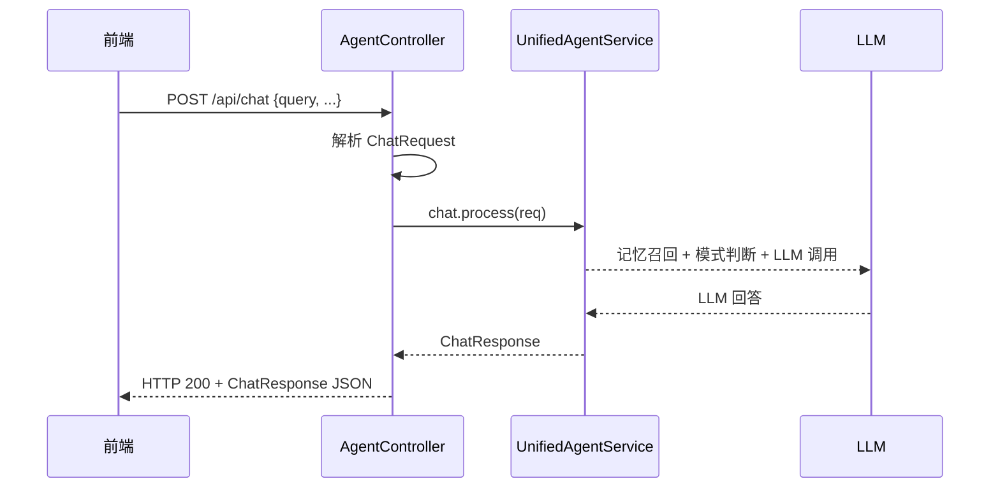
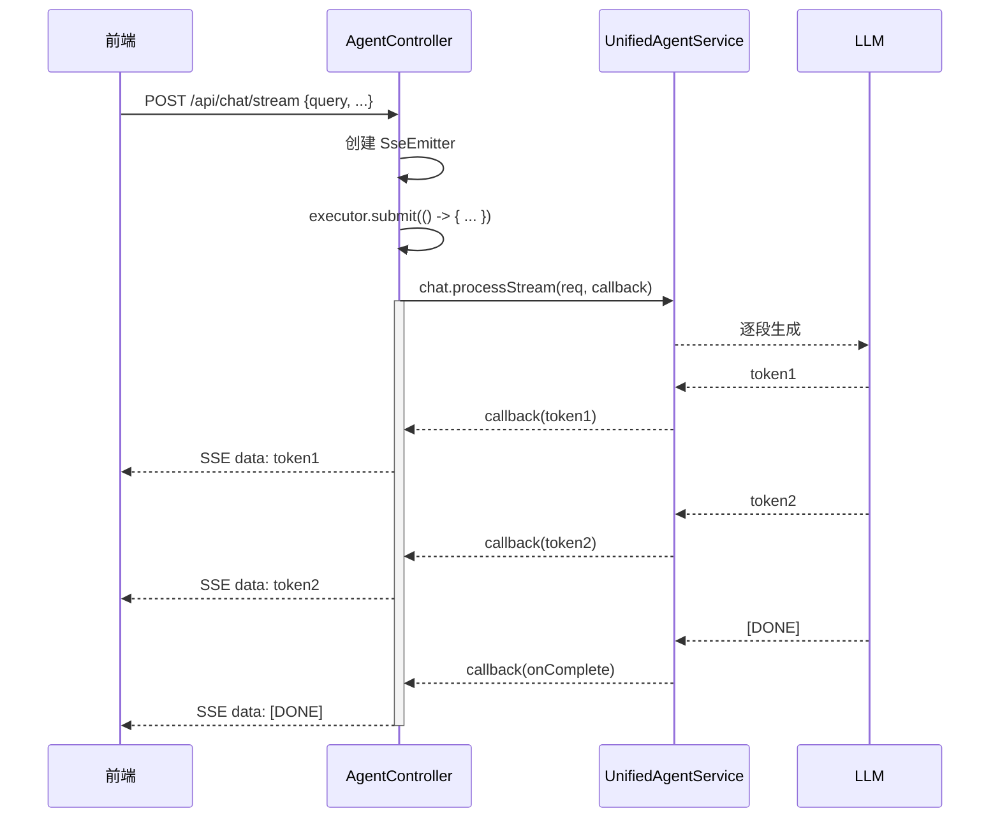
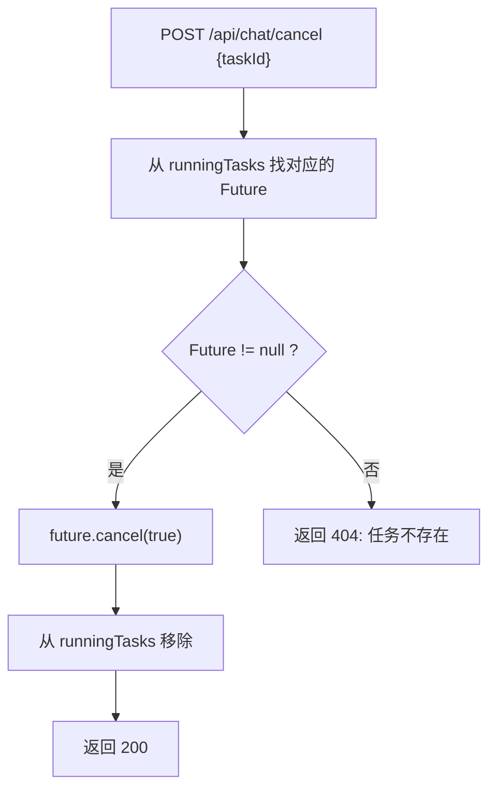

# 04 AgentController 请求入口

## 一句话结论

`AgentController` 是系统的 HTTP 大门——所有用户请求从它进入，通过 Spring Boot 的 `@RestController` 和 `@RequestMapping("/api")` 暴露 RESTful 接口。同步聊天走 `/api/chat`，流式聊天走 `/api/chat/stream`，取消走 `/api/chat/cancel`，文件上传走 `/api/upload`。

---

## 它在主链路里的位置

```text
用户手机/浏览器
    ↓ HTTP POST
AgentController  ← ★ 本文件：请求入口
    ↓ 调用
UnifiedAgentService.chat / processStream
    ↓
记忆召回 → 路由判断 → LLM/工具调用 → 回答返回
```

`AgentController` 是最上游——它负责：

1. 接收 HTTP 请求，解析参数
2. 把请求转给 `UnifiedAgentService`
3. 把结果包装成 HTTP 响应返回
4. SSE 模式下还要管理 Emitter 生命周期

**所有其他模块都依赖它收到请求才能开始工作。**

---

## 为什么需要它

没有 `AgentController`，系统就缺少 HTTP 接入点。可能有的替代方案：

| 方案 | 缺点（为什么没用） |
|---|---|
| 直接在 Agent 类加 main 方法 | 不能当 Web 服务用，无法被前端调用 |
| 用 WebSocket | 项目需求是 RESTful API + SSE |
| 用 gRPC | 太重，简单 REST 够用 |

最终选择 Spring Boot `@RestController`——最简单的 HTTP 接入方式，配合 `SseEmitter` 做流式输出。

---

## 对应源码位置

| 文件 | 作用 |
|---|---|
| `AgentController.java` | 所有 API 入口，本文核心 |
| `UnifiedAgentService.java` | 业务逻辑，Controller 调用这个 |
| `ChatRequest.java` / `ChatResponse.java` | 请求和响应对象 |

Controller 中的主要方法：

| 方法 | 路径 | 用途 |
|---|---|---|
| `chat` | POST /api/chat | 同步聊天 |
| `chatStream` | POST /api/chat/stream | 流式聊天 |
| `cancel` | POST /api/chat/cancel | 取消当前任务 |
| `upload` | POST /api/upload | 上传文档到知识库 |
| `getMemory` | GET /api/memory | 查看记忆状态 |
| `getTools` | GET /api/tools | 列出所有已注册工具 |
| `getStatus` | GET /api/status | 系统运行状态 |

---

## 先看对象长什么样

### 5.1 接收的请求对象

```java
public class ChatRequest {
    private String query;               // 用户消息，例如 "上海天气怎么样"
    private boolean explicit;           // 是否显式指定模式
    private boolean useRag;             // 是否启用 RAG
    private List<String> selectedTools; // 显式选择的工具列表
    private String conversationId;      // 对话 ID
    private String userId;              // 用户 ID
    private Map<String, Object> extra;  // 扩展字段
}
```

一次 POST 请求的 body：

```json
{
    "query": "上海天气怎么样",
    "explicit": false,
    "useRag": false,
    "selectedTools": ["get_weather", "search_web"],
    "conversationId": "conv_001",
    "userId": "user_123"
}
```

### 5.2 返回的响应对象

```java
public class ChatResponse {
    private String answer;              // LLM 回答文本
    private String mode;                // 实际使用的模式
    private ToolCallResult toolCall;    // 工具调用详情（如果有）
    private List<MemoryItem> memories;  // 召回的记忆（可选）
    private long durationMs;            // 耗时（毫秒）
    private Map<String, Object> extra;  // 扩展数据
}
```

一次响应示例：

```json
{
    "answer": "上海今天是小雨，气温20°C，出门记得带伞哦～",
    "mode": "tool",
    "toolCall": {
        "toolName": "get_weather",
        "params": {"city": "上海"},
        "toolResult": "上海：小雨 20°C"
    },
    "durationMs": 1234
}
```

### 5.3 Controller 的依赖

```java
@RestController
@RequestMapping("/api")
@CrossOrigin(origins = "*")
public class AgentController {
    private final UnifiedAgentService chat;    // 核心业务服务
    private final ToolService toolService;      // 工具服务（用于 /api/tools）
    private final MemoryService memoryService;  // 记忆服务（用于 /api/memory）
    private final RagService ragService;        // RAG 服务（用于 /api/upload）
    private final SandboxService sandboxService; // 沙箱服务
    private final AuditService auditService;   // 审计日志服务
    private final ConfigService configService;  // 配置服务
    // ... ExecutorService executor
}
```

**7 个依赖**——比想象中多。每个依赖对应一种能力：聊天、工具、记忆、知识库、沙箱、审计、配置。

---

## 核心流程图

### 6.1 同步聊天流程



### 6.2 流式聊天流程



### 6.3 取消流程



---

## 源码逐段讲解

原文件：`AgentController.java`

### 7.1 类注解——Spring Boot 配置

```java
@RestController                        // ①
@RequestMapping("/api")               // ②
@CrossOrigin(origins = "*")           // ③
public class AgentController {
```

逐行解释：

**`@RestController`** — 告诉 Spring 这是一个 REST 控制器。它和 `@Controller` 的区别：

```text
@Controller：返回视图名（配合 Thymeleaf）
@RestController：直接返回 JSON（响应体不经过视图解析器）
```

**`@RequestMapping("/api")`** — 所有方法都挂在这个基路径下：

```text
chat     → /api/chat
stream   → /api/chat/stream
cancel   → /api/chat/cancel
upload   → /api/upload
memory   → /api/memory
tools    → /api/tools
status   → /api/status
```

**`@CrossOrigin(origins = "*")`** — 允许跨域请求。`origins = "*"` 表示任何域名都可访问。生产环境应该限制为前端域名：

```java
@CrossOrigin(origins = "https://myapp.com")  // 生产环境：限制具体域名
```

---

### 7.2 依赖注入——7 个 Service

```java
private final UnifiedAgentService chat;    // 核心里聊天服务
private final ToolService toolService;      // 工具服务
private final MemoryService memoryService;  // 记忆服务
private final RagService ragService;        // RAG 服务
private final SandboxService sandboxService; // 沙箱服务
private final AuditService auditService;   // 审计服务
private final ConfigService configService;  // 配置服务

private final ExecutorService executor = Executors.newCachedThreadPool();  // 异步线程池
```

**为什么没有用 @Autowired？** 通常 Controller 用 `@Autowired` 进行字段注入，但这里用的是构造函数注入（Lombok 的 `@RequiredArgsConstructor`）：

```java
public AgentController(UnifiedAgentService chat, ToolService toolService, ...) {
    this.chat = chat;
    // ...
}
```

推荐构造函数注入的原因：

```text
字段注入（@Autowired）：
  → 依赖隐式，测试时不能直接 new
  → 可能被 Spring 代理破坏

构造函数注入：
  → 依赖显式，new 的时候必须传
  → 类构造完成后状态就是完整的
  → 更容易写单元测试
```

**`ExecutorService executor`** — 为什么需要线程池？SSE 流式输出时，不能占用 HTTP 请求线程（Tomcat 线程）。必须新建线程执行 LLM 调用，让请求线程可以立即返回 `SseEmitter`：

```text
没有线程池：
  SSE 请求 → 阻塞 Tomcat 线程直到 LLM 完成 → 失去流式意义

有线程池：
  SSE 请求 → 立即返回 SseEmitter → 另一个线程慢慢生成回答
  → 前端可以每秒收到几十个 token，而不是等 10 秒后收到完整回答
```

---

### 7.3 POST /api/chat——同步聊天

```java
@PostMapping("/chat")
public ChatResponse chat(@RequestBody ChatRequest req) {
    long start = System.currentTimeMillis();
    ChatResponse resp = chat.process(req);
    resp.setDurationMs(System.currentTimeMillis() - start);
    return resp;
}
```

执行过程（以"上海天气怎么样"为例）：

```text
① 前端 POST /api/chat
    Body: {"query": "上海天气怎么样", "userId": "user_123"}

② chat.process(req) 开始
    ↓
    Controller 线程等待 → UnifiedAgentService 内部：
      短期记忆写入 → 数据库保存 → 记忆召回 → 路由判断 → 工具/LLM 调用 → 回答生成
    ↓

③ chat.process(req) 返回
    ↓
    resp = ChatResponse{answer="上海今天是小雨...", mode="tool", durationMs=0}

④ resp.setDurationMs(当前时间 - 开始时间)
    ↓
    durationMs = 1500（假设花了 1.5 秒）

⑤ return resp
    ↓
    Spring 自动 JSON 序列化 → HTTP 200
```

**同步模式的关键特点：** 请求线程被阻塞直到 LLM 返回结果。如果 LLM 响应慢（10 秒+），Tomcat 线程就一直占用。但 API 最简单，前端不需要处理 SSE 事件流。

---

### 7.4 POST /api/chat/stream——流式聊天

这是最复杂、面试最常问的接口。先看完整代码，再逐段讲解：

```java
@PostMapping("/chat/stream")
public SseEmitter chatStream(@RequestBody ChatRequest req) {
    // ① 创建 SseEmitter，超时时间 5 分钟
    SseEmitter emitter = new SseEmitter(300_000L);

    // ② 提交异步任务
    executor.submit(() -> {
        try {
            chat.processStream(req, event -> {
                try {
                    emitter.send(SseEmitter.event()
                            .name(event.getType())
                            .data(event.getData()));
                } catch (IOException e) {
                    emitter.completeWithError(e);
                }
            });
            emitter.send(SseEmitter.event().name("done").data("[DONE]"));
            emitter.complete();
        } catch (Exception e) {
            emitter.completeWithError(e);
        }
    });

    return emitter;
}
```

逐段深入讲解：

**① `SseEmitter emitter = new SseEmitter(300_000L)`**

```text
SseEmitter 是 Spring 4.2 提供的 SSE（Server-Sent Events）实现类。
300_000L = 300 秒 = 5 分钟
如果 5 分钟内 LLM 还没完成（流式通常不会），连接自动超时关闭。
```

**② `executor.submit(() -> { ... })`**

为什么必须用线程池？因为 Spring 的 `SseEmitter` 机制要求：

```text
Controller 方法返回值 = SseEmitter
                                            ↓
Spring 看到返回值是 SseEmitter → 立即提交 HTTP 响应（保持连接打开）
                                            ↓
executor.submit 在另一个线程里逐步生成事件
```

**❌ 如果写成这样：**

```java
// 错！没有用线程池
@PostMapping("/chat/stream")
public SseEmitter chatStream(@RequestBody ChatRequest req) {
    SseEmitter emitter = new SseEmitter();
    chat.processStream(req, event -> { ... });  // 这里会阻塞！
    return emitter;  // 到这里已经等完了，没有流式的意义
}
```

**③ `emitter.send(SseEmitter.event().name(event.getType()).data(event.getData()))`**

SSE 协议格式：

```text
event: token
data: 上海

event: token
data: 今天

event: token
data: 是

event: token
data: 晴天

event: done
data: [DONE]
```

前端 JavaScript 接收：

```javascript
const source = new EventSource('/api/chat/stream');
source.addEventListener('token', (e) => {
    console.log('收到 token:', e.data);  // 逐步显示
});
source.addEventListener('done', (e) => {
    console.log('流式结束');
    source.close();
});
```

**④ `emitter.completeWithError(e)` 和 `emitter.complete()`**

```text
complete()           — 正常关闭 SSE 连接，前端收到 "done" 事件
completeWithError(e) — 异常关闭，前端触发 error 事件
```

---

### 7.5 POST /api/chat/cancel——取消任务

```java
private final Map<String, Future<?>> runningTasks = new ConcurrentHashMap<>();

@PostMapping("/chat/cancel")
public ResponseEntity<String> cancel(@RequestParam String taskId) {
    Future<?> future = runningTasks.get(taskId);
    if (future == null) {
        return ResponseEntity.notFound().build();
    }
    future.cancel(true);              // 中断正在执行的线程
    runningTasks.remove(taskId);      // 从映射中移除
    return ResponseEntity.ok("任务 " + taskId + " 已取消");
}
```

**`future.cancel(true)` 的参数 `true`**：

```text
true  → 即使线程正在执行也强制中断（interrupt）
false → 只取消尚未开始执行的任务
```

为什么用 `ConcurrentHashMap`？因为 SSE 模式下，多个请求可能并发修改 `runningTasks`。普通 `HashMap` 在并发 put 时可能死循环（JDK 8 前）：

```text
HashMap 并发 put → 环形链表 → 死循环 → CPU 100%
ConcurrentHashMap 分段锁 → 安全
```

**`cancel` 的局限性：**

```text
processStream 内部如果在 LLM HTTP 调用中：
  future.cancel(true) 会中断线程 → 线程的 InterruptedException 被抛出
  → 但 LLM 已经发送的 token 无法撤回
  → 前端可能已经收到了部分回答

更好的做法：
  用一个 volatile cancelled 标志
  processStream 内部每次循环检查：
    if (cancelled) break;
  这样能做到"优雅停止"
```

---

### 7.6 POST /api/upload——RAG 文档上传

```java
@PostMapping("/upload")
public ResponseEntity<String> upload(@RequestParam("file") MultipartFile file) {
    if (file.isEmpty()) {
        return ResponseEntity.badRequest().body("文件为空");
    }
    try {
        ragService.loadDocument(file.getInputStream(), file.getOriginalFilename());
        return ResponseEntity.ok("文档 " + file.getOriginalFilename() + " 上传成功");
    } catch (Exception e) {
        return ResponseEntity.internalServerError().body("上传失败: " + e.getMessage());
    }
}
```

**`MultipartFile`** 是 Spring 的标准文件上传接口。前端用 `FormData` 上传：

```javascript
const formData = new FormData();
formData.append('file', fileInput.files[0]);
fetch('/api/upload', { method: 'POST', body: formData });
```

**`ragService.loadDocument`** 做了三件事：

```text
① 解析文件（PDF/Word/TXT → 文本）
② 文本分块（chunk）
③ 每块生成 embedding → 存入向量数据库
④ 更新 rag.isLoaded() = true
```

---

### 7.7 GET /api/memory——查看记忆

```java
@GetMapping("/memory")
public ResponseEntity<MemorySnapshot> getMemory() {
    MemorySnapshot snapshot = new MemorySnapshot();
    snapshot.setShortTerm(stm.getRecentMessages());
    snapshot.setLongTerm(ltm.getItems());
    snapshot.setPreferences(pref.getAll());
    return ResponseEntity.ok(snapshot);
}
```

**调试接口**——不是给用户用的，是开发阶段 Debug 用的。原型阶段需要确认：

```text
短期记忆：最近对话是否正确保存？
长期记忆：写入长期记忆后能看到吗？
偏好记忆：用户偏好是否被正确抽取？
```

**生产环境应该加鉴权**：

```java
// 修改后
@GetMapping("/memory")
public ResponseEntity<MemorySnapshot> getMemory(@RequestHeader("X-Admin-Token") String token) {
    if (!"secret".equals(token)) return ResponseEntity.status(403).build();
    // ...
}
```

---

### 7.8 GET /api/tools——工具列表

```java
@GetMapping("/tools")
public ResponseEntity<Map<String, ToolInfo>> getTools() {
    Map<String, Tool> allTools = toolService.getAllTools();
    Map<String, ToolInfo> result = new HashMap<>();
    allTools.forEach((name, tool) -> {
        result.put(name, new ToolInfo(tool.getName(), tool.getDescription(),
                tool.getParameters()));
    });
    return ResponseEntity.ok(result);
}
```

这个接口的核心价值：

```text
前端想展示"系统有哪些工具可用"
    ↓
调用 /api/tools
    ↓
返回：
{
  "get_weather": {
    "name": "get_weather",
    "description": "获取城市天气信息",
    "parameters": [{"name": "city", "type": "string", "required": true}]
  },
  "search_web": { ... }
}
    ↓
前端用来展示工具选择面板
```

---

## 真实举例：它在流程中怎么运行

### 8.1 同步聊天——最常用路径

```text
请求：POST /api/chat
  Body: {"query": "上海天气怎么样"}

AgentController.chat() 执行过程：
① 解析 JSON → ChatRequest{query="上海天气怎么样"}
② 记录开始时间 start = System.currentTimeMillis()
③ chat.process(req) — 阻塞等待
    ↓
    UnifiedAgentService 内部：
    短期记忆写入 → 保存数据库 → 记忆召回 → 路由判断
    → 路由判断为 "tool" → ToolModeHandler 执行天气工具
    → LLM 总结 → 返回 ChatResponse
    ↓
④ resp返回，answer="上海今天是小雨，气温20°C"
⑤ resp.setDurationMs(当前时间 - start)
⑥ Spring 序列化 ChatResponse → JSON → HTTP 200
```

### 8.2 流式聊天——SSE 长连接

```text
请求：POST /api/chat/stream
  Body: {"query": "讲一个长故事"}

AgentController.chatStream() 执行过程：
① 创建 SseEmitter(300000)  — 5分钟超时
② executor.submit(() -> { ... }) — 在线程池执行
③ 返回 SseEmitter — 不等待，立即返回

SSE 事件流：
  → event: token, data: "从前"
  → event: token, data: "有座"
  → event: token, data: "山"
  → ...（50 个 token，2 秒内逐步发送）
  → event: done, data: "[DONE]"
  → 完成

前端逐 token 显示，不需要等待全部生成。
```

### 8.3 取消正在执行的任务

```text
用户发起流式聊天 → 感觉回答太长 → 取消

请求 1：POST /api/chat/stream → 返回 taskId="task_001"
请求 2：POST /api/chat/cancel?taskId=task_001

result：
  runningTasks.get("task_001") → Future@123
  future.cancel(true) → 中断执行线程
  runningTasks.remove("task_001") → 清除记录
  → 返回 "任务 task_001 已取消"
```

---

## 关键判断条件

| 判断点 | 条件 | true 时 | false 时 |
|---|---|---|---|
| SSE 超时 | `300000ms` | 超时 → 自动关闭连接 | 正常完成 → 正常关闭 |
| 文件上传 | `file.isEmpty()` | 返回 400 错误 | 继续处理 |
| 任务取消 | `future == null` | 返回 404 | 执行 cancel |
| 模式判断 | 在 Service 内部 | 路由到 chat/tool/react/rag | 兜底 chat 模式 |
| CORS | `origins = "*"` | 允许所有来源 | 无设置则同源限制 |

---

## 容易混淆的点

**1. SSE 不是 WebSocket。** SSE 是单向的（服务器→客户端），用 HTTP 长连接。WebSocket 是双向的。前端用 `EventSource` 而不是 `WebSocket` 接收。SSE 实现简单，原生浏览器支持，但只支持文本流。

**2. `SseEmitter` 返回后方法立即结束，响应体在另一个线程生成。** Spring 的机制是：方法返回值是 `SseEmitter` 时，Spring 不关闭连接，保持 HTTP 响应通道打开，让其他线程可以向这个通道写入数据。

**3. 同步模式下 `chat.process` 阻塞当前 Tomcat 线程。** Tomcat 线程池默认 200 个线程——200 个用户同时调用同步模式就把线程池占满了，第 201 个用户要等。流式模式下线程用得更少（请求线程立即返回，只有执行线程在工作）。

**4. `@CrossOrigin(origins = "*")` 在带 Cookie 的请求中不生效。** `Access-Control-Allow-Origin: *` 不能和 `Access-Control-Allow-Credentials: true` 一起用。如果前端请求带 Cookie，后端必须指定具体域名而不是 `*`。

**5. `cancel(true)` 不保证任务立即停止。** `Thread.interrupt()` 只是设置中断标记。如果线程在 sleep/wait/IO 阻塞中，会抛出 `InterruptedException`；但如果是纯 CPU 计算循环，需要线程自己检查 `Thread.interrupted()`。

---

## 和其他模块的关系

| Controller 方法 | 调用的 Service | Service 做的事 |
|---|---|---|
| `chat` | `UnifiedAgentService` | 完整聊天流程 |
| `chatStream` | `UnifiedAgentService` | 完整聊天流程 + 事件回调 |
| `cancel` | — | 直接操作 `runningTasks` Map |
| `upload` | `RagService` | 文档解析 + 向量化 + 存储 |
| `getMemory` | `MemoryService` | 读取三类记忆 |
| `getTools` | `ToolService` | 读取全局工具库 |
| `getStatus` | `ConfigService` | 读取配置状态 |

**`UnifiedAgentService` 是唯一一个 Controller 直接调用的业务 Service。** 其他 Service 是为辅助接口服务的。

---

## 如果要改这个功能，改哪里

| 需求 | 修改位置 | 怎么改 | 风险 |
|---|---|---|---|
| 加新 API 端点 | `AgentController.java` | 加新 `@GetMapping` / `@PostMapping` 方法 | 新增端点需要加鉴权 |
| 限制 CORS 域名 | `@CrossOrigin` 注解 | 改 `"*"` 为具体域名 | 多域名时需要列全 |
| 调整 SSE 超时 | `new SseEmitter(ms)` | 改 300_000 为更大/更小 | 太小导致长对话被截断 |
| 优雅取消 | `cancel` 方法 | 加 `volatile cancelled` 标志 | LLM 调用中可能无效 |
| 新增 SSE 事件类型 | `processStream` | 在回调中加新 event.name | 前端需要同步更新 |
| 文件上传格式支持 | `ragService.loadDocument` | 加新文件解析器 | 解析失败处理 |
| 生产环境加鉴权 | 所有 API 方法 | 加 `@RequestHeader("Token")` 或 Spring Security | 鉴权逻辑测试 |

---

## 面试怎么说

完整说法：

```text
AgentController 是系统的 HTTP 入口，通过 @RestController 和 @RequestMapping("/api") 暴露 RESTful API。同步聊天走 POST /api/chat，直接返回 ChatResponse JSON；流式聊天走 POST /api/chat/stream，返回 SseEmitter，通过线程池异步执行 processStream，逐步发送 SSE 事件。还提供取消、文件上传、状态查看等辅助接口。

同步和流式的核心区别是：同步阻塞 Tomcat 线程直到 LLM 完成；流式通过 SseEmitter + 线程池实现 token 级别推送，前端可以逐字显示。SSE 超时默认 5 分钟，超时后自动关闭连接。
```

短版：

```text
AgentController 是 HTTP 大门。同步模式返回完整 JSON，流式模式通过 SseEmitter + 线程池逐步推送 token。7 个依赖分别对应聊天、工具、记忆、RAG、沙箱、审计、配置七种能力。
```

---

## 自检题

1. `@RestController` 和 `@Controller` 有什么区别？
2. `SseEmitter` 为什么需要配合 `executor.submit` 使用？
3. `future.cancel(true)` 能保证任务立即停止吗？为什么？
4. SSE 超时时间设得太短会有什么影响？
5. `@CrossOrigin(origins = "*")` 在哪种情况下不生效？
6. Controller 里为什么用了构造函数注入而不是 `@Autowired`？
7. 如果同步模式用户请求了长时间任务（如复杂 ReAct），Tomcat 线程会怎样？
8. 流式模式下前端如何接收消息？
9. `/api/memory` 为什么说是"调试接口"？生产环境有什么风险？
10. SSE 和 WebSocket 的区别是什么？
