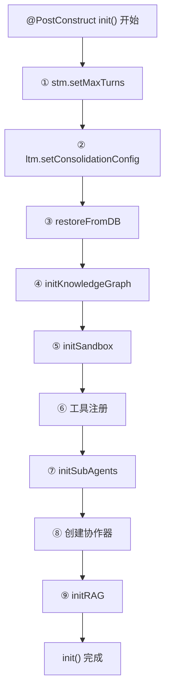

# 05 UnifiedAgentService 初始化

## 一句话结论

`UnifiedAgentService` 是整个系统的"大脑"——所有用户请求最终都交给它处理。它的 `@PostConstruct init()` 方法在 Spring 启动完成后执行，按顺序完成 9 大初始化步骤：配置短期记忆 → 配置长期记忆 → 数据库恢复 → 知识图谱 → 沙箱 → 工具注册 → 子代理注册 → 创建协作器 → 初始化 RAG。

---

## 它在主链路里的位置

```text
Spring 启动
    ↓
创建所有 @Service 和 @Component 实例（构造函数注入）
    ↓
Bean 实例化完成
    ↓
Spring 调用 @PostConstruct init()  ← ★ 本文件
    ↓
初始化完成，服务就绪
    ↓
等待用户请求
```

`init()` 不是处理请求的代码，而是**准备"战斗"的代码**——把所有武器（工具、记忆、知识库、子代理）装配好，等待第一个用户请求。

---

## 为什么需要它

如果不在 `init()` 集中初始化，你也可以想象其他方案：

| 方案 | 问题 |
|---|---|
| 构造函数里直接初始化 | 构造函数执行时依赖可能还没创建好（循环依赖） |
| 每个方法前懒加载 | 代码重复，且第一次请求会慢（冷启动） |
| 写一个独立的启动脚本 | 脱离 Spring 生命周期，无法利用依赖注入 |

`@PostConstruct init()` 是 Spring 提供的标准初始化时机——所有依赖都已注入，Bean 实例化完成，此时初始化最安全也最彻底。

---

## 对应源码位置

```text
AGI-saber-java/src/main/java/com/agi/assistant/service/agent/UnifiedAgentService.java
```

`init()` 方法内的 9 个步骤：

| 步骤编号 | 方法/代码块 | 做了什么 |
|---|---|---|
| ① | `stm.setMaxTurns(...)` | 配置短期记忆窗口大小 |
| ② | `ltm.setConsolidationConfig(...)` | 配置长期记忆整理策略 |
| ③ | `restoreFromDB()` | 从 PostgreSQL 恢复所有持久化数据 |
| ④ | `initKnowledgeGraph()` | 初始化 Neo4j 图记忆 |
| ⑤ | `initSandbox()` | 初始化沙箱执行环境 |
| ⑥ | 工具注册 | 注册默认工具 + 增强 + RAG + 沙箱工具 |
| ⑦ | `initSubAgents()` | 注册子代理 |
| ⑧ | 创建协作器 | 创建 Planner、ChatGenerator 等 6 个协作器 |
| ⑨ | `initRAG()` | 初始化 RAG 向量检索服务 |

---

## 先看对象长什么样

### 5.1 UnifiedAgentService 的字段——15 个依赖

```java
public class UnifiedAgentService {
    // ── 基础设施（5 个） ──
    private final AppConfig cfg;                  // 全局配置
    private final Infrastructure infra;            // 数据库操作层
    private final LlmService llm;                  // LLM 调用服务
    private final EmbeddingService emb;            // Embedding 服务
    private final AuditService audit;              // 审计日志服务

    // ── 记忆系统（4 个） ──
    private final ShortTermMemory stm;             // 短期记忆
    private final LongTermMemory ltm;              // 长期记忆
    private final PreferenceMemory pref;           // 偏好记忆
    private GraphMemory graphMem;                  // 图记忆（可选，启动时创建）

    // ── 工具系统（2 个） ──
    private final ToolService toolService;         // 工具注册与决策
    private final Map<String, Tool> tools;         // 全局工具库

    // ── 知识库与沙箱（3 个） ──
    private final RagService rag;                  // RAG 检索
    private KGStore kg;                            // 图数据库操作（可选）
    private Sandbox sandbox;                       // 沙箱执行引擎

    // ── 工作流（1 个） ──
    private final CollaborationManager collab;     // 子代理协作管理器
}
```

这些字段的依赖关系图（箭头表示"依赖于"）：

```text
UnifiedAgentService
  ├── cfg                  → 无依赖（最底层）
  ├── llm                  → 无依赖
  ├── emb                  → 无依赖
  ├── infra                → 无依赖
  ├── audit                → 无依赖
  │
  ├── stm                  → cfg（maxTurns）
  ├── ltm                  → cfg（consolidation）
  ├── pref                 → infra（数据库读写）
  ├── graphMem             → ltm + kg
  │
  ├── toolService          → llm + cfg
  ├── tools                → 自己维护的 Map
  │
  ├── rag                  → cfg + infra + emb + llm
  ├── kg                   → cfg（Neo4j 配置）+ llm
  ├── sandbox              → cfg
  │
  └── collab               → llm + toolService + rag
```

### 5.2 init() 方法执行后的状态

```text
init() 执行前：
  stm.getRecentMessages() = []      （空的）
  ltm.getItems() = []               （空的）
  pref.getAll() = {}                （空的）
  tools = {}                         （空的）
  kg = null                          （空的）
  sandbox = null                     （未创建）
  collab.getSubAgents() = {}         （空的）

init() 执行后：
  stm.getRecentMessages() = [最后 N 条历史对话]
  ltm.getItems() = [从数据库恢复的 N 条长期记忆]
  pref.getAll() = {语言: 中文, 风格: 简洁}
  tools = {get_time, get_weather, search_web, rag_search, exec_command, ...}
  kg = KGStore(Neo4j 连接就绪) 或 null
  sandbox = Sandbox(就绪)
  collab.getSubAgents() = {research_agent, writer_agent, review_agent, doc_agent}
```

---

## 核心流程图

### 6.1 init() 九步流程



---

## 源码逐段讲解

原文件：`UnifiedAgentService.java`，`init()` 方法。

### 7.1 @PostConstruct 入口

```java
@PostConstruct
public void init() {
    log.info("UnifiedAgentService 开始初始化...");
    // 9 步初始化...
    log.info("UnifiedAgentService 初始化完成");
}
```

**`@PostConstruct`** 是 JSR-250 规范定义的注解。Spring 在 Bean 初始化完成后（构造函数调用、依赖注入完成后）调用这个注解标注的方法：

```text
Spring Bean 创建过程：
  ① 构造函数调用 → 依赖注入（@Autowired）
  ② @PostConstruct 方法调用 ← ★ init() 在这里执行
  ③ 初始化完成，放入 Spring 容器
```

**为什么 `@PostConstruct` 而不是 `InitializingBean.afterPropertiesSet()`？**

```text
@PostConstruct：
  → 是标准 Java 注解（不依赖 Spring）
  → 即使换 Spring Boot 版本也不会影响

InitializingBean：
  → 是 Spring 特定接口
  → 代码侵入性强（类必须 implements InitializingBean）
```

---

### 7.2 第一步：配置短期记忆

```java
// ① 配置短期记忆
stm.setMaxTurns(cfg.getMemory().getShortTermMaxTurns());
```

假设配置：

```yaml
memory:
  short-term:
    max-turns: 10
```

执行后：

```text
stm.setMaxTurns(10)
    ↓
短期记忆最多保留 10 轮对话（用户+助手各一轮算 2 条）
    ↓
第 11 轮用户消息进来时：
    → stm.add("user", "新消息")
    → 超过 10 轮的旧消息被移除
    → 始终只保留最近 10 轮
```

**为什么不在构造方法里设置？** 因为 Spring 创建 `ShortTermMemory` 实例时还不知道配置值。配置是在 `AppConfig` 里，而 `AppConfig` 在注入 `UnifiedAgentService` 之后才完全就绪。

---

### 7.3 第二步：配置长期记忆整理

```java
// ② 配置长期记忆
ltm.setConsolidationConfig(cfg.getMemory().getConsolidation());
```

`ConsolidationConfig` 包含三个配置项：

```yaml
memory:
  consolidation:
    trigger-interval: 5     # 每新增 5 条记忆触发一次整理
    dedup-threshold: 0.95  # 去重阈值（cosine 相似度）
    decay-factor: 0.9      # 重要性衰减系数
```

执行后：

```text
ltm.setConsolidationConfig({
    triggerInterval: 5,
    dedupThreshold: 0.95,
    decayFactor: 0.9
})
    ↓
每次 storeClassified 新增时：
    storeCount++ → 累计到 5 → 触发后台整理
    → 衰减 → 去重 → 过期删除
```

---

### 7.4 第三步：数据库恢复

```java
// ③ 从数据库恢复
restoreFromDB();
```

`restoreFromDB()` 的内部逻辑在专门的文件 `06-数据库恢复-restoreFromDB.md` 中详细讲解，这里只概括：

```text
restoreFromDB()
  ├── 恢复聊天历史 → stm.add(...)
  ├── 恢复长期记忆 → ltm.storeItem(...)
  ├── 恢复偏好 → pref.save(key, value)
  └── 恢复快照 → snapshotManager.restore()
```

如果没有数据库（第一次启动或数据库清空）：

```text
restoreFromDB()
  → 查询结果为空
  → stm 仍然为空
  → ltm 仍然为空
  → pref 仍然为空
  → snapshotManager 没有快照可恢复
  → init() 继续执行后面的步骤
```

---

### 7.5 第四步：初始化知识图谱

```java
// ④ 初始化知识图谱
initKnowledgeGraph();
```

详细代码在 `07-知识图谱初始化-initKnowledgeGraph.md` 中讲解，这里只概括判断逻辑：

```text
if (Neo4j 配置存在) {
    创建 KGStore（连接 Neo4j）
    连接 KGStore 到 RAG
    创建 GraphMemory（包装 LongTermMemory）
    恢复 prevId
} else {
    kg = null
    graphMem = null
    // 后续代码正常执行，只是没有图能力
}
```

**这是一个"优雅降级"的例子——Neo4j 不存在不影响核心功能。**

---

### 7.6 第五步：初始化沙箱

```java
// ⑤ 初始化沙箱
private void initSandbox() {
    SandboxConfig sandboxCfg = cfg.getSandbox();
    if (sandboxCfg != null && sandboxCfg.isEnabled()) {
        sandbox = SandboxFactory.build(sandboxCfg);
        sandbox.setAuditFn(result -> audit.log("sandbox", result));
        log.info("沙箱初始化完成");
    } else {
        log.info("沙箱未启用");
    }
}
```

沙箱配置示例：

```yaml
sandbox:
  enabled: true
  type: DOCKER     # 可选：DOCKER / PROCESS / K8S_JOB
  image: "python:3.11-slim"  # Docker 镜像
  timeout: 30000   # 单次执行超时 30 秒
  memory-limit: "256m"  # 内存限制
```

**假设 Docker 不可用但 sandbox.enabled=true：**

```text
SandboxFactory.build()
  → 检查 Docker 是否可用
  → Docker 不可用
  → 降级为本地进程模式（type=PROCESS）
  → 仍然有超时和内存限制
  → 但没有 Docker 的隔离性
```

**`setAuditFn` 的作用：**

```text
每次 exec_command 执行后 → 沙箱自动调用 auditFn
  → audit.log("sandbox", "用户执行了 ls -la，耗时 200ms，返回码 0")
```

这是安全基线——所有沙箱命令执行都必须记录审计日志。

---

### 7.7 第六步：工具注册

```java
// ⑥ 工具注册
// 6.1 注册默认工具
Map<String, Tool> defaultTools = toolService.getDefaultTools();
tools.putAll(defaultTools);

// 6.2 增强 search_web（如果配置了 Tavily）
if (cfg.getSearch().getApiKey() != null && !cfg.getSearch().getApiKey().isEmpty()) {
    tools.put("search_web", createTavilySearchTool());
}

// 6.3 注册 RAG 搜索工具
tools.put("rag_search", createRagSearchTool());

// 6.4 注册命令执行工具
if (sandbox != null) {
    tools.put("exec_command", ExecCommandTool.create(sandbox));
}
```

详细讲解在 `08-工具注册与默认工具.md` 中。这里只关注注册顺序：

```text
① tools.putAll(defaultTools)
    → tools = {get_time, get_weather, search_web(模拟版)}

② tools.put("search_web", tavily版本)
    → tools = {get_time, get_weather, search_web(被覆盖为Tavily版)}

③ tools.put("rag_search", RAG版)
    → tools = {get_time, get_weather, search_web(Tavily), rag_search}

④ tools.put("exec_command", 沙箱版)
    → tools = {get_time, get_weather, search_web(Tavily), rag_search, exec_command}
```

**Map.put 同名覆盖——** 这是工具增强的核心机制。先放基础版，再放增强版覆盖。

---

### 7.8 第七步：注册子代理

```java
// ⑦ 注册子代理
private void initSubAgents() {
    collab.registerAgent("research_agent", new ResearchAgent(llm, rag, toolService));
    collab.registerAgent("writer_agent", new WriterAgent(llm));
    collab.registerAgent("review_agent", new ReviewAgent(llm));
    collab.registerAgent("doc_agent", new DocAgent(llm, rag));
}
```

子代理的作用：

| 子代理 | 输入 | 输出 | 使用场景 |
|---|---|---|---|
| research_agent | 研究问题 | 结构化研究结果 | ReAct 中需要深入调研 |
| writer_agent | 写作要求 | 文章/报告 | 需要写长文本时 |
| review_agent | 内容 | 评审意见 | 生成内容需要质量检查 |
| doc_agent | 文档问题 | 文档检索结果 | 内部文档问答 |

**子代理是"可插拔"的——** `collab.registerAgent` 只是注册名称到代理实例的映射。实际调度由 `CollaborationManager` 决定。

---

### 7.9 第八步：创建协作器

```java
// ⑧ 创建协作器
Planner planner = new Planner(llm, toolService);
ChatGenerator chatGen = new ChatGenerator(llm);
ReActLoop reactLoop = new ReActLoop(llm, toolService, planner);
ToolModeHandler toolMode = new ToolModeHandler(llm, toolService, pref);
MemoryWriter memWriter = new MemoryWriter(ltm, graphMem, emb, llm, cfg);
SnapshotManager snapManager = new SnapshotManager(infra);
```

这 6 个协作器是主链路的核心执行者：

```text
Planner           ─  ReAct 模式："要完成这个任务，需要哪几步？"
                      ↓
ChatGenerator     ─  chat 模式：直接调 LLM 回答
                      ↓
ReActLoop         ─  ReAct 模式：Agent 循环（观察 → 思考 → 行动 → 观察）
                      ↓
ToolModeHandler   ─  tool 模式：选一个工具 → 执行 → LLM 总结
                      ↓
MemoryWriter      ─  回答后处理：提取记忆信息 → 写入长期记忆
                      ↓
SnapshotManager   ─  快照管理：保存/恢复对话状态
```

---

### 7.10 第九步：初始化 RAG

```java
// ⑨ 初始化 RAG
private void initRAG() {
    try {
        rag.init(cfg.getRag());
        log.info("RAG 服务初始化完成");
    } catch (Exception e) {
        log.warn("RAG 初始化失败，知识库功能不可用: {}", e.getMessage());
    }
}
```

RAG 初始化做了：

```text
① 连接向量数据库（配置索引和维度，默认 1536）
② 加载已有文档（如果有）
③ 初始化检索通道（embedding 查询 → 向量数据库搜索）
④ 更新 rag.isLoaded() 状态
```

**初始化失败不中断服务启动：**

```text
RAG 初始化失败时：
  → 只打 warn 日志
  → rag.isLoaded() = false
  → 路由判断 needRAG 时：ragLoaded=false → 不走 RAG 模式
  → 用户仍然可以使用 chat/tool/react 模式
```

---

### 7.11 init() 完成后做的事——acceptNewRequest

```java
// 这个不是 init() 的一部分，但在初始化后有调用
private volatile boolean acceptingRequests = false;

@EventListener(ApplicationReadyEvent.class)
public void onApplicationReady() {
    this.acceptingRequests = true;
    log.info("服务就绪，开始接受请求");
}
```

**为什么 init() 完成后不立即接受请求？**

```text
Spring 容器的初始化序列：
  ① UnifiedAgentService.init() 执行完成
  ② 
  ③ 还有其他 @Service 可能在初始化！
  ④ 
  ⑤ ApplicationReadyEvent 发布
  ⑥ 
  ⑦ UnifiedAgentService.onApplicationReady()
  ⑧   → acceptingRequests = true
  ⑨   → processStream() 才能处理请求
```

所以 `processStream()` 开头有检查：

```java
if (!acceptingRequests) {
    // 返回 "服务正在初始化，请稍后重试"
}
```

---

## 真实举例：它在流程中怎么运行

### 8.1 完整的启动过程

```text
启动 Docker Compose (PostgreSQL + Neo4j + 应用)
    ↓
Spring 启动，创建 Bean：
  → new AppConfig()         ← 读取 application.yml
  → new LlmService()        ← 创建 LLM 客户端
  → new ShortTermMemory()   ← 空的短期记忆
  → new LongTermMemory()    ← 空的长期记忆
  → ...
  → new UnifiedAgentService(所有依赖)  ← 构造函数注入
    ↓
Spring 调用 @PostConstruct init():
  → stm.setMaxTurns(10)
  → ltm.setConsolidationConfig({triggerInterval:5, dedupThreshold:0.95})
  → restoreFromDB():
      → 查询 chat_history → reverse() → stm.add(...)
      → 查询 long_term_memory → ltm.storeItem(...)
      → 查询 preferences → pref.save(...)
  → initKnowledgeGraph():
      → Neo4j 配置存在 → 创建 KGStore → 创建 GraphMemory → syncPrevId
  → initSandbox():
      → sandbox.enabled = true → SandboxFactory.build()
  → 工具注册 → 子代理注册 → 创建协作器 → initRAG()
    ↓
ApplicationReadyEvent:
  → acceptingRequests = true
  → 服务就绪！
```

---

## 关键判断条件

| 判断点 | 条件 | true 时 | false 时 |
|---|---|---|---|
| 图记忆 | `Neo4j 配置存在` | 创建 KGStore + GraphMemory | kg=null, graphMem=null |
| 沙箱 | `sandboxCfg.isEnabled()` | 创建 Sandbox | sandbox=null |
| RAG 初始化 | `rag.init()` 成功 | rag.isLoaded()=true | rag.isLoaded()=false |
| 接收请求 | `acceptingRequests` | 正常处理 | 返回"正在初始化" |
| 工具覆盖 | `Map.put(同名key)` | 增强版覆盖基础版 | — |
| 数据库恢复 | 查询结果为空 | 状态为空，正常继续 | 恢复数据 |

---

## 容易混淆的点

**1. `@PostConstruct` 在构造函数之后执行，但不是 "Spring 启动的最后一件事"。** 其他 `@Service` 的 `@PostConstruct` 可能也在执行。真正的"全部就绪"是 `ApplicationReadyEvent`。

**2. `tools` 是 `Map<String, Tool>` 而不是 `ConcurrentHashMap`。** 如果未来需要运行时动态注册/取消工具，需要改成并发安全的 Map。当前所有工具注册在启动时完成，运行时不变，所以用普通 HashMap 即可。

**3. `graphMem != null` 不等于 Neo4j 可用。** 即使 Neo4j 配置不完整，`initKnowledgeGraph()` 可能会创建一个没有 `kg` 的 `GraphMemory`。图写入时内部判断 `kg != null && kg.available()`。

**4. `restoreFromDB` 使用 `ltm.storeItem()` 而不是 `ltm.storeClassified()`。** `storeItem` 直接追加，不做去重——因为数据库里保存的已经是去重后的数据。如果用 `storeClassified` 可能误合并。

**5. 子代理在 `init()` 中注册，但它们不是 "一直在后台运行"。** 它们只是注册到 `collab` 中，由 `ChatGenerator` 或 `ReActLoop` 在需要时通过名称查找并调用。

---

## 和其他模块的关系

`UnifiedAgentService.init()` 是整个系统的"总装配线"：

| init 步骤 | 影响的模块 | 影响什么 |
|---|---|---|
| ① stm.setMaxTurns | 短期记忆 | 对话窗口大小 |
| ② ltm.setConsolidationConfig | 长期记忆 | 去重阈值、衰减系数 |
| ③ restoreFromDB | 所有记忆 | 启动时的数据恢复 |
| ④ initKnowledgeGraph | 图记忆、RAG | 图能力开关 |
| ⑤ initSandbox | exec_command | 命令执行能力 |
| ⑥ 工具注册 | 路由、ReAct、ToolMode | 可用工具集 |
| ⑦ initSubAgents | Collaboration | 子代理可用性 |
| ⑧ 创建协作器 | 四种模式 | 处理请求的执行者 |
| ⑨ initRAG | RAG 模式 | 知识库可用性 |

---

## 如果要改这个功能，改哪里

| 需求 | 修改位置 | 怎么改 | 风险 |
|---|---|---|---|
| 新增初始化步骤 | `init()` 方法 | 新步骤加到现有步骤后面 | 确保步骤顺序正确 |
| 新工具注册 | init 工具注册部分 | tools.put("新工具", ...) | 新工具需要经过审核 |
| 初始化失败可重试 | init 方法 | 加 Retryable 注解 | 幂等性保证 |
| 惰性加载（不用时不要初始化） | 对应 init 子方法 | 拆成 @Lazy | 第一次请求可能慢 |
| 注册新子代理 | initSubAgents | collab.registerAgent("新代理", ...) | 代理实现正确性 |
| 初始化顺序依赖另一个 Service | ApplicationReadyEvent | 事件驱动初始化 | 启动时序复杂度提升 |

---

## 面试怎么说

完整说法：

```text
UnifiedAgentService 是系统的核心调度器。它的 @PostConstruct init() 方法在 Spring 完成依赖注入后执行 9 个初始化步骤：配置短期记忆窗口 → 配置长期记忆整理策略 → 从 PostgreSQL 恢复数据 → 初始化知识图谱（如果 Neo4j 可用）→ 初始化沙箱 → 注册工具和子代理 → 创建六大协作器 → 初始化 RAG。

每个步骤都是"优雅降级"的——Neo4j 不可用不影响核心功能，RAG 初始化失败不影响聊天能力。全部完成后，通过 ApplicationReadyEvent 设置 acceptingRequests=true，才开始接受用户请求。
```

短版：

```text
init() 是系统启动时的总装配线，9 步按顺序完成记忆、工具、沙箱、子代理、RAG 的初始化。每个步骤独立降级——某个组件失败不影响系统整体可用。完成后通过 ApplicationReadyEvent 设为就绪状态才接受请求。
```

---

## 自检题

1. `@PostConstruct` 在哪个时机执行？
2. init() 的 9 个步骤顺序可以乱吗？哪个步骤必须在哪个步骤之前？
3. `restoreFromDB` 为什么用 `ltm.storeItem()` 而不是 `ltm.storeClassified()`？
4. 如果 Neo4j 不可用，系统还能正常启动吗？`graphMem` 会怎样？
5. `acceptingRequests` 为什么用 `volatile` 修饰？
6. 工具注册的顺序会影响最终效果吗？举个例子。
7. 子代理是在什么时候被调用的？不是在 init() 时。
8. RAG 初始化失败后，`rag.isLoaded()` 是什么值？
9. 沙箱初始化时 Docker 不可用会怎样？
10. `ConsolidationConfig` 的三个配置项分别控制什么行为？
