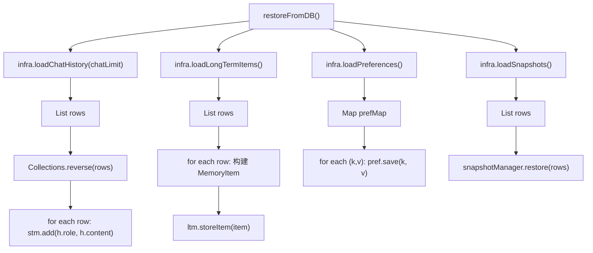

# 06 数据库恢复 restoreFromDB

## 一句话结论

`restoreFromDB()` 在服务启动时从 PostgreSQL 读取持久化数据，恢复到内存中的四类记忆对象（短期记忆、长期记忆、偏好记忆、快照）。没有这步，每次重启用户都会从"空白"开始。

---

## 它在主链路里的位置

```text
UnifiedAgentService.init()
  ├── ① stm.setMaxTurns(10)
  ├── ② ltm.setConsolidationConfig(...)
  ├── ③ restoreFromDB()            ← ★ 本文件
  │     ├── 恢复聊天历史 → stm
  │     ├── 恢复长期记忆 → ltm
  │     ├── 恢复偏好 → pref
  │     └── 恢复快照 → snapshotManager
  ├── ④ initKnowledgeGraph()
  ├── ⑤ initSandbox()
  ├── ⑥ 工具注册
  ├── ⑦ initSubAgents()
  ├── ⑧ 创建协作器
  └── ⑨ initRAG()
```

**`restoreFromDB()` 在 9 步中的第 3 步执行。** 它位于"配置记忆参数"之后、"创建知识图谱"之前——因为后面的 `initKnowledgeGraph()` 需要已恢复的长期记忆列表来计算 `prevId`。

---

## 为什么需要它

没有 `restoreFromDB()`，服务重启后：

| 记忆类型 | 重启前 | 重启后（无 restore） | 问题 |
|---|---|---|---|
| 短期记忆 | 最近 10 轮对话 | 空列表 | 用户问"我刚才说了什么"，系统不知道 |
| 长期记忆 | 100 条用户画像 | 空列表 | 系统忘记了用户的姓名、偏好、习惯 |
| 偏好记忆 | 语言=中文, 风格=简洁 | 空 Map | 回答风格回到默认 |
| 快照 | 对话中打了快照 | 不存在 | 无法从断点恢复 |

所以 `restoreFromDB()` 解决的是**会话连续性**——让用户感觉不到服务重启过。

---

## 对应源码位置

```text
AGI-saber-java/src/main/java/com/agi/assistant/service/agent/UnifiedAgentService.java
```

`restoreFromDB()` 方法体就在 `UnifiedAgentService` 中，约 40-60 行代码。它调用了 `Infrastructure` 接口的三个查询方法：

```text
Infrastructure 接口中的查询方法：
  ├── loadChatHistory(limit)     → List<ChatMessage>
  ├── loadLongTermItems()         → List<LongTermItemRow>
  ├── loadPreferences()           → Map<String, String>
  └── loadSnapshots()             → List<SnapshotRow>
```

与之对应的写入方法（不是 restoreFromDB 调用的，但做反向操作）：

```text
  ├── saveChatHistory(role, content)         → 写聊天记录
  ├── saveLongTermItemClassified(...)        → 写长期记忆
  ├── savePreference(key, value)             → 写偏好
  └── saveSnapshot(snapshot)                 → 写快照
```

---

## 先看对象长什么样

### 5.1 数据库中的表结构

PostgreSQL 中的四张表：

**chat_history 表：**

```sql
CREATE TABLE chat_history (
    id BIGSERIAL PRIMARY KEY,
    conversation_id VARCHAR(64) NOT NULL,
    role VARCHAR(16) NOT NULL,        -- 'user' 或 'assistant'
    content TEXT NOT NULL,             -- 消息内容
    created_at TIMESTAMP DEFAULT NOW()
);
CREATE INDEX idx_chat_history_conv ON chat_history(conversation_id, created_at);
```

**long_term_memory 表：**

```sql
CREATE TABLE long_term_memory (
    id BIGSERIAL PRIMARY KEY,
    content TEXT NOT NULL,              -- 记忆正文
    importance DOUBLE PRECISION,       -- 重要性
    embedding DOUBLE PRECISION[],      -- 向量数组
    category VARCHAR(32) DEFAULT 'general',
    tags TEXT[],                       -- 标签数组
    slot_hint VARCHAR(64),
    created_at TIMESTAMP DEFAULT NOW(),
    last_accessed TIMESTAMP DEFAULT NOW()
);
```

**preferences 表：**

```sql
CREATE TABLE preferences (
    id BIGSERIAL PRIMARY KEY,
    key VARCHAR(128) UNIQUE NOT NULL,  -- 偏好键名
    value TEXT NOT NULL,               -- 偏好值
    confidence DOUBLE PRECISION DEFAULT 1.0,
    updated_at TIMESTAMP DEFAULT NOW()
);
```

**snapshots 表：**

```sql
CREATE TABLE snapshots (
    id BIGSERIAL PRIMARY KEY,
    snapshot_id VARCHAR(64) UNIQUE NOT NULL,
    state JSONB NOT NULL,              -- 完整状态快照
    created_at TIMESTAMP DEFAULT NOW()
);
```

### 5.2 恢复后的内存对象

执行 `restoreFromDB()` 后，Java 内存里的状态：

```java
// stm 短期记忆
stm.getRecentMessages() = [
    ChatMessage{role="user", content="你好，我叫小李"},
    ChatMessage{role="assistant", content="你好小李！有什么可以帮助你的？"},
    ChatMessage{role="user", content="帮我查一下上海天气"},
    ...
]  // 最多 chatLimit 条

// ltm 长期记忆
ltm.getItems() = [
    MemoryItem{id=101, content="用户姓名: 小李", importance=0.9, category="identity"},
    MemoryItem{id=102, content="用户偏好: 中文回答", importance=0.7, category="preference"},
    ...
]

// pref 偏好记忆
pref.getAll() = {
    "语言": "中文",
    "回答风格": "简洁",
    "所在城市": "上海"
}

// snapshotManager 快照管理器
snapshotManager.getSnapshots() = [
    Snapshot{id="snap_001", ...},
    Snapshot{id="snap_002", ...}
]
```

---

## 核心流程图

### 6.1 restoreFromDB 数据流



---

## 源码逐段讲解

原文件：`UnifiedAgentService.java`，`restoreFromDB()` 方法。

### 7.1 方法入口——配置控制加载量

```java
private void restoreFromDB() {
    int chatLimit = cfg.getMemory().getRestoreChatLimit();  // 最多恢复多少条聊天记录
    // 四个恢复步骤...
}
```

配置文件：

```yaml
memory:
  restore-chat-limit: 50   # 最多恢复 50 条聊天记录（25 轮对话）
```

**为什么限制数量？** 如果把所有聊天记录都恢复到短期记忆：

```text
用户聊了 1 年，10 万条消息
    ↓
全部加载到 stm
    ↓
短期记忆窗口太大 → LLM prompt 塞满聊天历史
    ↓
LLM 上下文窗口不够用
```

所以 `restore-chat-limit` 是一个重要的配置项——**恢复不是"全部恢复"，而是"恢复最近的 N 条"**。

---

### 7.2 恢复聊天历史——需要 reverse()

```java
// 恢复聊天历史
List<ChatMessage> history = infra.loadChatHistory(chatLimit);
Collections.reverse(history);          // ① 为什么要 reverse？
for (ChatMessage h : history) {
    stm.add(h.getRole(), h.getContent());  // ② 一条条加入短期记忆
}
```

逐行讲解：

**`infra.loadChatHistory(chatLimit)`** — 执行的 SQL 类似：

```sql
SELECT role, content, created_at
FROM chat_history
WHERE conversation_id = ?
ORDER BY created_at DESC     -- 按时间倒序
LIMIT ?;                     -- 最多 chatLimit 条
```

**`Collections.reverse(history)` — 为什么要 reverse？**

```text
数据库返回：
  DESC 排序 → 最新的在前：
    row[0] = "帮我查上海天气"      （最新）
    row[1] = "好的，上海今天..."   （倒二）
    row[2] = "我叫小李"           （倒三）
    ...

stm.add 顺序：
  stm.add("user", "帮我查上海天气")   ← 先加入最新的
  stm.add("assistant", "好的，上海...")
  stm.add("user", "我叫小李")

短期记忆结果：
  [用户: 帮我查上海天气, 助手: 好的...]
  ↑
  最新信息在列表最前面，不符合对话时序！

如果 reverse()：
  row[0] → row[last]  → 最早的在前：
    stm.add("user", "我叫小李")         ← 先加入最早的
    stm.add("assistant", "你好小李！")
    stm.add("user", "帮我查上海天气")   ← 最后加入最新的

短期记忆结果：
  [用户: 我叫小李, 助手: 你好小李, 用户: 帮我查上海天气]
  ↑
  正确的时间顺序！
```

**❌ 如果写成没有 reverse()：**

```java
// 错误写法——没有 reverse
for (ChatMessage h : infra.loadChatHistory(chatLimit)) {
    stm.add(h.getRole(), h.getContent());
}
// 短期记忆中的顺序：最新→最旧
// 用户看到：chronological 顺序乱了
// 后续 LLM 看到乱序的对话历史 → 回答可能错乱
```

**`stm.add(h.getRole(), h.getContent())`** — 把对话消息一条条加入短期记忆的 circular buffer：

```text
假设 maxTurns=10, chatLimit=50

第一次 add("user", "我叫小李"):
  [用户: 我叫小李]                        size=1

第二次 add("assistant", "你好小李"):
  [用户: 我叫小李, 助手: 你好小李]         size=2

...
全部恢复完成后：
  [用户: 我叫小李, 助手: 你好小李, ..., 用户: 帮我查天气, 助手: 上海今天晴]  size=50

注意：size=50 超过了 maxTurns=10 吗？
  → stm 内部会限制 maxTurns 条
  → 但 restoreFromDB 是在 setMaxTurns 之后执行的
  → 所以短期记忆确实会保持 50 条（历史恢复不受 maxTurns 限制？）

这里要看具体实现：
  如果 stm.add 内部检查 maxTurns：
    → 恢复完成后 stm 最多只有 10 轮（20 条）
    → 多余的被丢弃了

  如果恢复时最大容量 = Math.max(maxTurns, restoreChatLimit)：
    → 临时扩大窗口装载恢复数据
```

**这个细节值得问一下代码实现者——当前是怎么处理的。** 两种策略各有利弊。

---

### 7.3 恢复长期记忆——用 storeItem 而不是 storeClassified

```java
// 恢复长期记忆
List<LongTermItemRow> rows = infra.loadLongTermItems();
for (LongTermItemRow row : rows) {
    MemoryItem item = new MemoryItem(row.getId(), row.getContent(),
            row.getImportance(), row.getEmbedding());
    item.setCategory(row.getCategory());
    item.setTags(row.getTags());
    item.setSlotHint(row.getSlotHint());
    // ... 设置 createdAt, lastAccessed 等
    ltm.storeItem(item);  // ★ 注意：不是 storeClassified！
}
```

**`infra.loadLongTermItems()`** — 执行的 SQL 类似：

```sql
SELECT id, content, importance, embedding, category, tags, slot_hint, created_at, last_accessed
FROM long_term_memory
ORDER BY created_at ASC;   -- 按时间正序
```

**`ltm.storeItem(item)` 和 `ltm.storeClassified()` 的区别：**

```java
// storeItem——直接追加，不做去重
public void storeItem(MemoryItem item) {
    items.add(item);       // 直接加到列表末尾
    if (item.getId() >= nextId) {
        nextId = item.getId() + 1;  // 更新 nextId 防止 ID 冲突
    }
}

// storeClassified——先做去重
public boolean storeClassified(...) {
    // 遍历 items，算 cosine，判断重复...
    // 只有不重复才新增
}
```

**为什么用 `storeItem` 而不是 `storeClassified`？**

```text
原因 1：数据库里的数据已经是去重后的
  → restoreFromDB 恢复的是"之前保存的、已确认无重复"的记忆
  → 不需要再做一次去重判断

原因 2：storeClassified 的内部去重可能误判
  → 两条记忆内容不同但 embedding 相似度很高
  → 如果使用 storeClassified 恢复，可能把原本不同的记忆合并
  → 导致数据丢失

原因 3：storeClassified 的参数结构不同
  → storeClassified 需要 embedding 列表
  → 但恢复时可能还没有 embedding 服务
  → storeItem 不需要 embedding
```

**❌ 如果写成用 `storeClassified`：**

```java
// 错误做法
for (LongTermItemRow row : rows) {
    ltm.storeClassified(
        row.getContent(), row.getImportance(), row.getEmbedding(),
        row.getCategory(), row.getTags(), row.getSlotHint()
    );
    // 问题：两条原本独立的记忆可能被去重合并！
    // 问题：可能改变原始 ID！
}
```

**`nextId` 的更新：**

```text
数据库已有的最大 ID = 105

恢复第一条 (ID=101):
  storeItem(item{id=101})
  → 101 >= nextId=0 → nextId = 102

恢复第二条 (ID=102):
  storeItem(item{id=102})
  → 102 >= nextId=102 → nextId = 103

...

恢复最后一条 (ID=105):
  storeItem(item{id=105})
  → 105 >= nextId=105 → nextId = 106

恢复完成后：
  nextId = 106
  → 下一次新增 MemoryItem 的 ID 从 106 开始
  → 不会和已有 ID 冲突
```

---

### 7.4 恢复偏好——最直接的 Map 操作

```java
// 恢复偏好
Map<String, String> prefMap = infra.loadPreferences();
for (Map.Entry<String, String> entry : prefMap.entrySet()) {
    pref.save(entry.getKey(), entry.getValue());
}
```

**`infra.loadPreferences()`** — 执行的 SQL：

```sql
SELECT key, value FROM preferences;
```

**`pref.save(key, value)`** — 存入 `PreferenceMemory` 的内存 Map：

```text
loadPreferences 返回：
  {"语言": "中文", "回答风格": "简洁", "所在城市": "上海"}

pref.save 三条记录后：
  pref.getAll() == {"语言": "中文", "回答风格": "简洁", "所在城市": "上海"}
```

**偏好恢复是最简单的——直接 Map put，不需要 reverse、不需要去重、不需要 ID 同步。**

---

### 7.5 恢复快照——由 SnapshotManager 管理

```java
// 恢复快照
List<SnapshotRow> snapshots = infra.loadSnapshots();
snapshotManager.restore(snapshots);
```

快照中保存的是对话的完整状态：

```text
Snapshot{
  id: "snap_conv_001_time_123456",
  state: {
    conversationId: "conv_001",
    lastMode: "react",
    unresolvedTasks: ["查天气", "推荐穿衣"],
    memoryState: { ... }
  },
  createdAt: "2026-06-22T10:00:00"
}
```

`snapshotManager.restore()` 做的事情：

```text
① 按 createdAt 排序快照
② 找到最新可用的快照
③ 恢复对话上下文（conversationId、lastMode 等）
④ 恢复未完成任务
⑤ 标记"可以从断点继续"
```

---

### 7.6 恢复的完整 SQL 概览

```text
restoreFromDB 四个查询——用一次数据库连接还是四次？

方案一：四次独立查询（当前）
  → 简单，每个查询独立
  → 四次 TCP 往返

方案二：一次批量查询
  → 减少网络开销
  → 但代码复杂度上升（四个结果集解析）

当前选择方案一——清晰优先于性能。启动时只执行一次，对整体启动时间影响小。
```

---

## 真实举例：它在流程中怎么运行

### 8.1 完整恢复过程

假设数据库中有以下数据：

```text
chat_history 表：
  id=1 | "你好" | user
  id=2 | "你好！我是助手" | assistant
  id=3 | "我叫小李" | user
  id=4 | "你好小李！" | assistant
  id=5 | "上海天气怎么样" | user

long_term_memory 表：
  id=101 | "用户姓名: 小李" | 0.9 | identity | embedding_101
  id=102 | "用户偏好: 中文回答" | 0.7 | preference | embedding_102

preferences 表：
  key="语言" | value="中文"
  key="所在城市" | value="上海"

snapshots 表：
  id=1 | snapshot_id="snap_001" | state={...}
```

**恢复过程：**

```text
第一步：恢复聊天历史
  loadChatHistory(50)
  → 返回 5 条，最新在前
  → reverse()
  → 按时间顺序：你好 → 你好我是助手 → 我叫小李 → 你好小李 → 上海天气怎么样
  → stm.add 5 次
  → stm.getRecentMessages() = [5 条对话]

第二步：恢复长期记忆
  loadLongTermItems()
  → 返回 2 条
  → 构建两个 MemoryItem（id=101, id=102）
  → ltm.storeItem(item101)
  → ltm.storeItem(item102)
  → nextId = 103
  → ltm.getItems() = [MemoryItem{id=101}, MemoryItem{id=102}]

第三步：恢复偏好
  loadPreferences()
  → 返回 {"语言": "中文", "所在城市": "上海"}
  → pref.save("语言", "中文")
  → pref.save("所在城市", "上海")

第四步：恢复快照
  loadSnapshots()
  → 返回 1 条
  → snapshotManager.restore([snap_001])
```

**恢复完成后：**

```text
用户发送新消息："帮我查天气"
    → processStream(req) 开始
    → stm 有最近的 5 条对话上下文
    → pref 知道用户偏好中文、所在上海
    → ltm 知道用户叫小李
    → 上下文更充分，回答更准确
```

---

## 关键判断条件

| 判断点 | 条件 | 结果 |
|---|---|---|
| 恢复条数 | `chatLimit` 配置值 | 最多加载 N 条 |
| 聊天历史顺序 | `Collections.reverse()` | 按时间正序加入 stm |
| 长期记忆写入 | `storeItem` vs `storeClassified` | storeItem 直接追加 |
| 长期记忆 ID | `item.getId() >= nextId` | 更新 nextId 防止冲突 |
| 偏好恢复 | `pref.save(k, v)` | 直接覆盖已有 key |
| 快照恢复 | `snapshotManager.restore` | 按时间和可用性选择 |

---

## 容易混淆的点

**1. `reverse()` 是针对 `DESC` 查询结果的修正，不是随意调用。** 如果查询 SQL 改为 `ASC`，就不需要 `reverse()` 了。当前代码写 `DESC + reverse` 是为了让 SQL 性能更好——`ORDER BY created_at DESC LIMIT N` 可以利用索引取最近的 N 条。

**2. `storeItem` 不一定是"不做任何检查"。** 取决于实现——有些实现中 `storeItem` 会检查 ID 是否重复。但 `storeItem` 不做**语义去重**（cosine 判断），这是它和 `storeClassified` 的本质区别。

**3. 恢复后 `ltm.getItems()` 的顺序和 `storeClassified` 新增的顺序可能不同。** `storeClassified` 把新记忆追加到末尾（按写入时间）。`storeItem` 按数据库查询结果顺序。如果数据库是 `ORDER BY created_at ASC`，两者顺序应该一致。

**4. 偏好恢复不保证持久化 `confidence` 字段。** 注意上面代码 `pref.save(key, value)` 只传了 key 和 value，没有 `confidence`。如果数据库里保存了置信度，恢复时可能会丢失。

**5. `restoreFromDB` 在所有 init 步骤之前只确定了 maxTurns 和 consolidation 配置。** 这意味着恢复出来的数据受这两个配置的影响——比如恢复时短期记忆的容量受 maxTurns 限制。

---

## 和其他模块的关系

| 恢复的数据 | 恢复到哪里 | 后续影响 |
|---|---|---|
| 聊天历史 | `ShortTermMemory` | `buildMemorySystemPrefix` 构建时包含历史 |
| 长期记忆 | `LongTermMemory` | `initKnowledgeGraph` 中的 `syncPrevId` |
| 长期记忆 | `LongTermMemory` | `contextAssembler` 召回时可用 |
| 长期记忆 | `LongTermMemory.nextId` | 后续 `storeClassified` 的 ID 从恢复后的 nextId 开始 |
| 偏好 | `PreferenceMemory` | `memPrefix` 构建包含偏好信息 |
| 快照 | `SnapshotManager` | 对话断点恢复能力 |

---

## 如果要改这个功能，改哪里

| 需求 | 修改位置 | 怎么改 | 风险 |
|---|---|---|---|
| 调整恢复聊天历史数量 | `cfg.memory.restoreChatLimit` | 配置加/减 | 太多塞满 prompt |
| 用 storeClassified 恢复 | `restoreFromDB` | 改为 ltm.storeClassified(...) | 可能误合并独立记忆 |
| 恢复时保留 embedding | 已保留 | — | — |
| 新增恢复数据类型 | `restoreFromDB` | 加新 infra.loadXxx() | 数据库表要先有 |
| 加快恢复速度 | `Infrastructure` | 批量查询 | 代码复杂度 |

---

## 面试怎么说

完整说法：

```text
restoreFromDB 在服务启动时从 PostgreSQL 读取持久化数据。聊天历史按时间倒序查询、反转后按正序写入短期记忆，确保对话时序正确；长期记忆通过 storeItem 直接追加到内存列表，不做去重——因为数据库保存的已经是去重后的数据，同时更新 nextId 防止 ID 冲突；偏好记忆和快照直接按 key-value 恢复。四个恢复步骤各自独立、互不影响。
```

短版：

```text
restoreFromDB 从 PostgreSQL 恢复四类数据到内存。聊天历史要 reverse() 保证时序，长期记忆用 storeItem 而非 storeClassified 避免误合并，偏好和快照直接恢复。核心目标是"让用户感觉不到服务重启"。
```

---

## 自检题

1. 为什么聊天历史恢复时要 `Collections.reverse()`？
2. 恢复长期记忆为什么用 `storeItem` 而不是 `storeClassified`？
3. `nextId` 在恢复过程中起什么作用？
4. 如果 `chatLimit` 设为 10，而 `maxTurns` 也是 10，恢复的聊天历史会怎样？
5. 偏好恢复为什么不带 `confidence` 字段？会有什么影响？
6. 恢复数据后，`initKnowledgeGraph` 中的 `syncPrevId` 依赖哪一步的恢复结果？
7. 服务第一次启动（数据库为空）时，`restoreFromDB` 的行为是什么？
8. 如果恢复时聊天历史有 100 条但 `chatLimit=50`，会丢掉哪些？丢掉的数据用户还能看到吗？
9. 快照恢复后，系统可以"从断点继续"——具体是怎么做到的？
10. 恢复过程中某个表查询失败了会怎样？系统崩溃还是跳过？
