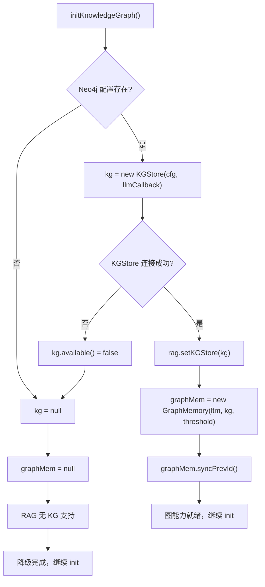

# 07 知识图谱初始化 initKnowledgeGraph

## 一句话结论

`initKnowledgeGraph()` 在服务启动时检测 Neo4j 配置——如果有则创建图数据库连接和 GraphMemory 包装层，把长期记忆提升为"带关系"的记忆；如果没有则优雅降级，系统继续正常使用，只是没有图能力。

---

## 它在主链路里的位置

```text
UnifiedAgentService.init()
  ├── ① stm.setMaxTurns(10)
  ├── ② ltm.setConsolidationConfig(...)
  ├── ③ restoreFromDB()              ← 此时记忆数据已恢复
  ├── ④ initKnowledgeGraph()         ← ★ 本文件：在恢复之后执行
  │     ├── 检查 Neo4j 配置
  │     ├── 创建 KGStore
  │     ├── 链接 RAG
  │     ├── 创建 GraphMemory
  │     └── syncPrevId
  ├── ⑤ initSandbox()
  ├── ⑥ 工具注册
  ├── ⑦ initSubAgents()
  ├── ⑧ 创建协作器
  └── ⑨ initRAG()
```

**为什么在 `restoreFromDB()` 之后？** 因为 `GraphMemory` 创建时需要 `LongTermMemory` 对象（已有从数据库恢复的数据），`syncPrevId()` 需要从恢复后的记忆列表中找到最后一条。

---

## 为什么需要它

没有图记忆，系统也能正常工作（向量召回也能找相似记忆）。但有了图记忆：

| 场景 | 无图记忆 | 有图记忆 |
|---|---|---|
| 用户说"继续刚才的话题" | 可能找错记忆 | 通过 FOLLOWS 边找到上下文 |
| 用户说"上次那个类似的项目" | 只能靠 embedding 模糊匹配 | 通过 SIMILAR_TO 边快速定位 |
| 用户问相关但不同的问题 | 只能召回最相似的单条 | 通过图邻居扩展多条相关记忆 |
| RAG 搜索 | 纯向量搜索 | 3-way 融合：向量+图+文本 |

所以 `initKnowledgeGraph()` 是"可选但加分"的能力——系统没有它能工作，有它效果更好。

---

## 对应源码位置

```text
AGI-saber-java/src/main/java/com/agi/assistant/service/agent/UnifiedAgentService.java
```

`initKnowledgeGraph()` 方法体就在 UnifiedAgentService 中。

涉及到的类和文件：

| 类 | 文件 | 作用 |
|---|---|---|
| `KGStore` | `service/graph/KGStore.java` | Neo4j 操作入口 |
| `Neo4jStore` | `service/graph/Neo4jStore.java` | 底层 Cypher 执行 |
| `GraphMemory` | `service/memory/GraphMemory.java` | 长期记忆的图包装层 |
| `RagService` | `service/rag/RagService.java` | RAG 检索服务 |
| `AppConfig` | — | 包含 Neo4j 配置 |

---

## 先看对象长什么样

### 5.1 Neo4j 配置

```yaml
neo4j:
  uri: "bolt://localhost:7687"
  username: "neo4j"
  password: "password"
```

### 5.2 initKnowledgeGraph 创建的两个核心对象

```text
KGStore:
  {
    neo4jStore: Neo4jStore {
      driver: org.neo4j.driver.Driver@123,  // Neo4j Java Driver
      available: true
    },
    llmCallback: (systemPrompt, userMsg) -> llm.chat(...)  // LLM 回调
  }

GraphMemory:
  {
    ltm: LongTermMemory @456,             // 已恢复的长期记忆
    kg: KGStore @789,                      // 刚创建的 KGStore
    simThreshold: 0.7,                     // 相似边阈值
    prevId: 102                            // 已恢复的最后一条记忆 ID（从 syncPrevId）
  }
```

### 5.3 RAG 3-way 融合示意图

```text
RAG 搜索 "用户姓名":
    ↓
① 向量搜索：        ② 图邻居扩展：       ③ 文本 BM25：
   embedding 匹配       KG 查询邻居         关键词匹配
   找到 M101            找到 M101 邻居      找到"姓名"相关
   相似度 0.92          邻居 M102、M103     得分 2.5
    ↓                     ↓                   ↓
④ 3-way 融合：
   排序 → 加权 → 去重 → 返回 Top-K 结果
```

---

## 核心流程图

### 6.1 initKnowledgeGraph 完整流程



---

## 源码逐段讲解

原文件：`UnifiedAgentService.java`，`initKnowledgeGraph()` 方法。

### 7.1 配置检查——第一步判断

```java
private void initKnowledgeGraph() {
    Neo4jConfig neo4jCfg = cfg.getNeo4j();
    if (neo4jCfg == null || neo4jCfg.getUri() == null
            || neo4jCfg.getUri().isEmpty()) {
        log.info("Neo4j 未配置，图记忆功能不可用");
        return;  // ← 直接返回，kg 和 graphMem 保持 null
    }
    // ... 后续初始化
}
```

**三个条件缺一不可：**

```text
cfg.getNeo4j() != null                          → 配置块存在
    ↓
neo4jCfg.getUri() != null                       → 连接地址存在
    ↓
!neo4jCfg.getUri().isEmpty()                    → 地址不为空
    ↓
全部满足 → 继续初始化
任一不满足 → 跳过，kg=null，graphMem=null
```

**❌ 如果写成只检查 uri 不检查 username/password：**

```java
// 错误：只检查 uri
if (neo4jCfg != null && neo4jCfg.getUri() != null) {
    kg = new KGStore(neo4jCfg, llmCallback);  // 可能缺少认证信息
}
// 问题：username/password 为空 → Neo4j 认证失败 → kg.available()=false
// 但代码执行到了这里，看起来像是初始化成功了
// 更好的做法：在 KGStore 构造函数中完成可用性检查
```

---

### 7.2 创建 KGStore——Neo4j 连接入口

```java
// 创建 KGStore，传入 LLM 回调
kg = new KGStore(neo4jCfg, (sp, um) ->
        llm.chat(sp, List.of(Map.of("role", "user", "content", um))));
```

**KGStore 的构造函数做了什么：**

```text
KGStore(neo4jCfg, llmCallback)
  ├── ① 创建 Neo4j Java Driver
  │     GraphDatabase.driver(uri, AuthTokens.basic(username, password))
  ├── ② 验证连接
  │     driver.verifyConnectivity() → available = true/false
  ├── ③ 保存 llmCallback（用于图查询的 LLM 增强）
  └── ← 返回 KGStore 实例
```

**`(sp, um) -> llm.chat(...)` 这个 Lambda 是什么？**

```text
这是一个 BiFunction<String, String, String>
  → 输入：systemPrompt, userMessage
  → 输出：LLM 回答

KGStore 内部某些高级查询可能需要 LLM 参与（如自然语言→Cypher 翻译）
它自己不带 LLM 能力，所以需要外面注入
```

**为什么用 Lambda 而不是直接注入 LlmService？**

```text
直接注入 LlmService：
  KGStore 强依赖 LlmService
  → 测试时不容易 mock
  → 耦合更紧

Lambda 注入：
  KGStore 只需要 "一个能处理 (prompt, msg) → answer 的函数"
  → 实现可以是 LLM、可以是本地规则、可以是 mock
  → 耦合更松
```

---

### 7.3 连接失败处理——优雅降级

```java
if (!kg.available()) {
    log.warn("Neo4j 连接失败，图记忆功能不可用");
    kg = null;  // ← 关键：置为 null，后面的代码按 null 处理
    return;
}
```

**此时系统状态：**

```text
kg = null
graphMem = null（还没创建）
RAG 没有 KG 支持
→ 所有后续代码遇到 kg==null 时都跳过图相关逻辑
```

**`kg.available()` 检查了什么：**

```text
① Neo4j Driver 是否创建成功
② verifyConnectivity() 是否通过
③ 没有活跃异常标记
```

**场景：Neo4j 服务在启动时挂了**

```text
Neo4j 容器还没启动完成 → Java 这边已经启动了
  → KGStore 构造函数创建 Driver
  → verifyConnectivity() 超时 → 抛异常
  → available = false
  → initKnowledgeGraph 中判断：
    if (!kg.available()) {
        kg = null;       ← 放弃图能力
        return;           ← 降级成功
    }
  → 系统正常启动，没有图能力
  → 之后 Neo4j 恢复 → 不会自动重连
  → 需要重启服务或手动 reinit
```

---

### 7.4 连接 RAG——3-way 融合

```java
// 把 KGStore 连接到 RAG 服务
rag.setKGStore(kg);  // RAG 现在可以 3-way 融合（向量 + 图 + 文本）
```

**`rag.setKGStore(kg)` 做了什么：**

```text
rag.setKGStore(kg) 之前：
  RAG 检索只做：
    ① 向量搜索（embedding → 向量数据库 → 相似 chunk）

rag.setKGStore(kg) 之后：
  RAG 检索可以做 3-way 融合：
    ① 向量搜索（embedding 相似）
    ② 图邻居扩展（KG 查询相关节点）
    ③ 文本 BM25 匹配（关键词）
    → 三元结果融合排序
```

**如果没有 KGStore：**

```text
rag.query(q) 的内部：
  → 向量搜索 → 返回结果
  → 没有图搜索 → 结果列表不变
  → 纯向量搜索仍然工作
```

---

### 7.5 创建 GraphMemory——图记忆包装层

```java
// 创建 GraphMemory
double threshold = cfg.getMemory().getConsolidation().getSimilarityThreshold();
graphMem = new GraphMemory(ltm, kg, threshold);
```

**`new GraphMemory(ltm, kg, threshold)` 的内部：**

```java
// GraphMemory 构造函数
public GraphMemory(LongTermMemory ltm, KGStore kg, double simThreshold) {
    this.ltm = ltm;
    this.kg = kg;
    this.simThreshold = simThreshold > 0 ? simThreshold : 0.7;
}
```

**`threshold` 的来源：**

```yaml
memory:
  consolidation:
    similarity-threshold: 0.7    # 默认 0.7
```

**这个 threshold 控制什么？**

```text
GraphMemory 建立 SIMILAR_TO 边时：
  if (cosine(old, new) >= simThreshold) {
      kg.addMemoryEdge(oldId, newId, "SIMILAR_TO", cosine);
  }

threshold=0.7：
  相似度 0.71 → 建边
  相似度 0.69 → 不建边

threshold=0.5：
  相似度 0.51 → 建边（更多边，但可能引入噪声）
```

---

### 7.6 syncPrevId——恢复时序边

```java
// 已创建的 graphMem 中 prevId 是 -1
// 需要从恢复的长期记忆中恢复
graphMem.syncPrevId();
```

**`syncPrevId()` 的内部：**

```java
// GraphMemory 中
public void syncPrevId() {
    List<MemoryItem> items = ltm.getItems();    // 取已恢复的长期记忆列表
    if (!items.isEmpty()) {
        prevId = items.get(items.size() - 1).getId();  // 取最后一条的 ID
    }
}
```

**为什么需要 `syncPrevId()`？**

```text
服务重启前：
  ltm.items = [M101, M102, M103]
  graphMem.prevId = 103    ← 保存在内存中
  → 服务重启！
  → prevId 回到 -1
  → 新添加 M104 时：prevId=-1，不建 FOLLOWS 边
  → M103 → M104 的时序关系断裂

syncPrevId() 后：
  ltm.items 从数据库恢复：[M101, M102, M103]
  items.size() = 3
  items.get(2).getId() = 103
  prevId = 103
  → 新添加 M104 时：prevId=103，建立 103→104 的 FOLLOWS
  → 时序关系恢复！
```

**❌ 如果没有 syncPrevId 会怎样？**

```text
服务重启后：
  prevId = -1（Java 字段默认值）
  → 不影响长期记忆本身
  → 不影响向量召回
  → 但图上的 FOLLOWS 链断裂
  → 后续的图邻居扩展无法通过 FOLLOWS 找到前面的记忆
```

---

### 7.7 总结——完整的降级路径

```text
initKnowledgeGraph() 的三种结果：

结果 A：Neo4j 配置完整 + 连接成功 → 完全体
  kg = KGStore(available=true)
  graphMem = GraphMemory(ltm, kg, 0.7)
  rag 有 KG 支持
  syncPrevId 执行
  → 图能力完整

结果 B：Neo4j 配置完整但连接失败 → 半降级
  kg = null（被置 null）
  graphMem = null
  rag 无 KG 支持
  → 降级为普通长期记忆，无图能力

结果 C：Neo4j 未配置 → 完全降级
  kg = null
  graphMem = null
  rag 无 KG 支持
  → 同上，但不需要尝试连接
```

---

## 真实举例：它在流程中怎么运行

### 8.1 场景一：Neo4j 完全体

```text
配置：
  neo4j.uri = "bolt://localhost:7687"
  neo4j.username = "neo4j"
  neo4j.password = "test1234"

长期记忆已恢复（3 条）：
  M101: "用户姓名小李"  id=101
  M102: "用户喜欢简洁回答"  id=102
  M103: "用户所在城市上海"  id=103

initKnowledgeGraph() 执行：
  ① neo4jCfg != null → 继续
  ② 创建 KGStore, available=true → 继续
  ③ rag.setKGStore(kg) → RAG 现在有图支持
  ④ 创建 GraphMemory(ltm, kg, 0.7)
  ⑤ syncPrevId():
       items = [M101, M102, M103]
       items.get(2).getId() → 103
       prevId = 103

初始化完成后的效果：
  用户发"我叫小王" → storeMemory 走 graphMem
    → GraphMemory 写入 M104
    → 建立 M103 → M104 的 FOLLOWS 边
    → 建立 M104 和相似旧记忆的 SIMILAR_TO 边
```

### 8.2 场景二：Neo4j 未配置

```text
配置：
  （没有 neo4j 配置块）

initKnowledgeGraph() 执行：
  ① neo4jCfg == null → log.info("Neo4j 未配置")
  ② return

初始化完成后的效果：
  kg = null
  graphMem = null

用户发"我叫小王" → storeMemory 走 ltm
  → storeMemory 内部：
    if (graphMem != null) → false → 走 ltm.store(...)
  → 长期记忆写入成功
  → 没有图节点，没有 FOLLOWS / SIMILAR_TO 边
  → 向量召回正常工作
```

---

## 关键判断条件

| 判断点 | 条件 | true 时 | false 时 |
|---|---|---|---|
| Neo4j 配置存在 | `neo4jCfg != null && uri != null && !uri.isEmpty()` | 继续初始化 | kg=null, 返回 |
| Neo4j 连接可用 | `kg.available()` | 创建 GraphMemory | kg=null, 返回 |
| RAG 图融合 | `rag.setKGStore(kg)` | 3-way 融合可用 | 纯向量搜索 |
| syncPrevId | `items.isEmpty()` | prevId=-1 | prevId=最后一条 ID |
| 图写入 | `graphMem.store...` | 写 LTM + 写图 | 只写 LTM |
| storeMemory | `graphMem != null` | 走 GraphMemory | 走 LongTermMemory |

---

## 容易混淆的点

**1. `graphMem != null` 不等于 `kg.available()`。** 在 `initKnowledgeGraph` 中，如果 Neo4j 创建成功才创建 `GraphMemory`。但 `GraphMemory` 内部写图时还会再检查一次 `kg != null && kg.available()`。所以外界看到 `graphMem != null` 以为图能力正常，但实际上图写入可能因为 `kg.available()=false` 而跳过。

**2. `syncPrevId` 恢复的不一定是"真正的最后一条记忆"。** 它从 `ltm.getItems()` 取最后一条——这取决于恢复时 `storeItem` 的顺序。如果数据库按 `created_at ASC` 恢复，最后一条确实是最近新增的。但如果恢复顺序不同，`prevId` 可能不对。

**3. Neo4j 挂了但系统还在运行——但不会自动恢复连接。** 这是一个需要改进的地方。如果服务启动后 Neo4j 才可用，当前没有任何重连机制。需要手动重启服务才能恢复图能力。

**4. `KGStore` 的 `llmCallback` 是一个 Lambda，不是 LLM 工具。** 这意味着图查询中的 LLM 调用没有工具调用能力。如果 KGStore 内部要执行复杂自然语言→Cypher 翻译，它只能得到文本回答，不能调用外部工具。

**5. 图记忆的 `FOLLOWS` 边在重启后只从 `prevId` 往后延续。** `syncPrevId` 只能恢复"当前最后一条"的 `prevId`。之前所有 `FOLLOWS` 边的数据在 Neo4j 里仍然存在（Neo4j 是持久化的），但 Java 内存中的 `prevId` 恢复只需要最后一条。

---

## 和其他模块的关系

| 模块 | 关系 | 说明 |
|---|---|---|
| `LongTermMemory` | GraphMemory 包装 LTM | initKnowledgeGraph 创建 GraphMemory 时传入已恢复的 LTM |
| `RagService` | rag.setKGStore(kg) | RAG 搜索增加图融合维度 |
| `MemoryWriter` | 通过 graphMem 写记忆 | MemoryWriter 判断 graphMem!=null 时走图路径 |
| `ToolService` | 无直接关系 | 工具系统独立于图记忆 |
| `ChatRouter` | 无直接关系 | 路由不依赖图记忆 |
| `UnifiedAgentService.storeMemory` | 统一写入口 | 根据 graphMem!=null 分发到图路径或 LTM 路径 |

---

## 如果要改这个功能，改哪里

| 需求 | 修改位置 | 怎么改 | 风险 |
|---|---|---|---|
| Neo4j 断开后自动重连 | `KGStore` / `Neo4jStore` | 加心跳检查 + 重连 | 连接池复杂性 |
| 运行时动态启用/禁用图记忆 | `UnifiedAgentService` | 加 API 端点手动触发 reinit | 线程安全问题 |
| 调整 RAG 3-way 融合权重 | `RagService.query` | 改向量/图/文本的加权系数 | 需要实验调参 |
| 新增图边类型 | `GraphMemory` | 加新的 linkXxxEdges 方法 | 白名单要同步更新 |
| 图记忆初始化失败通知 | `initKnowledgeGraph` | 发告警事件 | 简单通知不复杂 |
| syncPrevId 更精确 | `GraphMemory.syncPrevId` | 按 created_at 找真正最后一条 | 需要 created_at 排序 |

---

## 面试怎么说

完整说法：

```text
initKnowledgeGraph 在服务启动时检测 Neo4j 配置。如果配置存在且连接成功，会依次创建 KGStore（Neo4j 操作入口）、通过 rag.setKGStore 把图能力接入 RAG 实现 3-way 融合检索、创建 GraphMemory 包装长期记忆，最后调用 syncPrevId 从已恢复的记忆列表中找到最后一条 ID，让重启后的 FOLLOWS 时序边可以延续。

如果 Neo4j 未配置或连接失败，系统优雅降级——kg 和 graphMem 保持 null，storeMemory 走普通长期记忆路径，RAG 退回纯向量搜索。降级对用户无感知。
```

短版：

```text
initKnowledgeGraph 是可选能力。Neo4j 配置存在且连接成功就开启图记忆（KGStore + GraphMemory + RAG 3-way），失败或未配置就优雅降级为普通长期记忆。syncPrevId 保证重启后 FOLLOWS 时序边可以延续。
```

---

## 自检题

1. `initKnowledgeGraph` 在 init() 九步中的第几步执行？为什么在 restoreFromDB 之后？
2. `kg.available()` 返回 false 时，`kg` 会被置为 null 吗？为什么？
3. `syncPrevId` 是从哪里获取最后一条记忆 ID 的？
4. 如果没有 `syncPrevId`，服务重启后 FOLLOWS 边会怎样？
5. `rag.setKGStore(kg)` 给 RAG 带来了什么额外能力？
6. Neo4j 配置完整但连接超时，系统会崩溃吗？
7. 服务启动后 Neo4j 才恢复，图能力会自动恢复吗？
8. `GraphMemory` 的 `simThreshold` 从哪里读取？默认值多少？
9. `KGStore` 构造函数的 `llmCallback` 为什么是 Lambda 而不是直接注入 LlmService？
10. `initKnowledgeGraph` 在三种情况下（完全体、半降级、完全降级）分别得到什么结果？
