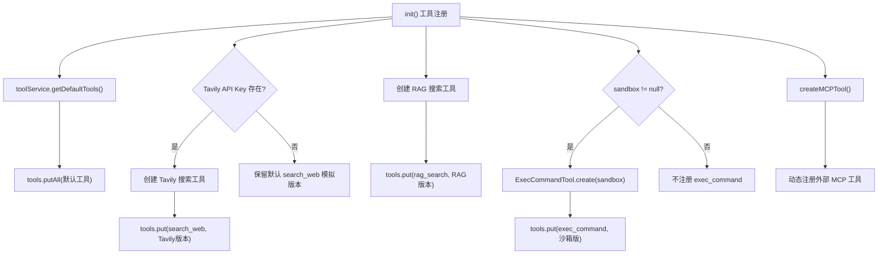

# 08 工具注册与默认工具

## 一句话结论

工具注册是 `UnifiedAgentService.init()` 中的"军火装配线"——按顺序注册默认工具 → 增强搜索工具 → 注册 RAG 工具 → 注册沙箱命令工具 → 注册 MCP 外部工具。最终形成全局 `tools` Map，后续 `filterTools` 从中选取本轮可用的工具子集。

---

## 它在主链路里的位置

```text
UnifiedAgentService.init()
  ├── ①~③ 记忆配置与恢复
  ├── ④ initKnowledgeGraph()
  ├── ⑤ initSandbox()
  ├── ⑥ 工具注册             ← ★ 本文件
  │     ├── 注册默认工具
  │     ├── 增强 search_web
  │     ├── 注册 rag_search
  │     ├── 注册 exec_command
  │     └── registerTool 动态注册
  ├── ⑦ initSubAgents()
  ├── ⑧ 创建协作器
  └── ⑨ initRAG()

后续用户请求中：
  tools Map → filterTools(selectedTools) → ts
  ts → ChatRouter.decideMode() → ToolModeHandler/ReActLoop
```

---

## 为什么需要它

没有统一的工具注册，每次新增工具就要改多处代码：

| 方案 | 问题 |
|---|---|
| 在 ToolModeHandler 里硬编码工具列表 | 每加一个工具就要改 ToolModeHandler |
| 在 ChatRouter 里硬编码路由 | 路由和工具紧耦合 |
| 在 ReActLoop 里写死工具 | 工具变化影响多工具编排 |

统一注册的好处：

```text
增加工具 = 在 init() 中加一行 put
删除工具 = 去掉那行 put
增强工具 = 覆盖 put
不需要改路由、不需要改 Handler、不需要改 ReAct
```

---

## 对应源码位置

| 文件 | 作用 |
|---|---|
| `UnifiedAgentService.java` | init() 方法中的工具注册部分 |
| `ToolService.java` | getDefaultTools() 提供默认工具 |
| `ExecCommandTool.java` | 沙箱命令执行的 tool 封装 |
| `Tool.java` | 工具对象模型 |

---

## 先看对象长什么样

### 5.1 最终 tools Map

`init()` 完成后，全局 `tools` Map 的内容：

```java
tools = {
    "get_time":     Tool{name="get_time",     desc="获取当前时间",       execute=Lambda},
    "get_weather":  Tool{name="get_weather",  desc="获取城市天气信息",    execute=Lambda},
    "search_web":   Tool{name="search_web",   desc="搜索网络信息",        execute=EnhancedLambda},
    "rag_search":   Tool{name="rag_search",   desc="从个人知识库检索文档", execute=RagLambda},
    "exec_command": Tool{name="exec_command", desc="执行终端命令",        execute=SandboxLambda},
    // ... 可能还有 MCP 动态注册的工具
}
```

### 5.2 注册过程中的 Map 变化

```text
初始状态：
  tools = {}  ← 空的

第 1 步：tools.putAll(defaultTools)
  tools = {
    get_time: Tool(get_time, 模拟执行),
    get_weather: Tool(get_weather, 模拟执行),
    search_web: Tool(search_web, 模拟执行)
  }
         ↓
第 2 步：tools.put("search_web", tavilyTool)
  tools = {
    get_time: Tool(get_time, 模拟执行),
    get_weather: Tool(get_weather, 模拟执行),
    search_web: Tool(search_web, Tavily+LLM fallback)  ← 被覆盖！
  }
         ↓
第 3 步：tools.put("rag_search", ragTool)
  tools = {
    get_time, get_weather,
    search_web: Tavily+LLM fallback,
    rag_search: Tool(rag_search, RAG检索)  ← 新增
  }
         ↓
第 4 步：tools.put("exec_command", cmdTool)
  tools = {
    get_time, get_weather,
    search_web: Tavily+LLM fallback,
    rag_search: Tool(rag_search, RAG检索),
    exec_command: Tool(exec_command, 沙箱执行)  ← 新增
  }
```

---

## 核心流程图

### 6.1 工具注册流程



---

## 源码逐段讲解

原文件：`UnifiedAgentService.java`（init 方法中的工具注册部分）和 `ToolService.java`。

### 7.1 注册默认工具——ToolService.getDefaultTools

```java
// UnifiedAgentService.init() 中
Map<String, Tool> defaultTools = toolService.getDefaultTools();
tools.putAll(defaultTools);
```

**`toolService.getDefaultTools()` 返回三个工具：**

```java
// ToolService.java
public Map<String, Tool> getDefaultTools() {
    Map<String, Tool> tools = new ConcurrentHashMap<>();
    tools.put("get_time", createGetTimeTool());
    tools.put("get_weather", createGetWeatherTool());
    tools.put("search_web", createSearchWebTool());
    return tools;
}
```

**`createGetTimeTool()` 的实现：**

```java
private Tool createGetTimeTool() {
    return new Tool("get_time", "获取当前时间",
            List.of(new ToolParam("timezone", "string", "时区", false)),
            params -> {
                String tz = params.get("timezone") != null
                        ? params.get("timezone").toString() : "";
                ZoneId zone = ZoneId.systemDefault();
                if (!tz.isEmpty()) {
                    try { zone = ZoneId.of(tz); } catch (Exception ignored) {}
                }
                return ZonedDateTime.now(zone)
                        .format(DateTimeFormatter.ofPattern("yyyy-MM-dd HH:mm:ss"));
            });
}
```

执行过程（假设用户问"现在几点"）：

```text
① ToolModeHandler.decide 识别为 get_time
  → ToolCallResult("get_time", {})

② Tool.getExecute().apply({})
  → params.get("timezone") = null
  → tz = ""
  → zone = ZoneId.systemDefault()  （亚洲/上海）
  → ZonedDateTime.now(Asia/Shanghai) = 2026-06-22T14:30:00+08:00
  → 格式化为 "2026-06-22 14:30:00"

③ 返回结果到 ToolModeHandler
  → LLM 总结："现在是北京时间 2026 年 6 月 22 日下午 2 点 30 分。"
```

**`createGetWeatherTool()` 的实现：**

```java
private Tool createGetWeatherTool() {
    return new Tool("get_weather", "获取城市天气信息",
            List.of(new ToolParam("city", "string", "城市名称", true)),
            params -> {
                String city = params.get("city") != null
                        ? params.get("city").toString() : "北京";
                String weather = WEATHER_DB.getOrDefault(city, "晴天 20°C（模拟）");
                return city + "：" + weather;
            });
}
```

**`WEATHER_DB` 是模拟数据：**

```java
private static final Map<String, String> WEATHER_DB = Map.of(
    "北京", "晴天 22°C",
    "上海", "小雨 20°C",
    "广州", "晴天 28°C",
    "深圳", "晴天 26°C",
    "纽约", "晴天 15°C",
    "伦敦", "阴天 12°C"
);
```

**注意：框架和数据分离——**

```text
框架层（Tool + execute + apply）：通用的，可以接任何 API
  ↓
数据层（WEATHER_DB）：当前是写死的 Map

更换真实 API 只改 execute Lambda：
  params -> weatherApiClient.getWeather(params.get("city").toString())
  不需要改框架
```

---

### 7.2 增强 search_web——Map.put 覆盖

```java
// 在 UnifiedAgentService.init() 中，注册完默认工具后：
if (cfg.getSearch().getApiKey() != null && !cfg.getSearch().getApiKey().isEmpty()) {
    try {
        Tool enhancedSearch = createTavilySearchTool();
        tools.put("search_web", enhancedSearch);  // 覆盖默认 search_web
        log.info("search_web 已升级为 Tavily 增强版");
    } catch (Exception e) {
        log.warn("创建 Tavily 搜索工具失败，保留默认版本: {}", e.getMessage());
    }
}
```

**`createTavilySearchTool()` 的内部——双通道搜索：**

```java
private Tool createTavilySearchTool() {
    return new Tool("search_web", "搜索网络信息（Tavily + LLM fallback）",
            List.of(new ToolParam("query", "string", "搜索关键词", true)),
            params -> {
                String q = params.get("query").toString();
                // 第一通道：Tavily API
                if (cfg.getSearch().getApiKey() != null) {
                    try {
                        return TavilyClient.search(q, cfg.getSearch().getApiKey(),
                                cfg.getSearch().getApiUrl());
                    } catch (Exception e) {
                        log.warn("Tavily 搜索失败，切换到 LLM: {}", e.getMessage());
                        // 不返回，继续 fallback
                    }
                }
                // 第二通道：LLM fallback
                return llm.chat("你是一个搜索引擎助手，根据你的知识回答：" + q,
                        List.of(Map.of("role", "user", "content", q)));
            });
}
```

执行分支图：

```text
① 检查 Tavily API Key 是否存在
    ↓ 存在
② TavilyClient.search(q, apiKey, apiUrl)
    ↓
  ┌─ 成功 → 返回真实搜索结果
  │
  ├─ 网络超时 → catch → 异常打印日志
  │
  ├─ API 返回 429 → catch → 异常打印日志
  │
  └─ API Key 过期 → catch → 异常打印日志
       ↓
③ 所有异常统一处理：执行 LLM fallback
  llm.chat("你是一个搜索引擎助手...", ...)
  → LLM 用自己的训练知识生成"搜索结果"
```

**为什么需要 LLM fallback？**

```text
场景 1：开发环境没有 Tavily API Key
  → Tavily 不可用 → LLM 兜底
  → search_web 在任何环境中都能工作

场景 2：Tavily 临时故障
  → 网络抖动、API 限流
  → 不会导致搜索功能挂掉
  → 自动 fallback 到 LLM

场景 3：API Key 过期
  → 不会突然崩溃
  → 平滑降级
```

**Tavily 版本和模拟版本的区别：**

| 对比 | 模拟版本 | Tavily 版本 |
|---|---|---|
| 搜索来源 | LLM 自身知识 | 真实搜索引擎 |
| 时效性 | 知识有截止日期 | 实时搜索结果 |
| 需要 API Key | 不需要 | 需要 |
| 失败处理 | 不可能失败 | 可能网络异常，有 LLM fallback |
| 结果准确度 | 可能"编造" | 真实搜索结果 |

---

### 7.3 注册 rag_search——知识库检索

```java
// 在 UnifiedAgentService.init() 中
tools.put("rag_search", new Tool("rag_search",
        "从私人知识库中检索相关文档内容",
        List.of(new ToolParam("query", "string", "检索关键词", true)),
        params -> {
            String q = params.get("query") != null
                    ? params.get("query").toString() : "相关内容";
            if (!rag.isLoaded()) {
                throw new RuntimeException("知识库为空，请先上传文档");
            }
            return rag.query(q).answer;
        }));
```

**`rag.query(q)` 做了什么：**

```text
rag.query("用户姓名")
  ↓
① embedding = emb.embed("用户姓名")        ← 文本转向量
② chunks = vectorDB.search(embedding, topK) ← 向量搜索
③ 如果有 KG：
    neighborIds = kg.expandMemoryNeighbors(topChunkIds)  ← 图邻居扩展
    chunks.extend(neighborChunks)
④ rerank(chunks)                            ← 重新排序
⑤ return chunks[0].answer                   ← 返回最佳结果
```

**如果没有上传文档就调用 rag_search：**

```java
if (!rag.isLoaded()) {
    throw new RuntimeException("知识库为空，请先上传文档");
    // ← 抛异常！不是返回模拟数据！
}
```

**为什么 RAG 工具抛异常而天气工具给默认值？**

```text
天气工具：调不到真实 API → 给模拟值 → 用户能收到"答案"
  → 错误容忍度高（"晴天 20°C"不影响使用）

RAG 工具：知识库为空 → 无法模拟 → 必须明确告知
  → 如果返回模拟文档 → 用户以为真的找到了 → 严重误导
```

---

### 7.4 注册 exec_command——沙箱命令执行

```java
// 在 UnifiedAgentService.init() 中
if (sandbox != null) {
    Tool execTool = ExecCommandTool.create(sandbox);
    tools.put("exec_command", execTool);
}
```

**`ExecCommandTool.create(sandbox)`：**

```java
// ExecCommandTool.java
public static Tool create(Sandbox sandbox) {
    return new Tool("exec_command", "在沙箱中执行命令",
            List.of(new ToolParam("command", "string", "要执行的命令", true)),
            params -> {
                String cmd = params.get("command").toString();
                SandboxResult result = sandbox.execute(cmd);  // 在沙箱中执行
                audit.log("exec_command", "命令: " + cmd + " 结果: " + result.getOutput());
                return result.getOutput();
            });
}
```

**审计日志为什么重要？**

```text
exec_command 和其他工具有本质区别：

get_time      → 只读，获取信息
get_weather   → 只读，获取信息
search_web    → 只读，获取信息
rag_search    → 只读，获取信息
exec_command  → 可写！可以在系统上执行任意命令！
                能创建文件、删除文件、修改配置、访问网络

所以必须：
  ① 在沙箱中执行（隔离环境）
  ② 记录审计日志（谁、什么时间、执行了什么、结果如何）
  ③ 设置超时（防止死循环命令）
  ④ 限制可用命令（白名单或黑名单）
```

**沙箱的安全策略：**

```text
SandboxFactory.build(sandboxCfg)
  └── type=DOCKER:
        Docker 容器 → 完全隔离
        容器挂掉不影响宿主机
        内存限制 256m
        CPU 限制 0.5 核
        超时 30 秒
  └── type=PROCESS:
        本地子进程 → 仅限白名单命令
        不能执行 rm -rf /
        不能访问 /etc 敏感目录
        超时 10 秒
```

---

### 7.5 MCP 动态工具注册

```java
// 在 UnifiedAgentService.init() 中
private void createMCPTool() {
    McpConfig mcpCfg = cfg.getMcp();
    if (mcpCfg == null || !mcpCfg.isEnabled()) return;

    List<McpServerConfig> servers = mcpCfg.getServers();
    for (McpServerConfig server : servers) {
        try {
            McpClient mcpClient = new McpClient(server);
            List<McpTool> mcpTools = mcpClient.listTools();
            for (McpTool mt : mcpTools) {
                Tool tool = mcpToolToTool(mt);  // MCP 工具 → 系统 Tool 对象
                registerTool(tool);
            }
        } catch (Exception e) {
            log.warn("MCP 服务器 {} 注册失败: {}", server.getName(), e.getMessage());
        }
    }
}
```

**registerTool 的简单实现：**

```java
public void registerTool(Tool tool) {
    tools.put(tool.getName(), tool);
    log.info("注册工具: {}", tool.getName());
}
```

**MCP（Model Context Protocol）是什么？**

```text
MCP 是 Anthropic 提出的开放协议
允许外部服务通过标准协议注册为 LLM 可调用的工具

一个 MCP 服务器可以提供：
  文件系统操作
  数据库查询
  GitHub API 操作
  自定义业务 API

通过 mcpClient.listTools() 获取远程工具列表
通过 mcpToolToTool() 转换为系统内部的 Tool 对象
注册到全局 tools Map 中
```

---

### 7.6 filterTools——选取本轮可用工具

```java
// 在 UnifiedAgentService 中
public Map<String, Tool> filterTools(List<String> selectedToolNames) {
    if (selectedToolNames == null || selectedToolNames.isEmpty()) {
        return new HashMap<>(tools);  // 未选择 → 全部可用
    }
    Map<String, Tool> result = new HashMap<>();
    for (String name : selectedToolNames) {
        if (tools.containsKey(name)) {
            result.put(name, tools.get(name));
        }
    }
    return result;
}
```

**三种调用场景：**

```scenario
场景 1：前端未传 selectedTools
  filterTools(null)
  → 返回全部工具
  → ts = {get_time, get_weather, search_web, rag_search, exec_command}

场景 2：前端传了 ["get_weather", "search_web"]
  filterTools(["get_weather", "search_web"])
  → 只返回选中工具
  → ts = {get_weather, search_web}

场景 3：前端传了 ["unknown_tool"]
  filterTools(["unknown_tool"])
  → tools.containsKey("unknown_tool") = false
  → ts = {}
  → 后续 ChatRouter.decideMode 中 ts.isEmpty() → needReActFromTools = false
  → 可能走 chat 模式兜底
```

---

## 真实举例：它在流程中怎么运行

### 8.1 启动时的注册过程

```text
假设配置：
  Tavily API Key = "sk-xxx"
  sandbox.enabled = true
  MCP: enabled = true, servers = [filesystem-mcp]

init() 工具注册过程：

第 1 步：tools.putAll(getDefaultTools())
  tools = {get_time: [], get_weather: [], search_web: [模拟版]}

第 2 步：Tavily Key 存在
  → createTavilySearchTool()
  → tools.put("search_web", Tavily版)
  tools = {get_time, get_weather, search_web: [Tavily+fallback]}

第 3 步：创建 RAG 工具
  → tools.put("rag_search", RAG版)
  tools = {get_time, get_weather, search_web: [Tavily+fallback], rag_search}

第 4 步：sandbox != null
  → ExecCommandTool.create(sandbox)
  → tools.put("exec_command", 沙箱版)
  tools = {get_time, get_weather, search_web: [Tavily+fallback], rag_search, exec_command}

第 5 步：MCP 启用
  → 连接 filesystem-mcp 服务器
  → 获取远程工具列表
  → 每个远程工具转换为 Tool 对象
  → registerTool(tool)
  tools = {..., read_file, write_file, list_directory, ...}
```

### 8.2 运行时工具过滤

```text
用户请求："上海天气怎么样"

processStream(req):
  ① 路由判断
      → needTool("上海天气怎么样") → true（包含"天气"）
  ② filterTools(req.getSelectedTools())
      → req.selectedTools = null（用户未指定）
      → 返回全部 tools
  ③ ts = {get_time, get_weather, search_web, rag_search, exec_command, ...}
  ④ decideMode("上海天气怎么样", explicit=false, ts)
      → needReAct → false（count=1 < 2）
      → needTool → true（含"天气"）
      → mode = "tool"
  ⑤ ToolModeHandler.run(resp, "上海天气怎么样", ts, memPrefix, histMsgs)
      → toolService.decide("上海天气怎么样", ts)
      → ToolCallResult("get_weather", {"city": "上海"})
      → ts.get("get_weather").getExecute().apply({"city":"上海"})
      → "上海：小雨 20°C"
```

---

## 关键判断条件

| 判断点 | 条件 | true 时 | false 时 |
|---|---|---|---|
| search_web 增强 | `apiKey != null && !apiKey.isEmpty()` | 覆盖为 Tavily 版本 | 保留模拟版本 |
| 沙箱工具 | `sandbox != null` | 注册 exec_command | 不注册 |
| MCP 工具 | `mcpCfg.isEnabled()` | 遍历注册 MCP 工具 | 跳过 |
| RAG 工具 | `rag.isLoaded()` | 正常检索 | 抛异常 |
| 工具过滤 | `selectedTools 为空` | 返回全部工具 | 只返回选中的 |
| filterTools | `tools.containsKey(name)` | 加入 ts | 跳过 |

---

## 容易混淆的点

**1. `tools.putAll(defaultTools)` 和后面的 `tools.put("search_web", enhancedTool)` 是同一个 Map 操作。** `putAll` 批量添加，`put` 单个覆盖。因为 tools 是同一个引用，后注册同名的会覆盖先注册的。

**2. 默认工具和增强工具不是同时存在的。** 如果增强 search_web，全局 tools 里只有一个 search_web（增强版），模拟版被覆盖了。不存在"两个 search_web 同时可用"的情况。

**3. `exec_command` 不是所有环境都可用。** 它依赖 sandbox 的创建。如果沙箱未配置（sandbox.enabled=false），globals tools 里没有 exec_command。`filterTools` 不会被选中，路由不会走到命令执行分支。

**4. `MCP 工具不是启动时必须注册完的。** 当前 `createMCPTool` 在 init() 中同步注册。如果 MCP 服务器启动慢，可能导致服务启动延迟。更好的做法是异步注册——服务先就绪，MCP 工具后台加载。

**5. `filterTools` 返回的是工具对象的浅拷贝。** `new HashMap<>(tools)` 复制了 Map 的引用，但没有复制 Tool 对象本身。如果外部修改了 Tool 对象的 execute Lambda，会影响全局 tools。但在当前设计中，Tool 对象在注册后不变。

---

## 和其他模块的关系

| 模块 | 关系 | 说明 |
|---|---|---|
| `ToolService` | 提供默认工具 | getDefaultTools() 返回三个基础工具 |
| `ChatRouter` | 消费 ts | ts 是路由判断的输入之一 |
| `ToolModeHandler` | 消费 ts | 单工具模式从 ts 取工具 |
| `ReActLoop` + `Planner` | 消费 ts | 多工具模式从 ts 选工具规划任务 |
| `Sandbox` | exec_command 的依赖 | 没有 sandbox 就不注册 exec_command |
| `KGStore` | 无直接关系 | 工具系统独立于图记忆 |

---

## 如果要改这个功能，改哪里

| 需求 | 修改位置 | 怎么改 | 风险 |
|---|---|---|---|
| 新增工具 | `init()` 工具注册部分 | tools.put("新工具名", new Tool(...)) | 路由要支持新工具名 |
| 移除工具 | `init()` 工具注册部分 | 删掉对应的 put | 确保没有代码依赖 |
| 修改 search_web fallback | `createTavishSearchTool` | 改 LLM fallback 逻辑 | 搜索质量变化 |
| 添加 MCP 服务器 | 配置文件 | 在 mcp.servers 加新 server 配置 | 服务器连接失败处理 |
| filterTools 加排序/优先级 | `filterTools` 方法 | 返回 LinkedHashMap 按优先级排序 | 前端展示顺序变化 |
| 运行时动态注册工具 | `registerTool` | 外部线程调用 registerTool | 并发安全问题 |

---

## 面试怎么说

完整说法：

```text
工具注册在 UnifiedAgentService.init() 中完成。顺序是：先通过 ToolService.getDefaultTools 注册 get_time、get_weather、search_web 三个模拟工具；然后检查 Tavily API Key，如果有则用增强版覆盖 search_web——增强版内部是双通道：优先 Tavily API，失败后 LLM fallback；接着注册 rag_search 和 exec_command；最后通过 createMCPTool 注册外部 MCP 工具。

全局 tools Map 是注册中心，filterTools 根据前端选择或系统判断从中选取本轮可用工具子集 ts。注册/覆盖机制是利用 HashMap 的 put 同名覆盖——先注册基础版，再覆盖增强版，不需要额外的替换逻辑。
```

短版：

```text
工具注册是按顺序 put 到全局 Map。默认工具来自 ToolService，search_web 根据 Tavily Key 决定是否覆盖增强，RAG 和沙箱工具按配置决定是否注册。Map.put 同名覆盖是实现工具增强的核心机制。
```

---

## 自检题

1. 注册工具的 Map 覆盖机制是什么？为什么可以先注册默认 search_web 再覆盖？
2. Tavily search 失败后为什么还有 LLM fallback？
3. 为什么 rag_search 知识库为空时抛异常而不是返回模拟结果？
4. `exec_command` 和其他工具有什么本质区别？为什么需要审计日志？
5. MCP 工具是在什么时候注册的？MCP 服务器的配置从哪里读取？
6. `filterTools(null)` 和 `filterTools(["unknown_tool"])` 分别返回什么？
7. 如果同时有默认 search_web 和增强 search_web，tools 里会同时有两个吗？
8. 沙箱未启用时，exec_command 会出现在全局 tools 里吗？
9. `tools` Map 用的是什么实现类？为什么？
10. MCP 工具注册失败会影响服务启动吗？
