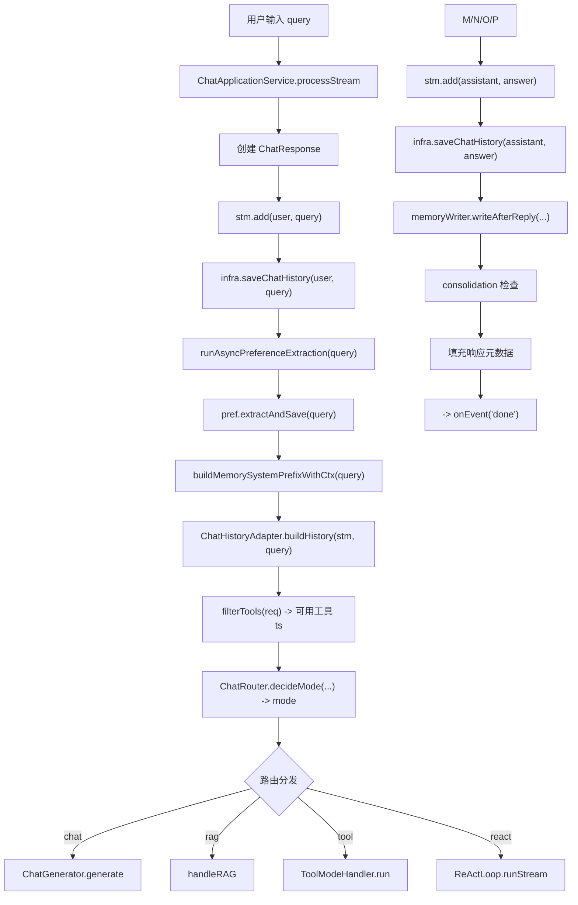
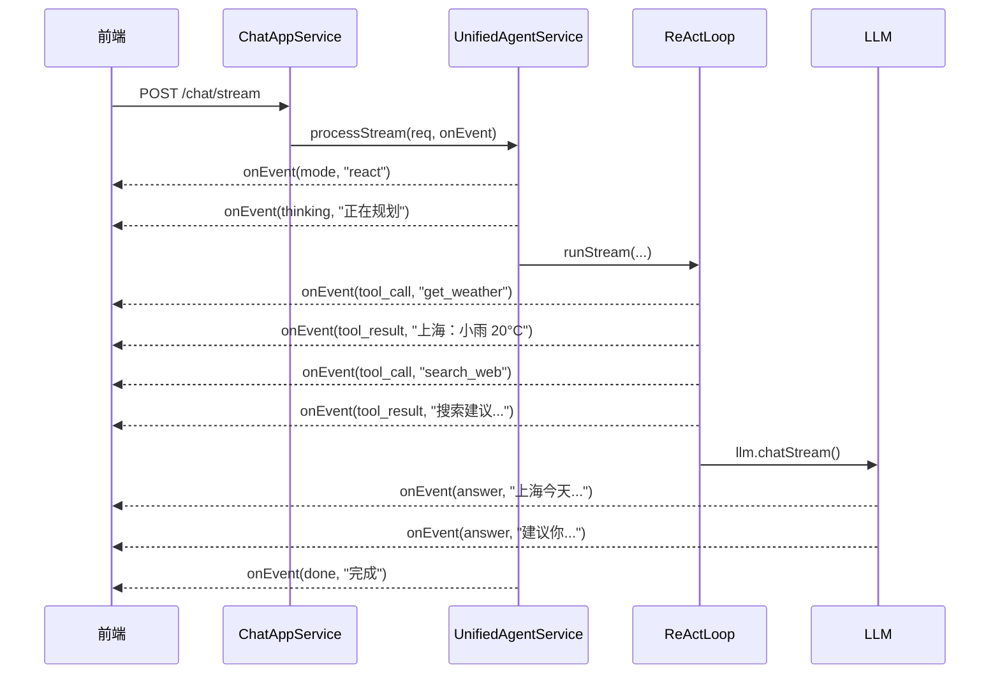

# 09 chatStream 主流程

## 1. 一句话结论

`processStream()` 是 AI Agent 的完整请求处理链路：**保存用户消息 → 提取偏好 → 构建记忆前缀 → 转换历史消息 → 路由分发 → 执行对应模式 → 保存助手回复 → 异步记忆写入 → 触发整理 → 填充响应元数据**。流式版本比同步版多了逐帧推送 SSE 事件。

---

## 2. 它在主链路里的位置

这是**请求入口**。用户前端发来的每个 HTTP 请求，最终都会落到 `UnifiedAgentService.processStream()` 或 `processInternal()` 里。

```text
前端 HTTP 请求
    ↓
ChatApplicationService.processStream()
    ↓
UnifiedAgentService.processStream()   ← 这里
    ↓
路由分发 → chat / tool / react / rag
    ↓
响应流推回前端
```

`processStream()` 是流式版本，通过 `Consumer<StreamEvent> onEvent` 把每一步的进度推送到前端；`processInternal()` 是非流式版本，等待全部完成后返回完整结果。**两个版本共享同一个路由和分发逻辑**，区别只在流式版本会推送 SSE 事件。

---

## 3. 为什么需要它

**没有 `processStream`，用户就看不到任务执行进度。**

举例：用户说"查上海天气并搜索小雨出门建议"——系统要先后调用天气工具和搜索工具，每个工具可能有 1-3 秒延迟。如果没有流式推送：

```text
用户发请求 → 等待 → 等待 → 等待 → ...5秒后→ 一次性收到回答
```

用户不知道系统是在思考、在查工具、还是卡住了。

有了 `processStream`：

```text
用户发请求 → 收到"mode=react"事件 → 收到"planner完成"事件 → 收到"执行get_weather"事件 → 收到"执行search_web"事件 → 收到"LLM合成"事件 → 收到完整回答
```

每个事件 `< 500ms` 间隔，用户能看到进度。这是**流式体验**的核心所在。

---

## 4. 对应源码位置

| 文件 | 作用 |
|---|---|
| `UnifiedAgentService.java` | 主链路调度者，`processStream` / `processInternal` |
| `ChatApplicationService.java` | 应用层入口，包装 HTTP 请求参数 |
| `ChatRouter.java` | 路由判断 |
| `ChatGenerator.java` | chat 模式生成回答 |
| `ToolModeHandler.java` | 单工具模式 |
| `ReActLoop.java` | ReAct 多工具模式 |
| `MemoryWriter.java` | 回复后异步写入长期记忆 |
| `ChatHistoryAdapter.java` | 短期记忆转 LLM 消息格式 |

---

## 5. 先看对象长什么样

### 5.1 ChatRequest —— 请求对象

```java
public class ChatRequest {
    private String query;              // 用户问题，例如"我叫小李，查一下上海天气"
    private String mode;               // 显式指定模式：chat/tool/react/rag
    private Boolean useRag;            // 是否使用知识库
    private List<String> selectedTools; // 前端选中的工具列表
    private String sessionId;          // 会话 ID
    // ...getter/setter...
}
```

真实请求体 JSON：

```json
{
    "query": "我叫小李，查一下上海天气",
    "mode": null,
    "useRag": false,
    "selectedTools": null,
    "sessionId": "abc123"
}
```

`mode=null` 表示让系统自动判断，走 `ChatRouter.decideMode()`。

### 5.2 ChatResponse —— 响应对象

```java
public class ChatResponse {
    private String query;              // 原始问题（回显）
    private String answer;             // 最终回答文本
    private String mode;               // 实际走的模式：chat/tool/react/rag
    private String extractedInfo;      // 偏好提取结果："已记住：姓名 = 小李"
    private Integer shortTermCount;    // 短期记忆条数
    private Integer longTermCount;     // 长期记忆条数
    private Integer preferenceCount;   // 偏好数量
    private ToolCallResult toolCall;   // 工具调用详情（tool/react 模式有）
    // ...getter/setter...
}
```

### 5.3 StreamEvent —— 流式事件对象

```java
public class StreamEvent {
    private String type;     // 事件类型：thinking/tool_call/tool_result/answer/done
    private String content;  // 事件内容
    // ...getter/setter...
}
```

事件类型定义：

| type | content 例子 | 含义 |
|---|---|---|
| `mode` | `"react"` | 路由决策结果 |
| `plan` | `"[查天气, 搜索建议]"` | 规划完成 |
| `tool_call` | `"get_weather"` | 开始执行某工具 |
| `tool_result` | `"上海：小雨 20°C"` | 工具执行完毕 |
| `thinking` | `"正在综合信息..."` | LLM 思考中 |
| `answer` | `"上海今天..."` | LLM 输出片段（流式） |
| `done` | `"完成"` | 全部完成 |

---

## 6. 核心流程图

### 6.1 总体流程图



### 6.2 流式事件推送时序



---

## 7. 源码逐段讲解

原文件：`UnifiedAgentService.java`

### 7.1 processStream 方法声明

```java
public void processStream(ChatRequest req, Consumer<StreamEvent> onEvent) {
    ChatResponse resp = new ChatResponse();
    resp.setQuery(req.getQuery());
```

**这段代码在做什么？**

创建响应对象，把用户原始问题设置进去。`resp.setQuery()` 的作用是让前端能拿到"原始问题"来回显——用户发完消息后，界面上通常会显示用户自己说了什么。

**方法签名拆解：**

```text
public           → 外部（ChatApplicationService）可以调用
void             → 没有返回值，所有输出通过 onEvent 回调
processStream    → 处理流式请求
ChatRequest req  → 请求参数对象，含 query/mode/useRag/selectedTools
Consumer<StreamEvent> onEvent → 回调函数，每次产生事件就调用它
```

`Consumer<StreamEvent>` 是 Java 的函数式接口。前端调用时，会传入一个 Lambda：

```java
// 假设前端通过 SSE 推送
unifiedService.processStream(req, (StreamEvent event) -> {
    sseEmitter.send(event);  // 每个事件推送到前端
});
```

**为什么不直接返回 `Stream<ChatResponse>`？** Spring 的 SSE（Server-Sent Events）底层就是 `Consumer` 模式——每产生一个事件就调用一次 `sseEmitter.send()`。用 `Consumer` 参数让方法不依赖 Spring 的 SSE 实现。

---

### 7.2 Step 1：保存用户消息

```java
// Step 1: Save user message
stm.add("user", req.getQuery());
infra.saveChatHistory("user", req.getQuery());
```

**两行代码，做的是同一件事的两个方面：**

```text
stm.add("user", query)
    → 写入 ShortTermMemory（Java 内存中的 List<ConversationMessage>）
    → 保证本轮调用 buildHistory 时能看到这条消息
    → 代价：如果 JVM 重启，内存中的数据丢失

infra.saveChatHistory("user", query)
    → 写入 PostgreSQL chat_history 表
    → 保证重启后还能恢复最近聊天
    → 代价：每次多一次数据库 I/O
```

**为什么紧挨着而不是异步执行？** 因为 `buildHistory` 要在下一步立即使用 stm，所以必须先写入内存。数据库写入理论上可以异步（不阻塞当前线程），但当前版本为了简单，同步写入。

**真实数据举例：**

```java
// query = "我叫小李，查一下上海天气"

// 执行 stm.add 之后，短期记忆变成：
messages = [
    ConversationMessage{role="user", content="我叫小李，查一下上海天气", timestamp="14:30:01"},
    // ...之前还有几轮的话
]

// 执行 saveChatHistory 之后，数据库多一行：
// chat_history 表
// | id | role | content                | created_at          |
// |----|------|------------------------|---------------------|
// | 105| user | 我叫小李，查一下上海天气 | 2026-06-22 14:30:01 |
```

---

### 7.3 Step 2：提取偏好

```java
// Step 2: Extract preferences
runAsyncPreferenceExtraction(req.getQuery());  // async
String[] extracted = pref.extractAndSave(req.getQuery()); // sync
if (extracted != null) resp.setExtractedInfo("已记住：" + extracted[0] + " = " + extracted[1]);
```

**这里有两个提取调用，一个异步一个同步，为什么？**

```text
runAsyncPreferenceExtraction(query)：异步执行
    → 在新线程中调用 extractAndSave
    → 不阻塞主链路
    → 但主链路等不到提取结果
    → 目的：让偏好提取也触发，但不影响当前请求

pref.extractAndSave(query)：同步执行（阻塞）
    → 在当前线程中调用 extractAndSave
    → 结果能在当前请求中使用
    → 如果提取到偏好，"已记住：xxx"会在当前回答中返回
```

**`extractAndSave` 内部流程：**

```text
① LLM 判断 query 是否包含可提取信息
    "我叫小李" → 是的，"姓名"="小李"
    "查天气" → 不是偏好信息

② 如果可提取，返回 String[]{"姓名", "小李"}

③ 存入 PreferenceMemory 的 Map
    pref.data.put("姓名", "小李")

④ 返回 extracted = ["姓名", "小李"]
```

**真实数据举例：**

```java
// query = "我叫小李，查一下上海天气"
String[] extracted = pref.extractAndSave(query);
// extracted = ["姓名", "小李"]

resp.setExtractedInfo("已记住：姓名 = 小李");
// 最终返回给前端的 extractedInfo 字段：
// "已记住：姓名 = 小李"
```

**如果 query = "查一下上海天气"：**

```java
String[] extracted = pref.extractAndSave("查一下上海天气");
// extracted = null  （没有可提取的偏好信息）

// 所以 resp.setExtractedInfo 不会执行
// resp.extractedInfo = null
```

---

### 7.4 Step 3：构建记忆前缀

```java
// Step 3: Build memory prefix
String memPrefix = buildMemorySystemPrefixWithCtx(req.getQuery());
```

**什么是 memPrefix？**

它是一个字符串，包含"用户偏好 + 相关的长期记忆"，最终拼到 system prompt 的前面。具体构建过程详见文件 `11-memPrefix上下文构建.md`。

**此时内存中的数据：**

```text
假设偏好中有：{"姓名": "小李"}
长期记忆召回结果："用户正在学习 AI Agent"

memPrefix =
    "【用户偏好】
     姓名: 小李
    
     【相关记忆】
     用户正在学习 AI Agent"
```

**如果记忆为空：**

```text
memPrefix = ""

→ 之后 buildSystemPrompt 时会直接返回 basePrompt，不加前缀
```

---

### 7.5 Step 4：构建历史消息

```java
// Step 4: Build history messages from STM
List<Map<String, String>> histMsgs = ChatHistoryAdapter.buildHistory(stm, req.getQuery());
```

**这一步是把 ShortTermMemory 里的 List<ConversationMessage> 转换成 LLM 需要的 List<Map<String, String>>。** 详见文件 `10-短期记忆与histMsgs.md`。

**数据转换示例：**

```text
stm.getMessages() 返回：
    [
        ConversationMessage{role="user", content="你好", timestamp="14:28:00"},
        ConversationMessage{role="assistant", content="你好！我是AI助手", timestamp="14:28:03"},
        ConversationMessage{role="user", content="我叫小李，查一下上海天气", timestamp="14:30:01"}
    ]

buildHistory 之后 histMsgs：
    [
        {"role": "user", "content": "你好"},
        {"role": "assistant", "content": "你好！我是AI助手"},
        {"role": "user", "content": "我叫小李，查一下上海天气"}
    ]
```

**注意：timestamp 被过滤掉了。** 每个 `ConversationMessage` 有 role/content/timestamp 三个字段，但 `Map.of("role", role, "content", content)` 只保留两个。

---

### 7.6 Step 5：获取可用工具

```java
// Step 5: Route to mode
Map<String, Tool> ts = filterTools(req);
```

**`filterTools` 作用：** 筛选出本轮请求可用的工具。

```text
① 如果 req.selectedTools 不为 null → 只返回选中的工具
② 如果 req.selectedTools 为 null → 返回全部已注册工具
```

**此时 ts 数据：**

```text
ts = {
    "get_time": Tool{name="get_time", ...},
    "get_weather": Tool{name="get_weather", ...},
    "search_web": Tool{name="search_web", ...}
}
```

（假设系统注册了这三个工具，前端没有显式选择）

---

### 7.7 Step 6：路由决策

```java
boolean explicit = req.getMode() != null;
boolean useRag = Boolean.TRUE.equals(req.getUseRag());
String mode = ChatRouter.decideMode(req.getQuery(), explicit, useRag,
        req.getSelectedTools(), rag.isLoaded());

resp.setMode(mode);
```

**路由决策流程（详见文件 `12-路由判断-chat-tool-react-rag.md`）：**

以 query="我叫小李，查一下上海天气" 为例：

```text
① explicit = req.getMode() != null
    req.getMode() = null → explicit = false
    → 走关键词判断分支

② needReAct(query)
    q = "我叫小李，查一下上海天气"
    "时间"/"几点" → 不命中 → count=0
    "天气" → 命中 → count=1
    "总结"/"汇总" → 不命中 → count=1
    "查"/"搜索" → "查"命中 → count=2
    count >= 2 → true → return "react"
```

**为什么命中"查""?** 因为`q.contains("查")`检查的是子串，"查一下"包含"查"，所以命中。

**如果没有"查"：** query = "上海天气怎么样"：

```text
① needReAct
    "天气"命中 → count=1
    count=1 < 2 → false

② needTool
    "天气"命中 → true

③ mode = "tool"
```

---

### 7.8 Step 7：路由分发

```java
// Step 6: Dispatch to handler based on mode
resp.setMode(mode);
switch (mode) {
    case "chat"  -> generator.generate(resp, req.getQuery(), memPrefix, histMsgs);
    case "rag"   -> handleRAG(resp, req.getQuery(), memPrefix, histMsgs);
    case "tool"  -> toolHandler.run(resp, req.getQuery(), ts, memPrefix, histMsgs);
    case "react" -> reactLoop.runStream(resp, req.getQuery(), ts, memPrefix, histMsgs, onEvent);
}
```

**各个分支的作用：**

```text
chat → 直接调 LLM，没有工具调用，最简路径
rag  → 从知识库检索 → LLM 合成（或 LLM 判断不需要检索后直接回答）
tool → 单工具：decide → 取工具 → 补参数 → 执行 → LLM 总结
react → 多工具：Planner 规划 → GraphRuntime 执行 → LLM 合成（流式推送事件）
```

**流式 vs 非流式的关键区别：** `react` 模式调用了 `runStream` 而不是 `run`。`runStream` 在每个步骤都回调 `onEvent`，而 `run` 只返回最终答案。其他三个模式在流式版本中同样不产生中间事件——前端在 react 模式下会看到"thinking→tool_call→tool_result→answer"事件流。

**以当前 query 为例的分发：**

```text
mode = "react" → reactLoop.runStream(resp, query, ts, memPrefix, histMsgs, onEvent)
```

这之后进入 ReActLoop，它会：
1. 推送 `onEvent("mode", "react")`
2. 推送 `onEvent("thinking", "正在规划...")`
3. Planner.planGraph → 得到 Node 列表
4. 推送 `onEvent("plan", "[查天气, 搜索建议]")`
5. GraphRuntime.execute → 按层执行
6. 每次执行工具前推 `onEvent("tool_call", name)`
7. 每次执行工具后推 `onEvent("tool_result", result)`
8. LLM 合成 → 推 `onEvent("answer", text)`

详见文件 `16-ReAct模式.md`。

---

### 7.9 Step 8：保存助手回复

```java
// Step 7: Save assistant reply
stm.add("assistant", resp.getAnswer());
infra.saveChatHistory("assistant", resp.getAnswer());
```

**和 Step 1 对称：** 之前保存了用户消息，现在保存助手消息。

**真实数据：**

```java
// resp.getAnswer() = "上海今天小雨，20°C。建议出门带伞。\n\n另外，已记住你的名字：小李。"

stm.add("assistant", "上海今天小雨...");
// 短期记忆追加一条：
messages = [
    ...,
    ConversationMessage{role="user", content="我叫小李，查一下上海天气", timestamp="14:30:01"},
    ConversationMessage{role="assistant", content="上海今天小雨...", timestamp="14:30:05"}
]

infra.saveChatHistory("assistant", "上海今天小雨...");
// 数据库多一行：
// | id | role      | content             | created_at          |
// |----|-----------|---------------------|---------------------|
// | 106| assistant | 上海今天小雨...    | 2026-06-22 14:30:05 |
```

**为什么保存回答要在路由分发之后？** 因为路由分发（switch）内部才是真正生成回答的地方。`ToolModeHandler.run` 或 `ReActLoop.runStream` 会修改 `resp.answer`，所以必须在它们返回后才能拿到最终回答。

---

### 7.10 Step 9：回复后记忆写入

```java
// Step 8: Post-reply memory writing (async)
memoryWriter.writeAfterReply(req.getQuery(), resp.getAnswer());
```

**这是异步执行的。** `MemoryWriter` 会在新线程中：

```text
① 把 "用户问：我叫小李，查一下上海天气 / 答：上海今天小雨..."
    交给 LLM 判断：哪些信息值得长期记忆？

② LLM 返回结构化结果：
    [
        {"type": "fact", "content": "用户名字叫小李"},
        {"type": "preference", "content": "用户喜欢查询天气信息"}
    ]

③ 分别执行：
    - 事实 → ltm.store(content) 写入长期记忆
    - 偏好 → pref.save(key, value) 更新偏好
    - 图记忆 → graphMem.store(content) 写入图记忆
```

**为什么是异步？** 因为记忆写入不应该阻塞当前请求。用户已经拿到回答了，不需要等记忆处理完再响应。代价是：记忆写入失败不会影响当前回答，但用户下次对话可能看不到刚提到的信息。

---

### 7.11 Step 10：Consolidation 整理检查

```java
// Step 9: Consolidation check
new Thread(() -> {
    if (graphMem != null && graphMem.needConsolidation()) {
        syncConsolidationToDB(graphMem.graphAwareConsolidate());
    } else if (ltm.needConsolidation()) {
        syncConsolidationToDB(ltm.consolidate());
    }
}).start();
```

**合并整理（Consolidation）是什么？** 长期记忆写入时会积累新信息，积累到一定数量后需要"合并整理"——压缩重复内容、更新重要性评分、删除不重要的记忆。

**触发条件：**

```text
graphMem.needConsolidation() → 图记忆积累到整理阈值
    ↓ 是 → graphAwareConsolidate() → 整理图记忆
    ↓ 否 → ltm.needConsolidation() → 普通记忆需要整理？
        ↓ 是 → ltm.consolidate() → 整理长期记忆
        ↓ 否 → 什么都不做
```

**为什么 graphMem 优先？** 如果启用了图记忆（graphMem != null），图记忆包含更丰富的关联信息（邻居关系、重要性传播），整理优先级更高。

**同样在新线程异步执行**——因为整理可能需要调用 LLM 重新评估记忆重要性，耗时较长，不能阻塞当前请求。

---

### 7.12 Step 11：填充响应元数据

```java
// Step 10: Fill response metadata
resp.setShortTermCount(stm.size());
resp.setLongTermCount(ltm.size());
resp.setPreferences(pref.getData());
```

**这些数据给前端展示用：**

```text
resp.setShortTermCount(stm.size())
    → stm.messages.size()（短期记忆条数）
    → 例如 4

resp.setLongTermCount(ltm.size())
    → ltm.getAll().size()（长期记忆条数）
    → 例如 12

resp.setPreferences(pref.getData())
    → pref.data 的副本（所有偏好键值对）
    → Map{"姓名": "小李", "城市": "上海"}
```

**前端可以展示：** "当前会话 4 条消息，长期记忆 12 条，已记住 2 个偏好设置。"

这些数据对调试也很重要——线上排查时，如果 `shortTermCount` 不对劲（比如 0 或很大），说明短期记忆可能有问题。

---

### 7.13 processInternal —— 非流式版本

```java
public ChatResponse processInternal(ChatRequest req) {
    ChatResponse resp = new ChatResponse();
    resp.setQuery(req.getQuery());

    // 和 processStream 同样的逻辑，只是没有 onEvent
    stm.add("user", req.getQuery());
    infra.saveChatHistory("user", req.getQuery());

    runAsyncPreferenceExtraction(req.getQuery());
    String[] extracted = pref.extractAndSave(req.getQuery());
    if (extracted != null) resp.setExtractedInfo("已记住：" + extracted[0] + " = " + extracted[1]);

    String memPrefix = buildMemorySystemPrefixWithCtx(req.getQuery());
    List<Map<String, String>> histMsgs = ChatHistoryAdapter.buildHistory(stm, req.getQuery());

    Map<String, Tool> ts = filterTools(req);
    boolean explicit = req.getMode() != null;
    boolean useRag = Boolean.TRUE.equals(req.getUseRag());
    String mode = ChatRouter.decideMode(req.getQuery(), explicit, useRag,
            req.getSelectedTools(), rag.isLoaded());
    resp.setMode(mode);

    switch (mode) {
        case "chat"  -> generator.generate(resp, req.getQuery(), memPrefix, histMsgs);
        case "rag"   -> handleRAG(resp, req.getQuery(), memPrefix, histMsgs);
        case "tool"  -> toolHandler.run(resp, req.getQuery(), ts, memPrefix, histMsgs);
        case "react" -> reactLoop.run(resp, req.getQuery(), ts, memPrefix, histMsgs);
    }

    stm.add("assistant", resp.getAnswer());
    infra.saveChatHistory("assistant", resp.getAnswer());

    memoryWriter.writeAfterReply(req.getQuery(), resp.getAnswer());

    new Thread(() -> {
        if (graphMem != null && graphMem.needConsolidation()) {
            syncConsolidationToDB(graphMem.graphAwareConsolidate());
        } else if (ltm.needConsolidation()) {
            syncConsolidationToDB(ltm.consolidate());
        }
    }).start();

    resp.setShortTermCount(stm.size());
    resp.setLongTermCount(ltm.size());
    resp.setPreferences(pref.getData());

    return resp;
}
```

**和 processStream 的唯一区别：**

```text
processStream:
    → void
    → 有 onEvent 参数
    → react 模式调用 runStream（推送中间事件）
    → 不能直接返回响应，前端需要从回调收集

processInternal:
    → ChatResponse
    → 没有 onEvent
    → react 模式调用 run（不推送事件，只返回最终答案）
    → 前端等全部完成后一次性拿到完整响应
```

---

## 8. 真实举例：它在流程中怎么运行

### 8.1 场景：普通问候

```text
query = "你好"
路由：mode = "chat"
执行：ChatGenerator.generate
流程：stm.add("user","你好") → 构建memPrefix(可能为空) → 构建histMsgs → LLM.chat → stm.add("assistant","你好！")
总耗时：~2s（主要花在 LLM 调用）
```

### 8.2 场景：查询天气

```text
query = "上海天气怎么样"
路由：mode = "tool"
执行：ToolModeHandler.run
流程：stm.add → 偏好提取(无) → memPrefix → histMsgs → decide("get_weather",{"city":"上海"}) → execute("上海") → "小雨20°C" → LLM总结 → stm.add
总耗时：~3s（decide < 50ms + execute 10ms + LLM ~2.5s）
```

### 8.3 场景：多步任务

```text
query = "查上海天气并搜索小雨出门建议"
路由：mode = "react"
执行：ReActLoop.runStream
流程：stm.add → memPrefix → histMsgs → Planner.plan → [weather, search] → GraphRuntime.execute → get_weather("上海") → search_web("小雨 出门 建议") → LLM合成 → stm.add
总耗时：~5s（Planner ~500ms + 两个工具各~1s + LLM ~2.5s）
```

---

## 9. 用一个完整例子跑一遍

假设用户刚启动对话，输入：

```text
query = "我叫小李，查一下上海天气"
```

### 9.1 初始状态

```java
// 短期记忆：空（刚启动或本轮是第一条）
stm.messages = []

// 偏好记忆：空
pref.data = {}

// 长期记忆：空
ltm.items = []
```

### 9.2 步骤 1-3：保存用户消息

```java
stm.add("user", "我叫小李，查一下上海天气");
// stm.messages = [
//     ConversationMessage{role="user", content="我叫小李，查一下上海天气", timestamp="14:30:01"}
// ]

infra.saveChatHistory("user", "我叫小李，查一下上海天气");
// chat_history 表新增一条记录
```

### 9.3 步骤 4：提取偏好

```java
pref.extractAndSave("我叫小李，查一下上海天气");
// LLM 分析 → 提取到 "姓名" = "小李"
// pref.data = {"姓名": "小李"}

resp.extractedInfo = "已记住：姓名 = 小李"
```

### 9.4 步骤 5：构建 memPrefix

```java
buildMemorySystemPrefixWithCtx("我叫小李，查一下上海天气");

// ① pref.buildContext() → "【用户偏好】\n姓名: 小李"
// ② llm.embed(query) → [0.12, -0.34, ...]（128维向量）
// ③ ltm.recall → 空（没有长期记忆）
// ④ 没有召回结果，不加"【相关记忆】"

memPrefix = "【用户偏好】\n姓名: 小李"
```

### 9.5 步骤 6：构建 histMsgs

```java
ChatHistoryAdapter.buildHistory(stm, "我叫小李，查一下上海天气");
// stm.messages 中只有一条（如果之前没有对话）
// 兜底检查：最后一条就是当前 query，不追加

histMsgs = [
    {"role": "user", "content": "我叫小李，查一下上海天气"}
]
```

### 9.6 步骤 7：路由决策

```java
ChatRouter.decideMode("我叫小李，查一下上海天气", false, false, null, false);

// explicit = false
// needReAct → "天气"命中 count=1, "查"命中 count=2 → count>=2 → true
mode = "react"
resp.mode = "react"
```

### 9.7 步骤 8：分发到 ReAct

```java
reactLoop.runStream(resp, "我叫小李，查一下上海天气", ts, "【用户偏好】\n姓名: 小李", histMsgs, onEvent);

// 内部：
// ① Planner.planGraph → [get_weather("上海"), search_web("小雨 出行 建议")]
// ② GraphRuntime.execute:
//    执行 get_weather → "上海：小雨 20°C"
//    执行 search_web → "小雨天建议携带雨具，穿防水鞋..."
// ③ LLM 合成 → "上海今天小雨，20°C。建议带伞。另外，已记住你的名字叫小李。"
```

### 9.8 步骤 9：保存助手回复

```java
stm.add("assistant", "上海今天小雨，20°C。建议带伞。另外，已记住你的名字叫小李。");
// stm.messages = [
//     ConversationMessage{role="user", content="我叫小李，查一下上海天气", timestamp="14:30:01"},
//     ConversationMessage{role="assistant", content="上海今天小雨...", timestamp="14:30:05"}
// ]

infra.saveChatHistory("assistant", "上海今天小雨...");
// chat_history 表新增一条
```

### 9.9 步骤 10：回复后记忆写入

```java
memoryWriter.writeAfterReply("我叫小李，查一下上海天气", "上海今天小雨...");
// 异步：把回答交给 LLM 分析，提取到"姓名=小李"写入长期记忆
// ltm.store("用户名字叫小李") → 长期记忆多一条
```

### 9.10 步骤 11：填充元数据并完成

```java
resp.shortTermCount = 2
resp.longTermCount = 1   // memoryWriter 写入了 1 条
resp.preferences = {"姓名": "小李"}

// 最终响应：
// query: "我叫小李，查一下上海天气"
// answer: "上海今天小雨，20°C。建议带伞。另外，已记住你的名字叫小李。"
// mode: "react"
// extractedInfo: "已记住：姓名 = 小李"
// shortTermCount: 2
// longTermCount: 1
```

---

## 10. 关键判断条件

| 判断点 | 条件 | true → | false → |
|---|---|---|---|
| 是否有显式模式 | `req.getMode() != null` | 跳过关键词，直接按 mode 路由 | 走关键词判断 |
| needReAct | 4 类子任务命中 ≥ 2 类 | `"react"` | 继续判断 |
| needTool | 6 个关键词命中任一个 | `"tool"` | 继续判断 |
| needRAG | ragLoaded && 不是 tool/react | `"rag"` | `"chat"` |
| 偏好提取结果 | `extractAndSave != null` | 设置 extractedInfo | 不设置 |
| graphMem 是否启用 | `graphMem != null` | Consolidation 优先走图记忆 | 走普通 LTM |
| Consolidation 触发 | `needConsolidation()` | 执行整理 | 不执行 |

---

## 11. 容易混淆的点

### 11.1 processStream vs processInternal

流式版本和非流式版的区别不止在于返回值。react 模式下，流式版调用 `runStream` 产生中间事件，非流式版调用 `run` 不产生事件。其他模式（chat/tool/rag）两个版本行为完全一致，因为它们的回答是一次性生成的。

### 11.2 stm.add 和 infra.saveChatHistory 的作用不同

`stm.add` 是写内存，供后续 `buildHistory` 使用；`infra.saveChatHistory` 是写数据库，供重启恢复使用。两者紧挨着写同一条消息，但目的完全不同。**不是冗余，是双写。**

### 11.3 memPrefix 和 histMsgs 都包含记忆，但去处不同

```text
memPrefix → system prompt（长期上下文）
histMsgs → messages（短期对话历史）
```

两者在 LLM 输入中是分开的。LLM 知道 system prompt 里的是背景知识，messages 里的是对话历史。

### 11.4 偏好提取有两个调用

`runAsyncPreferenceExtraction` 和 `pref.extractAndSave` 调用的是同一个方法。前者异步（不阻塞），后者同步（阻塞）。异步调用保证"即使同步调用有问题，偏好提取也至少触发一次"——一个兜底策略。

### 11.5 Consolidation 只检查一个

if-else 结构保证：要么整理图记忆，要么整理普通记忆，不会同时整理两个。但每次请求都检查，如果图记忆需要整理且整理完了，下次请求又会检查普通记忆。

---

## 12. 和其他模块的关系

| 阶段 | 调用的模块 | 关系说明 |
|---|---|---|
| 保存消息 | `ShortTermMemory.add` | 写入内存短期窗口 |
| 保存消息 | `ChatHistoryRepository.save` | 写入数据库持久化 |
| 偏好提取 | `PreferenceMemory.extractAndSave` | 从 query 提取键值对 |
| 构建前缀 | `buildMemorySystemPrefixWithCtx` | 调用 LTM/GraphMem 召回 |
| 转换消息 | `ChatHistoryAdapter.buildHistory` | STM → LLM messages |
| 路由 | `ChatRouter.decideMode` | 关键词决策 |
| 聊天 | `ChatGenerator.generate` | 最简 LLM 调用 |
| 单工具 | `ToolModeHandler.run` | 规则+执行+LLM |
| 多工具 | `ReActLoop.runStream` | 规划+执行+LLM |
| 记忆写入 | `MemoryWriter.writeAfterReply` | 异步长期记忆写入 |
| 整理 | `LongTermMemory.consolidate` | 合并压缩记忆 |

---

## 13. 如果要改这个功能，改哪里

| 需求 | 修改位置 | 怎么改 | 风险 |
|---|---|---|---|
| 增加新路由模式 | `ChatRouter.decideMode` + switch 新增 case | 加一个 mode 枚举 + handler | 旧模式逻辑不可见，注意优先级 |
| 提前偏好提取时机 | 把 `runAsyncPreferenceExtraction` 放到更前面 | 改成在 stm.add 之前执行 | 异步线程安全问题 |
| 改为全流程流式 | chat/tool/rag 模式也推送中间事件 | 在每个 handler 里加 onEvent 回调 | 改动面大，前端要适应 |
| 移除数据库聊天记录 | 删除 `infra.saveChatHistory` 调用 | 主链路去掉这两行 | 重启后短期记忆丢失 |
| 同步改为异步记忆写入 | memoryWriter 改成消息队列 | 引入 Queue + Worker | 系统复杂度增加 |
| 调整 Consolidation 触发频率 | `needConsolidation` 的阈值 | 改配置参数 | 太频繁浪费 LLM，太少记忆膨胀 |

---

## 14. 面试怎么说

完整回答：

```text
processStream 是 UnifiedAgentService 的核心方法，处理每个用户请求的完整生命周期。方法接收 ChatRequest 和一个事件回调 Consumer<StreamEvent>，内部按以下步骤执行：

第一，保存用户消息。同时写入 ShortTermMemory 内存和 chat_history 数据库表，分别满足低延迟读取和持久化恢复的需求。

第二，偏好提取。同步和异步各调用一次 extractAndSave——同步用于当前请求响应中展示"已记住：xxx"，异步作为兜底保证提取不因主线程故障丢失。

第三，构建记忆上下文。buildMemorySystemPrefixWithCtx 把偏好和长期记忆召回结果拼成 memPrefix 字符串，后续放入 system prompt。

第四，转换历史消息。ChatHistoryAdapter.buildHistory 把 ShortTermMemory 中的 List<ConversationMessage> 转为 LLM 需要的 List<Map<String, String>> 格式。

第五，路由分发。ChatRouter.decideMode 按优先级判断走 chat/tool/react/rag 四种模式之一。

第六，根据路由结果分发到对应 handler。chat 模式直接调 LLM；tool 模式走 ToolModeHandler 五步流程；react 模式走 ReActLoop 规划-执行-合成链路，并流式推送中间事件；rag 模式检索知识库后合成回答。

第七，保存助手回复并与入数据库。

第八，异步记忆写入。MemoryWriter 分析回答中的可记忆信息并写入长期记忆。

第九，Consolidation 检查。判断图记忆或长期记忆是否需要合并整理，需要时异步执行。

第十，填充响应元数据，返回给前端展示。
```

短版：

```text
processStream 是十步主链路：保存消息 → 提取偏好 → 构建 memPrefix → 转换 histMsgs → 路由决策 → 分发执行 → 保存回复 → 异步记忆写入 → 触发整理 → 填充元数据。流式版本通过 Consumer<StreamEvent> 在每个步骤推送 SSE 事件给前端。
```

---

## 15. 自检题

1. `stm.add("user", query)` 和 `infra.saveChatHistory("user", query)` 有什么区别？为什么两个都要执行？

2. 为什么 `pref.extractAndSave` 有同步和异步两个调用？去掉异步调用会有什么问题？

3. `memPrefix` 和 `histMsgs` 分别放进 LLM 请求的什么位置？

4. `processStream` 和 `processInternal` 的核心区别是什么？

5. 路由决策的优先级顺序是什么？如果 query 同时命中 needTool 和 needReAct，走哪个模式？

6. Consolidation 为什么在新线程中执行？不这样做会有什么问题？

7. `ChatRouter.decideMode` 接收的参数 `explicit`、`useRag`、`selectedTools` 分别从哪里来？

8. `memoryWriter.writeAfterReply` 是同步还是异步？为什么？

9. 如果 `resp.answer` 没有在 switch 块中被设置（为空字符串），最终会怎样？

10. `resp.setShortTermCount(stm.size())` 在流程结束时调用，这个值是多少？
