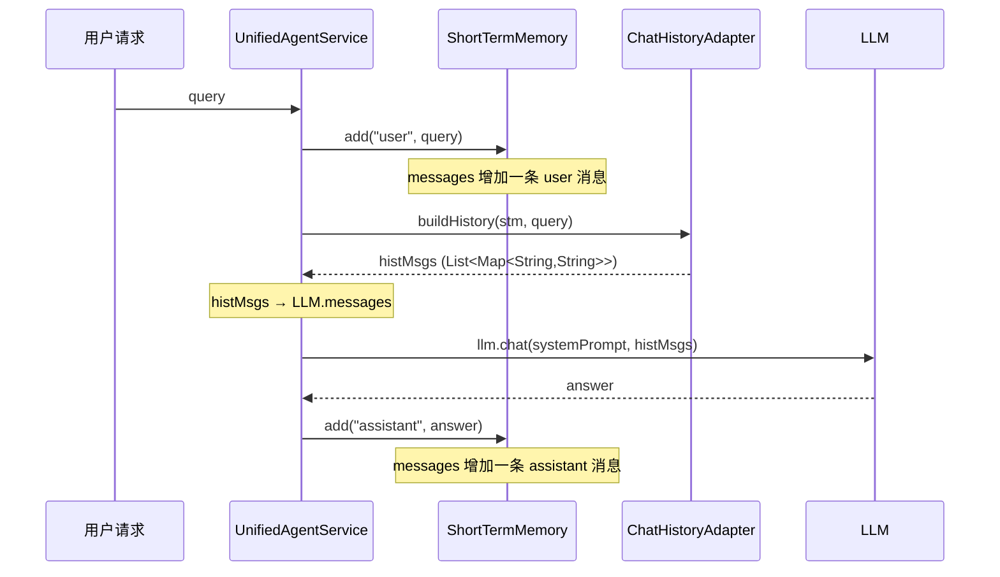
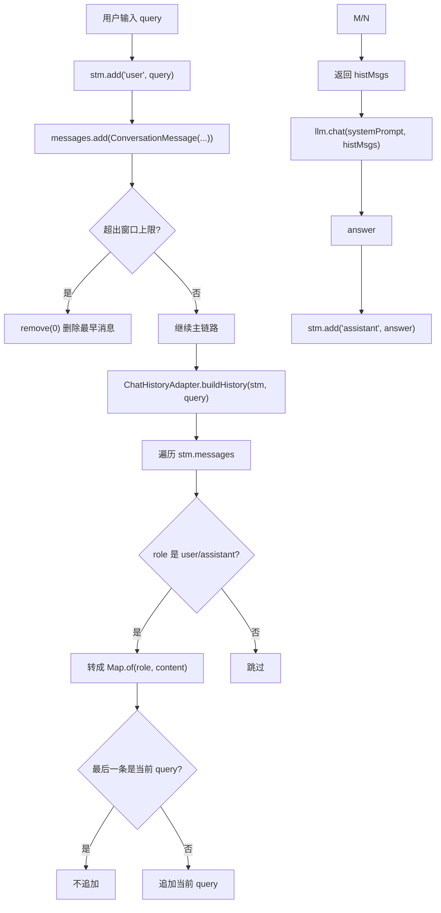

# 10 短期记忆与 histMsgs

## 1. 一句话结论

短期记忆 (`ShortTermMemory`) 是**当前会话的滑动窗口**，保存最近的 user/assistant 原始对话。`histMsgs` 是短期记忆经过 `ChatHistoryAdapter` 转换后的 LLM 消息格式。主链路中，用户消息和助手消息分别写入短期记忆，在调用 LLM 前转换成 `histMsgs` 放入 messages 参数。

---

## 2. 它在主链路里的位置

短期记忆在主链路的三个关键位置出现：

```text
主链路开始：
    stm.add("user", query)               ← 写入用户消息
    infra.saveChatHistory("user", query)

调用 LLM 前：
    histMsgs = ChatHistoryAdapter.buildHistory(stm, query)  ← 转成 messages

主链路结束：
    stm.add("assistant", answer)         ← 写入助手回复
    infra.saveChatHistory("assistant", answer)
```



---

## 3. 为什么需要它

**没有短期记忆，大模型就看不到上文的对话内容。**

举例：

```text
第 1 轮
用户：我叫小李
助手：好的，我记住了。

第 2 轮
用户：我刚才说我叫什么？
```

如果没有短期记忆，第 2 轮发给 LLM 的消息只有 `{"role": "user", "content": "我刚才说我叫什么？"}`。LLM 不知道"小李"，回答不出来。

有短期记忆时：

```java
histMsgs = [
    {"role": "user", "content": "我叫小李"},
    {"role": "assistant", "content": "好的，我记住了。"},
    {"role": "user", "content": "我刚才说我叫什么？"}
]
```

LLM 看到上下文，可以回答"你刚才说你叫小李"。

---

## 4. 对应源码位置

| 文件 | 作用 |
|---|---|
| `ShortTermMemory.java` | 短期记忆本体，保存/裁剪/读取 |
| `ConversationMessage.java` | 单条消息对象 |
| `ChatHistoryAdapter.java` | 把 STM 转成 LLM messages |
| `UnifiedAgentService.java` | 主链路中调用 add 和 buildHistory |

---

## 5. 先看对象长什么样

### 5.1 ConversationMessage —— 内部存储格式

```java
public class ConversationMessage {
    private String role;      // "user" 或 "assistant"
    private String content;   // 消息正文
    private String timestamp; // 写入时间，如 "14:30:01"
}
```

### 5.2 ShortTermMemory.messages —— 内存中的消息列表

```java
// 2 轮对话后：
messages = [
    ConversationMessage{role="user", content="你好", timestamp="14:28:00"},
    ConversationMessage{role="assistant", content="你好！", timestamp="14:28:03"},
    ConversationMessage{role="user", content="我叫小李", timestamp="14:29:00"},
    ConversationMessage{role="assistant", content="好的，我记住了。", timestamp="14:29:03"}
]
```

### 5.3 histMsgs —— LLM 消息格式

```java
// ChatHistoryAdapter.buildHistory 转换后：
histMsgs = [
    {"role": "user", "content": "你好"},
    {"role": "assistant", "content": "你好！"},
    {"role": "user", "content": "我叫小李"},
    {"role": "assistant", "content": "好的，我记住了。"}
]
```

注意对比：

```text
ConversationMessage 有 3 个字段：role, content, timestamp
histMsgs 的 Map 有 2 个键值对：role, content
timestamp 在转换时被丢弃了。
```

---

## 6. 核心流程图



---

## 7. 源码逐段讲解

### 7.1 主链路中短期记忆的三次调用

原文件：`UnifiedAgentService.java`

```java
// 第 1 次：用户消息进来，写入短期记忆
stm.add("user", query);

// 第 2 次：短期记忆转成 LLM messages
List<Map<String, String>> histMsgs = ChatHistoryAdapter.buildHistory(stm, query);

// 第 3 次：助手回答生成后，写入短期记忆
stm.add("assistant", resp.getAnswer());
```

**第 1 次写入为什么必须在 buildHistory 之前？**

```text
假设执行顺序颠倒了：
    // ❌ 错误顺序
    List<Map<String, String>> histMsgs = ChatHistoryAdapter.buildHistory(stm, query);
    stm.add("user", query);  // 在 buildHistory 之后才 add

    → buildHistory 时 stm 还没有当前 query！
    → 进入兜底逻辑：if (msgs.isEmpty() || 最后一条不是当前 query) 追加
    → 虽然最终 histMsgs 里会有当前 query，但它不是从 stm 来的
    → 如果之前有多轮对话，还能正常工作。但如果 stm 为空，buildHistory 凭空造了一条消息

    // ✅ 正确顺序
    stm.add("user", query);
    List<Map<String, String>> histMsgs = ChatHistoryAdapter.buildHistory(stm, query);

    → buildHistory 时 stm 已经有当前 query
    → 遍历时正常包含它，最后一条就是当前 query，不触发兜底
    → 逻辑清晰，数据来源明确
```

---

### 7.2 stm.add 内部做了什么

原文件：`ShortTermMemory.java`

```java
public void add(String role, String content) {
    // 创建消息对象并加入列表末尾
    messages.add(new ConversationMessage(role, content,
            LocalTime.now().format(DateTimeFormatter.ofPattern("HH:mm:ss"))));

    // 计算最大允许条数
    int max = maxTurns * 2;

    // 超出上限则删除最早消息
    while (messages.size() > max) {
        messages.remove(0);
    }
}
```

**第一步：创建消息对象**

```text
messages.add(new ConversationMessage("user", "我叫小李", "14:30:01"))

内部执行：
① LocalTime.now() → 14:30:01.123
② 格式化 → "14:30:01"
③ new ConversationMessage("user", "我叫小李", "14:30:01")
④ messages.add(...) → 追加到列表末尾
```

**第二步：计算上限**

```text
maxTurns = 5（默认值，可从配置读取）
max = 5 * 2 = 10 条消息

为什么乘 2？因为一轮 = user 1 条 + assistant 1 条 = 2 条消息
```

**第三步：滑动窗口裁剪**

假设当前有 10 条消息（刚好满），第 11 条加入：

```text
messages.add → size = 11
while (11 > 10) → true → remove(0) → size = 10
while (10 > 10) → false → 退出循环

最终：size = 10，最早那条被删掉了
```

**为什么要用 while 而不是 if？**

```java
// ❌ 错误写法
if (messages.size() > max) {
    messages.remove(0);
}
```

如果一次 add 后 size = 12（理论上不会，因为每次只加 1 条，但并发场景可能），用 if 只删 1 条还剩 11 条，仍然超限。用 while 保证最终不超过 max。

---

### 7.3 ChatHistoryAdapter.buildHistory 做了什么

原文件：`ChatHistoryAdapter.java`

```java
public static List<Map<String, String>> buildHistory(ShortTermMemory stm, String query) {
    List<Map<String, String>> msgs = new ArrayList<>();

    for (ConversationMessage m : stm.getMessages()) {
        if ("user".equals(m.getRole()) || "assistant".equals(m.getRole())) {
            msgs.add(Map.of("role", m.getRole(), "content", m.getContent()));
        }
    }

    // 兜底：如果最后一条不是当前 query，补上
    if (msgs.isEmpty() || !msgs.get(msgs.size() - 1).get("content").equals(query)) {
        msgs.add(Map.of("role", "user", "content", query));
    }

    return msgs;
}
```

**遍历 stm 时的数据流：**

```text
假设 stm.messages 是（3 轮对话后，maxTurns=2）：
    messages = [
        ConversationMessage{role="user", content="我叫小李", timestamp="14:29:00"},
        ConversationMessage{role="assistant", content="好的，我记住了。", timestamp="14:29:03"},
        ConversationMessage{role="user", content="你喜欢用什么语言回答", timestamp="14:29:30"},
        ConversationMessage{role="assistant", content="中文", timestamp="14:29:33"},
        ConversationMessage{role="user", content="我叫小李，查一下上海天气", timestamp="14:30:01"}
    ]

遍历过程：
    i=0: role="user" → 加入 → msgs = [{"role":"user","content":"我叫小李"}]
    i=1: role="assistant" → 加入 → msgs = [..., {"role":"assistant","content":"好的，我记住了。"}]
    i=2: role="user" → 加入 → msgs = [..., {"role":"user","content":"你喜欢用什么语言回答"}]
    i=3: role="assistant" → 加入 → msgs = [..., {"role":"assistant","content":"中文"}]
    i=4: role="user" → 加入 → msgs = [..., {"role":"user","content":"我叫小李，查一下上海天气"}]

兜底检查：
    msgs 不为空 → 最后一条 content = "我叫小李，查一下上海天气"
    equals(query) → true → 不追加

最终 histMsgs：
    [
        {"role": "user", "content": "我叫小李"},
        {"role": "assistant", "content": "好的，我记住了。"},
        {"role": "user", "content": "你喜欢用什么语言回答"},
        {"role": "assistant", "content": "中文"},
        {"role": "user", "content": "我叫小李，查一下上海天气"}
    ]
```

**如果另一种代码风格（Role 过滤）会怎样？**

```java
// ❌ 错误写法
for (ConversationMessage m : stm.getMessages()) {
    msgs.add(Map.of("role", m.getRole(), "content", m.getContent()));
}
```

这样会把所有 role 都加进去。如果短期记忆里混入了某些特殊角色（比如 `system`、`tool`），LLM 的 messages 格式可能不允许——Anthropic/OpenAI 的 messages API 只接受 `user` 和 `assistant` role。过滤后可以保证不会混入非法 role。

**而且 `"user".equals(m.getRole())` 而不是 `m.getRole().equals("user")` 是防御性编程：**

```text
m.getRole().equals("user")
    → 如果 m.getRole() 是 null → NullPointerException！

"user".equals(m.getRole())
    → 如果 m.getRole() 是 null → "user".equals(null) → false
    → 不会抛异常，只是跳过这条消息
```

---

### 7.4 buildSystemPrompt —— memPrefix 拼接

```java
public static String buildSystemPrompt(String memPrefix, String basePrompt) {
    if (memPrefix == null || memPrefix.isEmpty()) return basePrompt;
    return memPrefix + "\n\n" + basePrompt;
}
```

**最终 LLM 输入的完整样子：**

```text
system:
    【用户偏好】
    姓名: 小李
    城市: 上海
    
    【相关记忆】
    用户正在学习 AI Agent
    
    你是一个简洁的AI助手。结合你掌握的用户信息，使回答更个性化。

messages:
    [{"role": "user", "content": "你好"},
     {"role": "assistant", "content": "你好！"},
     {"role": "user", "content": "我刚才说我叫什么？"}]
```

**memPrefix 和 histMsgs 在 LLM 输入中的角色完全分开：**

```text
memPrefix → system prompt（LLM 把它当背景知识）
histMsgs  → messages（LLM 把它当对话历史）

LLM 训练时被教导：
- system prompt = 全局约束和背景知识，不应该被"忘记"
- messages = 对话历史，可能会被轮换覆盖
```

---

### 7.5 3 轮对话实战演练

假设 `maxTurns = 2`（最多 4 条消息）。

**第 1 轮：用户说名字**

```java
// 用户输入
query1 = "我叫小李"

// stm.add("user", "我叫小李")
messages = [
    ConversationMessage{role="user", content="我叫小李", timestamp="14:00:01"}
]

// buildHistory → histMsgs = [{"role":"user","content":"我叫小李"}]

// LLM 回答："好的，我记住了，你叫小李。"

// stm.add("assistant", "好的，我记住了，你叫小李。")
messages = [
    ConversationMessage{role="user", content="我叫小李", timestamp="14:00:01"},
    ConversationMessage{role="assistant", content="好的，我记住了，你叫小李。", timestamp="14:00:04"}
]
```

**第 2 轮：用户问偏好**

```java
// 用户输入
query2 = "我喜欢你用中文回答"

// stm.add("user", "我喜欢你用中文回答")
messages = [
    ConversationMessage{role="user", content="我叫小李", timestamp="14:00:01"},
    ConversationMessage{role="assistant", content="好的，我记住了，你叫小李。", timestamp="14:00:04"},
    ConversationMessage{role="user", content="我喜欢你用中文回答", timestamp="14:05:00"}
]

// buildHistory → histMsgs = [
//     {"role":"user", "content":"我叫小李"},
//     {"role":"assistant", "content":"好的，我记住了，你叫小李。"},
//     {"role":"user", "content":"我喜欢你用中文回答"}
// ]

// LLM 回答："好的，我用中文回答。"

// stm.add("assistant", "好的，我用中文回答。")
messages = [
    // size = 4，未超 max=4，不裁剪
    ConversationMessage{role="user", content="我叫小李", timestamp="14:00:01"},
    ConversationMessage{role="assistant", content="好的，我记住了，你叫小李。", timestamp="14:00:04"},
    ConversationMessage{role="user", content="我喜欢你用中文回答", timestamp="14:05:00"},
    ConversationMessage{role="assistant", content="好的，我用中文回答。", timestamp="14:05:03"}
]
```

**第 3 轮：用户问自己的名字**

```java
// 用户输入
query3 = "我刚才说我叫什么？"

// stm.add("user", "我刚才说我叫什么？")
// 此时 size 变为 5，超过 max=4
messages = [
    ConversationMessage{role="user", content="我叫小李", timestamp="14:00:01"},  ← 即将被删
    ConversationMessage{role="assistant", content="好的，我记住了，你叫小李。", timestamp="14:00:04"},
    ConversationMessage{role="user", content="我喜欢你用中文回答", timestamp="14:05:00"},
    ConversationMessage{role="assistant", content="好的，我用中文回答。", timestamp="14:05:03"},
    ConversationMessage{role="user", content="我刚才说我叫什么？", timestamp="14:08:00"}
]

// 裁剪：while(5>4) → remove(0) → 删除"我叫小李"
// 最终 messages：
messages = [
    ConversationMessage{role="assistant", content="好的，我记住了，你叫小李。", timestamp="14:00:04"},
    ConversationMessage{role="user", content="我喜欢你用中文回答", timestamp="14:05:00"},
    ConversationMessage{role="assistant", content="好的，我用中文回答。", timestamp="14:05:03"},
    ConversationMessage{role="user", content="我刚才说我叫什么？", timestamp="14:08:00"}
]

// buildHistory → histMsgs = [
//     {"role":"assistant", "content":"好的，我记住了，你叫小李。"},
//     {"role":"user", "content":"我喜欢你用中文回答"},
//     {"role":"assistant", "content":"好的，我用中文回答。"},
//     {"role":"user", "content":"我刚才说我叫什么？"}
// ]

// LLM 看到：
// assistant 说的"好的，我记住了，你叫小李。" — 里面有"小李"
// 可以推理出用户叫"小李"
```

**关键发现：** 虽然"我叫小李"这条原始用户消息被窗口挤掉了，但助手的回复里提到了"你叫小李"。所以 LLM 仍然能回答。但如果用户"小李"信息只在用户自己说的时候出现过，没有在助手回复里被提及，被裁剪后就真的丢失了——这就需要长期记忆来兜底（`memPrefix` 可以从长期记忆中召回）。

---

### 7.6 程序启动后如何恢复短期记忆

```java
// UnifiedAgentService 启动时
int chatLimit = cfg.getMemory().getShortTermMaxTurns() * 2;
List<InfrastructureService.ChatHistoryRow> history = infra.loadChatHistory(chatLimit);
for (InfrastructureService.ChatHistoryRow h : history) {
    stm.add(h.role, h.content);
}
```

**数据库 load 的内部：**

```sql
SELECT role, content, TO_CHAR(created_at, 'HH24:MI:SS')
FROM chat_history
ORDER BY id DESC
LIMIT ?
```

取到后 `Collections.reverse(rows)` 恢复时间顺序（从旧到新），然后逐条 `stm.add`。

**恢复后 stm.messages 的样子：**

```java
messages = [
    ConversationMessage{role="user", content="我叫小李", timestamp="14:00:01"},  // 注意：这是 stm.add 新设的时间
    ConversationMessage{role="assistant", content="好的，我记住了。", timestamp="14:00:04"},
    ConversationMessage{role="user", content="我喜欢你用中文回答", timestamp="14:05:00"},
    ConversationMessage{role="assistant", content="好的，我用中文回答。", timestamp="14:05:03"}
]
```

**恢复的时间戳是重新生成的**，不是数据库里的 `created_at`。因为 `stm.add` 内部用 `LocalTime.now()` 作为 timestamp。但 LLM 不使用这个字段，所以不影响回答质量。

---

## 8. 真实举例：它在流程中怎么运行

### 8.1 第一个问题

```text
query = "你好"
stm.add("user", "你好")
stm.messages = [{user, "你好", "14:00:00"}]

buildHistory(stm, "你好")
→ histMsgs = [{"user", "你好"}]
→ 最后一条是"你好"=query，不追加

发给 LLM：system prompt + [{"user", "你好"}]
LLM 回答："你好！有什么可以帮你的？"

stm.add("assistant", "你好！有什么可以帮你的？")
stm.messages = [
    {user, "你好", "14:00:00"},
    {assistant, "你好！有什么可以帮你的？", "14:00:03"}
]
```

### 8.2 第二个问题（有上下文）

```text
query = "我叫小李"
stm.add("user", "我叫小李")
stm.messages = [
    {user, "你好", "14:00:00"},
    {assistant, "你好！有什么可以帮你的？", "14:00:03"},
    {user, "我叫小李", "14:01:00"}
]

buildHistory(stm, "我叫小李")
→ histMsgs = [
    {"role": "user", "content": "你好"},
    {"role": "assistant", "content": "你好！有什么可以帮你的？"},
    {"role": "user", "content": "我叫小李"}
]
→ 最后一条是"我叫小李"=query，不追加

发给 LLM：
system prompt + [
    {"user", "你好"},
    {"assistant", "你好！有什么可以帮你的？"},
    {"user", "我叫小李"}
]

LLM 看到上下文，知道用户刚刚说了"你好"，现在说"我叫小李"。
→ 回答："你好小李！"
```

---

## 9. 用一个完整例子跑一遍

### 9.1 配置

```java
shortTermMaxTurns = 3  // 最多 3 轮 = 6 条消息
```

### 9.2 4 轮对话后的状态

```text
第 1 轮：user"你好" → assistant"你好！"
第 2 轮：user"我叫小李" → assistant"好的小李"
第 3 轮：user"今天天气好吗" → assistant"上海小雨20°C"
第 4 轮：user"明天呢"

第 4 轮 stm.add("user", "明天呢") 时：
    size=7 > max=6 → remove(0) 删除最早"你好"
    再检查 size=6 ≤6 → 停止删除
```

### 9.3 buildHistory 的结果

```java
histMsgs = [
    {"role": "assistant", "content": "你好！"},
    {"role": "user", "content": "我叫小李"},
    {"role": "assistant", "content": "好的小李"},
    {"role": "user", "content": "今天天气好吗"},
    {"role": "assistant", "content": "上海小雨20°C"},
    {"role": "user", "content": "明天呢"}
]
```

注意：用户的第一句话"你好"已经被裁剪掉了，但助手的"你好！"还在——因为"你好"在第 0 位，"你好！"在第 1 位，删除第 0 位后第 1 位移到第 0 位。所以会出现"看到助手回答但看不到用户上一条"的不对称情况。不过 LLM 通常够聪明，能从助手回答"你好！"倒推出用户上一句说了"你好"。

---

## 10. 关键判断条件

| 判断点 | 条件 | true → | false → |
|---|---|---|---|
| 裁剪 | `messages.size() > maxTurns * 2` | `remove(0)` 删最早 | 不裁剪 |
| Role 过滤 | `role == user \|\| role == assistant` | 加入 histMsgs | 跳过 |
| 兜底追加 | `msgs.isEmpty()` | 追加当前 query | 继续判断最后一条 |
| 兜底追加 | 最后一条 content != query | 追加当前 query | 不追加 |
| 恢复条数 | `chatLimit = shortTermMaxTurns * 2` | 取最近 limit 条 | 不取更多 |

---

## 11. 容易混淆的点

### 11.1 histMsgs 的数据来源

`histMsgs` 来源于 `ShortTermMemory.messages`，但消息条数可能不同。因为 `buildHistory` 只保留 `role` 为 `user` 或 `assistant` 的消息。如果短期记忆中有其他 role 的消息，`histMsgs` 会少几条。

### 11.2 裁剪是按条数不是按轮

`maxTurns * 2` 控制的是消息条数，不是"对话轮数"的严格语义。如果某轮只有 user 没有 assistant（比如中途出错），窗口里实际可容纳的"完整轮数"可能少于 maxTurns。

### 11.3 stm.add 后的裁剪是同步的

`stm.add("user", query)` 执行完后，如果超出限制，最早消息已经被删除了。所以下一步 `buildHistory` 读取到的已经是裁剪后的数据。

### 11.4 memPrefix 中的"名字"和 histMsgs 中的"名字"可能重复

memPrefix 从长期记忆/偏好中取到"用户叫小李"，histMsgs 的对话历史里也可能出现"我叫小李"。LLM 同时看到两份信息，不会有什么问题——system prompt 里的背景和 messages 里的对话内容有重叠很正常。

### 11.5 重启恢复的时效性问题

系统重启后恢复的聊天记录，所有消息的 `timestamp` 会被重新设置为启动时的时间。这意味着**时间顺序和原始时间不同**。但由于 LLM 不读 timestamp，对话体验不受影响。

---

## 12. 和其他模块的关系

| 模块 | 关系 |
|---|---|
| `ChatHistoryAdapter` | 是 STM 和 LLM 之间的桥梁，负责格式转换 |
| `InfrastructureService` | 负责持久化 chat_history，供重启恢复 |
| `LongTermMemory` | 当 STM 裁剪掉重要信息后，LTM 在 memPrefix 中补回 |
| `MemoryWriter` | 分析回答内容，把值得长期保存的信息写入 LTM |
| `UnifiedAgentService` | 负责"什么时候 add、什么时候 buildHistory"的调度 |

---

## 13. 如果要改这个功能，改哪里

| 需求 | 修改位置 | 怎么改 | 风险 |
|---|---|---|---|
| 增大上下文窗口 | 配置 `shortTermMaxTurns` | 改成 10/20 | prompt 变长，token 消耗增加 |
| 按 token 裁剪（不是按条） | `ShortTermMemory.add` | 改成估计 token 数，超限删除 | 需要 tokenizer，估计不准可能裁剪过头 |
| 支持多用户隔离 | `ShortTermMemory` 改为 Map | `Map<userId, List<ConversationMessage>>` | 所有调用方需要传 userId |
| 传递 timestamp 给 LLM | `ChatHistoryAdapter.buildHistory` | content 中追加时间 | 可能干扰 LLM 对正文的理解 |
| 支持 tool role | `ChatHistoryAdapter.buildHistory` | 放开 role 过滤 | 需要确认 LLM API 支持 tool 消息格式 |

---

## 14. 面试怎么说

完整回答：

```text
短期记忆是当前会话的滑动窗口。用户请求进入后，首先 stm.add("user", query) 写入内存，同时保存到 chat_history 表。调用 LLM 前，ChatHistoryAdapter.buildHistory 把 List<ConversationMessage> 转换成 List<Map<String,String>>——保留 role 和 content，丢弃 timestamp，过滤掉非 user/assistant 的角色。

STM 内部用 synchronizedList 包装 ArrayList，maxTurns * 2 控制窗口大小。超出时 remove(0) 删除最早的。助手回答生成后再 add 一条 assistant 消息。

histMsgs 会拼到 LLM 的 messages 参数里，而偏好和长期记忆通过 memPrefix 拼到 system prompt。两者在 LLM 输入中角色分开：system prompt 是背景知识，messages 是对话历史。
```

短版：

```text
短期记忆保存最近几轮原始对话，buildHistory 转成 LLM messages。它和 memPrefix 一起构成 LLM 的完整输入——memPrefix 在 system prompt，histMsgs 在 messages。
```

---

## 15. 自检题

1. `maxTurns = 10` 时，`stm.add` 最多保留多少条消息？

2. `ChatHistoryAdapter.buildHistory` 返回的 `histMsgs` 有几个字段？（role, content, timestamp？）

3. 如果 stm 为空（messages=[]），`buildHistory(stm, "你好")` 返回什么？

4. 为什么 `"user".equals(m.getRole())` 比 `m.getRole().equals("user")` 更安全？

5. 第 3 轮对话时，短期记忆的裁剪逻辑如何执行？

6. 程序重启后，ShortTermMemory.messages 还能恢复吗？如何恢复？

7. stm.add("user", query) 和 ChatHistoryAdapter.buildHistory(stm, query) 的执行顺序能互换吗？

8. memPrefix 和 histMsgs 在 LLM 输入中分别在哪里？

9. 如果短期消息窗口太小导致"我叫小李"被裁剪，系统还靠什么回答出用户名字？

10. 为什么 shortTermMaxTurns 配置的是"轮数"而不是"消息条数"？
