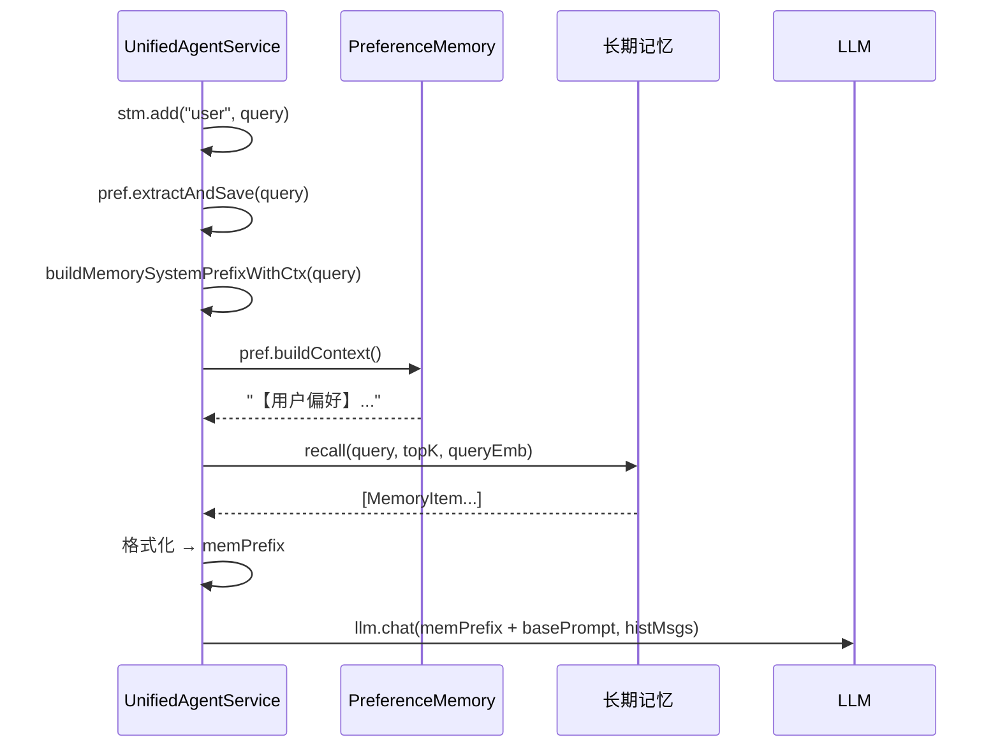
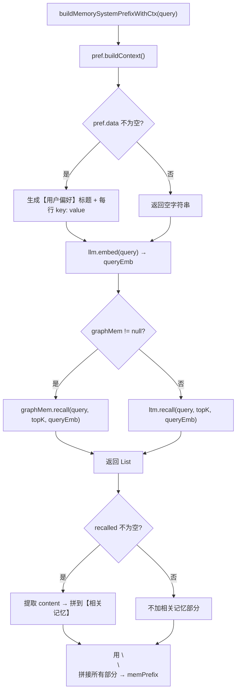

# 11 memPrefix 上下文构建

## 1. 一句话结论

`memPrefix` 是拼到 LLM system prompt 前面的文字块，包含"用户偏好"和"长期记忆召回结果"两部分，让 LLM 在回答时知道用户的背景信息。

---

## 2. 它在主链路里的位置

在调用 LLM **之前**构建，结果放入 system prompt。



**和其他信息的对比：**

| 变量 | 来源 | 放到 LLM 哪里 | 作用 |
|---|---|---|---|
| `memPrefix` | 偏好 + 长期记忆召回 | system prompt | 给 LLM 长期背景知识 |
| `histMsgs` | ShortTermMemory | messages | 给 LLM 当前对话上下文 |

---

## 3. 为什么需要它

**如果没有 memPrefix，LLM 只知道"这是什么对话"，不知道"用户是谁、喜欢什么、有什么历史"。**

举例：

```text
用户：我叫小李
助手：好的，我记住了。

（过去 30 条对话后，短期记忆窗口滚动，"我叫小李"已被裁剪）

用户：我刚才说我叫什么？
```

没有 memPrefix 时：
- `histMsgs` 可能已经看不到"我叫小李"
- LLM 不知道用户叫什么，回答不了

有 memPrefix 时：
- 长期记忆召回了 `MemoryItem{content="用户叫小李"}` 
- `memPrefix` = "【相关记忆】\n用户叫小李"
- LLM 在 system prompt 中看到了"用户叫小李"
- 能回答"你叫小李"

---

## 4. 对应源码位置

| 文件 | 作用 |
|---|---|
| `UnifiedAgentService.java` | `buildMemorySystemPrefixWithCtx` 方法 |
| `PreferenceMemory.java` | `buildContext()` 偏好转文字 |
| `LongTermMemory.java` | `recall()` 语义召回 |
| `GraphMemory.java` | `recall()` 带邻居扩展的召回（优先于 LTM） |
| `MemoryItem.java` | 召回结果对象 |
| `LlmService.java` | `embed()` 向量化 |

---

## 5. 先看对象长什么样

### 5.1 最终 memPrefix 的字符串

**有偏好 + 有长期记忆：**

```text
【用户偏好】
姓名: 小李
城市: 上海

【相关记忆】
用户正在学习 AI Agent 工具调用系统
用户偏好简短回答风格
```

**只有偏好：**

```text
【用户偏好】
姓名: 小李
```

**只有长期记忆：**

```text
【相关记忆】
用户正在学习 AI Agent 工具调用系统
```

**两者都没有：**

```text
""  ← 空字符串
```

### 5.2 PreferenceMemory 内部数据

```java
pref.data = {
    "姓名": "小李",
    "城市": "上海"
}
```

### 5.3 召回结果（LongTermMemory.recall 返回值）

```java
[
    MemoryItem {
        id = 42,
        content = "用户正在学习 AI Agent 工具调用系统",
        importance = 0.8,
        score = 0.85,
        embedding = [0.12, -0.34, ...]
    },
    MemoryItem {
        id = 43,
        content = "用户偏好简短回答风格",
        importance = 0.6,
        score = 0.72,
        embedding = [0.08, -0.21, ...]
    }
]
```

---

## 6. 核心流程图



---

## 7. 源码逐段讲解

### 7.1 方法整体结构

原文件：`UnifiedAgentService.java`

```java
private String buildMemorySystemPrefixWithCtx(String query) {
    List<String> parts = new ArrayList<>();

    // Part 1: Preference context
    String prefCtx = pref.buildContext();
    if (!prefCtx.isEmpty()) parts.add(prefCtx);

    // Part 2: Long-term memory recall
    List<Double> queryEmb = llm.embed(query);
    List<MemoryItem> recalled = (graphMem != null)
        ? graphMem.recall(query, cfg.getMemory().getLongTermTopK(), queryEmb)
        : ltm.recall(query, cfg.getMemory().getLongTermTopK(), queryEmb);

    if (!recalled.isEmpty()) {
        List<String> contents = recalled.stream().map(MemoryItem::getContent).toList();
        parts.add("【相关记忆】\n" + String.join("\n", contents));
    }

    return String.join("\n\n", parts);
}
```

**方法在做什么？** 收集所有"需要告诉 LLM 的用户背景信息"，拼成一个多段的字符串。

**结构拆解：** 一个 `List<String>` 收集各段，最后用 `\n\n` 拼接。每一段都是一个独立的"信息块"——偏好是一段，相关记忆是一段，未来可能再加"工具状态"、"对话目标"等段。

---

### 7.2 Part 1：偏好上下文

```java
String prefCtx = pref.buildContext();
if (!prefCtx.isEmpty()) parts.add(prefCtx);
```

**pref.buildContext() 内部做了什么？**

```java
// PreferenceMemory.java
public String buildContext() {
    if (data.isEmpty()) return "";
    
    StringBuilder sb = new StringBuilder("【用户偏好】\n");
    for (Map.Entry<String, String> e : data.entrySet()) {
        sb.append(e.getKey()).append(": ").append(e.getValue()).append("\n");
    }
    return sb.toString().trim();
}
```

**假设备份数据：**

```text
data = {"姓名": "小李", "城市": "上海"}
```

**执行流程：**

```text
① sb = "【用户偏好】\n"
② 遍历：
   e = "姓名"→"小李" → sb.append("姓名: 小李\n")
   e = "城市"→"上海" → sb.append("城市: 上海\n")
③ sb = "【用户偏好】\n姓名: 小李\n城市: 上海\n"
④ .trim() → "【用户偏好】\n姓名: 小李\n城市: 上海"
```

**返回结果：**

```text
"【用户偏好】
姓名: 小李
城市: 上海"
```

**如果为空：**

```java
pref.data = {}  // 没有任何偏好
pref.buildContext() → ""
!prefCtx.isEmpty() → false → parts 不加
```

---

### 7.3 向量化：llm.embed(query)

```java
List<Double> queryEmb = llm.embed(query);
```

**这一步在做什么？** 把用户的文本问题转换成一个数值向量，用于语义相似度计算。

**什么是 embedding？**

```text
"我叫小李，查一下上海天气"
    ↓ LLM  embedding 模型
[0.12, -0.34, 0.56, ..., 0.89]  ← 128 个浮点数组成的向量

"你叫什么名字"
    ↓ LLM embedding 模型
[0.11, -0.33, 0.55, ..., 0.88]  ← 和"我叫小李"的向量很接近（语义相似）

"今天天气不错"
    ↓ LLM embedding 模型
[-0.45, 0.67, -0.23, ..., 0.12]  ← 和"我叫小李"的向量差别较大
```

**embeddings = 128 维向量**（具体维度看模型，有的是 768 维、1024 维）。维度越高，能表达的语义信息越丰富，但计算量也越大。

**`llm.embed` 调用了什么？**

```text
llm.embed(query)
    → 调用 LLM 提供商的 embedding API
    → 例如 OpenAI text-embedding-3-small、或者本地 embedding 模型
    → 返回 List<Double>
    → 耗时约 100-500ms（取决于模型大小和网络）
```

**然后 queryEmb 去哪了？** 传给 `recall` 方法，用于和 MemoryItem 的 embedding 做余弦相似度计算。

---

### 7.4 选择召回器：graphMem vs ltm

```java
List<MemoryItem> recalled = (graphMem != null)
    ? graphMem.recall(query, cfg.getMemory().getLongTermTopK(), queryEmb)
    : ltm.recall(query, cfg.getMemory().getLongTermTopK(), queryEmb);
```

**这是三元运算符：**

```text
条件：graphMem != null？
    真 → 走 GraphMemory.recall（图记忆召回）
    假 → 走 LongTermMemory.recall（普通记忆召回）
```

**为什么优先用 graphMem？**

```text
GraphMemory = LongTermMemory + 图结构
    → 召回时除了语义相似，还会扩展邻居节点
    → 比如用户问"学习进度"，可以召回"工具调用"相关记忆（邻居）
    
LongTermMemory = 纯语义召回
    → 只按 embedding 相似度打分排序
    → 不会扩展关联信息
```

**`cfg.getMemory().getLongTermTopK()` 是什么？** 配置中的 topK 参数，控制最多召回多少条记忆。默认通常是 5 或 10。

---

### 7.5 recall 内部：复合打分

以 `LongTermMemory.recall` 为例（`GraphMemory.recall` 类似但多了邻居扩展）：

```java
public List<MemoryItem> recall(String query, int topK, List<Double> queryEmb) {
    List<ScoredMemoryItem> scored = new ArrayList<>();

    for (MemoryItem item : items) {
        // 余弦相似度
        double cosSim = cosineSimilarity(queryEmb, item.getEmbedding());

        // 重要性分数
        double importance = item.getImportance();

        // 复合分数 = 余弦相似度 × 0.7 + 重要性 × 0.3
        double score = cosSim * 0.7 + importance * 0.3;

        if (score >= threshold) {  // 阈值过滤
            item.setScore(score);
            scored.add(new ScoredMemoryItem(item, score));
        }
    }

    // 按复合分降序，取 topK
    scored.sort((a, b) -> Double.compare(b.score, a.score));
    return scored.stream().limit(topK).map(s -> s.item).toList();
}
```

**打分执行流程（假设有 5 条记忆）：**

```text
items = [
    MemoryItem{id=1, content="用户叫小李", embedding=[0.1, ...], importance=0.8},
    MemoryItem{id=2, content="用户喜欢蓝色", embedding=[-0.2, ...], importance=0.5},
    MemoryItem{id=3, content="上海天气查询方法", embedding=[0.5, ...], importance=0.6},
    MemoryItem{id=4, content="用户偏好中文回答", embedding=[0.3, ...], importance=0.7},
    MemoryItem{id=5, content="用户正在学习AI", embedding=[0.4, ...], importance=0.9}
]

queryEmb = llm.embed("我叫小李，查一下上海天气") = [0.12, -0.34, 0.56, ...]

遍历计算：
    id=1: cosSim("我叫小李查天气", "用户叫小李") = 0.85
          importance = 0.8
          score = 0.85×0.7 + 0.8×0.3 = 0.595 + 0.24 = 0.835
    
    id=2: cosSim("我叫小李查天气", "用户喜欢蓝色") = 0.12
          importance = 0.5
          score = 0.12×0.7 + 0.5×0.3 = 0.084 + 0.15 = 0.234
    
    id=3: cosSim("我叫小李查天气", "上海天气查询方法") = 0.72
          importance = 0.6
          score = 0.72×0.7 + 0.6×0.3 = 0.504 + 0.18 = 0.684
    
    id=4: cosSim("我叫小李查天气", "用户偏好中文回答") = 0.45
          importance = 0.7
          score = 0.45×0.7 + 0.7×0.3 = 0.315 + 0.21 = 0.525
    
    id=5: cosSim("我叫小李查天气", "用户正在学习AI") = 0.38
          importance = 0.9
          score = 0.38×0.7 + 0.9×0.3 = 0.266 + 0.27 = 0.536

阈值 threshold = 0.3（假设）：

    通过：id=1(0.835), id=3(0.684), id=4(0.525), id=5(0.536)
    淘汰：id=2(0.234) < 0.3

按分降序排序，取 topK=3：

    id=1(0.835), id=5(0.536), id=3(0.684)
    ↓ 排序后
    id=1(0.835), id=3(0.684), id=5(0.536)
    ↓ 取 topK=3
    [id=1, id=3, id=5]
```

**三个权重：**

```text
cosineSimilarity × 0.7
    → 语义相关度占大头（70%）
    → 确保召回的内容和当前问题语义相近

importance × 0.3
    → 重要性占小头（30%）
    → 确保长期重要但不一定语义相关的记忆不被完全忽略
```

---

### 7.6 格式化召回结果

```java
if (!recalled.isEmpty()) {
    List<String> contents = recalled.stream().map(MemoryItem::getContent).toList();
    parts.add("【相关记忆】\n" + String.join("\n", contents));
}
```

**Stream API 拆解：**

```text
recalled = [MemoryItem{content="用户叫小李"}, MemoryItem{content="上海天气查询方法"}, MemoryItem{content="用户正在学习AI"}]

recalled.stream()
    → 转换成 Stream，可以链式操作

.map(MemoryItem::getContent)
    → 对每个 MemoryItem 调用 getContent() 方法
    → 提取出 content 字符串
    → ["用户叫小李", "上海天气查询方法", "用户正在学习AI"]

.toList()
    → 把 Stream 收集成 List
    → contents = ["用户叫小李", "上海天气查询方法", "用户正在学习AI"]
```

**拼接过程：**

```java
String.join("\n", contents)
// "用户叫小李\n上海天气查询方法\n用户正在学习AI"

"【相关记忆】\n" + "用户叫小李\n上海天气查询方法\n用户正在学习AI"
// "【相关记忆】\n用户叫小李\n上海天气查询方法\n用户正在学习AI"

parts.add(...)
// parts = ["【用户偏好】\n姓名: 小李", "【相关记忆】\n用户叫小李\n上海天气查询方法\n用户正在学习AI"]
```

---

### 7.7 最终拼接

```java
return String.join("\n\n", parts);
```

**如果 parts 有两个元素：**

```java
String.join("\n\n", ["【用户偏好】\n姓名: 小李", "【相关记忆】\n用户叫小李\n..."])
// "【用户偏好】\n姓名: 小李\n\n【相关记忆】\n用户叫小李\n..."
```

**最终 memPrefix 长这样：**

```text
【用户偏好】
姓名: 小李

【相关记忆】
用户叫小李
上海天气查询方法
用户正在学习AI
```

**如果 parts 只有一个元素（只有偏好）：**

```text
【用户偏好】
姓名: 小李
```

**如果 parts 为空：**

```java
String.join("\n\n", [])  // → "" 空字符串
```

**空 memPrefix 进入 system prompt：**

```java
ChatHistoryAdapter.buildSystemPrompt("", "你是一个简洁的AI助手...")
// → memPrefix 为空 → 直接返回 basePrompt
// → "你是一个简洁的AI助手..."
```

---

### 7.8 memPrefix 拼入 system prompt

```java
// UnifiedAgentService 中调用 LLM 前
String sp = ChatHistoryAdapter.buildSystemPrompt(memPrefix,
        "你是一个简洁的AI助手。结合你掌握的用户信息，使回答更个性化。");
```

**buildSystemPrompt 的源码：**

```java
public static String buildSystemPrompt(String memPrefix, String basePrompt) {
    if (memPrefix == null || memPrefix.isEmpty()) return basePrompt;
    return memPrefix + "\n\n" + basePrompt;
}
```

**完整 LLM 输入：**

```text
system:
    【用户偏好】
    姓名: 小李
    
    【相关记忆】
    用户叫小李
    上海天气查询方法
    用户正在学习AI
    
    你是一个简洁的AI助手。结合你掌握的用户信息，使回答更个性化。

messages:
    [{"role": "user", "content": "我叫小李，查一下上海天气"}]
```

**注意顺序：memPrefix 在 basePrompt 前面。** LLM 倾向于更重视 prompt 前面的内容。先让模型了解"这个用户是什么样的人"，再告诉它"你应该如何服务用户"。

---

## 8. 真实举例：它在流程中怎么运行

### 8.1 场景一：新用户，无偏好，无长期记忆

```text
query = "你好"
pref.data = {}  // 空
ltm.items = []  // 空

buildMemorySystemPrefixWithCtx("你好"):
① pref.buildContext() → ""
② parts = []（空的，不添加）
③ llm.embed("你好") → [0.01, 0.02, ...]
④ ltm.recall("你好", 5, emb) → []（空）
⑤ recalled.isEmpty() → true，不添加
⑥ String.join("\n\n", []) → ""

memPrefix = ""

最终 system prompt："你是一个简洁的AI助手。..."
→ 没有用户背景信息
→ LLM 按默认行为回答
```

### 8.2 场景二：有偏好，无长期记忆

```text
query = "查一下上海天气"
pref.data = {"城市": "上海"}

buildMemorySystemPrefixWithCtx("查一下上海天气"):
① pref.buildContext() → "【用户偏好】\n城市: 上海"
② parts = ["【用户偏好】\n城市: 上海"]
③ llm.embed → [0.3, -0.1, ...]
④ ltm.recall → []（没有长期记忆）
⑤ recalled.isEmpty() → true
⑥ String.join → "【用户偏好】\n城市: 上海"

memPrefix = "【用户偏好】\n城市: 上海"

system prompt = "【用户偏好】\n城市: 上海\n\n你是一个简洁的AI助手。..."
→ LLM 知道用户"城市=上海"，可以个性化回答上海天气
```

### 8.3 场景三：有偏好 + 长期记忆

```text
query = "帮我推荐学习路线"
pref.data = {"姓名": "小李"}
ltm.items 中有：
    "用户正在学习 AI Agent 系统"
    "用户偏好详细解释"

buildMemorySystemPrefixWithCtx("帮我推荐学习路线"):
① pref.buildContext() → "【用户偏好】\n姓名: 小李"
② parts = ["【用户偏好】\n姓名: 小李"]
③ llm.embed → [0.5, 0.3, ...]
④ ltm.recall → [MemoryItem{content="用户正在学习 AI Agent 系统", score=0.82},
                   MemoryItem{content="用户偏好详细解释", score=0.71}]
⑤ contents = ["用户正在学习 AI Agent 系统", "用户偏好详细解释"]
   parts.add("【相关记忆】\n用户正在学习 AI Agent 系统\n用户偏好详细解释")
⑥ String.join → "【用户偏好】\n姓名: 小李\n\n【相关记忆】\n用户正在学习 AI Agent 系统\n用户偏好详细解释"

memPrefix = "【用户偏好】\n姓名: 小李\n\n【相关记忆】\n用户正在学习 AI Agent 系统\n用户偏好详细解释"
```

---

## 9. 用一个完整例子跑一遍

### 9.1 初始状态

```java
pref.data = {"姓名": "小李", "语言偏好": "中文", "城市": "上海"}

ltm.items = [
    MemoryItem{id=1, content="用户正在学习AI Agent", importance=0.8, embedding=[0.1,...]},
    MemoryItem{id=2, content="用户偏好详细解释", importance=0.7, embedding=[-0.2,...]},
    MemoryItem{id=3, content="用户上周问过spring配置", importance=0.5, embedding=[0.5,...]},
    MemoryItem{id=4, content="上海天气多变建议关注", importance=0.6, embedding=[0.3,...]},
    MemoryItem{id=5, content="用户不喜欢长篇大论", importance=0.4, embedding=[-0.4,...]}
]
```

### 9.2 用户输入

```text
query = "查一下上海天气"
```

### 9.3 执行 buildMemorySystemPrefixWithCtx

```text
Step 1: pref.buildContext()
    → "【用户偏好】\n姓名: 小李\n语言偏好: 中文\n城市: 上海"
    → parts = ["【用户偏好】\n姓名: 小李\n语言偏好: 中文\n城市: 上海"]

Step 2: llm.embed("查一下上海天气")
    → [0.31, -0.42, 0.55, ...]

Step 3: ltm.recall("查一下上海天气", topK=3, emb)
    计算每条的复合分数：
    id=1: cosSim=0.35, score=0.35×0.7+0.8×0.3=0.245+0.24=0.485
    id=2: cosSim=0.20, score=0.20×0.7+0.7×0.3=0.14+0.21=0.35
    id=3: cosSim=0.45, score=0.45×0.7+0.5×0.3=0.315+0.15=0.465
    id=4: cosSim=0.78, score=0.78×0.7+0.6×0.3=0.546+0.18=0.726 ← 最高分！
    id=5: cosSim=0.15, score=0.15×0.7+0.4×0.3=0.105+0.12=0.225
    
    threshold=0.3:
        通过: id=1(0.485), id=2(0.35), id=3(0.465), id=4(0.726)
        淘汰: id=5(0.225)
    
    排序取 topK=3:
        [id=4(0.726), id=1(0.485), id=3(0.465)]

Step 4: 格式化召回结果
    recalled = [MemoryItem{content="上海天气多变建议关注"},
                MemoryItem{content="用户正在学习AI Agent"},
                MemoryItem{content="用户上周问过spring配置"}]
    contents = ["上海天气多变建议关注", "用户正在学习AI Agent", "用户上周问过spring配置"]
    parts.add("【相关记忆】\n上海天气多变建议关注\n用户正在学习AI Agent\n用户上周问过spring配置")

Step 5: 最终拼接
    String.join("\n\n", parts)
    → "【用户偏好】\n姓名: 小李\n语言偏好: 中文\n城市: 上海\n\n【相关记忆】\n上海天气多变建议关注\n用户正在学习AI Agent\n用户上周问过spring配置"
```

### 9.4 消费 memPrefix

```java
String sp = ChatHistoryAdapter.buildSystemPrompt(memPrefix,
    "你是一个简洁的AI助手。结合你掌握的用户信息，使回答更个性化。");
```

**最终 LLM 输入：**

```text
system:
    【用户偏好】
    姓名: 小李
    语言偏好: 中文
    城市: 上海
    
    【相关记忆】
    上海天气多变建议关注
    用户正在学习AI Agent
    用户上周问过spring配置
    
    你是一个简洁的AI助手。结合你掌握的用户信息，使回答更个性化。

messages:
    [{"role": "user", "content": "查一下上海天气"}]
```

LLM 看到：
- 用户叫小李，城市上海，偏好中文和简洁回答
- 之前提到过"上海天气多变"
- 用户问题：查天气

→ 更可能回答："上海目前是小雨，20°C，天气比较多变，建议关注天气预报。希望这个简短回答对你有帮助，小李。"

---

## 10. 关键判断条件

| 判断点 | 条件 | true → | false → |
|---|---|---|---|
| 偏好是否加入 | `pref.buildContext() != ""` | 加入 parts | 跳过 |
| 选择召回器 | `graphMem != null` | GraphMemory.recall | LongTermMemory.recall |
| 召回到阈值 | `score >= threshold` | 保留该 Item | 丢弃 |
| 召回是否加入 | `!recalled.isEmpty()` | 加入 parts 的"相关记忆"段 | 跳过 |
| memPrefix 是否为空 | `memPrefix.isEmpty()` | system prompt 不加前缀 | 加前缀 |

---

## 11. 容易混淆的点

### 11.1 memPrefix 和 histMsgs 都来自记忆，但位置不同

```text
memPrefix → system prompt → LLM 当背景知识
histMsgs  → messages → LLM 当对话历史

两者的信息来源有重叠（都可能有"用户叫小李"），但传入 LLM 的方式不同。
```

### 11.2 recall 返回的不一定都有用

召回基于语义相似度 × 重要性分数。但语义相似不等于实际有用。

举例：用户问"查一下上海天气"，可能召回"用户上周问过 spring 配置"（因为语义相似度 0.45 超过了阈值）——这条记忆和天气无关，只是被"上海"一词拉高了相似度。LLM 会自动忽略不相关的记忆，所以影响不大——但多了浪费 token。

### 11.3 偏好没有做向量召回

偏好直接用 `buildContext()` 转换成文本，不做 embedding，不做相似度排序。所以偏好**全部**进入 memPrefix。如果偏好太多（比如 50 条），prompt 会很长。当前系统没有对偏好做裁剪或截断。

### 11.4 embedding 模型和 chat 模型可能不同

`llm.embed(query)` 可能使用专门的 embedding 模型（如 text-embedding-3-small），而 `llm.chat()` 使用的是对话模型（如 GPT-4）。两者的 API、tokenizer、价格都不同。所以不要认为 `embed` 的结果一定是对话模型产出的。

---

## 12. 和其他模块的关系

| 模块 | 关系 |
|---|---|
| `PreferenceMemory` | 提供偏好文本段 |
| `LongTermMemory` / `GraphMemory` | 提供召回记忆段 |
| `LlmService.embed` | 把 query 向量化 |
| `ChatHistoryAdapter.buildSystemPrompt` | 把 memPrefix 和 basePrompt 拼成最终 system prompt |
| `ChatGenerator` / `ToolModeHandler` / `ReActLoop` | 各个 handler 都会用这个 system prompt |

---

## 13. 如果要改这个功能，改哪里

| 需求 | 修改位置 | 怎么改 | 风险 |
|---|---|---|---|
| 偏好太多时截断 | `pref.buildContext()` | 限制 key-value 数量或 total token | 可能丢失重要偏好 |
| 召回结果排序调整 | `recall` 方法的复合分数公式 | 改 cos×0.7+imp×0.3 的权重 | 不同场景需要不同权重 |
| 增加更多上下文段 | `buildMemorySystemPrefixWithCtx` | 在 parts 中加新段（如"工具状态"） | prompt 变长，token 增加 |
| 按 token 截断 memPrefix | 返回前的 String.join | 估算 token 数，超出则截断【相关记忆】 | 可能截掉关键信息 |
| 替换 embedding 模型 | `LlmService.embed` | 换 API 调用 | 向量维度可能不同，需要重新索引 |
| graphMem 降级为 ltm | 三元运算的条件 | 去掉 graphMem != null 判断 | 失去邻居扩展能力 |

---

## 14. 面试怎么说

完整回答：

```text
buildMemorySystemPrefixWithCtx 构建 system prompt 里的记忆前缀。它分两步：先取偏好，pref.buildContext 把 PreferenceMemory 的键值对转成"【用户偏好】\nkey: value"格式；再取长期记忆，先用 llm.embed 把 query 向量化，然后从 GraphMemory 或 LongTermMemory 做语义召回——复合分数 = cosineSimilarity × 0.7 + importance × 0.3，超过阈值的按分数排序取 topK，格式化成"【相关记忆】\n内容1\n内容2"。

两部分用 \n\n 拼接成 memPrefix。之后 ChatHistoryAdapter.buildSystemPrompt 把 memPrefix 放在基础 system prompt 前面。这样 LLM 的 system prompt 里既有用户背景信息又有对话规范，响应更个性化。

memPrefix 只在 system prompt 里出现，和 messages 里的 histMsgs 分开传入，让 LLM 明确区分"背景知识"和"对话历史"。
```

短版：

```text
memPrefix = pref.buildContext() + longTermMem.recall(query embedding) 的文本化。拼到 system prompt 前面，让 LLM 知道用户是谁、喜欢什么、有什么相关历史。
```

---

## 15. 自检题

1. `buildMemorySystemPrefixWithCtx` 的返回值和什么有关？哪两个来源？

2. `pref.buildContext()` 返回格式是什么？如果 data 为空呢？

3. `ltm.recall` 的复合分数如何计算？哪两个因素各占多少权重？

4. 为什么优先使用 `graphMem.recall` 而不是 `ltm.recall`？

5. 召回结果的 threshold 有什么用？低于 threshold 的记忆会怎样？

6. `topK` 参数来自哪里？在哪设置的？

7. 如果 memPrefix 为空字符串，最终的 system prompt 会是什么？

8. memPrefix 和 histMsgs 分别放到 LLM 请求的哪个参数里？

9. `llm.embed(query)` 返回的是什么数据？有什么用？

10. 偏好（PreferenceMemory）是做向量召回还是直接输出文字？
