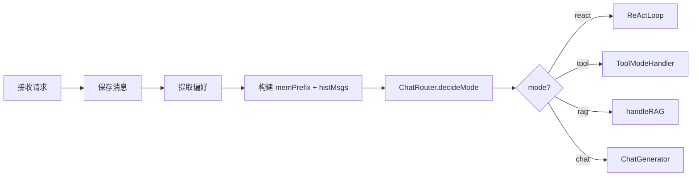
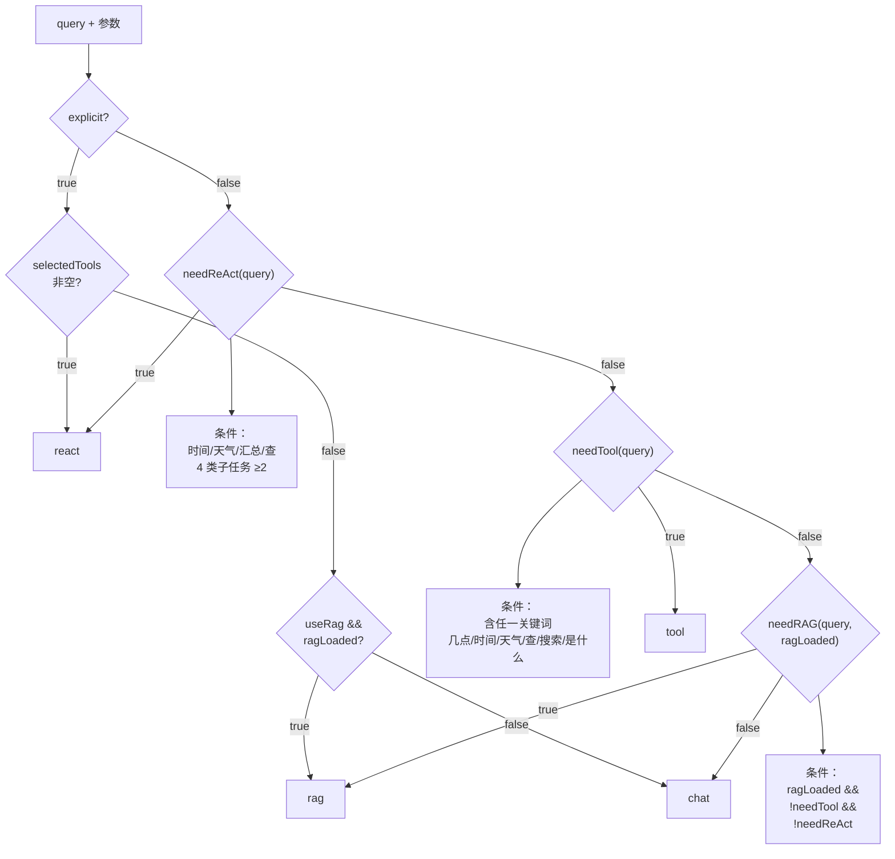

# 12 路由判断 chat / tool / react / rag

## 1. 一句话结论

`ChatRouter.decideMode()` 用**关键词匹配 + 严格优先级**在四种模式中选一个：`react` > `tool` > `rag` > `chat`。explicit 模式（用户显式指定）跳过所有关键词判断。

---

## 2. 它在主链路里的位置

路由判断在**构建完 memPrefix 和 histMsgs 之后、分发到具体 handler 之前**：



**为什么路由判断在这里？** 因为路由之前的所有步骤（保存消息、提取偏好、构建上下文）对所有模式都一样——不管最后走 chat 还是 react，都需要记忆前缀和历史消息。路由是"分岔点"。

---

## 3. 为什么需要它

**AI Agent 有多个能力模式，需要决定当前问题用哪个。**

```text
"你好"             → chat（聊天，不需要工具）
"上海天气怎么样"   → tool（单工具，查天气）
"查天气并给建议"   → react（多工具，先查再搜建议）
"公司福利政策"     → rag（知识库检索）
"帮我查时间"       → tool（单工具，查时间）
```

如果没有路由，要么所有问题都走 chat（失去工具能力），要么所有问题都走 react（即使只需一个工具，杀鸡用牛刀，额外的 planner 调用浪费 token 和延迟）。

**路由的目标：用最合适的模式处理当前问题，不浪费、不漏处理。**

---

## 4. 对应源码位置

| 文件 | 方法 | 作用 |
|---|---|---|
| `ChatRouter.java` | `decideMode` | 主要决策入口 |
| `ChatRouter.java` | `needReAct` | 判断是否需要多工具 |
| `ChatRouter.java` | `needTool` | 判断是否需要单工具 |
| `ChatRouter.java` | `needRAG` | 判断是否需要知识库 |
| `ChatRouter.java` | `needReActFromTools` | 判断显式工具集 |

---

## 5. 先看决策逻辑

### 5.1 决策树

```text
decideMode(query, explicit, useRag, selectedTools, ragLoaded)
    │
    ├── explicit == true ────┬── selectedTools 非空 → "react"
    │                        ├── useRag && ragLoaded → "rag"
    │                        └── 否则 → "chat"
    │
    └── explicit == false ──┬── needReAct → "react"
                             ├── needTool → "tool"
                             ├── needRAG → "rag"
                             └── 兜底 → "chat"
```

### 5.2 完整调用

```java
// UnifiedAgentService 中
boolean explicit = req.getMode() != null;
boolean useRag = Boolean.TRUE.equals(req.getUseRag());

String mode = ChatRouter.decideMode(
    req.getQuery(),        // 用户问题
    explicit,              // 是否显式指定模式
    useRag,                // 是否启用 rag
    req.getSelectedTools(),// 前端选中的工具列表
    rag.isLoaded()         // 知识库是否已加载
);
```

---

## 6. 核心流程图



---

## 7. 源码逐段讲解

原文件：`ChatRouter.java`

### 7.1 decideMode——主入口

```java
public static String decideMode(String query, boolean explicit, boolean useRag,
                                List<String> selectedTools, boolean ragLoaded) {
    if (explicit) {
        if (selectedTools != null && !selectedTools.isEmpty()) return "react";
        if (useRag && ragLoaded) return "rag";
        return "chat";
    }
    if (needReAct(query)) return "react";
    if (needTool(query)) return "tool";
    if (needRAG(query, ragLoaded)) return "rag";
    return "chat";
}
```

**这是整个路由的核心。** 按照严格的优先级链判断，不找最优，只找"第一个匹配的"。

```text
优先级从高到低：
    
    第 1 层：explicit == true
        ↓ 第 1.1 子层：selectedTools 非空 → "react"
        ↓ 第 1.2 子层：useRag && ragLoaded → "rag"
        ↓ 第 1.3 子层：兜底 → "chat"
    
    第 2 层：explicit == false（自动判断）
        ↓ 第 2.1 子层：needReAct → "react"       ← 最高自动优先级
        ↓ 第 2.2 子层：needTool → "tool"
        ↓ 第 2.3 子层：needRAG → "rag"            ← 最低非 chat 优先级
        ↓ 第 2.4 子层：兜底 → "chat"
```

**explicit 分支：** 如果用户（或前端）显式传了 `mode` 参数，跳过所有关键词判断，直接走指定模式。但显式 mode 不是唯一决定因素——如果前端传了 `selectedTools`，即使 mode 没传，也走 react。

---

### 7.2 needTool——单工具触发

```java
public static boolean needTool(String query) {
    String q = query == null ? "" : query.toLowerCase(Locale.ROOT);
    return q.contains("几点") || q.contains("时间")
        || q.contains("天气") || q.contains("查")
        || q.contains("搜索") || q.contains("是什么");
}
```

**什么是 needTool？** 如果 query 包含这 6 个关键词的**任何一个**，就认为需要单工具调用。

**执行演示（4 个例子）：**

```text
例 1："上海天气怎么样"
    q = "上海天气怎么样"
    "几点" → false
    "时间" → false
    "天气" → true ✅ → return true

例 2："现在几点"
    q = "现在几点"
    "几点" → true ✅ → return true

例 3："你好"
    q = "你好"
    全不匹配 → return false

例 4："查一下时间"
    q = "查一下时间"
    "查" → true（"查一下"包含"查"）✅ → return true
```

**这 6 个关键词分别对映什么工具？**

```text
"几点" / "时间" → get_time 工具（获取当前时间/日期）
"天气"         → get_weather 工具（获取天气）
"查"           → 通常是 search/search_web 工具
"搜索"         → search_web 工具
"是什么"       → 知识问答/搜索工具
```

**但 needTool 不直接选工具**——它只返回 true/false，具体选哪个工具由 `ToolService.decide()` 或 `Planner.planGraph()` 负责。

**为什么用 `Locale.ROOT`？** 不同地区 `toLowerCase` 行为不同。土耳其语的 `I.toLowerCase()` 是 `ı` 不是 `i`。用 `Locale.ROOT` 保证跨平台行为一致。

---

### 7.3 needReAct——多子任务触发

```java
public static boolean needReAct(String query) {
    String q = query == null ? "" : query.toLowerCase(Locale.ROOT);
    int count = 0;
    if (q.contains("时间") || q.contains("几点")) count++;
    if (q.contains("天气")) count++;
    if (q.contains("总结") || q.contains("汇总")) count++;
    if (q.contains("查") || q.contains("搜索")) count++;
    return count >= 2;
}
```

**needReAct 和 needTool 有关键词重叠：** `"时间"/"几点"`、`"天气"`、`"查"/"搜索"` 在两者中都出现了。区别在于 needReAct 用"计数 ≥ 2"来判断是否是多子任务。

**执行演示（6 个例子）：**

```text
例 1："查上海天气，并搜索小雨出门建议"
    "时间"/"几点" → 不命中 → count=0
    "天气" → 命中 → count=1
    "总结"/"汇总" → 不命中 → count=1
    "查"/"搜索" → "查"命中 → count=2
    count=2 >= 2 → true ✅ → react

例 2："上海天气怎么样"
    "时间"/"几点" → 不命中 → count=0
    "天气" → 命中 → count=1
    "总结"/"汇总" → 不命中 → count=1
    "查"/"搜索" → 不命中 → count=1
    count=1 < 2 → false ❌

例 3："查天气"
    "天气" → 命中 → count=1
    "查" → 命中 → count=2
    count=2 >= 2 → true ✅ → react
    （虽然只有"查天气"三个字，但触发了两个类别的关键词！）

例 4："总结今天天气并查时间"
    "时间" → 命中 → count=1
    "天气" → 命中 → count=2
    "总结" → 命中 → count=3
    "查" → 命中 → count=4
    count=4 >= 2 → true ✅ → react

例 5："现在几点"
    "时间"/"几点" → 命中 → count=1
    "天气" → 不命中 → count=1
    "总结"/"汇总" → 不命中 → count=1
    "查"/"搜索" → 不命中 → count=1
    count=1 < 2 → false ❌ → needTool 返回 true → tool 模式

例 6："搜索上海天气"
    "天气" → 命中 → count=1
    "搜索" → 命中 → count=2
    count=2 >= 2 → true ✅ → react
```

**例 3 值得注意：** "查天气"只有三个字，但"查"是一类、"天气"是另一类，count=2 触发了 react。但"查天气"实际上只需要一个天气工具——走 react 杀鸡用牛刀了。这是关键词重叠的副作用，当前系统可以接受。

**为什么阈值是 2 不是 1 或 3？**

```text
阈值=1：所有含有关键词的 query 都走 react
    → "上海天气怎么样" 也走 react
    → 本来 tool 就可以，多走了 Planner，浪费 token

阈值=3：需要至少 3 类子任务才触发 react
    → "查天气并搜索建议"（2 类）走 tool，但实际需要 2 个工具
    → 漏处理

阈值=2：在两者之间平衡
    → 2 类及以上提示多工具需求，走 react
    → 1 类及以下走 tool 就够了
```

---

### 7.4 needRAG——知识库触发

```java
public static boolean needRAG(String query, boolean ragLoaded) {
    return ragLoaded && !needTool(query) && !needReAct(query);
}
```

**RAG 优先级最低。** 只有"不是工具问题、不是多工具问题、知识库已加载"时才走 RAG。

**三个条件缺一不可：**

```text
ragLoaded = true
    → 知识库已加载，有文档可查
    → 如果 ragLoaded = false，系统没有知识库，肯定不走 RAG

!needTool(query)
    → 不是单工具问题
    → 如果 needTool 为 true（比如"查天气"），即使有知识库也先走工具
    → 因为工具能直接拿到准确数据，比 RAG 搜索更快更准

!needReAct(query)
    → 不是多工具问题
    → 同上，工具优先级高于 RAG
```

**执行演示：**

```text
例 1：query="公司福利政策"，ragLoaded=true
    needReAct → false
    needTool → false
    needRAG → true && true && true = true ✅ → rag

例 2：query="上海天气"，ragLoaded=true
    needTool → true（命中"天气"）
    needRAG → true && false → false ❌ → tool 模式
    
例 3：query="你好"，ragLoaded=true
    needReAct → false
    needTool → false
    needRAG → true && true && true = true ✅ → rag
    （但"你好"->rag 可能不合理！知识库可能只是公司文档）
```

**例 3 暴露了问题：** 如果 RAG 知识库里是公司文档，"你好"这种问候语不应该走 RAG。更合理的设计是 needRAG 再加一个关键词判断（比如包含"政策"/"文档"/"规定"等时才走 RAG）。当前系统没有做这个限制。

---

### 7.5 needReActFromTools——显式工具集触发

```java
public static boolean needReActFromTools(String query, Map<String, Tool> ts) {
    return ts != null && !ts.isEmpty();
}
```

**这个方法的调用场景：** 当 `decideMode` 走到 `explicit == true && selectedTools != null` 分支时。它不检查 query 内容——只要用户（前端）显式指定了工具，就走 react。

```text
前端传了 selectedTools=["get_weather", "search_web"]
    → needReActFromTools → true
    → mode = "react"
    → 不管 query 是什么

前端没有传 selectedTools（null）
    → needReActFromTools → false
    → 继续判断
```

---

### 7.6 四种模式的完整例子对照

```text
                needTool   needReAct   needRAG   最终 mode
                ────────   ─────────   ──────    ─────────
"你好"             false      false      true*     chat
"上海天气"         true       false      false     tool
"查天气"           true       true       false     react
"查天气并给建议"   true       true       false     react
"公司福利政策"     false      false      true      rag
"现在几点"         true       false      false     tool
"总结今天内容"     false      true       false     react
"搜索 2024 新闻"   true       true       false     react
```

*needRAG 需要 ragLoaded=true，如果知识库没加载，最后也是 chat。

---

## 8. 真实举例：它在流程中怎么运行

### 8.1 普通聊天

```text
query = "你好，帮我介绍一下你自己"
explicit = false
selectedTools = null
ragLoaded = false

needReAct:
    "时间"/"几点" → false
    "天气" → false
    "总结"/"汇总" → false
    "查"/"搜索" → false
    count = 0 < 2 → false

needTool:
    all 6 keywords → false → false

needRAG:
    ragLoaded = false → false

兜底 → "chat"
```

### 8.2 单工具查询

```text
query = "现在几点"
explicit = false
selectedTools = null

needReAct:
    "时间"/"几点" → true → count = 1
    others → false
    count = 1 < 2 → false

needTool:
    "几点" → true → true

mode = "tool"
```

### 8.3 多工具查询

```text
query = "查上海天气并搜索小雨出门建议"
explicit = false

needReAct:
    "天气" → count = 1
    "查" → count = 2
    count = 2 >= 2 → true

mode = "react"
```

### 8.4 显式指定模式

```text
query = "你好"
mode = "tool"  // 前端传了 mode=tool
explicit = true

// 不走任何关键词判断！
selectedTools 为 null → 不返回 react
useRag = false → 不返回 rag
兜底 → "chat"

// 注意：显式指定 mode="tool" 但实际走了 chat！
// 因为 explicit 分支里，mode 参数不影响路由！
// 这是当前代码的一个设计特点：explicit 只检查 selectedTools 和 useRag，
// 不检查 req.getMode() 的值
```

**等等，上面例子的分析似乎有问题。** 让我重新看 `decideMode` 的逻辑：

```java
if (explicit) {
    if (selectedTools != null && !selectedTools.isEmpty()) return "react";
    if (useRag && ragLoaded) return "rag";
    return "chat";
}
```

`explicit` 只表示"前端传了 mode 参数"，但具体传了什么值，decideMode **没有使用**。它只用 `selectedTools` 和 `useRag` 来决定。所以：

```text
前端传 mode="tool" → explicit=true，但如果 selectedTools 和 useRag 都没设 → 走 chat

这确实是个问题：前端显式指定了 tool 模式，但系统还是走了 chat。
```

如果要正确支持显式 mode，需要类似：

```java
if (explicit) {
    switch (req.getMode()) {
        case "react": return "react";
        case "tool": return "tool";
        case "rag": return "rag";
        default: return "chat";
    }
}
```

当前代码没有这样做，所以**显式 mode 的支持是有限的**——更准确的说是"前端通过传 selectedTools 或 useRag 来间接指定模式"。

---

## 9. 用一个完整例子跑一遍

### 9.1 场景：搜索并总结

```text
query = "搜索今天新闻并总结"
explicit = false
ragLoaded = true

路由决策：
① needReAct("搜索今天新闻并总结"):
    "时间"/"几点" → false（"今天"不在关键词中）
    "天气" → false
    "总结"/"汇总" → "总结"命中 → count=1
    "查"/"搜索" → "搜索"命中 → count=2
    count=2 >= 2 → true ✅

② mode = "react"
```

### 9.2 场景：知识库查询

```text
query = "公司年假政策是什么"
explicit = false
ragLoaded = true

路由决策：
① needReAct:
    "时间"/"几点" → false
    "天气" → false
    "总结"/"汇总" → false
    "查"/"搜索" → false
    count=0 < 2 → false

② needTool:
    "几点"/"时间" → false
    "天气" → false
    "查" → false（"年假政策"不包含"查"）
    "搜索" → false
    "是什么" → "是什么"命中 → true

    needTool → true!

③ mode = "tool"（不是 rag！）

因为"是什么"在 needTool 关键词里，即使有知识库，也先走 tool 模式。
```
---

## 10. 关键判断条件

| 判断点 | 条件 | true → | false → |
|---|---|---|---|
| explicit | `req.getMode() != null` | 跳过关键词 | 走关键词判断 |
| selectedTools | `selectedTools != null && !empty` | "react" | 继续 |
| needReAct | count ≥ 2 | "react" | 继续 |
| needTool | 含 6 个关键词任一 | "tool" | 继续 |
| needRAG | ragLoaded && !needTool && !needReAct | "rag" | "chat" |

---

## 11. 容易混淆的点

### 11.1 needTool 和 needReAct 的关键词重叠

| 关键词 | needTool 中 | needReAct 中（归类） |
|---|---|---|
| 时间 | 是 | 第 1 类 |
| 几点 | 是 | 第 1 类 |
| 天气 | 是 | 第 2 类 |
| 查 | 是 | 第 4 类 |
| 搜索 | 是 | 第 4 类 |

这意味着："搜索天气"会同时触发 needTool（"搜索"或"天气"命中）和 needReAct（"天气"+ "搜索" = 2 类）。但由于 needReAct 的判断在 needTool **之前**，所以结果永远是 react，不是 tool。

### 11.2 优先级：react > tool > rag > chat

这是整个路由设计最核心的原则。为什么 react 比 tool 优先级高？

```text
react → 多工具规划，能力最强但最慢
tool  → 单工具，能力中等，速度快
rag   → 知识库检索，能力受限（只能回答知识库里的内容）
chat  → 最简，无工具

优先级顺序 = 能力覆盖从广到窄
```

如果用户需要多工具但走了 tool，会丢失功能（因为 ToolModeHandler 只调用一个工具）。反之，如果只需要单工具但走了 react，只是多了一步 Planner 的调用（浪费一点 token），功能上还能正常工作。

所以设计原则是：**宁可高估不可低估**。

### 11.3 "查天气"为什么走 react

"查"是一类，"天气"是另一类 → count=2 → react。这算是一个"误触发"——"查天气"本质上只需要一个 get_weather 工具。但 react 也能处理单工具场景（Planner 只规划出一个 Node），所以功能上没问题。

### 11.4 RAG 的触发条件

`needRAG` 需要满足三个条件：ragLoaded=true && !needTool && !needReAct。

如果 query 包含"是什么"（命中 needTool），即使有知识库也不会走 RAG。这意味着很多自然问句（"公司政策是什么"）会走 tool 而不是 rag，除非把"是什么"从 needTool 中移除。

---

## 12. 和其他模块的关系

| 模块 | 关系 |
|---|---|
| `ToolModeHandler` | mode="tool" 时调用 |
| `ReActLoop` | mode="react" 时调用 |
| `ChatGenerator` | mode="chat" 时调用 |
| `handleRAG` | mode="rag" 时由 UnifiedAgentService 调用 |
| `ToolService` | needTool=true 但不直接选工具，decide 在 ToolModeHandler 或 Planner 内部 |

---

## 13. 如果要改这个功能，改哪里

| 需求 | 修改位置 | 怎么改 | 风险 |
|---|---|---|---|
| 增加路由关键词 | `needTool` / `needReAct` | 加 contains 判断 | 可能误触发，需要测试 |
| 调整 needReAct 阈值 | `needReAct` 的 count >= 2 | 改成 >= 3 或 >= 1 | 调高漏处理，调低过度触发 |
| 用 LLM 做路由 | 新增方法 `needReActByLLM(query)` | 调一次 LLM 判断是否需要工具 | 多一次 LLM 调用，延迟和成本增加 |
| 支持显式 mode 值 | `decideMode` 的 explicit 分支 | 根据 `req.getMode()` 直接返回 | 要看前端是否传 mode 值 |
| RAG 增加关键词 | `needRAG` 加 `contains` 判断 | 只有包含"政策"等才走 RAG | 非关键词问法不走 RAG |
| needTool 移除"是什么" | `needTool` 去掉 contains("是什么") | RAG 触发率提升 | 一些需要工具的问题可能漏 |

---

## 14. 面试怎么说

完整回答：

```text
ChatRouter 用纯关键词匹配做路由决策，四种模式优先级从高到低：react、tool、rag、chat。

决策链分两层。第一层是 explicit 模式，如果前端传了 mode 参数，跳过所有关键词判断，直接按 selectedTools 和 useRag 决定——有 selectedTools 走 react，有 rag 需求且知识库加载了走 rag，否则 chat。

第二层是自动判断。先用 needReAct 检查是否需要多工具——把关键词分成 4 类（时间/天气/总结/搜索），命中 ≥2 类就走 react。然后用 needTool 检查是否需要单工具——包含 6 个关键词任一就 tool。然后用 needRAG——只有知识库已加载、不是工具问题、不是多工具问题才走 RAG。最后兜底 chat。

needTool 和 needReAct 的关键词有重叠，但 needReAct 的优先级更高，因为多工具降级为单工具会丢失功能，单工具升级为多工具只是多一步 Planner。
```

短版：

```text
路由就是一堆 contains 按优先级排列：先检查 explicit（跳过关键词），再检查 needReAct（计数≥2）、needTool（任一个关键词）、needRAG（ragLoaded && 不是工具），最后 chat。react > tool > rag > chat。
```

---

## 15. 自检题

1. `decideMode` 的四种返回值分别是？优先级顺序是什么？

2. `needReAct("查天气并搜索建议")` 返回什么？count 是多少？

3. `needTool("现在几点了")` 返回什么？触发了哪个关键词？

4. `needRAG("公司政策", true)` 返回什么？需要哪三个条件？

5. `needReAct("查天气")` 为什么返回 true？这合理吗？

6. `needReAct` 和 `needTool` 共享的关键词有哪些？

7. 如果 `explicit = true, selectedTools = null, useRag = false`，最终 mode 是什么？

8. "搜索"这个词在 `needTool` 和 `needReAct` 中分别代表了什么？

9. 为什么 needReAct 的优先级比 needTool 高？

10. 如果需要添加"写邮件"作为新的单工具触发词，需要改哪里？
