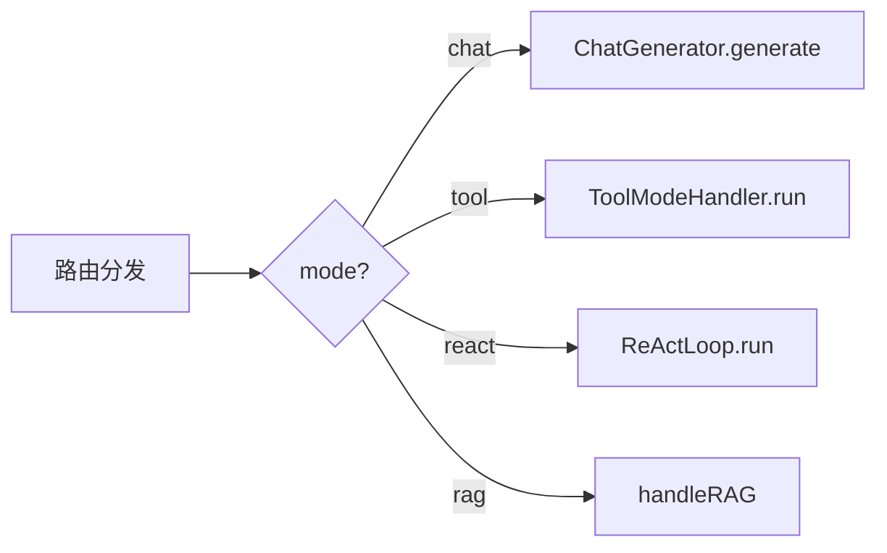
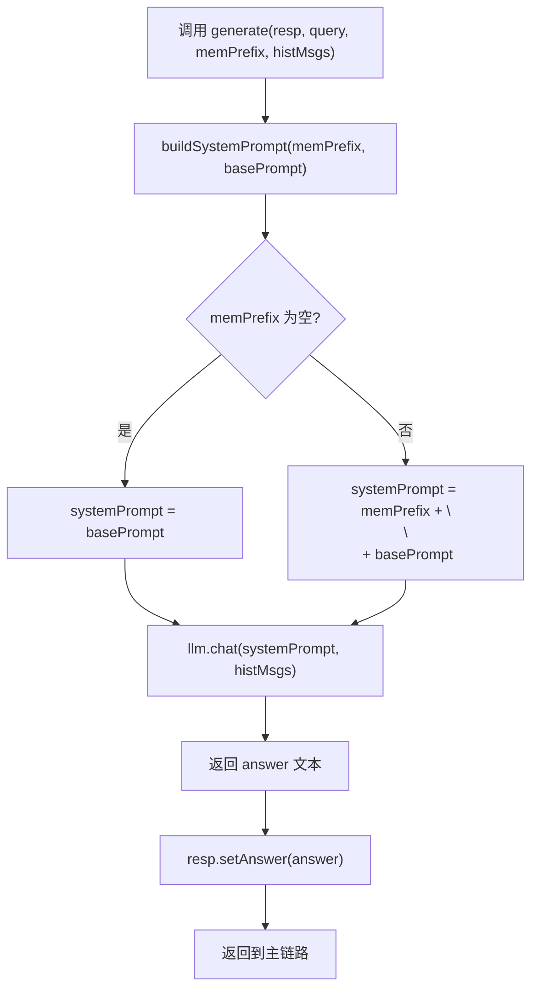

# 13 普通聊天模式 chat

## 1. 一句话结论

Chat 模式是四种模式中最简单的：**直接把 memPrefix（system prompt 前缀）和 histMsgs（对话历史）发给 LLM，模型回答后返回。** 没有工具调用、没有 RAG 检索、没有规划执行。

---

## 2. 它在主链路里的位置

Chat 模式是路由分发的一个分支：



当 `ChatRouter.decideMode()` 返回 `"chat"` 时，主链路调用：

```java
generator.generate(resp, req.getQuery(), memPrefix, histMsgs);
```

---

## 3. 为什么需要它

**聊天的场景是最多的。** 用户可能只是打招呼、问问题、聊天，不需要调用任何工具。

```text
"你好"                 → 不需要工具 → chat
"你是谁"               → 不需要工具 → chat
"今天星期几"           → 不需要工具（和"现在几点"不同，没触发 needTool）
"帮我写一首诗"         → 不需要工具 → chat
"什么是 AI Agent"      → 不需要工具 → chat（没触发"搜索"、"是什么"）
```

如果所有问题都走 tool 或 react，即使不需要工具也会执行不必要的步骤：

```text
"你好" → tool 模式 → ToolService.decide → 找不到匹配工具 → 返回"无法处理"
```

所以 chat 模式是兜底中的兜底——所有不需要工具的场景都走它。

---

## 4. 对应源码位置

| 文件 | 方法 | 作用 |
|---|---|---|
| `ChatGenerator.java` | `generate` | 核心——组装 prompt 并调用 LLM |
| `ChatHistoryAdapter.java` | `buildSystemPrompt` | memPrefix + basePrompt 拼接 |
| `UnifiedAgentService.java` | processStream 中的 switch | 路由分发到 chat 分支 |
| `LlmService.java` | `chat` | 实际调用大模型 API |

---

## 5. 先看对象长什么样

### 5.1 ChatGenerator 的输入

```java
generate(ChatResponse resp, String query, String memPrefix, List<Map<String, String>> histMsgs)
```

**真实数据：**

```java
resp = ChatResponse{query="你好", answer=null, ...}
query = "你好"
memPrefix = "【用户偏好】\n姓名: 小李"
histMsgs = [{"role": "user", "content": "你好"}]
```

### 5.2 ChatGenerator 的输出

`resp.answer` 被设置：

```java
resp.answer = "你好！我是 AI 助手，有什么可以帮你的吗？"
```

---

## 6. 核心流程图



---

## 7. 源码逐段讲解

原文件：`ChatGenerator.java`

### 7.1 类的结构

```java
@Component
public class ChatGenerator {
    private final LlmService llm;

    public ChatGenerator(LlmService llm) {
        this.llm = llm;
    }

    public void generate(ChatResponse resp, String query,
                         String memPrefix, List<Map<String, String>> histMsgs) {
        String sp = ChatHistoryAdapter.buildSystemPrompt(memPrefix,
            "你是一个简洁的AI助手。结合你掌握的用户信息，使回答更个性化。");
        
        resp.setAnswer(llm.chat(sp, histMsgs));
    }
}
```

**@Component：** Spring 注册为单例 Bean，被 `UnifiedAgentService` 注入。

**LlmService llm：** 大模型调用服务。`llm.chat(systemPrompt, histMsgs)` 发送请求到 LLM API（如 OpenAI/Claude），等待返回文本。

**generate 方法：** 只有 3 行代码。这就是 chat 模式的全部逻辑。

---

### 7.2 buildSystemPrompt——拼接 system prompt

```java
String sp = ChatHistoryAdapter.buildSystemPrompt(memPrefix,
    "你是一个简洁的AI助手。结合你掌握的用户信息，使回答更个性化。");
```

**ChatHistoryAdapter.buildSystemPrompt：**

```java
public static String buildSystemPrompt(String memPrefix, String basePrompt) {
    if (memPrefix == null || memPrefix.isEmpty()) return basePrompt;
    return memPrefix + "\n\n" + basePrompt;
}
```

**不同 memPrefix 下的结果：**

```text
场景 1：memPrefix = "【用户偏好】\n姓名: 小李"
    sp = "【用户偏好】\n姓名: 小李\n\n你是一个简洁的AI助手。结合你掌握的用户信息，使回答更个性化。"

场景 2：memPrefix = ""（空）
    sp = "你是一个简洁的AI助手。结合你掌握的用户信息，使回答更个性化。"

场景 3：memPrefix = "【相关记忆】\n用户正在学习AI"
    sp = "【相关记忆】\n用户正在学习AI\n\n你是一个简洁的AI助手。结合你掌握的用户信息，使回答更个性化。"
```

**basePrompt 是硬编码的中文提示词。** 如果系统部署在英文环境或需要不同的角色设定，这里需要改成配置化。

---

### 7.3 llm.chat——调用大模型

```java
resp.setAnswer(llm.chat(sp, histMsgs));
```

**llm.chat 内部做了什么：**

```text
① 构建 LLM API 请求体：
    {
        "model": "gpt-4",
        "messages": [
            {"role": "system", "content": sp},
            {"role": "user", "content": "你好"},
            ...  // histMsgs 更多消息
        ],
        "temperature": 0.7,
        ...
    }

② 发送 HTTP 请求到 LLM 提供商

③ 等待响应（通常 1-5 秒）

④ 解析返回的 JSON，提取 content 字段

⑤ 返回字符串："你好！我是 AI 助手..."
```

**这里的 `llm.chat` 是同步阻塞调用。** 主线程会卡住直到 LLM 返回。在 processStream 的流式版本中，chat 模式也没有流式推送——它是干脆利落地"请求→等待→返回"。

**同步 vs 流式：**

```java
// 当前 chat 模式：
resp.setAnswer(llm.chat(sp, histMsgs));
// → 整个请求线程等待 LLM 返回后，才执行后续步骤

// 如果想流式输出，需要改成：
llm.chatStream(sp, histMsgs, (token) -> {
    resp.appendAnswer(token);
    onEvent.accept(new StreamEvent("answer", token));
});
```

当前代码没有对 chat 模式做流式——只在 react 模式做流式。因为 chat 模式的回答通常是短文本，一次性返回的体验就够了。

---

### 7.4 异常处理

当前代码没有对 `llm.chat` 的异常做 try-catch：

```java
resp.setAnswer(llm.chat(sp, histMsgs));
```

如果 LLM API 调用失败（网络超时、API key 过期、模型负载过高），`llm.chat` 会抛异常，导致当前请求失败。但 `UnifiedAgentService.processStream` 的调用方（`ChatApplicationService`）应该有一层全局异常处理，捕获后返回错误信息给前端。

**如果加异常处理，应该是：**

```java
public void generate(ChatResponse resp, String query,
                     String memPrefix, List<Map<String, String>> histMsgs) {
    try {
        String sp = ChatHistoryAdapter.buildSystemPrompt(memPrefix, basePrompt);
        resp.setAnswer(llm.chat(sp, histMsgs));
    } catch (Exception e) {
        resp.setAnswer("抱歉，我暂时无法回答这个问题。");
        log.error("Chat generation failed", e);
    }
}
```

但当前代码没有这样做，这意味着 LLM 调用失败时，错误会一直抛到最外层。

---

## 8. 真实举例：它在流程中怎么运行

### 8.1 普通问候（无偏好、无长期记忆）

```text
query = "你好"
memPrefix = ""（新用户）
histMsgs = [{"role": "user", "content": "你好"}]

调用流程：
① buildSystemPrompt("", "你是一个简洁的AI助手...")
    → sp = "你是一个简洁的AI助手。结合你掌握的用户信息，使回答更个性化。"

② llm.chat(sp, histMsgs)
    → 发送给 LLM：

    system: "你是一个简洁的AI助手。结合你掌握的用户信息，使回答更个性化。"
    messages: [{"role": "user", "content": "你好"}]

    → LLM 返回："你好！有什么可以帮你的吗？"

③ resp.setAnswer("你好！有什么可以帮你的吗？")
```

### 8.2 有用户偏好的问候

```text
query = "推荐一下学习资源"
memPrefix = "【用户偏好】\n姓名: 小李\n领域: 编程"
histMsgs = [
    {"role": "user", "content": "你好"},
    {"role": "assistant", "content": "你好！"},
    {"role": "user", "content": "推荐一下学习资源"}
]

调用流程：
① buildSystemPrompt(memPrefix, basePrompt)
    → sp = "【用户偏好】\n姓名: 小李\n领域: 编程\n\n你是一个简洁的AI助手。结合你掌握的用户信息，使回答更个性化。"

② llm.chat(sp, histMsgs):
    system: "【用户偏好】\n姓名: 小李\n领域: 编程\n\n你是一个简洁的AI助手。..."
    messages: 三轮对话历史

    LLM 看到用户叫小李、编程领域 → 回答编程学习资源推荐

③ resp.setAnswer("小李你好！针对编程领域，推荐以下学习资源...")
```

### 8.3 有长期记忆召回

```text
query = "我之前学到哪了"
memPrefix = "【相关记忆】\n用户正在学习 AI Agent 工具调用系统\n用户上次学到 Planner"
histMsgs = [{"role": "user", "content": "我之前学到哪了"}]

LLM 响应：
    system 里有"用户正在学习AI Agent"和"用户上次学到Planner"
    → 回答："你之前在学习 AI Agent 的工具调用系统，上次学到了 Planner 的部分。"
```

---

## 9. 用一个完整例子跑一遍

### 9.1 初始状态

```text
用户：你好（第 1 轮对话）
短期记忆：空
偏好：空
长期记忆：空
路由结果：chat
```

### 9.2 执行 chat 模式

```java
// UnifiedAgentService 中
stm.add("user", "你好");

String memPrefix = buildMemorySystemPrefixWithCtx("你好");
// pref.buildContext() → ""
// ltm.recall("你好", 5, emb) → []
// memPrefix = ""

List<Map<String, String>> histMsgs = ChatHistoryAdapter.buildHistory(stm, "你好");
// histMsgs = [{"role": "user", "content": "你好"}]

// 路由分发 → "chat"
generator.generate(resp, "你好", "", histMsgs);
```

### 9.3 进入 ChatGenerator.generate

```java
// buildSystemPrompt
sp = "" + "\n\n" + "你是一个简洁的AI助手..."
// 因为 memPrefix 为空 → 直接返回 basePrompt
sp = "你是一个简洁的AI助手。结合你掌握的用户信息，使回答更个性化。"

// llm.chat
llm.chat(sp, histMsgs)
// 实际 HTTP 请求体：
// {
//   "model": "gpt-4",
//   "messages": [
//     {"role": "system", "content": "你是一个简洁的AI助手。结合你掌握的用户信息，使回答更个性化。"},
//     {"role": "user", "content": "你好"}
//   ]
// }
// LLM 返回："你好！很高兴为你服务。"
```

### 9.4 回到主链路

```java
resp.setAnswer("你好！很高兴为你服务。");
// resp.answer = "你好！很高兴为你服务。"
// resp.mode = "chat"

stm.add("assistant", "你好！很高兴为你服务。");
// 短期记忆现在有 2 条
```

---

## 10. 关键判断条件

| 判断点 | 条件 | true → | false → |
|---|---|---|---|
| memPrefix 是否为空 | `memPrefix == null \|\| isEmpty()` | sp = basePrompt | sp = memPrefix + basePrompt |
| 路由到 chat 的条件 | `!needReAct && !needTool && !needRAG` | chat 模式 | 其他模式 |
| llm.chat 是否成功 | 无异常（当前无 try-catch） | resp.answer = 正常回答 | 抛异常（无降级） |

---

## 11. 容易混淆的点

### 11.1 chat 模式也有 memPrefix

虽然 chat 模式没有工具调用，但它仍然有 `memPrefix`。偏好和长期记忆召回的结果会进入 system prompt，让回答更个性化。

```text
chat 模式 ≠ 无记忆的对话
chat 模式 = 有记忆背景但无工具调用的纯对话
```

### 11.2 chat 模式不走 stream

`ChatGenerator.generate` 不接收 `onEvent` 参数，所以不会流式推送事件。前端在 chat 模式下只能等全部回答完成后一次性收到。

但 `ReActLoop.runStream` 有流式推送。所以 react 模式下的"LLM 合成"阶段是流式的。

### 11.3 basePrompt 是硬编码的

```java
"你是一个简洁的AI助手。结合你掌握的用户信息，使回答更个性化。"
```

这个 prompt 直接写在代码里。如果要改成英文、更活泼的风格、或特定角色（"你是客服助手"、"你是技术顾问"），需要改源码。

### 11.4 chat 模式也可能使用工具结果

不——chat 模式**不会调用任何工具**。如果有工具结果需要总结，那是 tool 或 react 模式的事。chat 模式只做纯文本对话。

---

## 12. 和其他模块的关系

| 模块 | 关系 |
|---|---|
| `ChatHistoryAdapter.buildSystemPrompt` | 拼接 memPrefix 和 basePrompt |
| `PreferenceMemory` | memPrefix 的来源之一 |
| `LongTermMemory` / `GraphMemory` | memPrefix 的另一个来源 |
| `LlmService.chat` | 实际调用 LLM API |
| `ChatRouter.decideMode` | 决定是否走 chat 模式 |

---

## 13. 如果要改这个功能，改哪里

| 需求 | 修改位置 | 怎么改 | 风险 |
|---|---|---|---|
| 修改基础系统提示词 | `ChatGenerator.generate` 的 basePrompt 参数 | 改成从配置读取或模板 | 需要管理多个环境的提示词 |
| chat 模式也流式输出 | `ChatGenerator` 接收 `Consumer<StreamEvent>` | llm.chat 改 llm.chatStream | 前端要适配流式消息 |
| 增加 chat 模式的异常降级 | `generate` 加 try-catch | 捕获异常后设置降级回答 | 降级回答可能不合适 |
| chat 模式做特殊处理 | 新增生成逻辑 | 比如调用链式 prompt 或上下文增强 | 让简单模式变复杂 |
| basePrompt 国际化 | 改成 ResourceBundle | 根据用户语言加载不同 prompt | 多语言维护成本 |

---

## 14. 面试怎么说

完整回答：

```text
Chat 模式是四种模式中最简单的。当 ChatRouter 判断 query 不需要工具、不需要 RAG 时，走这个分支。

ChatGenerator.generate 接收 memPrefix 和 histMsgs。它先调用 buildSystemPrompt 把 memPrefix 拼到基础 system prompt 前面——memPrefix 空就直接用 basePrompt。然后调用 llm.chat 把拼好的 system prompt 和 histMsgs 一起发给大模型。返回的文本设置到 resp.answer。

整个过程没有工具调用、没有 RAG 检索、没有规划执行。是主链路中最快的分支，通常只依赖一次 LLM 调用。但如果 basePrompt 硬编码了中文，切换到英文环境时需要改源码。
```

短版：

```text
Chat 模式就是纯文本对话：buildSystemPrompt 拼 memPrefix + basePrompt 作为 system prompt，histMsgs 作为 messages，一次 LLM 调用返回回答。没有工具、没有 RAG、没有规划。
```

---

## 15. 自检题

1. ChatGenerator.generate 接收哪几个参数？

2. buildSystemPrompt 的拼接规则是什么？memPrefix 为空时返回什么？

3. chat 模式有没有 memPrefix？如果有，memPrefix 从哪来？

4. chat 模式会不会调用工具？

5. chat 模式和 tool 模式的核心区别是什么？

6. 如果 llm.chat 调用失败，当前代码会怎么处理？

7. 为什么 chat 模式不做流式输出？

8. chat 模式是同步还是异步？主线程会等 LLM 返回吗？

9. basePrompt 在哪里定义？是硬编码还是配置化？

10. 什么情况下路由会走到 chat 模式？列举三种典型场景。
