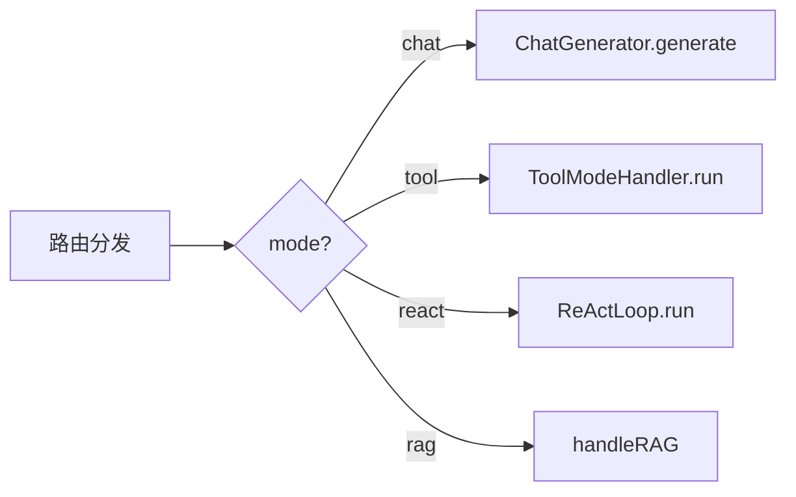
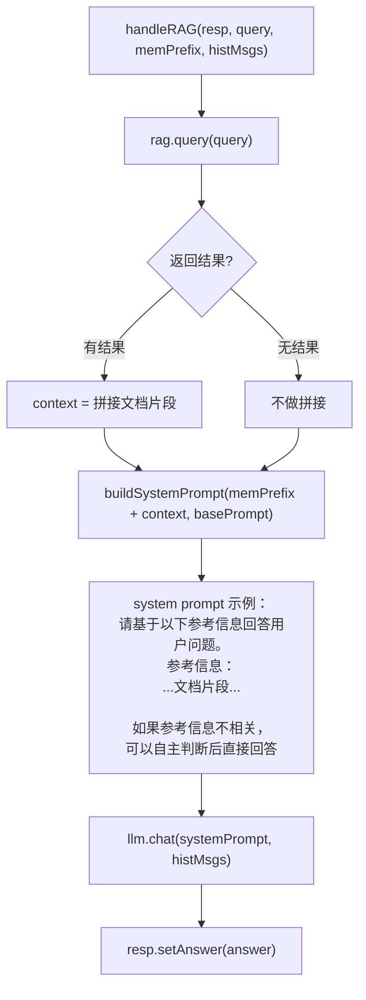

# 14 RAG 模式

## 1. 一句话结论

RAG（Retrieval-Augmented Generation）模式是：**从知识库中检索相关文档片段 → 把片段作为上下文 → 引导 LLM 基于这些片段回答问题**。如果知识库没有相关内容，LLM 也可以自主判断后直接回答。

---

## 2. 它在主链路里的位置

RAG 模式是路由分发的一个分支，优先级低于 tool 和 react：



主链路中调用：

```java
case "rag" -> handleRAG(resp, req.getQuery(), memPrefix, histMsgs);
```

---

## 3. 为什么需要它

**LLM 的知识有截止日期，而且不包含私有文档。** 例如：

```text
用户问：公司年假政策是什么？
    → 大模型训练数据里没有公司的内部文档
    → 即使有，可能是过时的版本
    → 答不上来，或者瞎编

RAG 方案：
    → 从公司内部知识库检索相关文档
    → 把文档片段作为参考上下文
    → LLM 基于这些片段回答 → 准确、可靠
```

**RAG 和 tool 模式的区别：**

```text
tool 模式 → 调用外部 API（天气API、时间API、搜索引擎）→ 获取结构化数据
rag 模式 → 检索内部知识库（文档库、规章制度、产品手册）→ 获取文本段落
```

---

## 4. 对应源码位置

| 文件 | 方法 | 作用 |
|---|---|---|
| `UnifiedAgentService.java` | `handleRAG` | RAG 模式入口 |
| `RagService.java` | `query` | 知识库检索 |
| `RagService.java` | `isLoaded` | 检查知识库是否已加载 |
| `ChatHistoryAdapter.java` | `buildSystemPrompt` | 拼接 memPrefix |

---

## 5. 先看对象长什么样

### 5.1 handleRAG 的输入

```java
handleRAG(ChatResponse resp, String query, String memPrefix,
          List<Map<String, String>> histMsgs)
```

**真实数据：**

```java
resp = ChatResponse{query="公司年假政策是什么", ...}
query = "公司年假政策是什么"
memPrefix = "【用户偏好】\n姓名: 小李"
histMsgs = [{"role": "user", "content": "公司年假政策是什么"}]
```

### 5.2 RAG 检索结果

```java
rag.query("公司年假政策是什么")
// 返回 List<String> 或一段文本：
→ [
    "年假政策：正式员工每年享有15天带薪年假。服务满5年增加至20天。",
    "年假申请需提前一周提交，经主管审批后方可执行。"
  ]
```

### 5.3 RAG 知识库加载状态

```java
rag.isLoaded() → true / false
```

---

## 6. 核心流程图



---

## 7. 源码逐段讲解

原文件：`UnifiedAgentService.java`

### 7.1 handleRAG 完整方法

```java
private void handleRAG(ChatResponse resp, String query, String memPrefix,
                       List<Map<String, String>> histMsgs) {
    // Step 1: 检索 RAG 知识库
    String context = rag.query(query);
    
    // Step 2: 构建 system prompt（含上下文）
    String basePrompt = "你是一个专业的AI助手。";
    if (context != null && !context.isEmpty()) {
        basePrompt = "请基于以下参考信息来回答用户问题。如果参考信息不相关或不足以回答，你可以根据自己的知识来回答。\n\n参考信息：\n"
                     + context + "\n\n" + basePrompt;
    }
    
    String sp = ChatHistoryAdapter.buildSystemPrompt(memPrefix, basePrompt);
    
    // Step 3: 调用 LLM
    resp.setAnswer(llm.chat(sp, histMsgs));
}
```

---

### 7.2 Step 1：检索知识库

```java
String context = rag.query(query);
```

**rag.query 内部流程：**

```text
① 对 query 做 embedding（向量化）
② 在知识库的向量索引中做相似度搜索
③ 找到最相似的 topK 个文档片段
④ 拼接成一段文本返回
⑤ 如果没找到相关内容，返回空字符串
```

**检索结果示例：**

```text
query = "公司年假政策是什么"

向量搜索过程：
query embedding: [0.23, -0.45, ...]
    ↓ 余弦相似度计算
知识库文档片段1: "年假政策：正式员工每年享有15天带薪年假"  相似度 0.91 ✅
知识库文档片段2: "年假申请需提前一周提交"                    相似度 0.88 ✅
知识库文档片段3: "公司成立于2010年"                         相似度 0.12 ❌
知识库文档片段4: "加班政策：..."                             相似度 0.23 ❌

返回 topK=2:
片段1 + 片段2 → 拼成 context
```

**context 结果：**

```text
"年假政策：正式员工每年享有15天带薪年假。服务满5年增加至20天。
年假申请需提前一周提交，经主管审批后方可执行。"
```

**如果检索不到相关内容：**

```text
rag.query("今天天气怎么样")
→ 知识库里没有天气相关文档 → ""
→ context = null 或 ""
```

---

### 7.3 Step 2：构建含上下文的 system prompt

```java
String basePrompt = "你是一个专业的AI助手。";
if (context != null && !context.isEmpty()) {
    basePrompt = "请基于以下参考信息来回答用户问题。如果参考信息不相关或不足以回答，你可以根据自己的知识来回答。\n\n参考信息：\n"
                 + context + "\n\n" + basePrompt;
}
```

**如果 context 有内容：**

```text
basePrompt = "请基于以下参考信息来回答用户问题。如果参考信息不相关或不足以回答，你可以根据自己的知识来回答。

参考信息：
年假政策：正式员工每年享有15天带薪年假。服务满5年增加至20天。
年假申请需提前一周提交，经主管审批后方可执行。

你是一个专业的AI助手。"
```

**如果 context 为空：**

```text
basePrompt = "你是一个专业的AI助手。"
→ 和普通 chat 模式一样
```

**关键设计：** prompt 中写了"如果参考信息不相关或不足以回答，你可以根据自己的知识来回答"。这是 RAG 系统的典型设计——**防止知识库没有相关内容时 LLM 硬编答案**。它告诉 LLM：如果有参考信息就用，没有或不够就靠你自己。

---

### 7.4 Step 3：拼接 memPrefix 和调用 LLM

```java
String sp = ChatHistoryAdapter.buildSystemPrompt(memPrefix, basePrompt);
resp.setAnswer(llm.chat(sp, histMsgs));
```

**完整 LLM 输入：**

```text
system:
    【用户偏好】
    姓名: 小李
    
    请基于以下参考信息来回答用户问题。如果参考信息不相关或不足以回答，你可以根据自己的知识来回答。
    
    参考信息：
    年假政策：正式员工每年享有15天带薪年假。服务满5年增加至20天。
    年假申请需提前一周提交，经主管审批后方可执行。
    
    你是一个专业的AI助手。

messages:
    [{"role": "user", "content": "公司年假政策是什么"}]
```

**LLM 响应：**

```text
根据公司政策，正式员工每年享有15天带薪年假，服务满5年后增加至20天。
年假需要提前一周提交申请，并经主管审批后才能使用。
小李，如果你还有其他关于年假的问题，可以继续问我。
```

---

## 8. 真实举例：它在流程中怎么运行

### 8.1 知识库有相关内容

```text
query = "公司体检政策是什么"

rag.query("公司体检政策是什么")
→ context = "公司每年为正式员工提供一次免费体检，时间为每年6月。体检项目包括：血常规、心电图、胸透等。"

system prompt = 含参考信息的专业prompt

LLM 基于体检政策文档回答：
"公司每年6月为正式员工提供一次免费体检，包含血常规、心电图、胸透等项目。"
```

### 8.2 知识库无相关内容（LLM 自主回答）

```text
query = "什么是机器学习"

rag.query("什么是机器学习")
→ context = ""（知识库里没有机器学习相关文档）

system prompt = "你是一个专业的AI助手。"（不加参考信息）

LLM 凭自身知识回答：
"机器学习是人工智能的一个分支，通过算法让计算机从数据中学习模式和规律..."
```

### 8.3 知识库有相关内容但用户问的不是知识库的

**注意：** 当前系统 `needRAG` 不检查 query 是否与知识库内容相关。只要 ragLoaded && 不是工具问题，就走 RAG。这意味着：

```text
query = "你好"
ragLoaded = true

路由：needReAct(false) → needTool(false) → needRAG(true) → mode = "rag"

handleRAG("你好", ...)
rag.query("你好") → context = ""（知识库没有"你好"相关文档）

→ 走无上下文的 LLM 调用 → "你好！有什么可以帮你的？"
→ 结果和 chat 模式一样
```

这其实不算问题——只是多了一次 `rag.query()` 的调用（稍微多花点时间），功能上不受影响。

---

## 9. 用一个完整例子跑一遍

### 9.1 初始状态

```text
用户：公司年假政策是什么？
短期记忆：空
偏好：{"姓名": "小李"}
知识库：已加载（包含公司规章制度文档）
路由结果：rag
```

### 9.2 执行

```java
// 主链路
stm.add("user", "公司年假政策是什么");

String memPrefix = buildMemorySystemPrefixWithCtx("公司年假政策是什么");
// pref.buildContext() → "【用户偏好】\n姓名: 小李"
// memPrefix = "【用户偏好】\n姓名: 小李"

histMsgs = [{"role": "user", "content": "公司年假政策是什么"}]

// 路由 → "rag"
handleRAG(resp, "公司年假政策是什么", "【用户偏好】\n姓名: 小李", histMsgs);
```

### 9.3 进入 handleRAG

```java
// Step 1: 检索
String context = rag.query("公司年假政策是什么");
// → "年假政策：正式员工每年享有15天带薪年假。服务满5年增加至20天。\n年假申请需提前一周提交。"

// Step 2: 构建 prompt
String basePrompt = "你是一个专业的AI助手。";
// context 不为空 → 拼接
basePrompt = "请基于以下参考信息来回答用户问题。\n\n参考信息：\n年假政策：正式员工每年享有15天带薪年假。...\n\n你是一个专业的AI助手。";

String sp = ChatHistoryAdapter.buildSystemPrompt(memPrefix, basePrompt);
// sp = "【用户偏好】\n姓名: 小李\n\n请基于以下参考信息...\n\n你是一个专业的AI助手。"

// Step 3: 调用 LLM
resp.setAnswer(llm.chat(sp, histMsgs));
// → "小李你好！根据公司政策，正式员工每年享有15天带薪年假，服务满5年增加至20天。年假需要提前一周申请并经主管审批。"
```

### 9.4 回到主链路

```java
resp.mode = "rag"
resp.answer = "小李你好！根据公司政策..."

stm.add("assistant", "小李你好！根据公司政策...");
// 短期记忆追加
```

---

## 10. 关键判断条件

| 判断点 | 条件 | true → | false → |
|---|---|---|---|
| RAG 路由触发 | `ragLoaded && !needTool && !needReAct` | mode=rag | 继续判断 |
| 是否有检索结果 | `context != null && !context.isEmpty()` | prompt 中加参考信息 | 不加参考信息 |
| LLM 是否基于参考信息回答 | prompt 中的指令 | LLM 优先用参考信息 | LLM 凭自身知识回答 |

---

## 11. 容易混淆的点

### 11.1 RAG 和 tool 的区别

```text
RAG 检索的是内部知识库（文档、规章制度）→ 非结构化文本
Tool 调用的是外部 API（天气、搜索、时间）→ 结构化数据

RAG 的结果直接给 LLM 作为参考上下文
Tool 的结果经过 PreferenceFiller 补参数、execute 执行、LLM 再总结
```

### 11.2 needRAG 的触发条件不受 query 内容影响

needRAG = `ragLoaded && !needTool && !needReAct`。它不检查 query 是否和知识库的内容相关。所以"你好"也可能走 RAG（如果 ragLoaded=true）。这是当前系统的一个简化设计——更精细的做法是再加一层 LLM 或关键词判断。

### 11.3 RAG 和 chat 的区别在 prompt

RAG 的不带参考信息 -> 和 chat 模式几乎一样：
```text
RAG + 无参考信息 → "你是一个专业的AI助手。"
chat 模式       → "你是一个简洁的AI助手。结合你掌握的用户信息，使回答更个性化。"
```

主要区别在 basePrompt 的内容不同。RAG 的 basePrompt 强调"基于参考信息"。而 chat 的 basePrompt 强调"结合你掌握的用户信息"。

### 11.4 RAG 的知识库需要预先加载

`rag.isLoaded()` 检查知识库是否已加载。如果系统刚启动，知识库还没加载完，`ragLoaded=false`，即使有 RAG 需求也走 chat。知识库加载通常是异步的（启动时读取文件/数据库 → 建立向量索引）。

---

## 12. 和其他模块的关系

| 模块 | 关系 |
|---|---|
| `ChatRouter.decideMode` | 决定是否走 RAG 模式 |
| `RagService.query` | 执行知识库检索 |
| `ChatHistoryAdapter.buildSystemPrompt` | 拼接 memPrefix 和 RAG 上下文 |
| `PreferenceMemory` | memPrefix 中含有偏好信息 |
| `LlmService.chat` | 最终调用 LLM 回答 |

---

## 13. 如果要改这个功能，改哪里

| 需求 | 修改位置 | 怎么改 | 风险 |
|---|---|---|---|
| RAG 增加 query 关键词判断 | `needRAG` | 只有包含"政策/文档/规定"等才走 RAG | 非关键词问法不走 RAG |
| 优化检索结果的 context 拼接 | `handleRAG` | 限制 context 长度，加来源引用 | 可能截断关键信息 |
| RAG 结果打不开来源 | 在 RAG 问答中标注哪些信息来自哪些文档 | 修改 prompt，要求 LLM 标注引用 | prompt 变长 |
| RAG 降级到 chat | `handleRAG` 无结果时 | 让 LLM 判断不需要 RAG 时直接回答 | 当前已支持 |
| 更换知识库引擎 | `RagService.query` | 换 embedding + 向量数据库实现 | API 可能变化 |
| RAG 走流式 | `handleRAG` 加 onEvent 参数 | llm.chat → llm.chatStream | 前端要适配 |

---

## 14. 面试怎么说

完整回答：

```text
RAG 模式是四种路由模式之一，专门处理需要从知识库检索信息的问题。当 ChatRouter 判断 query 不是工具问题、不是多工具问题、但知识库已加载时，走 RAG 模式。

handleRAG 方法三步走：第一步，rag.query 从知识库向量索引中检索最相关的文档片段；第二步，如果检索到内容，构建含"参考信息"的 system prompt——告诉 LLM 优先基于参考信息回答，如果参考信息不相关也可以凭自身知识回答；第三步，调用 llm.chat 把含参考信息的 system prompt 和 histMsgs 一起发给 LLM。

RAG 模式和 chat 模式的区别在于 prompt 不同——RAG 模式强调"基于参考信息"，chat 模式强调"结合用户偏好"。RAG 模式和 tool 模式的区别在于：RAG 检索内部知识库的非结构化文本，tool 调用外部 API 获取结构化数据。
```

短版：

```text
RAG 模式从知识库检索相关文档片段，作为参考上下文放入 system prompt，引导 LLM 基于这些片段回答问题。如果知识库没有相关内容，LLM 也可以自主判断后直接回答。
```

---

## 15. 自检题

1. `handleRAG` 的三个主要步骤是什么？

2. `needRAG` 返回 true 需要什么条件？

3. `rag.query(query)` 返回什么？什么时候返回空？

4. RAG 模式的 basePrompt 和 chat 模式的 basePrompt 有什么不同？

5. 如果 RAG 检索不到相关内容，代码会怎么处理？

6. RAG 和 tool 模式的核心区别是什么？

7. 为什么 prompt 中要写"如果参考信息不相关或不足以回答，你可以根据自己的知识来回答"？

8. `rag.isLoaded()` 返回 false 时，needRAG 能返回 true 吗？

9. RAG 模式下，memPrefix 还会进入 system prompt 吗？

10. 如果知识库里没有和 query 相关的文档，但路由走了 RAG，最终的回答质量会受影响吗？
