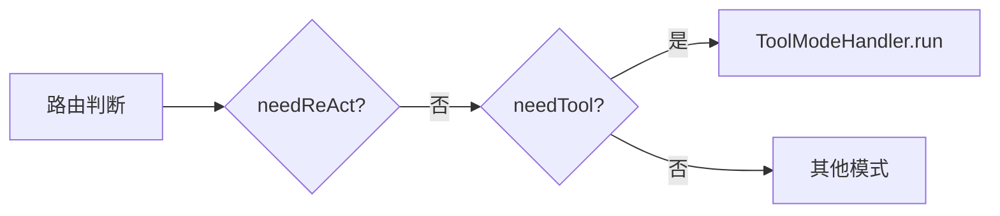
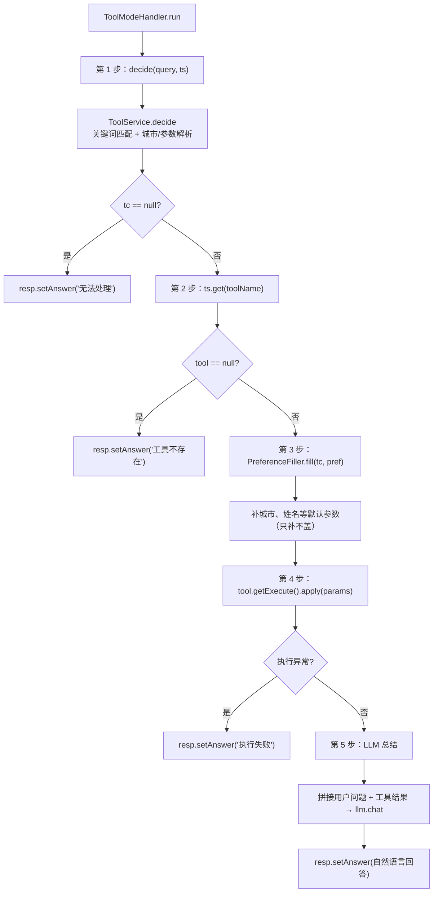

# 15 单工具模式 tool

## 1. 一句话结论

单工具模式走 `ToolModeHandler.run`，**五步直线流程：decide 选一个工具 → 取 Tool 对象 → PreferenceFiller 补缺失参数 → execute 执行 → LLM 把结果翻译成自然语言。** 不规划、不建 DAG，适合意图明确的单一工具调用。

---

## 2. 它在主链路里的位置

主链路路由分发中，tool 是优先级第二高的自动模式（仅次于 react）：



---

## 3. 为什么需要它

**有些问题只需要一个工具，不需要 Planner 规划任务图。**

```text
"上海天气怎么样" → 只需要 get_weather 工具
"现在几点"       → 只需要 get_time 工具
"搜索 AI 新闻"  → 只需要 search_web 工具
```

如果让这些场景走 react，相当于：
1. 多一次 Planner（LLM 调用）来规划任务
2. 多一次 GraphRuntime 的任务管理开销
3. 多几百毫秒 ~ 几秒的额外延迟

**tool 模式比 react 模式快，因为省掉了"规划"这一步。** ToolService.decide 是规则匹配（毫秒级），Planner 是 LLM 调用（秒级）。

---

## 4. 对应源码位置

| 文件 | 方法 | 作用 |
|---|---|---|
| `ToolModeHandler.java` | `run` | 五步核心流程 |
| `ToolService.java` | `decide` | 规则选工具 |
| `PreferenceFiller.java` | `fill` | 补缺失参数 |
| `Tool.java` | `getExecute()` | 获取可执行函数 |

---

## 5. 先看对象长什么样

### 5.1 ToolCallResult —— 工具调用结果对象

```java
public class ToolCallResult {
    private String toolName;      // 工具名，如 "get_weather"
    private Map<String, Object> params;  // 参数，如 {"city": "上海"}
    private String toolResult;    // 执行结果，如 "上海：小雨 20°C"
    private String error;         // 错误信息
    // ...getter/setter...
}
```

### 5.2 Tool —— 工具对象

```java
public class Tool {
    private String name;                    // 工具名
    private String description;             // 描述
    private Map<String, Object> params;     // 参数 schema
    private Function<Map<String, Object>, String> execute;  // 执行函数
    // ...getter/setter...
}
```

**真实工具对象：**

```java
Tool get_weather = new Tool();
get_weather.setName("get_weather");
get_weather.setDescription("获取城市的天气信息");
get_weather.setParams(Map.of(
    "city", Map.of("type", "string", "required", true)
));
get_weather.setExecute((params) -> {
    String city = (String) params.get("city");
    return WEATHER_DB.getOrDefault(city, "未知城市");
});
```

### 5.3 输入输出

**输入：**

```java
run(ChatResponse resp, "上海天气怎么样", ts,
    "【用户偏好】\n姓名: 小李",
    [{"role": "user", "content": "上海天气怎么样"}])
```

**输出（resp 被修改后）：**

```java
resp.answer = "上海今天是小雨，气温20°C，建议带伞。"
resp.mode = "tool"
resp.toolCall = ToolCallResult{
    toolName="get_weather",
    params={"city": "上海"},
    toolResult="上海：小雨 20°C"
}
```

---

## 6. 核心流程图



---

## 7. 源码逐段讲解

原文件：`ToolModeHandler.java`

### 7.1 依赖注入

```java
public class ToolModeHandler {
    private final LlmService llm;
    private final ToolService toolService;
    private final PreferenceMemory pref;

    public ToolModeHandler(LlmService llm, ToolService toolService, PreferenceMemory pref) {
        this.llm = llm;
        this.toolService = toolService;
        this.pref = pref;
    }
```

**三个依赖：**

```text
LlmService → 第 5 步 LLM 总结需要
ToolService → 第 1 步 decide 需要
PreferenceMemory → 第 3 步 fill 需要
```

**为什么用构造器注入而不是 @Autowired？** 构造器注入是 Spring 推荐的方式——依赖在创建时就必须提供，不会在运行时发现 null。而且这个类没有 @Component 注解（可能在其他地方手动创建），所以不能依赖 Spring 自动注入。

---

### 7.2 run 方法——第 1 步：决策

```java
public void run(ChatResponse resp, String query, Map<String, Tool> ts,
                String memPrefix, List<Map<String, String>> histMsgs) {

    // ── 第 1 步：决策 ──
    ToolCallResult tc = toolService.decide(query, ts);
    if (tc == null) {
        resp.setAnswer("我无法处理这个请求。");
        return;
    }
```

**toolService.decide 做了什么？**

```java
// ToolService.java (简化)
public ToolCallResult decide(String query, Map<String, Tool> tools) {
    if (tools == null || tools.isEmpty()) return null;

    // 关键词匹配：遍历所有工具，看 query 是否匹配
    // 比如 query 包含"天气" → 选 get_weather
    // 比如 query 包含"搜索" → 选 search_web
    
    // 同时解析参数：从 query 中提取城市名、人名等
    
    // Fallback：如果都没匹配到，选第一个工具
    for (String name : tools.keySet()) {
        return new ToolCallResult(name, Map.of("query", query));
    }
    return null;
}
```

**"上海天气怎么样"的 decide 执行：**

```text
输入：query="上海天气怎么样", ts={get_weather, get_time, search_web}

① 遍历每个工具，检查 query 是否匹配：
    get_weather："天气"匹配 → 尝试提取城市名
        城市列表 = ["上海", "北京", "广州", "深圳"...]
        query 包含 "上海" → city = "上海"
        return ToolCallResult("get_weather", {"city": "上海"})

② 返回 tc：
    ToolCallResult{
        toolName = "get_weather",
        params = {"city": "上海"},
        toolResult = null  （还没执行）
    }
```

**"搜索 AI 新闻"的 decide 执行：**

```text
输入：query="搜索 AI 新闻"

① 遍历工具：
    search_web："搜索"匹配 → query 中没有特定城市/人名
    params = {"query": "AI 新闻"}（把整个 query 作为搜索词）
    return ToolCallResult("search_web", {"query": "AI 新闻"})
```

**如果 ts 为空（没有可用工具）：**

```text
tools = {}（空 Map）
decide 遍历时没有工具 → fallback 遍历也没有 → return null

run 中 tc == null → resp.setAnswer("我无法处理这个请求。")
→ 直接返回，不走后续步骤
```

---

### 7.3 第 2 步：取 Tool 对象

```java
// ── 第 2 步：取工具 ──
Tool tool = ts.get(tc.getToolName());
if (tool == null) {
    resp.setAnswer("工具 " + tc.getToolName() + " 不存在");
    resp.setToolCall(tc);
    return;
}
```

**"上海天气怎么样"的执行：**

```text
tc.getToolName() = "get_weather"
ts.get("get_weather")
    → 从 Map 中取出之前注册的 get_weather 工具
    → Tool{name="get_weather", execute=天气Lambda}
```

**如果 decide 返回的 toolName 在 ts 里找不到：**

正常情况下不会，因为 decide 内部已经检查了 `tools.containsKey(name)`。但防御性编程——万一并发删除或其他 bug 导致不一致，这里兜底。

**ts.get 的复杂度：** HashMap 的 get 是 O(1)，毫秒级完成。

---

### 7.4 第 3 步：补参数

```java
// ── 第 3 步：补参数 ──
PreferenceFiller.fill(tc, pref);
```

**PreferenceFiller.fill 做了什么？**

```java
// PreferenceFiller.java (简化)
public static void fill(ToolCallResult tc, PreferenceMemory pref) {
    Map<String, Object> params = tc.getParams();
    Map<String, String> prefData = pref.getData();

    // 遍历工具的每个参数，如果缺失则用偏好补
    // 偏好中的 key 和参数名匹配则补上
    for (String paramName : getRequiredParams(tc.getToolName())) {
        if (params.get(paramName) == null && prefData.containsKey(paramName)) {
            params.put(paramName, prefData.get(paramName));
        }
    }
}
```

**"上海天气怎么样"的执行：**

```text
tc.params = {"city": "上海"}  ← decide 已经解析出来了
pref.data = {"姓名": "小李", "城市": "上海"}

fill 遍历 get_weather 的必需参数：
    "city": params 中已有 "city"="上海" → 不覆盖
    "location": 不匹配 get_weather 的参数 → 跳过

结果：tc.params 不变，仍然是 {"city": "上海"}
```

**另一个例子："帮我查天气"（没有指定城市）：**

```text
query = "帮我查天气"
decide 返回：
    tc = ToolCallResult("get_weather", {})  ← params 为空

pref.data = {"姓名": "小李", "城市": "上海"}

fill 遍历：
    "city": params 中无 "city"，pref.data 有 "城市"
        → 注意 key 不完全匹配！"城市" vs "city"
        → 如果代码是 HashMap.get("city")，这里不会补上！
```

**这里有个潜在问题：** 偏好中的 key 是中文"城市"，而工具参数名是英文"city"。如果 fill 代码是按工具参数名去偏好中查找：

```java
params.put(paramName, prefData.get(paramName));
// paramName = "city"
// prefData.get("city") → null（因为 prefData 里是"城市"→"上海"）
// 所以补不上！
```

这就是为什么实际代码中需要一个"参数名映射表"或者更智能的匹配逻辑。但当前简化版本可能确实存在这个问题。

**"只补不盖"原则：**

```java
// 如果 params 已有该参数 → 不覆盖
// 如果 params 没有该参数 → 从偏好中取（如果偏好有的话）
if (params.get(paramName) == null && prefData.containsKey(paramName)) {
    params.put(paramName, prefData.get(paramName));
}
```

这个设计很重要：**用户明确说了"北京"，就不要用偏好里的"上海"覆盖。**

---

### 7.5 第 4 步：执行工具

```java
// ── 第 4 步：执行工具 ──
try {
    String result = tool.getExecute().apply(tc.getParams());
    tc.setToolResult(result);
} catch (Exception e) {
    resp.setAnswer("工具执行失败: " + e.getMessage());
    resp.setToolCall(tc);
    return;
}
```

**tool.getExecute().apply(params) 的执行链：**

```text
① tool.getExecute()
    → 取出 execute 字段
    → 它是在注册工具时设置的 Function<Map<String, Object>, String>
    → 例如 get_weather 注册时写了：
        tool.setExecute((params) -> {
            String city = (String) params.get("city");
            return WEATHER_DB.get(city);
        });

② .apply(tc.getParams())
    → 调用函数的 apply 方法
    → 传入 {"city": "上海"}
    → 函数体执行

③ 函数体执行（以 get_weather 为例）：
    city = params.get("city") → "上海"
    data = WEATHER_DB.get("上海") → "小雨 20°C"
    return "上海：小雨 20°C"

④ tc.setToolResult("上海：小雨 20°C")
    → 结果写回 ToolCallResult
```

**如果执行异常：**

```java
// 比如工具内部抛了 NullPointerException（params 没有 city 字段）
try {
    String result = tool.getExecute().apply(tc.getParams());
    // → 抛异常
} catch (Exception e) {
    resp.setAnswer("工具执行失败: NullPointerException...");
    resp.setToolCall(tc);  // 把 tc 写入 resp，前端可以看参数
    return;  // 不继续 LLM 总结了
}
```

**异常为什么不走 LLM 总结？** 工具执行失败时，没有有效的工具结果可以总结。继续调 LLM 只会让 LLM 瞎编一个回答。所以直接返回错误信息，让用户知道工具调用出问题了。

---

### 7.6 第 5 步：LLM 总结

```java
// ── 第 5 步：LLM 总结 ──
String sp = ChatHistoryAdapter.buildSystemPrompt(memPrefix,
        "你是一个善于综合信息的AI助手。结合你掌握的用户信息，使回答更个性化。");
String userMsg = String.format(
        "用户问：%s\n工具 %s 返回结果：%s\n请根据结果自然地回答用户。",
        query, tc.getToolName(), tc.getToolResult());
resp.setAnswer(llm.chat(sp, List.of(Map.of("role", "user", "content", userMsg))));
resp.setToolCall(tc);
```

**这里发生了什么？** 把工具返回的原始数据拼成一个"用户问题 + 工具结果"的文本，交给 LLM 做自然语言生成。

**"上海天气怎么样"的 LLM 总结：**

```text
system prompt:
    【用户偏好】
    姓名: 小李
    
    你是一个善于综合信息的AI助手。结合你掌握的用户信息，使回答更个性化。

user message:
    用户问：上海天气怎么样
    工具 get_weather 返回结果：上海：小雨 20°C
    请根据结果自然地回答用户。

LLM 响应：
    "上海今天是小雨天气，气温大约20°C。出门建议携带雨具。希望这个信息对你有帮助，小李！"
```

**注意这里传入的 histMsgs 不是原始对话历史，而是一条拼出来的消息：**

```java
List.of(Map.of("role", "user", "content", userMsg))
```

即 `histMsgs` 参数没有被使用，而是重新构建了一条消息。为什么？因为 `run` 方法接收的 `histMsgs` 是**主链路传递的原始对话历史**。但在 LLM 总结这一步，给 LLM 看"用户第 1 轮说了什么、第 2 轮说了什么"是多余的。LLM 只需要知道"当前用户问了什么，工具返回了什么"。

**为什么要经过 LLM 这一步？不能直接返回工具结果吗？**

```text
直接返回："上海：小雨 20°C"
    → 太生硬，用户看到的是原始数据

经过 LLM：
    → "上海今天是小雨天气，气温大约20°C。出门建议携带雨具。"
    → 自然语言，用户体验好
    → 而且可以结合用户偏好调整风格

如果用户偏好是"简短回答"：
    → LLM 可能回答："上海：小雨，20°C"
    
如果用户偏好是"详细回答"：
    → LLM 可能回答："根据最新的气象数据，上海今天以小雨为主..."
```

---

## 8. 真实举例：它在流程中怎么运行

### 8.1 查询天气

```text
query = "上海天气怎么样"
ts = {get_weather, get_time, search_web}
pref.data = {"姓名": "小李", "城市": "上海"}

第 1 步：decide
    匹配 "天气" → 选 get_weather
    提取城市 → "上海"
    tc = ToolCallResult("get_weather", {"city": "上海"})

第 2 步：取工具
    ts.get("get_weather") → Tool{execute=天气函数}

第 3 步：补参数
    params 已有 "city"="上海" → 不覆盖

第 4 步：执行
    WEATHER_DB.get("上海") → "小雨 20°C"
    tc.toolResult = "上海：小雨 20°C"

第 5 步：LLM 总结
    sp = "【用户偏好】\n姓名: 小李\n\n你是一个善于综合信息的AI助手..."
    userMsg = "用户问：上海天气怎么样\n工具 get_weather 返回结果：上海：小雨 20°C\n请根据结果自然地回答用户。"
    resp.answer = "上海今天是小雨，温度约20°C。建议您出门带伞。"
```

### 8.2 查询时间

```text
query = "现在几点"
ts = {get_time, get_weather, search_web}

第 1 步：decide
    匹配 "几点" → 选 get_time
    不需要额外参数
    tc = ToolCallResult("get_time", {})

第 2 步：取工具 → get_time

第 3 步：补参数 → get_time 不需要参数，params 空 → 不补

第 4 步：执行
    LocalTime.now() → "14:35"
    tc.toolResult = "当前时间：14:35"

第 5 步：LLM 总结
    resp.answer = "现在是下午2点35分。"
```

### 8.3 带偏好的搜索

```text
query = "搜索今天的 AI 新闻"
pref.data = {"姓名": "小李", "兴趣领域": "科技"}

第 1 步：decide
    匹配 "搜索" → 选 search_web
    params = {"query": "今天的 AI 新闻"}

第 2 步：取工具 → search_web

第 3 步：补参数 → params 已有关键词，不补偏好

第 4 步：执行 → 返回搜索结果

第 5 步：LLM 总结
    sp = "【用户偏好】\n姓名: 小李\n兴趣领域: 科技\n\n..."
    LLM 看到用户兴趣是科技 → 可以针对性地筛选推荐
    resp.answer = "小李你好！今天AI领域有几条重要新闻..."
```

---

## 9. 用一个完整例子跑一遍

### 9.1 初始状态

```text
用户：上海天气怎么样
短期记忆：[{user, "你好"}, {assistant, "你好！"}, {user, "上海天气怎么样"}]
偏好：{"姓名": "小李"}
路由：tool
```

### 9.2 执行

```java
// ToolModeHandler.run 接收
resp = ChatResponse{query="上海天气怎么样", ...}
query = "上海天气怎么样"
ts = {get_weather=Tool{...}, get_time=Tool{...}, search_web=Tool{...}}
memPrefix = "【用户偏好】\n姓名: 小李"
histMsgs = [
    {"role": "user", "content": "你好"},
    {"role": "assistant", "content": "你好！"},
    {"role": "user", "content": "上海天气怎么样"}
]
```

**第 1 步：decide("上海天气怎么样", ts)**

```text
工具遍历：
    get_weather: desc="获取天气"
        query 包含 "天气" → 匹配
        城市列表包含 "上海" → city = "上海"
        返回 ToolCallResult("get_weather", {"city": "上海"})

    get_time: desc="获取时间"
        query 不包含 "几点"/"时间" → 跳过

    search_web: desc="搜索信息"
        query 不包含 "搜索" → 跳过

tc = ToolCallResult("get_weather", {"city": "上海"})
```

**第 2 步：取工具**

```java
Tool tool = ts.get("get_weather");
// tool = Tool{name="get_weather", execute=天气查询函数}
```

**第 3 步：补参数**

```java
PreferenceFiller.fill(tc, pref);
// tc.params = {"city": "上海"}
// pref.data = {"姓名": "小李"}
// "city" 已有值 → 不覆盖
// tc.params 不变
```

**第 4 步：执行**

```java
tool.getExecute().apply({"city": "上海"})
// 内部：WEATHER_DB.get("上海") → "小雨 20°C"
// 返回："上海：小雨 20°C"

tc.setToolResult("上海：小雨 20°C");
```

**第 5 步：LLM 总结**

```java
String sp = "【用户偏好】\n姓名: 小李\n\n你是一个善于综合信息的AI助手。结合你掌握的用户信息，使回答更个性化。";
String userMsg = "用户问：上海天气怎么样\n工具 get_weather 返回结果：上海：小雨 20°C\n请根据结果自然地回答用户。";

resp.setAnswer(llm.chat(sp, [{"role": "user", "content": userMsg}]));
// llm.chat 返回："上海今天小雨，温度20°C。建议你出门带伞，小李！"

resp.setToolCall(tc);
```

### 9.3 回到主链路

```java
resp.answer = "上海今天小雨，温度20°C。建议你出门带伞，小李！"
resp.mode = "tool"
resp.toolCall = ToolCallResult{toolName="get_weather", params={"city":"上海"}, toolResult="上海：小雨 20°C"}

stm.add("assistant", "上海今天小雨，温度20°C。建议你出门带伞，小李！");
```

---

## 10. 关键判断条件

| 判断点 | 条件 | true → | false → |
|---|---|---|---|
| decide 结果 | `tc == null` | 返回"无法处理" | 继续 |
| 工具是否存在 | `ts.get(toolName) == null` | 返回"工具不存在" | 继续 |
| 参数缺失 | `params.get(paramName) == null && prefData.containsKey(paramName)` | 用偏好补 | 不补 |
| 工具异常 | `catch (Exception e)` | 返回"执行失败" | 继续 LLM 总结 |
| 最终回答 | LLM.chat 返回 | 设置 resp.answer | 不设置（异常已退出） |

---

## 11. 容易混淆的点

### 11.1 decide 选工具和路由选模式是不同的

`decideMode` 决定走 tool 模式，而 `ToolService.decide` 决定具体调哪个工具。一个是"要不要调工具"，一个是"调哪个工具"。

### 11.2 参数的"补"和"盖"

PreferenceFiller.fill 只补不盖：如果 params 已有该参数，跳过；如果 params 没有但偏好里有，用偏好补。

```text
用户说了上海 + 偏好存了上海 → params 已有 city=上海 → 不补（结果一样）
用户说了北京 + 偏好存了上海 → params 已有 city=北京 → 不补（保留北京）
用户没说话 + 偏好存了上海 → params 空 → 用偏好的上海补
```

### 11.3 最终的 LLM 总结不使用传入的 histMsgs

`run` 方法接收了 `histMsgs`，但在第 5 步没有使用。它自己构造了一条 user message：

```java
String.format("用户问：%s\n工具 %s 返回结果：%s\n请根据结果自然地回答用户。",
    query, tc.getToolName(), tc.getToolResult());
```

所以即使 `histMsgs` 中有上几轮的对话历史，LLM 在总结时也看不到。这是一个设计选择：工具调用结果总结不需要对话上下文，只需要"当前用户问题 + 工具返回数据"。

### 11.4 tool 模式不处理"查询参数即问题本身"的情况

```text
query = "帮我查一下"（没有指定查什么）
decide 可能匹配 "查" → 选第一个工具
params = {"query": "帮我查一下"}（把整句作为参数）
执行后返回的结果可能是无意义的
```

ToolService.decide 的规则匹配不能保证"选了正确的工具和正确的参数"。所以 tool 模式适合**意图明确**的问题。意图模糊的问题更适合 react 模式（Planner 会用 LLM 仔细规划）。

---

## 12. 和其他模块的关系

| 模块 | 关系 |
|---|---|
| `ChatRouter.decideMode` | 决定是否走 tool 模式 |
| `ToolService.decide` | 在 tool 模式内部选具体工具 |
| `PreferenceMemory` | 给 PreferenceFiller 提供参数补全数据 |
| `PreferenceFiller` | 补全工具缺失的参数 |
| `Tool`（工具库） | 提供执行函数 |
| `ChatHistoryAdapter.buildSystemPrompt` | 拼 memPrefix + basePrompt |
| `LlmService.chat` | 第 5 步的自然语言生成 |

---

## 13. 如果要改这个功能，改哪里

| 需求 | 修改位置 | 怎么改 | 风险 |
|---|---|---|---|
| 优化工具选择 | `ToolService.decide` | 增加更多匹配规则或用 LLM 判断 | 规则匹配变复杂或延迟增加 |
| 改进参数匹配 | `PreferenceFiller.fill` | 增加参数名映射（中英文/别名） | 映射表维护成本 |
| 使用传入的 histMsgs | `ToolModeHandler.run` 第 5 步 | 把 histMsgs 一起发给 LLM | 可能让 LLM 分心 |
| 增加工具结果后处理 | 第 4 步和第 5 步之间 | 对工具结果做格式化/过滤 | 额外的处理逻辑 |
| 工具超时 | 第 4 步的 try 块 | 加 Future.get(timeout) | 需要线程池管理 |
| 工具出错后重试 | catch 块 | 自动重试一次 | 指数级增加延迟 |

---

## 14. 面试怎么说

完整回答：

```text
ToolModeHandler.run 是单工具调用的五步流程。第一步，ToolService.decide 用关键词匹配决定调哪个工具，同时从 query 中提取参数——比如"上海天气"提取"上海"作为 city 参数。第二步，从工具库 Map 中取出对应的 Tool 对象。第三步，PreferenceFiller.fill 检查工具参数是否缺失——缺失且偏好中有对应值就补上，已有值不覆盖。第四步，tool.getExecute().apply(params) 执行工具函数，返回字符串结果。第五步，把"用户问题 + 工具返回结果"拼成一条 user message，调 LLM 做自然语言总结，把原始数据变成自然语言。

和 react 模式的区别是：tool 模式不做规划，不建任务图，是一条直线流程。适合意图明确、只需要一个工具的问题。
```

短版：

```text
单工具模式五步走：decide 规则选工具、ts.get 取 Tool 对象、PreferenceFiller 补缺失参数、execute 执行工具函数、LLM 把结果翻译成自然语言。不做规划，适合单一工具场景。
```

---

## 15. 自检题

1. ToolModeHandler.run 的五个步骤是什么？请按顺序说出。

2. `toolService.decide` 返回 null 意味着什么？run 方法怎么处理？

3. PreferenceFiller.fill 的"只补不盖"原则是什么？为什么这样设计？

4. `tool.getExecute().apply(tc.getParams())` 具体做了什么？

5. 第 5 步 LLM 总结时，为什么不用 `histMsgs` 参数而是新建 user message？

6. 工具执行抛异常时，为什么直接返回错误信息而不是走 LLM 总结？

7. tool 模式和 react 模式的核心区别是什么？

8. 如果用户说"查天气"（没有指定城市），偏好中存了"城市=上海"，参数回怎么补？

9. `llm.chat(sp, List.of(Map.of(...)))` 中的 `List.of` 创建的是什么？

10. "上海天气怎么样"触发 tool 模式后，resp.mode、resp.toolCall、resp.answer 分别是什么？
