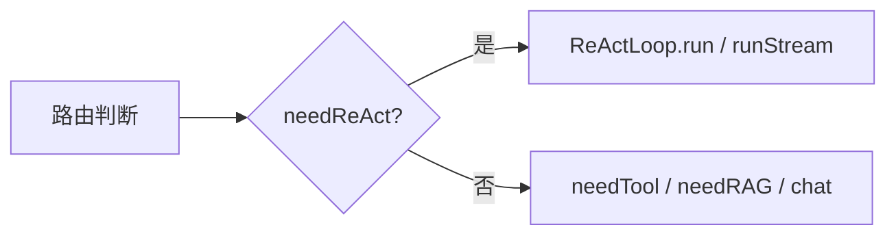
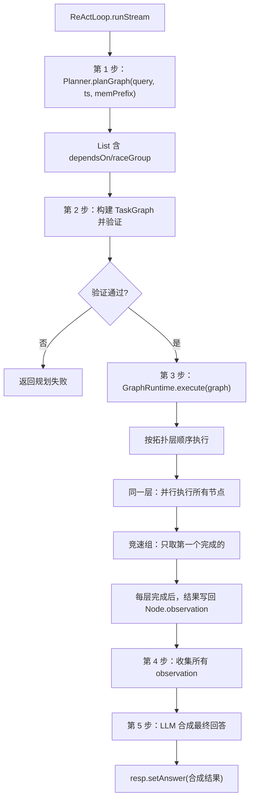
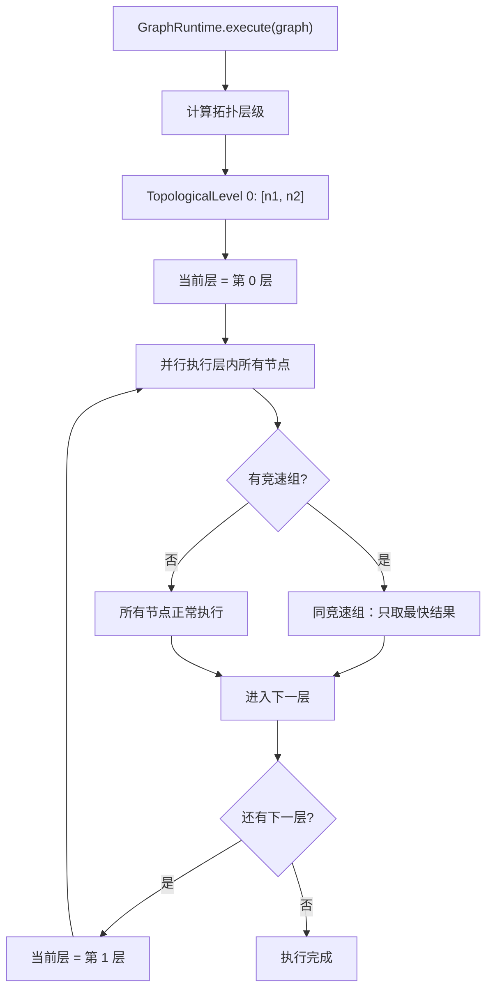

# 16 ReAct 模式

## 1. 一句话结论

ReAct 模式是**最强也最复杂的模式**：`Planner` 用 LLM 把用户问题拆成多个工具调用任务（Node 列表，含依赖关系和竞速组），`GraphRuntime` 按层执行——同一层并行、竞速组内只取第一个完成的——然后 `ReActLoop` 把各工具的执行结果交给 LLM 做最终合成。整个过程通过 SSE 事件流式推送到前端。

---

## 2. 它在主链路里的位置

ReAct 是优先级最高的自动路由模式：



主链路调用：

```java
case "react" -> reactLoop.runStream(resp, query, ts, memPrefix, histMsgs, onEvent);
```

---

## 3. 为什么需要它

**有些问题需要多个工具协作才能完成。** 单工具模式不够用。

```text
例 1："查上海天气并搜索小雨出门建议"
    → 需要 get_weather + search_web 两个工具
    → get_weather 的输出（天气结果）供 search_web 使用

例 2："搜索今天 AI 新闻并总结"
    → 需要 search_web + LLM 两个步骤
    → 搜索结果是总结的输入

例 3："查时间和天气，两个同时查"
    → 需要 get_time + get_weather 两个工具
    → 两个工具没有依赖关系，可以并行执行
```

这些场景如果走单工具模式会漏处理（只调一个工具）。ReAct 模式的规划器和执行器可以处理**多工具、有依赖、可并行、可竞速**的复杂场景。

---

## 4. 对应源码位置

| 文件 | 作用 |
|---|---|
| `ReActLoop.java` | 编排整个 ReAct 流程：规划→执行→合成，循环支持 |
| `Planner.java` | 用 LLM 把 query 拆成 Node 列表 |
| `GraphRuntime.java` | 按层执行 TaskGraph：并行+竞速 |
| `TaskGraph.java` | 节点和边组成的有向无环图 |
| `Node.java` | 一个工具调用任务 |

---

## 5. 先看对象长什么样

### 5.1 Node —— 一个任务节点

```java
public class Node {
    private String id;            // 节点 ID，如 "n1"
    private String toolName;      // 工具名，如 "get_weather"
    private Map<String, Object> params;  // 参数，如 {"city": "上海"}
    private List<String> dependsOn;     // 依赖节点 ID 列表
    private String raceGroup;           // 竞速组，同组只取第一个完成的
    private String observation;         // 执行结果（执行后填充）
}
```

### 5.2 TaskGraph —— 任务图

```java
public class TaskGraph {
    private List<Node> nodes;       // 所有节点
    private List<Edge> edges;       // 依赖边（from → to）
    // 验证：无环、所有 dependsOn 都存在
}
```

### 5.3 一个完整的规划结果

“查上海天气并搜索小雨出门建议”的 Planner 输出：

```java
nodes = [
    Node{id="n1", toolName="get_weather", params={"city": "上海"},
         dependsOn=[], raceGroup=null, observation=null},
    Node{id="n2", toolName="search_web", params={"query": "小雨天气出门建议"},
         dependsOn=["n1"], raceGroup=null, observation=null}
]
```

### 5.4 拓扑层级

```text
n1 (get_weather) → 第 0 层（无依赖，先执行）
n2 (search_web)  → 第 1 层（依赖 n1，等 n1 完成后执行）
```

---

## 6. 核心流程图

### 6.1 ReActLoop 总体流程



### 6.2 GraphRuntime 执行流程



---

## 7. 源码逐段讲解

原文件：`ReActLoop.java`

### 7.1 类的结构

```java
@Component
public class ReActLoop {
    private final Planner planner;
    private final GraphRuntime graphRuntime;
    private final LlmService llm;
    private final ToolService toolService;
```

**四个依赖：**

```text
Planner → 第 1 步：用 LLM 规划任务
GraphRuntime → 第 3 步：执行任务图
LlmService → 第 5 步：合成最终回答
ToolService → 提供工具元数据给 Planner
```

---

### 7.2 runStream 方法——流式版本

```java
public void runStream(ChatResponse resp, String query, Map<String, Tool> ts,
                       String memPrefix, List<Map<String, String>> histMsgs,
                       Consumer<StreamEvent> onEvent) {
```

**参数：**

```text
resp → 响应对象，最终设置 answer
query → 用户问题
ts → 可用工具 Map
memPrefix → 记忆前缀（进入 system prompt）
histMsgs → 对话历史（进入 messages）
onEvent → 流式回调，每一步推送事件给前端
```

---

### 7.3 第 1 步：Planner 规划

```java
// 推送规划开始事件
onEvent.accept(new StreamEvent("mode", "react"));
onEvent.accept(new StreamEvent("thinking", "正在规划任务..."));

// Planner 规划
List<Node> nodes = planner.planGraph(query, ts, memPrefix);
```

**Planner.planGraph 内部做了什么？**

```text
① 构建 LLM prompt：
    "你有以下工具可用：
      - get_weather(city): 获取天气
      - search_web(query): 搜索信息
      
     用户问题：查上海天气并搜索小雨出门建议
     
     请将问题拆解为多个工具调用，注意：
     1. 每个工具调用是一个节点
     2. 如果 B 需要 A 的结果，B 的 dependsOn 包含 A 的 id
     3. 如果 A 和 B 没有依赖关系，可以并行
     4. 如果多个工具可以完成同一目标，设置相同 raceGroup"

② LLM 返回结构化 JSON：
    {
        "nodes": [
            {"id": "n1", "tool": "get_weather", "params": {"city": "上海"},
             "dependsOn": [], "raceGroup": null},
            {"id": "n2", "tool": "search_web", "params": {"query": "小雨天气出门建议"},
             "dependsOn": ["n1"], "raceGroup": null}
        ]
    }

③ 解析 JSON → 创建 Node 对象列表
④ 返回 List<Node>
```

**"上海天气怎么样"的规划（单工具场景也会走到 react）：**

```text
query = "上海天气怎么样"
Planner 分析 → 只需要一个 get_weather 工具

nodes = [
    Node{id="n1", toolName="get_weather", params={"city": "上海"},
         dependsOn=[], raceGroup=null}
]

→ 只有 1 个节点，不需要依赖管理，直接执行
→ 这就是 react 也能处理单工具场景的原因
```

---

### 7.4 第 2 步：构建并验证 TaskGraph

```java
// 推送规划完成事件
String planSummary = nodes.stream()
    .map(n -> n.getToolName() + "(" + n.getParams() + ")")
    .collect(Collectors.joining(", "));
onEvent.accept(new StreamEvent("plan", planSummary));

// 构建 TaskGraph
TaskGraph graph = new TaskGraph(nodes);

// 验证：无环、所有 dependsOn 存在
if (!graph.validate()) {
    onEvent.accept(new StreamEvent("error", "任务图验证失败"));
    resp.setAnswer("规划失败，请重试。");
    return;
}
```

**TaskGraph 内部做了什么？**

```text
① 存储节点列表
② 根据 dependsOn 构建边：
    n2.dependsOn = ["n1"] → edge from n1 to n2
③ 验证：
    - 所有 dependsOn 中的 id 都在 nodes 中存在 → 否则 invalid
    - 无环（拓扑排序能完成） → 否则 invalid
④ 计算层级：
    n1: 无依赖 → level 0
    n2: dependsOn=[n1] → level 1
```

**验证失败举例：**

```text
❌ 无效：dependsOn 指向不存在的节点
    Node{id="n2", dependsOn=["n99"]}  // n99 不存在！
    → validate() 返回 false

❌ 无效：循环依赖
    Node{id="n1", dependsOn=["n2"]}
    Node{id="n2", dependsOn=["n1"]}  // 互相依赖！
    → 拓扑排序失败，validate() 返回 false

✅ 有效：
    Node{id="n1", dependsOn=[]}
    Node{id="n2", dependsOn=["n1"]}
    Node{id="n3", dependsOn=["n1"]}  // n2 和 n3 都依赖 n1，但彼此不依赖
    → 层级：n1=level0, n2=level1, n3=level1
```

---

### 7.5 第 3 步：GraphRuntime 执行

```java
// 执行任务图
graphRuntime.execute(graph, (nodeId, result) -> {
    onEvent.accept(new StreamEvent("tool_result", nodeId + ": " + result));
});
```

**GraphRuntime.execute 的内部流程：**

```java
// GraphRuntime.java (简化)
public void execute(TaskGraph graph, BiConsumer<String, String> onResult) {
    // 第 1 步：按拓扑排序分组
    Map<Integer, List<Node>> levels = topologicalLevels(graph);

    // 第 2 步：按层顺序执行
    for (int level = 0; level < levels.size(); level++) {
        List<Node> currentLevel = levels.get(level);

        // 第 3 步：同一层内并行执行
        // 但竞速组内只取第一个完成的
        Map<String, List<Node>> raceGroups = groupByRace(currentLevel);

        for (List<Node> group : raceGroups.values()) {
            if (group.size() == 1) {
                // 普通节点：正常执行
                executeNode(group.get(0), onResult);
            } else {
                // 竞速组：并发执行，只取最快的结果
                raceExecute(group, onResult);
            }
        }
    }
}

private void executeNode(Node node, BiConsumer<String, String> onResult) {
    // 获取工具
    Tool tool = ts.get(node.getToolName());
    if (tool == null) {
        node.setObservation("工具不存在: " + node.getToolName());
        return;
    }

    // 用偏好补参数
    PreferenceFiller.fill(node, pref);

    // 执行工具
    try {
        String result = tool.getExecute().apply(node.getParams());
        node.setObservation(result);
        onResult.accept(node.getId(), result);
    } catch (Exception e) {
        node.setObservation("执行失败: " + e.getMessage());
    }
}
```

**处理"查上海天气并搜索小雨出门建议"的执行过程：**

```text
拓扑层级：
    Level 0: [n1(get_weather)]
    Level 1: [n2(search_web)]

Level 0 执行：
    → n1: get_weather({"city": "上海"})
    → WEATHER_DB.get("上海") → "小雨 20°C"
    → n1.observation = "上海：小雨 20°C"
    → onEvent("tool_result", "n1: 上海：小雨 20°C")

Level 1 执行：
    → n2: search_web({"query": "小雨天气出门建议"})
    → 搜索引擎返回：建议带雨具、穿防水鞋...
    → n2.observation = "小雨天建议出门携带雨具，穿防水鞋。"
    → onEvent("tool_result", "n2: 小雨天建议出门携带雨具...")
```

**并行执行示例：**

```text
假设 query = "查北京天气和现在几点"
Planner 输出：
    n1: get_weather({"city": "北京"})
    n2: get_time({})
    n1 和 n2 都没有 dependsOn → 可并行

拓扑层级：
    Level 0: [n1(get_weather), n2(get_time)]

执行：
    ← 同时启动两个线程 →
    n1: get_weather("北京") → "晴天 25°C"
    n2: get_time() → "14:35"
    
    两个工具调用没有先后依赖，总耗时 ≈ max(天气耗时, 时间耗时) ≈ 天气耗时
    而不是 天气耗时 + 时间耗时
```

**竞速组示例：**

```text
假设 query = "查上海天气，用多个天气源提高可靠性"
Planner 输出：
    n1: get_weather_a({"city": "上海"})
    n2: get_weather_b({"city": "上海"})
    n1.raceGroup = "weather_race"
    n2.raceGroup = "weather_race"
    两者竞速，谁先返回就用谁的结果

执行：
    ← 同时启动两个线程 →
    n1: 天气源A → 1.5秒后返回 "小雨 20°C"  ← 先完成
    n2: 天气源B → 2.0秒后返回 "小雨 21°C"  ← 被取消（因为 n1 已完成）
    
    最终 observation = n1 返回的 "小雨 20°C"
    n2 的结果被丢弃
```

---

### 7.6 第 4 步：收集结果

```java
// 收集所有 observation
List<String> observations = new ArrayList<>();
for (Node node : graph.getNodes()) {
    if (node.getObservation() != null) {
        observations.add(node.getToolName() + " 返回: " + node.getObservation());
    }
}
```

**"查上海天气并搜索小雨出门建议"的 observation：**

```text
observations = [
    "get_weather 返回: 上海：小雨 20°C",
    "search_web 返回: 小雨天建议出门携带雨具，穿防水鞋。"
]
```

---

### 7.7 第 5 步：LLM 合成

```java
onEvent.accept(new StreamEvent("thinking", "正在综合信息..."));

// 构建合成 prompt
String sp = ChatHistoryAdapter.buildSystemPrompt(memPrefix,
        "你是一个善于综合信息的AI助手。结合你掌握的用户信息，使回答更个性化。");

String userMsg = String.format(
        "用户问题：%s\n\n以下是各工具的执行结果：\n%s\n\n请基于这些结果综合回答用户。",
        query, String.join("\n", observations));

resp.setAnswer(llm.chat(sp, List.of(Map.of("role", "user", "content", userMsg))));

onEvent.accept(new StreamEvent("answer", resp.getAnswer()));
onEvent.accept(new StreamEvent("done", "完成"));
```

**合成 LLM 调用：**

```text
system:
    【用户偏好】
    姓名: 小李
    
    你是一个善于综合信息的AI助手。结合你掌握的用户信息，使回答更个性化。

user:
    用户问题：查上海天气并搜索小雨出门建议
    
    以下是各工具的执行结果：
    get_weather 返回: 上海：小雨 20°C
    search_web 返回: 小雨天建议出门携带雨具，穿防水鞋。
    
    请基于这些结果综合回答用户。

LLM 响应：
    "小李你好！上海今天是小雨天气，气温大约20°C。建议你：
    1. 出门记得带伞
    2. 穿防水鞋或携带备用鞋袜
    3. 雨天路滑，注意出行安全"
```

**和 tool 模式 LLM 总结的区别：**

```text
tool 模式：
    传入的是单个工具的结果：工具 get_weather 返回结果：上海：小雨 20°C

react 模式：
    传入的是多个工具的结果列表：
        get_weather 返回: 上海：小雨 20°C
        search_web 返回: 小雨天建议出门携带雨具...

tool 模式：LLM 只需要将工具结果翻译成自然语言
react 模式：LLM 需要综合多个工具结果，做信息合并和逻辑编排
```

---

### 7.8 非流式版本 run

```java
public void run(ChatResponse resp, String query, Map<String, Tool> ts,
                String memPrefix, List<Map<String, String>> histMsgs) {
    // 和 runStream 同样的逻辑，但没有 onEvent

    List<Node> nodes = planner.planGraph(query, ts, memPrefix);
    TaskGraph graph = new TaskGraph(nodes);
    if (!graph.validate()) {
        resp.setAnswer("规划失败，请重试。");
        return;
    }

    graphRuntime.execute(graph, (nodeId, result) -> {});  // 无事件回调

    // 收集结果 → LLM 合成
    List<String> observations = new ArrayList<>();
    for (Node node : graph.getNodes()) {
        if (node.getObservation() != null) {
            observations.add(node.getToolName() + " 返回: " + node.getObservation());
        }
    }

    String sp = ChatHistoryAdapter.buildSystemPrompt(memPrefix, basePrompt);
    String userMsg = String.format("用户问题：%s\n\n工具执行结果：\n%s\n\n请综合回答。",
            query, String.join("\n", observations));
    resp.setAnswer(llm.chat(sp, List.of(Map.of("role", "user", "content", userMsg))));
}
```

**和 runStream 的唯一区别：**

```text
runStream:
    → 每次事件推送到前端（onEvent）
    → 用户能看到进度：plan → tool_call → tool_result → thinking → answer → done

run:
    → 没有事件推送
    → 用户只能等全部完成后一次性收到结果
    → OnEvent 回调为空操作（(nodeId, result) -> {}）
```

---

## 8. 真实举例：它在流程中怎么运行

### 8.1 两个无关工具并行

```text
query = "查上海天气和现在时间"
Planner 输出：
    n1: get_weather({"city": "上海"})，无依赖
    n2: get_time({})，无依赖

层级：Level 0: [n1, n2]  ← 两个都在同一层

执行：
    ← 并行启动 →
    n1(1.5s) → "上海：小雨 20°C"
    n2(0.1s) → "当前时间：14:35:22"
    
总耗时 ≈ 1.5s（取最慢的）

LLM 合成：
    "上海今天小雨20°C。另外，现在是下午2点35分。"
```

### 8.3 竞速组

```text
query = "用最快方式查北京天气"
Planner 输出：
    n1: get_weather_a({"city": "北京"})，raceGroup="weather_race"
    n2: get_weather_b({"city": "北京"})，raceGroup="weather_race"

执行：
    ← 并行启动两个天气源 →
    n1(0.8s) → "北京：晴 25°C"  ← 先完成
    n2(2.0s) → 被取消

observation = n1 的结果
n2 的结果被忽略

LLM 合成：
    "北京今天晴，25°C。"
```

---

## 9. 用一个完整例子跑一遍

### 9.1 初始状态

```text
用户：查上海天气并搜索小雨出门建议
短期记忆：有 2 轮对话历史
偏好：{"姓名": "小李", "城市": "上海"}
路由结果：react
```

### 9.2 执行全流程

```java
// onEvent 事件流：
// 1. onEvent("mode", "react")
// 2. onEvent("thinking", "正在规划任务...")

// Planner.planGraph
nodes = [
    Node{id="n1", tool="get_weather", params={"city":"上海"}, dependsOn=[], obs=null},
    Node{id="n2", tool="search_web", params={"query":"小雨出门建议"}, dependsOn=["n1"], obs=null}
]

// 3. onEvent("plan", "get_weather({city=上海}), search_web({query=小雨出门建议})")

// TaskGraph 验证通过
// 层级：n1=level0, n2=level1

// 4. onEvent("tool_call", "get_weather")
// GraphRuntime 执行 level0
n1.observation = "上海：小雨 20°C"
// 5. onEvent("tool_result", "get_weather: 上海：小雨 20°C")

// 6. onEvent("tool_call", "search_web")
// GraphRuntime 执行 level1
n2.observation = "小雨天建议出门携带雨具，穿防水鞋。注意雨天路滑。"
// 7. onEvent("tool_result", "search_web: 小雨天建议出门携带雨具...")

// 8. onEvent("thinking", "正在综合信息...")

// LLM 合成
observations = [
    "get_weather 返回: 上海：小雨 20°C",
    "search_web 返回: 小雨天建议出门携带雨具..."
]

system: "【用户偏好】\n姓名: 小李\n\n你是一个善于综合信息的AI助手。..."
user: "用户问题：查上海天气并搜索小雨出门建议\n\n工具执行结果：\nget_weather 返回: ...\nsearch_web 返回: ..."

resp.answer = "小李你好！上海今天是小雨，20°C。\n\n建议：\n1. 出门带伞\n2. 穿防水鞋\n3. 雨天路滑注意安全"

// 9. onEvent("answer", "小李你好！上海今天是小雨...")
// 10. onEvent("done", "完成")
```

### 9.3 主链路返回

```java
resp.answer = "小李你好！上海今天是小雨，20°C。\n\n建议：..."
resp.mode = "react"
```

---

## 10. 关键判断条件

| 判断点 | 条件 | true → | false → |
|---|---|---|---|
| 是否走 react | `needReAct(query)` count ≥ 2 | react 模式 | 继续判断 |
| 规划结果 | `nodes` 为空或 null | 规划失败 | 继续执行 |
| TaskGraph 验证 | `validate()` | 继续执行 | 返回规划失败 |
| 依赖关系 | Node A 的 dependsOn 包含 B | A 在 B 执行完后执行 | A 可立即执行 |
| 竞速组 | `raceGroup != null` | 同组节点竞争 | 正常执行所有 |
| 工具执行 | `execute` 成功/失败 | 写入 observation | 写入错误信息 |

---

## 11. 容易混淆的点

### 11.1 react 模式和 tool 模式的边界

```text
"查天气"（3 个字）
    needReAct: "天气"→count=1, "查"→count=2 → react
    但实际上只需要一个 get_weather 工具

"上海天气怎么样"（7 个字）
    needReAct: "天气"→count=1, 其他不命中 → tool
    确实只需要一个 get_weather 工具
```

"查天气"走了 react 而不是 tool——这是关键词重叠导致的伪误判。但功能上没问题：react 也能处理单工具（Planner 只规划出一个 Node，GraphRuntime 正常执行）。

### 11.2 Planner 是 LLM 调用，不是规则

`ToolService.decide`（单工具决策）是规则匹配（毫秒级）。`Planner.planGraph` 是 LLM 调用（秒级 + API 费用）。所以 react 模式比 tool 模式多花一个 LLM 调用的成本。

### 11.3 竞速组的结果取舍

竞速组中，第一个完成的节点的结果被保留，其他节点即使完成，结果也被丢弃。这发生在 GraphRuntime 内部——通过 `CompletableFuture.anyOf()` 或类似机制实现。

### 11.4 LLM 合成的消息构建

和 tool 模式一样，react 模式的 LLM 合成也不使用传入的 `histMsgs` 作为 messages。它自己构造一条包含"用户问题 + 所有工具结果"的 user message。

---

## 12. 和其他模块的关系

| 模块 | 关系 |
|---|---|
| `Planner` | 用 LLM 把 query 拆成 Node 列表，含依赖关系和竞速组 |
| `TaskGraph` | 管理 Node 和边，验证无环 |
| `GraphRuntime` | 执行任务图：拓扑排序 → 分層 → 并行执行 |
| `Tool`（工具库） | 提供执行函数 |
| `PreferenceFiller` | 在工具执行前补全缺失参数 |
| `ChatRouter.decideMode` | 决定是否走 react 模式 |
| `ChatHistoryAdapter` | 构建 system prompt |

---

## 13. 如果要改这个功能，改哪里

| 需求 | 修改位置 | 怎么改 | 风险 |
|---|---|---|---|
| Planner 换不同的 LLM | `Planner.planGraph` | 换 model/lm.chat 的 API 调用 | 规划质量可能变化 |
| 增加节点超时 | `GraphRuntime.executeNode` | 加 Future.get(timeout) | 超时后的处理策略 |
| 支持循环执行 | `ReActLoop` 加 while | 规划→执行→检查是否还需规划 | 可能死循环 |
| 中间结果传递给下游节点 | `ReActLoop` / `GraphRuntime` | n1 结果作为 n2 的部分输入 | 需要修改节点的参数合并逻辑 |
| 节点执行失败重试 | `GraphRuntime` executeNode | 捕获异常后重试一次 | 延迟增加 |
| 合成阶段也流式输出 | `ReActLoop` 第 5 步 | llm.chat 改为 llm.chatStream | 前端需要处理分段 answer 事件 |

---

## 14. 面试怎么说

完整回答：

```text
ReAct 模式是最复杂的模式，处理需要多个工具协作的问题。它分三步走：

第一步，Planner 规划。Planner 用 LLM 分析用户问题，判断需要调用哪些工具、工具之间的依赖关系、是否可以并行或竞速。输出是 Node 列表——每个 Node 包含工具名、参数、dependsOn 和 raceGroup。Planner 本身是一次 LLM 调用，所以比规则匹配的 ToolService.decide 更灵活、更准确，但也更慢、更贵。

第二步，GraphRuntime 执行。先把 Node 列表构造成 TaskGraph，验证无环、所有依赖存在。然后按拓扑排序分层，逐层执行。同一层的节点并行执行，竞速组内多个节点并发，只取第一个完成的结果。每个工具执行时，会经过 PreferenceFiller 补参数、调用 getExecute().apply(params)，结果写入 Node.observation。

第三步，LLM 合成。收集所有 Node 的 observation，拼成"用户问题 + 各工具返回结果"的文本，交给 LLM 做综合回答。这一步的 LLM 调用和 tool 模式的区别是：tool 模式只有单一工具结果需要翻译，react 模式需要综合多个工具结果做信息合并。

整个 react 模式在 runStream 中还会通过 onEvent 回调推送 SSE 事件——mode、plan、tool_call、tool_result、thinking、answer、done——让前端能看到执行进度。
```

短版：

```text
ReAct 模式三步：Planner 用 LLM 规划多工具任务图 → GraphRuntime 按层并行执行（支持竞速） → LLM 综合所有工具结果做最终回答。流式版本每步推 SSE 给前端。
```

---

## 15. 自检题

1. ReAct 模式的三大步骤是什么？请按顺序说出。

2. Planner.planGraph 的输出是什么数据结构？包含哪些关键字段？

3. TaskGraph 验证什么内容？什么情况会导致验证失败？

4. GraphRuntime 分几层执行？同一层的节点怎么执行？

5. 竞速组有什么用？raceGroup 如何工作？

6. "查上海天气并搜索小雨出门建议"会生成几个 Node？dependsOn 怎么设置？

7. Planner 和 ToolService.decide 有什么区别？

8. LLM 合成阶段，传入的 user message 包含什么内容？

9. runStream 和 run 有什么区别？

10. 如果 Planner 只规划出一个 Node（单工具），react 模式还能正常工作吗？
