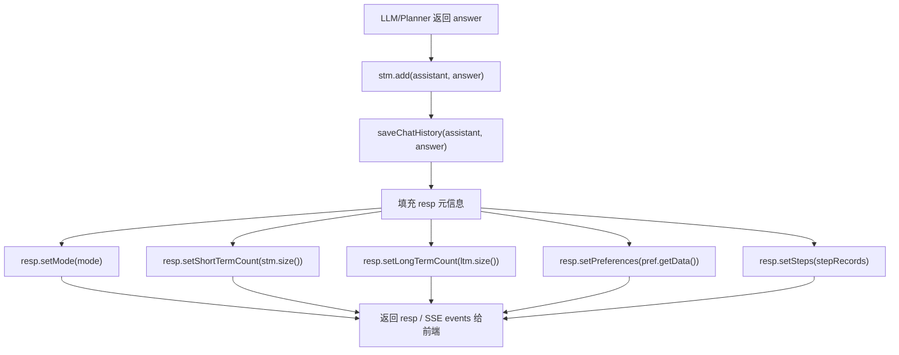

# 17 回答保存与 StreamEvent

## 1. 一句话结论

回答生成后，系统做三件事：

1. **保存到短期记忆和聊天历史**（同步）。
2. **填充响应的元信息**（模式、记忆条数、偏好）。
3. **通过 SSE 推送给前端**流式事件。

一句话记住：

```text
stm.add + saveChatHistory 是内部状态更新。
StreamEvent 是前端通信协议。
ChatResponse 是最终 JSON 体。
```

## 2. 它在主链路里的位置

回答生成后的位置：

```text
LLM / Planner / GraphRuntime 返回 answer
    ↓
stm.add("assistant", resp.getAnswer())
    ↓
infra.saveChatHistory("assistant", resp.getAnswer())
    ↓
resp.setShortTermCount(stm.size())  ← 元信息
resp.setLongTermCount(ltm.size())   ← 元信息
resp.setPreferences(pref.getData()) ← 元信息
    ↓
controller 把 resp / event 返回给前端
```

## 3. 为什么需要它

如果没有这个阶段：

- 聊天历史只存在于内存，重启就丢。
- 前端不知道当前用了什么模式、走了多少步。
- 前端不知道还有多少长期记忆、偏好是什么。
- 异步操作（MemoryWriter、Consolidation）的结果没有地方反馈。

**stm.add + saveChatHistory 保证了会话连贯性。**
**StreamEvent 保证了前端实时反馈。**
**ChatResponse 保证了前端能展示完整的元信息。**

## 4. 对应源码位置

| 文件 | 角色 |
|---|---|
| `UnifiedAgentService.java` | 主链路中设置 resp 元信息 |
| `ChatResponse.java` | 最终返回给前端的模型 |
| `AgentController.java` / `ChatController.java` | SSE 事件发送 |
| `StreamEvent.java` | SSE 事件类型定义 |

**ChatResponse 核心字段：**

```java
public class ChatResponse {
    private String query;           // 原始用户问题
    private String answer;          // 最终回答
    private String mode;            // chat / tool / react / rag
    private String extractedInfo;   // 偏好抽取结果
    private List<Step> steps;       // 工具调用步骤
    private int shortTermCount;     // 当前短期记忆条数
    private int longTermCount;      // 当前长期记忆条数
    private Map<String, String> preferences; // 用户偏好
    // getter / setter...
}
```

**StreamEvent 事件类型：**

| 事件名 | 含义 | 数据载荷 |
|---|---|---|
| `nodeStart` | 某个 DAG 节点开始执行 | node id, tool name |
| `nodeDone` | 某个 DAG 节点执行完成 | node id, result |
| `observation` | 工具调用观察到结果 | observation 原文 |
| `raceWon` | 竞速组有节点胜出 | winning node id |
| `graphReady` | DAG 整体完成，可以合成 | 无 |
| `error` | 流程中出现错误 | error message |

## 5. 先看对象长什么样

### 5.1 完整的 ChatResponse JSON (tool 模式)

用户问"上海天气怎么样"，走 tool 模式：

```json
{
  "query": "上海天气怎么样",
  "answer": "上海今天小雨，20°C，出门建议带伞。",
  "mode": "tool",
  "extracted_info": "已记住：城市 = 上海",
  "steps": [
    {
      "tool": "get_weather",
      "args": {"city": "上海"},
      "result": "上海：小雨 20°C",
      "status": "success"
    }
  ],
  "short_term_count": 4,
  "long_term_count": 3,
  "preferences": {
    "姓名": "用户姓名: 小李",
    "城市": "用户城市: 上海"
  }
}
```

### 5.2 完整的 ChatResponse JSON (react 模式)

用户问"查上海天气和搜索小雨出门建议"，走 react 模式：

```json
{
  "query": "查上海天气和搜索小雨出门建议",
  "answer": "上海今天小雨，20°C。小雨天气出门建议带伞、穿防滑鞋...",
  "mode": "react",
  "extracted_info": "",
  "steps": [
    {
      "tool": "get_weather",
      "args": {"city": "上海"},
      "result": "上海：小雨 20°C",
      "status": "success"
    },
    {
      "tool": "search_web",
      "args": {"query": "小雨天气出门建议"},
      "result": "搜索结果：建议带伞、穿防滑鞋...",
      "status": "success"
    }
  ],
  "short_term_count": 4,
  "long_term_count": 5,
  "preferences": {
    "姓名": "用户姓名: 小李"
  }
}
```

### 5.3 StreamEvent 示例

```json
// nodeStart
{"type": "nodeStart", "data": {"nodeId": "n1", "toolName": "get_weather"}}

// observation
{"type": "observation", "data": "调用 get_weather(city=上海)..."}

// nodeDone
{"type": "nodeDone", "data": {"nodeId": "n1", "result": "上海：小雨 20°C"}}

// raceWon
{"type": "raceWon", "data": {"nodeId": "n2"}}

// graphReady
{"type": "graphReady", "data": {}}

// error
{"type": "error", "data": {"message": "LLM 调用超时"}}
```

## 6. 核心流程图



## 7. 源码逐段讲解

### 7.1 回答生成后的保存

原文件：`UnifiedAgentService.java`

```java
stm.add("assistant", resp.getAnswer());
infra.saveChatHistory("assistant", resp.getAnswer());
```

这两个调用跟在回答生成后面，分别发生什么：

**第一步：stm.add("assistant", answer)**

```text
① 创建 ConversationMessage
    role = "assistant"
    content = "上海今天小雨，20°C..."
    timestamp = "22:15:06"

② 追加到 messages 末尾
    messages 变成：
    [
        ...之前的 user/assistant 消息...,
        ConversationMessage{role="assistant", content="上海今天小雨...", timestamp="22:15:06"}
    ]

③ 裁剪窗口
    max = maxTurns * 2
    if messages.size() > max → remove(0) 删除最早
```

**第二步：infra.saveChatHistory("assistant", answer)**

```text
① infra 调用 chatHistoryRepo.save("assistant", answer)
② 拼 SQL:
    INSERT INTO chat_history (role, content) VALUES ('assistant', '上海今天小雨...')
③ 执行 INSERT
④ 数据库生成新的自增 id
```

这两步是同步的——用户线程会等它们完成。

### 7.2 填充响应元信息

```java
resp.setShortTermCount(stm.size());
resp.setLongTermCount(ltm.size());
resp.setPreferences(pref.getData());
```

**resp.setShortTermCount(stm.size())**

```text
stm.size() 返回 messages 里当前有多少条。
如果 5 轮对话，通常返回 10。
```

**resp.setLongTermCount(ltm.size())**

```text
ltm.size() 返回 items 里有多少条长期记忆。
这个数字会告诉前端：系统记住了多少事实。
```

**resp.setPreferences(pref.getData())**

```text
pref.getData() 返回 PreferenceMemory 的整个 Map。
例如：
{
  "姓名": "用户姓名: 小李",
  "城市": "用户城市: 上海"
}
```

注意这里**不是**只返回当前这一轮抽取的偏好，而是**全部偏好**。

### 7.3 StreamEvent 发送逻辑

原文件：`AgentController.java` 或 `ChatController.java`

```java
// 伪代码：发送 SSE 事件
SseEmitter emitter = new SseEmitter();

// 工具节点开始时
emitter.send(SseEmitter.event()
    .name("nodeStart")
    .data(Map.of("nodeId", "n1", "toolName", "get_weather")));

// 观察结果
emitter.send(SseEmitter.event()
    .name("observation")
    .data("调用 get_weather(city=上海)..."));

// 节点完成
emitter.send(SseEmitter.event()
    .name("nodeDone")
    .data(Map.of("nodeId", "n1", "result", "上海：小雨 20°C")));

// DAG 就绪
emitter.send(SseEmitter.event()
    .name("graphReady")
    .data(Map.of()));

// 错误
emitter.send(SseEmitter.event()
    .name("error")
    .data(Map.of("message", "LLM 调用超时")));
```

**SSE 什么情况下触发？**

- **tool 模式：** ToolModeHandler 执行过程中，观察结果逐步推送。
- **react 模式：** Planner 定义好图后，GraphRuntime 执行每个节点时推送。
- **chat/rag 模式：** 通常只有最终结果，没有中间事件。

**如果 SSE 发送失败怎么办？**

```text
SseEmitter 会抛出异常。
通常的降级：捕获异常，标记 emitter 为已完成。
前端检测到连接断开后重连。
```

### 7.4 完整的 ChatResponse 返回

```java
// controller 返回
return ResponseEntity.ok(resp);
```

前端收到的 JSON 结构：

```json
{
  "query": "...",
  "answer": "...",
  "mode": "tool",
  "extracted_info": "...",
  "steps": [...],
  "short_term_count": 4,
  "long_term_count": 3,
  "preferences": {...}
}
```

**注意这些字段只在 final response 里出现，不在 SSE 事件里。** SSE 事件是"中间过程"，`ChatResponse` 是"最终结果"。

### 7.5 为什么 SSE 和 ChatResponse 分开？

**SSE 的目的是让前端实时看到进展。**
**ChatResponse 的目的是让前端拿到最终完整数据。**

例子：

```text
用户发请求 → 前端收到 nodeStart → "正在查天气..."
          → 前端收到 observation → "查询结果..."
          → 前端收到 nodeDone   → "查询完成"
          → 前端收到 graphReady → "开始合成回答"
          → 前端收到 ChatResponse → "最终回答"
```

如果只返回 ChatResponse，前端在整个 LLM 调用期间都是"空白等待"。

如果只发 SSE，前端需要自己拼接大量碎片数据。

所以两者配合：SSE 给过程，ChatResponse 给结果。

## 8. 真实举例：它在流程中怎么运行

### 8.1 chat 模式

用户问"你好"：

```text
① LLM 返回 "你好，有什么可以帮你的？"
② stm.add("assistant", "你好，有什么可以帮你的？")
③ saveChatHistory("assistant", "你好，有什么可以帮你的？")
④ resp.setMode("chat")
   resp.setShortTermCount(2)
   resp.setLongTermCount(0)
   resp.setPreferences({})
⑤ 返回:
   {
     "query": "你好",
     "answer": "你好，有什么可以帮你的？",
     "mode": "chat",
     "steps": [],
     "short_term_count": 2,
     "long_term_count": 0,
     "preferences": {}
   }
```

### 8.2 tool 模式

用户问"上海天气"：

```text
① ToolModeHandler 调用 get_weather(city=上海)
② 发送 SSE: nodeStart → observation → nodeDone
③ LLM 合成回答
④ stm.add / saveChatHistory 同步保存
⑤ resp.setMode("tool")
   resp.setSteps([{tool:"get_weather", args:{city:"上海"}, result:"小雨 20°C"}])
⑥ 返回 ChatResponse + 前端已收到 SSE
```

### 8.3 react 模式

用户问"查上海天气和小雨出门建议"：

```text
① Planner 规划图：n1:get_weather + n2:search_web
② GraphRuntime 并行执行两个节点
③ 发送 SSE:
   - nodeStart n1
   - nodeStart n2
   - observation n1
   - nodeDone n1 (get_weather 完成)
   - observation n2
   - nodeDone n2 (search_web 完成)
   - graphReady (全部完成)
④ LLM 合成回答
⑤ stm.add / saveChatHistory / 填充元信息
⑥ 返回 ChatResponse
```

### 8.4 error 场景

工具调用失败：

```text
① GraphRuntime 执行 get_weather
② 调用异常（网络超时）
③ 发送 SSE: error → {message: "get_weather 调用超时"}
④ 如果还有可执行的节点，继续执行
⑤ LLM 根据部分结果合成回答
⑥ 返回 ChatResponse（steps 里 status 标记为 "failed"）
```

## 9. 用一个完整例子跑一遍

用户发请求：

```text
POST /api/chat/stream
Body: {"query": "上海天气怎么样"}
```

**用户线程执行顺序：**

```text
① stm.add("user", "上海天气怎么样")
   messages = [ConversationMessage{role="user", content="上海天气怎么样"}]

② saveChatHistory("user", "上海天气怎么样")
   PG chat_history 新增一行

③ ChatRouter.decideMode → "tool"

④ ToolModeHandler 调用 get_weather(city=上海)

⑤ SSE 事件流（发给前端）:
   emitter.send(nodeStart, {nodeId:"n1", toolName:"get_weather"})
   emitter.send(observation, "调用 get_weather...")
   emitter.send(nodeDone, {nodeId:"n1", result:"上海：小雨 20°C"})

⑥ LLM 合成回答:
   "上海今天小雨，20°C，出门建议带伞。"

⑦ stm.add("assistant", "上海今天小雨，20°C，出门建议带伞。")
   messages = [
     {role="user", content="上海天气怎么样"},
     {role="assistant", content="上海今天小雨，20°C，出门建议带伞。"}
   ]

⑧ saveChatHistory("assistant", "上海今天小雨...")
   PG chat_history 新增一行

⑨ 填充元信息:
   resp.setMode("tool")
   resp.setShortTermCount(2)
   resp.setLongTermCount(ltm.size())  // 假设 0
   resp.setPreferences(pref.getData()) // 假设 {}
   resp.setSteps(stepRecords)

⑩ 返回 ChatResponse:
   {
     "query": "上海天气怎么样",
     "answer": "上海今天小雨，20°C，出门建议带伞。",
     "mode": "tool",
     "extracted_info": "",
     "steps": [{
       "tool": "get_weather",
       "args": {"city": "上海"},
       "result": "上海：小雨 20°C",
       "status": "success"
     }],
     "short_term_count": 2,
     "long_term_count": 0,
     "preferences": {}
   }
```

## 10. 关键判断条件

| 位置 | 条件 | true 时 | false 时 |
|---|---|---|---|
| `resp.setMode` | mode 值 | 前端显示回答模式 | 无 mode |
| `resp.setShortTermCount` | stm.size() | 前端展示记忆条数 | 返回 0 |
| `resp.setLongTermCount` | ltm.size() | 前端展示长期记忆数 | 返回 0 |
| `resp.setPreferences` | pref.getData() | 前端展示用户偏好 | 返回空 Map |
| `emitter.send` | SSE 发射 | 前端实时更新进度 | 前端无进度提示 |
| `streamEvent.nodeStart` | DAG 节点开始 | RT 层在跑工具调用 | 等待中 |
| `streamEvent.nodeDone` | 节点调用完成 | 前端可以展示结果 | 可能正在等其他节点 |
| `streamEvent.error` | 调用异常 | 前端显示错误信息 | 正常流程 |
| `streamEvent.raceWon` | 竞速组有节点胜出 | 取消同组其他节点 | 继续等待同组完成 |

## 11. 容易混淆的点

### 11.1 SSE 和 ChatResponse 不是同一件事

SSE 是**事件流**，ChatResponse 是**最终结果**。

| | SSE | ChatResponse |
|---|---|---|
| 何时发送 | 工具执行过程中 | 最终回答生成后 |
| 格式 | 事件名 + 数据 | 完整 JSON |
| 包含什么 | nodeStart/nodeDone/obs/error | answer/mode/steps/preferences... |
| 谁消费 | 前端实时展示 | 前端最终渲染 |

### 11.2 `setShortTermCount` 是当前条数，不是总轮数

```text
setShortTermCount(stm.size())
// 返回的是 messages 里的条数，不是对话轮数。

轮数 = stm.size() / 2（不考虑单条 user 的情况）
```

### 11.3 `setPreferences` 返回全部偏好，不是仅本轮

```text
pref.getData() 返回整个 Map。

第一轮：用户说"我叫小李"
→ resp.preferences = {"姓名": "用户姓名: 小李"}

第二轮：用户说"我住上海"
→ resp.preferences = {"姓名": "用户姓名: 小李", "城市": "用户城市: 上海"}
```

不是只返回本轮新增的偏好。

### 11.4 SSE 错误不影响 ChatResponse

SSE 遇到错误时：

```java
try { emitter.send(...); } catch (Exception e) { log.warn("SSE 发送失败"); }
```

如果 SSE 发送失败，系统不会停止处理。ChatResponse 仍然会正常返回。前端检测到 SSE 断开后仍然可以通过 ChatResponse 拿到最终结果。

## 12. 和其他模块的关系

### 12.1 和 ShortTermMemory

回答保存到 `stm`，保证了下一轮能看到"上一轮助手说了什么"。

### 12.2 和 PreferenceMemory

`resp.setPreferences(pref.getData())` 让前端知道当前偏好状态。

### 12.3 和 LongTermMemory

`resp.setLongTermCount(ltm.size())` 让前端知道长期记忆条数（通常展示为"已记住 X 条事实"）。

### 12.4 和 GraphRuntime

SSE 事件的发送者是 GraphRuntime。它每执行一个节点就发一次事件。

### 12.5 和 MemoryWriter

回答保存后，MemoryWriter 异步启动。但它的结果**不会**反映到本次 ChatResponse 里——因为它是异步的，本次响应时它可能还没跑完。

## 13. 如果要改这个功能，改哪里

| 需求 | 修改位置 | 怎么改 | 风险 |
|---|---|---|---|
| 新增响应字段 | `ChatResponse.java` | 加字段和 getter/setter | 前端需要对应解析 |
| 新增 SSE 事件类型 | `StreamEvent.java` / controller | 加新事件名和发送逻辑 | 前端需要处理新事件 |
| 不在 answer 里暴露某些信息 | `UnifiedAgentService.java` | 在 setAnswer 前过滤 | 可能影响 LLM 回答 |
| 支持流式输出（token 逐字） | controller + LLM 调用 | 改 llm.chat 为 stream + emitter.send | 影响较大，涉及 LLM 调用方式 |
| SSE 带用户偏好 | controller | 在 SSE 数据里加上 pref | 敏感信息泄漏 |
| 改为推送模式 | controller | 用 WebSocket 替代 SSE | 架构调整 |

## 14. 面试怎么说

完整说法：

```text
回答生成后，系统首先 stm.add("assistant", answer) 保存到短期记忆，同时 infra.saveChatHistory 保存到 PostgreSQL chat_history 表。然后填充 ChatResponse 的元信息：mode、shortTermCount、longTermCount、preferences、steps。对于 tool 和 react 模式，系统还会通过 SSE 事件向前端推送执行过程：nodeStart、nodeDone、observation、graphReady。前端通过 SSE 实时展示进度，最终收到 ChatResponse 做完整渲染。
```

如果问"SSE 和 ChatResponse 的关系"：

```text
SSE 是事件流，用于实时展示中间状态（比如工具调用进度）。ChatResponse 是最终结果 JSON，包含完整的回答和元信息。两者配合使用——SSE 让用户不等得焦虑，ChatResponse 给前端完整的渲染数据。
```

如果问"如果前端断开 SSE 连接"：

```text
后端捕获异常后标记 emitter 完成，主链路继续执行。前端重新发起请求时，系统从头处理——因为 chat_history 和 STM 都已经保存了。SSE 断开不影响最终回答的生成和保存。
```

## 15. 自检题

1. `stm.add("assistant", answer)` 和 `saveChatHistory` 分别在干什么？
2. SSE 和 ChatResponse 有什么区别？各自给谁用？
3. `resp.setPreferences(pref.getData())` 返回的是本轮偏好还是全部偏好？
4. StreamEvent 有哪些类型？每种类型在什么场景触发？
5. 如果 SSE 发送失败，主流程还会继续执行吗？
6. `shortTermCount` 和 `longTermCount` 分别代表什么？
7. tool 模式和 react 模式下 SSE 事件的触发顺序有什么不同？
8. 为什么说 MemoryWriter 的结果不会反映到本次 ChatResponse 里？
9. ChatResponse 的 `steps` 字段在 chat 模式、tool 模式、react 模式下分别是什么？
10. 如果要新增一个 SSE 事件类型（比如 `thinkingStart`），需要改哪些文件？
