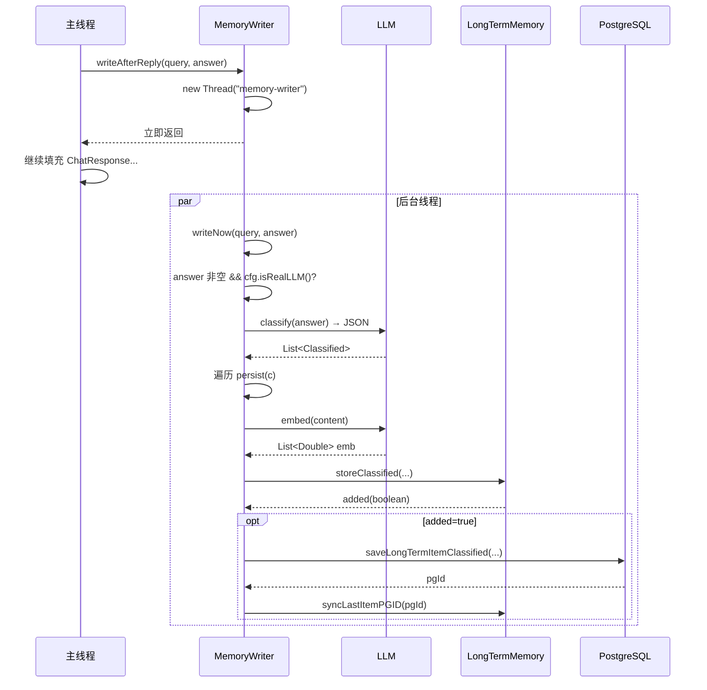

# 18 回复后记忆写入 — MemoryWriter

## 1. 一句话结论

`MemoryWriter` 是主链路**回答生成之后**触发的异步记忆沉淀模块。

它在 `stm.add` 和 `saveChatHistory` 之后被调用：

```java
memoryWriter.writeAfterReply(query, resp.getAnswer());
```

开新线程跑 `writeNow`，用 LLM 从 answer 里分类抽取长期记忆，写入偏好、长期记忆、图记忆和 PostgreSQL。

一句话记住：

```text
回答 → 保存到 STM → MemoryWriter 异步抽记忆 → 写入 PG。
整个过程不阻塞用户看到结果。
```

## 2. 它在主链路里的位置

```text
用户请求进来
    ↓
[...处理链路...]
    ↓
LLM / ReAct 返回 answer
    ↓
stm.add("assistant", answer)
saveChatHistory("assistant", answer)
    ↓
memoryWriter.writeAfterReply(query, resp.getAnswer())  ← ★ 这里
    ↓
new Thread("memory-writer") → writeNow(query, answer)
    ↓
主线程继续填充 ChatResponse 返回给前端
    ↓
后台线程：classify → persist → 写 PG / Neo4j (异步)
```

注意关键的一点：`writeAfterReply` 调用后**立即返回**。此时可能 MemoryWriter 甚至还没开始分类。

## 3. 为什么需要它

没有 MemoryWriter 的情况：

```text
用户说：我住在上海，喜欢中文回答。
系统回答：好的，我记住了。

—— 但系统只在 STM 里存了对话，没有提取成长期记忆。
重启后：用户说"我住哪？" — 系统不知道。
```

MemoryWriter 做了什么：

```text
用户说：我住在上海，喜欢中文回答。
系统回答：好的，记住了你住在上海，喜欢中文回答。

MemoryWriter 分类提取：
  → identity: 用户城市: 上海 (importance=0.9)
  → preference: 用户偏好: 中文回答 (importance=0.7)

这两条写入长期记忆和偏好。
重启后：用户说"我住哪？" — 召回得到"上海"。
```

**它和轻量级规则的区别：**

| 特性 | 轻量级规则 | MemoryWriter |
|---|---|---|
| 处理对象 | query | answer |
| 依赖 | 字符串匹配 "我叫" | LLM 分类 |
| 同步/异步 | 同步 | 异步 |
| 分类粒度 | 只有 key-value | category+content+tags |
| 触发时机 | 请求到达时 | 回答生成后 |

两者互补：规则处理"用户说我喜欢什么"，MemoryWriter 处理"系统回答里体现了什么值得记的"。

## 4. 对应源码位置

| 文件 | 作用 |
|---|---|
| `AGI-saber-java/src/main/java/com/agi/assistant/application/chat/MemoryWriter.java` | MemoryWriter 本体 |
| `AGI-saber-java/src/main/java/com/agi/assistant/service/agent/UnifiedAgentService.java` | 主链路调用处 |

**为什么说"从主链路视角"？**

详细文档在 `01-memory-system/10-MemoryWriter回复后写入.md`，那里讲 MemoryWriter 内部的 classify、persist、guessPrefKey 等细节。这里只讲：

```text
主链路怎么调用它？
调用后什么时候开始工作？
如果失败了会怎么样？
```

## 5. 先看调用对象长什么样

从主链路视角看，`memoryWriter` 只有一个公开方法：

```java
public void writeAfterReply(String query, String answer)
```

调用处：

```java
memoryWriter.writeAfterReply(query, resp.getAnswer());
```

**两个参数：**

| 参数 | 内容 | 用途 |
|---|---|---|
| `query` | 用户原始问题 | 传下去了，但当前版本 classify 没用它 |
| `answer` | 系统生成的回答 | MemoryWriter 从这里面抽记忆 |

## 6. 核心流程图



## 7. 源码逐段讲解

### 7.1 主链路的调用点

原文件：`UnifiedAgentService.java`

```java
memoryWriter.writeAfterReply(query, resp.getAnswer());
```

这一行位于主链路的最后位置：

```text
① stm.add("user", query)
② saveChatHistory("user", query)
③ [路由判断 + 回答生成]
④ stm.add("assistant", answer)
⑤ saveChatHistory("assistant", answer)
⑥ memoryWriter.writeAfterReply(query, resp.getAnswer()) ← 最后一步
```

**为什么放最后？**

因为 MemoryWriter 需要回答内容。回答还没生成时不能调用。放最后也保证：即使 MemoryWriter 内部抛异常，前面 5 步已经完成，不会丢失用户消息和助手回答。

### 7.2 writeAfterReply — 异步入口

原文件：`MemoryWriter.java`

```java
public void writeAfterReply(String query, String answer) {
    new Thread(() -> {
        try {
            writeNow(query, answer);
        } catch (Exception e) {
            log.warn("MemoryWriter 写入失败: {}", e.getMessage());
        }
    }, "memory-writer").start();
}
```

**这一行拆解：**

```java
new Thread(() -> { ... }, "memory-writer").start();
```

执行顺序：

```text
① new Thread(...) — 创建线程对象
    JVM 分配线程栈空间
    设置线程名 = "memory-writer"

② .start() — 让线程进入可运行状态
    JVM 把线程放入线程调度器
    等待 CPU 时间片执行

③ () -> { writeNow(query, answer); } — 线程要执行的代码
```

**为什么用 new Thread 而不是线程池？**

```text
当前项目是原型阶段：
  → new Thread 简单直接
  → 不需要管理线程池生命周期
  → 每次调用创建一个新线程

生产环境的问题：
  → 高频调用会创建大量线程
  → 线程创建开销大（栈分配+上下文切换）
  → 无上限 → OOM

生产环境应该用：
  → ExecutorService 线程池
  → Spring @Async
  → 消息队列（MQ/RabbitMQ）
```

**`catch (Exception e)` 只打 warn 不抛异常的原因：**

```text
主线程已经返回给用户了。
这个异常在后台上，主线程没法处理。
抛异常只会让后台线程崩溃，不会有任何补救。

所以：记日志 → 完事。
```

**主链路的视角来看：**

```text
writeAfterReply 调用后：
  ① 主线程继续执行
  ② 返回 ChatResponse 给前端
  ③ 用户已经看到回答

后台：
  "memory-writer" 线程可能刚创建
  甚至还没开始 writeNow
```

### 7.3 writeNow — 同步执行的判断

原文件：`MemoryWriter.java`

```java
public void writeNow(String query, String answer) {
    if (answer == null || answer.isEmpty() || !cfg.isRealLLM()) return;

    List<Classified> items = classify(answer);
    if (items.isEmpty()) return;

    for (Classified c : items) {
        persist(c);
    }
}
```

**三种跳过情况：**

```text
① answer == null
    LLM 没有返回回答 → 没什么可抽的

② answer.isEmpty()
    回答是空字符串 → 同上

③ !cfg.isRealLLM()
    没有配置真实 API Key → mock 模式
    mock 模式下的回答是伪造的，不应该污染长期记忆
```

**`cfg.isRealLLM()` 是怎么判断的？**

```java
public boolean isRealLLM() {
    return llm.getApiKey() != null && !llm.getApiKey().isEmpty();
}
```

所以本地开发时如果没配 API Key，MemoryWriter 永远不会工作。

### 7.4 classify — 分类抽取（从主链路视角看返回什么）

主链路不需要关心 classify 内部怎么调 LLM，只需要知道它返回什么：

```java
List<Classified> items = classify(answer);
```

返回结果：

```text
正常情况：
  [
    Classified(category="identity",   content="用户城市: 上海",     tags=["城市"]),
    Classified(category="preference", content="用户偏好: 中文回答", tags=["语言"])
  ]

无可记忆内容：
  []

LLM 调用失败：
  []

JSON 解析失败：
  []
```

**如果 classify 返回空列表 → 直接结束。**

```java
if (items.isEmpty()) return;
```

这意味着 MemoryWriter 本次写入了 0 条长期记忆。

### 7.5 persist — 真正的写入

从主链路视角，`persist` 的完整链路是：

```java
private void persist(Classified c) {
    double importance = importanceFor(c.category);   // category → 0.5~0.9
    String slotHint = slotHintFor(c.category);        // category → Profile/Constraints/...

    // ① 如果是 identity/preference，尝试写 PreferenceMemory
    if ("identity".equals(c.category) || "preference".equals(c.category)) {
        String key = guessPrefKey(c.content);
        if (key != null && !key.isEmpty()) {
            pref.save(key, c.content);
            infra.savePreference("default", key, c.content);
        }
    }

    // ② 生成 embedding
    List<Double> emb;
    try { emb = llm.embed(c.content); } catch (Exception e) { emb = null; }

    // ③ 写 LongTermMemory / GraphMemory
    boolean added = (graphMem != null)
        ? graphMem.storeClassified(...).added()
        : ltm.storeClassified(...);

    // ④ 真正新增才写 PG
    if (!added) return;
    int pgId = infra.saveLongTermItemClassified(...);
    syncLastItemPGID(pgId);
}
```

**主链路的视角来看 `persist` 的保证：**

```text
① 偏好写入成功 → 偏好增加了 key-value
   失败 → 只是少了一条偏好，不影响回答

② embedding 生成失败 → emb = null
   后续去重可能不准，但 content 还在

③ storeClassified 返回 added=false → 不再写 PG
   这是去重生效了，不是失败

④ PG 写入失败 → 内存里多了条记录，但没持久化
   下次启动会丢失这条记忆
```

### 7.6 整个异步线程的生命周期

```
主线程调用 writeAfterReply 的时刻
    │
    ▼
new Thread("memory-writer").start()
    │
    ├── 主线程：继续 → 返回 ChatResponse → 完成本次请求
    │
    └── 后台线程：
        │
        ① writeNow(query, answer)
            │
            ├── answer 为空?               → return（线程结束）
            ├── !cfg.isRealLLM()?          → return（线程结束）
            │
            └── classify(answer)
                    │
                    ├── items 为空?         → return（线程结束）
                    │
                    └── for each Classified:
                            persist(c)
                                │
                                ├── 写 PreferenceMemory（可选）
                                ├── llm.embed(content)
                                ├── storeClassified（LTM/GraphMem）
                                └── 如果 added=true:
                                        saveLongTermItemClassified
                                        syncLastItemPGID
                    │
                    └── 所有 item 处理完 → 线程自动结束
```

**线程什么时候结束？**

```text
正常结束：所有 persist 执行完，run() 返回。
异常结束：persist 里抛异常，被 catch，run() 返回。
```

**线程存在多久？**

```text
取决于 LLM 分类 + embedding + 数据库写入的总耗时。
通常几百毫秒到几秒。
```

## 8. 真实举例：它在流程中怎么运行

### 8.1 正常写入

用户问"我叫小李，我住在上海"：

```text
主链路执行到 memoryWriter.writeAfterReply(query, answer):
   ① 后台线程启动
   ② classify(answer)
      LLM 返回：
      [
        {category:"identity", content:"用户姓名: 小李",     tags:["姓名"]},
        {category:"identity", content:"用户城市: 上海",     tags:["城市"]}
      ]
   ③ persist 第一条 → 写 PreferenceMemory("姓名", "用户姓名: 小李")
                      写 LongTermMemory(added=true)
                      写 PG (pgId=135)
                      syncLastItemPGID(135)
   ④ persist 第二条 → 写 PreferenceMemory("城市", "用户城市: 上海")
                      写 LongTermMemory(added=true)
                      写 PG (pgId=136)
                      syncLastItemPGID(136)
   ⑤ 线程结束
```

### 8.2 重复判断跳过

用户再次说"我叫小李"：

```text
   ① classify 又返回了 identity: "用户姓名: 小李"
   ② persist → storeClassified 判断 embedding 重复
   ③ added=false → return
   ④ 没有写 PG，没有新存储
```

### 8.3 异常情况

用户说"你好"（没有值得记忆的内容）：

```text
   ① classify(answer) 返回 items = []
   ② items.isEmpty() → return
   ③ 线程立即结束，没有写任何东西
```

### 8.4 mock 模式

没有配置 API Key：

```text
   ① writeNow → !cfg.isRealLLM() → true
   ② return
   ③ 线程结束，什么也没做
```

## 9. 用一个完整例子跑一遍

### 配置与初始状态

```text
cfg.isRealLLM() = true
ltm.items = []
pref.data = {}
```

### 用户请求

```text
query: "我叫小李，帮我查一下上海天气"
answer: "好的，我记住了你叫小李。上海今天小雨，20°C。"
```

### 主链路调用

```java
memoryWriter.writeAfterReply(query, resp.getAnswer());
// ← 这里立即返回，主线程继续
```

### 后台线程执行

```text
① writeNow 判断
   answer = "好的，我记住了你叫小李。上海今天小雨，20°C。"  ✅ 非空
   cfg.isRealLLM() = true                                    ✅

② classify(answer)
   → LLM 调用 classify prompt
   → 返回 JSON：
     {"items":[
       {"category":"identity","content":"用户姓名: 小李","tags":["姓名"]}
     ]}
   → 解析后 items 有 1 条

③ persist(Classified{category="identity", content="用户姓名: 小李", tags=["姓名"]})

   ③-a importanceFor("identity") → 0.9
       slotHintFor("identity") → "Profile"

   ③-b category 是 identity → 尝试写 PreferenceMemory
       guessPrefKey("用户姓名: 小李")
       → 找到冒号, left="用户姓名"
       → 去掉"用户", left="姓名"
       → length=2 <= 12
       → key = "姓名"
       → pref.save("姓名", "用户姓名: 小李")
       → infra.savePreference("default", "姓名", "用户姓名: 小李")

   ③-c llm.embed("用户姓名: 小李")
       → [0.013, -0.022, ...]

   ③-d graphMem 为 null → ltm.storeClassified(...)
       → storeClassified 内部：
         → 去重判断：items 为空，不是重复
         → new MemoryItem(nextId=0, ...)
         → items.add(item)
         → storeCount++
         → return true

   ③-e added=true → 保存 PG
       embJson = "[0.013,-0.022,...]"
       tagsJson = "[\"姓名\"]"
       pgId = infra.saveLongTermItemClassified(
           "用户姓名: 小李", 0.9, embJson, "identity", tagsJson, "Profile")
       → INSERT INTO long_term_memory ...
       → pgId = 135

   ③-f syncLastItemPGID(135)
       items.get(size-1).id = 0 → id = 135
       同时 nextId 从 0 → 136

④ persist 结束，线程结束
```

### 最终状态

```text
ltm.items = [
  MemoryItem{id=135, content="用户姓名: 小李", importance=0.9, ...}
]
nextId = 136
pref.data = {"姓名": "用户姓名: 小李"}
```

## 10. 关键判断条件

| 判断点 | 条件 | true 时 | false 时 |
|---|---|---|---|
| writeAfterReply | 直接调用 | 后台线程启动 | — |
| writeNow | answer 为空 | 直接 return | 继续 |
| writeNow | !cfg.isRealLLM() | 直接 return | 继续 |
| writeNow | items.isEmpty() | 直接 return | 遍历 persist |
| persist | category 是 identity/preference | 尝试写 PreferenceMemory | 跳过偏好写入 |
| persist | guessPrefKey 有结果 | pref.save + infra.savePreference | 不写偏好 |
| persist | llm.embed 抛异常 | emb = null | 正常 embedding |
| persist | storeClassified 返回 added=true | 写 PG + syncLastItemPGID | 跳过落库 |
| persist | graphMem != null | graphMem.storeClassified | ltm.storeClassified |
| persist | syncLastItemPGID | 内存 ID 对齐数据库 ID | 不对 ID 对齐 |
| writeNow | for 循环结束 | 线程自然结束 | — |

## 11. 容易混淆的点

### 11.1 `writeAfterReply` 不是同步执行的

```java
memoryWriter.writeAfterReply(query, resp.getAnswer());
// ← 这一行会立即返回！
// 后台线程还没开始 writeNow
```

主链路不需要等 MemoryWriter。

### 11.2 即使 MemoryWriter 没跑完，主链路已经返回

```text
用户收到回答后，MemoryWriter 可能还在：
  ① 调 LLM 分类
  ② 生成 embedding
  ③ 写数据库
```

### 11.3 MemoryWriter 的结果不会出现在本次 ChatResponse 里

```text
因为它是异步的。
ChatResponse 返回时，MemoryWriter 可能还没跑完。
所以本次响应的 longTermCount/preferences 是"旧值"。
```

### 11.4 cfg.isRealLLM() 控制的不只是 MemoryWriter

```text
它还控制：
  runAsyncPreferenceExtraction（另一个异步偏好抽取）
```

所以 mock 模式下，两个异步记忆写入都跳过。

### 11.5 主链路调用时传了 query，但 classify 里没用

```java
public void writeAfterReply(String query, String answer)
```

参数 `query` 传进去了，但 `classify` 的 prompt 只拼了 answer：

```java
"回复：" + answer
```

`query` 参数当前是"传递了但没用"的状态。这是代码遗留——可能未来版本会把 query 和 answer 一起给 LLM。

## 12. 和其他模块的关系

### 12.1 和 ShortTermMemory

MemoryWriter 在 `stm.add("assistant", answer)` 之后调用。所以 STM 已经有了最新回答。

### 12.2 和 PreferenceMemory

MemoryWriter 会写 PreferenceMemory：identity/preference 类别下的可拆 key 内容。

### 12.3 和 LongTermMemory

所有分类内容都通过 `ltm.storeClassified` 或 `graphMem.storeClassified` 写入长期记忆。

### 12.4 和 GraphMemory

如果 `graphMem != null`，所有内容走 `graphMem.storeClassified`，它内部会：

```text
① ltm.storeClassified（写内存长期记忆）
② 新增成功 → 异步写 Neo4j 节点
③ 建 FOLLOWS / SIMILAR_TO 边
```

### 12.5 和 PostgreSQL

新增的记忆通过 `infra.saveLongTermItemClassified` 落库。

## 13. 如果要改这个功能，改哪里

| 需求 | 修改位置 | 怎么改 | 风险 |
|---|---|---|---|
| 不让 MemoryWriter 异步（改为同步） | `writeAfterReply` | 直接调 `writeNow` | 主线程等待，响应变慢 |
| 用线程池替代 new Thread | `writeAfterReply` | 注入 `ExecutorService` | 线程池参数调优 |
| 让 classify 也看 query | `MemoryWriter.classify` | prompt 拼 query | LLM 输出可能受 query 影响 |
| 新增 memory-writer 的触发条件 | `writeNow` | 增加更多判断 | 可能漏记忆 |
| 让 MemoryWriter 不写偏好 | `persist` | 去掉 identity/preference 分支 | 偏好不再从回答中提取 |
| 增加重试机制 | `writeNow` / `persist` | 失败重试 | 可能重复写入 |

## 14. 面试怎么说

完整说法：

```text
MemoryWriter 是回复后的异步记忆沉淀模块。主链路在 stm.add 和 saveChatHistory 之后调用 writeAfterReply(query, answer)，它会启动 memory-writer 后台线程执行 writeNow。writeNow 先判断 answer 非空且是真实 LLM 模式，然后 classify 让 LLM 从回答中抽取分类记忆。每条分类记忆走 persist：写偏好（如果是 identity/preference）、生成 embedding、storeClassified 写入 LTM 或 GraphMemory、新增成功才保存 PostgreSQL 并 syncLastItemPGID。整个过程不阻塞主线程。
```

如果问"为什么异步"：

```text
因为 LLM 分类、embedding、数据库写入都可能很慢（几百毫秒到几秒）。主线程应该尽快返回用户回答，这些后处理不应该让用户等待。
```

如果问"如果 MemoryWriter 失败会怎样"：

```text
catch 里只记 log.warn，不会抛到主线程。用户已经看到了回答。只是这条记忆没有持久化，后续启动会丢失。这就和没有 MemoryWriter 一样——回答在，但长期记忆可能缺一条。
```

## 15. 自检题

1. `memoryWriter.writeAfterReply(query, resp.getAnswer())` 是同步还是异步？
2. 主线程需要等 MemoryWriter 完成才能返回用户吗？
3. MemoryWriter 分类用的是 query 还是 answer？
4. 什么情况下 MemoryWriter 什么都不做就返回？
5. `added=false` 代表什么？是失败吗？
6. MemoryWriter 的结果会出现在当次的 ChatResponse 里吗？
7. 为什么要用 new Thread 而不是线程池？
8. 如果 cfg.isRealLLM() 为 false，MemoryWriter 怎么处理？
9. MemoryWriter 写 PreferenceMemory 的前置条件是什么？
10. 如果 MemoryWriter 线程抛了异常，主线程会收到吗？
