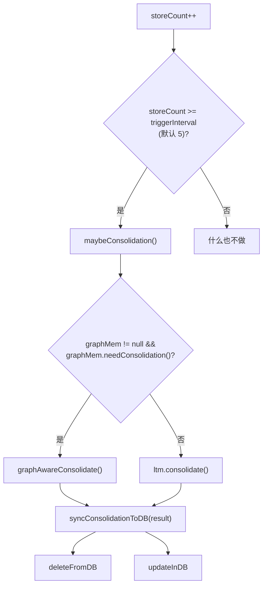
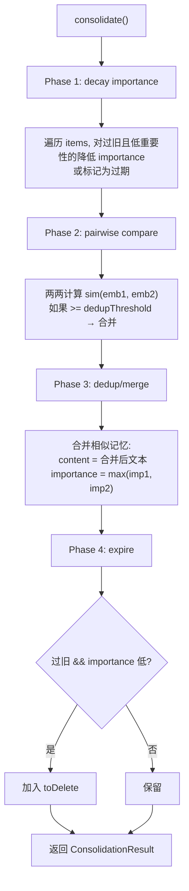

# 19 Consolidation 后台整理

## 1. 一句话结论

Consolidation 是长期记忆的后台整理机制。

每写入 `triggerInterval`（默认 5）条新记忆，自动触发一次整理：衰减重要性、两两比较去重、合并相似项、过期删除，并同步更新 PostgreSQL。

一句话记住：

```text
storeCount % triggerInterval == 0 → 触发 consolidation。
Consolidation = 衰减 + 去重 + 合并 + 过期。
```

## 2. 它在主链路里的位置

Consolidation 的触发位置在 `storeClassified` 返回 `true` 后：

原文件：`LongTermMemory.java`

```java
if (storeClassified(...) == true) {  // 真正新增了一条记忆
    storeCount++;                     // 新增计数器 +1
    maybeConsolidation();             // 检查是否要整理
}
```

而 `maybeConsolidation` 内部：

```java
private void maybeConsolidation() {
    if (storeCount < triggerInterval) return;  // 未达到阈值

    new Thread(() -> {
        if (graphMem != null && graphMem.needConsolidation()) {
            syncConsolidationToDB(graphMem.graphAwareConsolidate());
        } else if (ltm.needConsolidation()) {
            syncConsolidationToDB(ltm.consolidate());
        }
    }).start();
}
```

从主链路看，它的位置是：

```text
主链路 → MemoryWriter.writeAfterReply
    → persist → storeClassified → added=true
    → storeCount++ → maybeConsolidation() (后台线程)
    → 立即返回
```

**这里有几个连接点：**

| 判断 | 条件 | 分支 |
|---|---|---|
| `storeCount >= triggerInterval` | 是 | 触发整理 |
| `graphMem != null && graphMem.needConsolidation()` | 是 | 走图记忆整理 |
| 否则 | — | 走普通长期记忆整理 |
| `syncConsolidationToDB(result)` | — | 同步更新 PostgreSQL |

## 3. 为什么需要它

没有 Consolidation 的问题：

```text
用户说很多话，MemoryWriter 不断写入：

第 1 轮: "用户喜欢中文回答"
第 2 轮: "用户偏好: 中文回答"
第 3 轮: "用户喜欢用中文回答"
第 4 轮: "用户偏好: 中文"
第 5 轮: "用户语言偏好: 中文"
...
```

长期记忆里存了 5 条意思相似的记忆，全是重复。

**Consolidation 解决三个问题：**

| 问题 | Consolidation 处理方式 |
|---|---|
| 记忆重复 | 两两比较 embedding，相似的合并 |
| 记忆衰减 | 过旧但低重要性的记忆降低 importance |
| 记忆过期 | 过旧且低重要性的记忆删除 |

**图记忆还有第四个问题：** 高中心性节点不应该被删。`graphAwareConsolidate` 保护入度 >= 3 的节点。

## 4. 对应源码位置

| 文件 | 角色 |
|---|---|
| `LongTermMemory.java` | `maybeConsolidation`、`consolidate`、`needConsolidation`、`syncConsolidationToDB` |
| `GraphMemory.java` | `graphAwareConsolidate`（图记忆增强版整理） |
| `AppConfig.ConsolidationConfig` | `triggerInterval`（默认 5）、`dedupThreshold`、`expireDays` 等配置 |

核心方法：

```java
// 检查是否达到触发阈值
public boolean needConsolidation() {
    return storeCount >= triggerInterval;
}

// 执行整理，返回(删除列表, 更新列表)
public ConsolidationResult consolidate() {
    // ① decay importance
    // ② pairwise compare dedup/merge
    // ③ expire old items
}

// 图记忆增强版
public ConsolidationResult graphAwareConsolidate() {
    // ① ltm.consolidate()
    // ② protect high-centrality nodes (入度 >= 3)
}

// 同步到数据库
public void syncConsolidationToDB(ConsolidationResult result) {
    // deleteFromDB(result.toDelete)
    // updateInDB(result.toUpdate)
}
```

## 5. 先看对象长什么样

### 5.1 ConsolidationResult

```java
public static class ConsolidationResult {
    private List<MemoryItem> toDelete;   // 要删除的记忆
    private List<MemoryItem> toUpdate;   // 要更新的记忆
}
```

例子：

```text
ConsolidationResult{
    toDelete = [
        MemoryItem{id=12, content="用户喜欢中文", importance=0.5},
        MemoryItem{id=15, content="用户喜欢中文回答", importance=0.4}
    ],
    toUpdate = [
        MemoryItem{id=10, content="用户偏好: 中文回答", importance=0.7, ...}
    ]
}
```

### 5.2 触发前 vs 触发后的 items

触发前的 items（5 条）：

```text
items = [
  MemoryItem{id=1, content="用户姓名: 小李",          importance=0.9, createdAt=10天前},
  MemoryItem{id=2, content="用户喜欢中文回答",          importance=0.7, createdAt=8天前},
  MemoryItem{id=3, content="用户偏好中文",              importance=0.5, createdAt=7天前},
  MemoryItem{id=4, content="默认记忆",                  importance=0.5, createdAt=30天前},
  MemoryItem{id=5, content="用户偏好: 中文",            importance=0.7, createdAt=1天前}
]
```

触发后的 items：

```text
items = [
  MemoryItem{id=1, content="用户姓名: 小李",            importance=0.9,  createdAt=10天前}, // ← importance 高，保留
  MemoryItem{id=4, content="默认记忆",                  importance=0.5,  createdAt=30天前}, // ← 被删除（太旧且 importance 低）
  // id=2(id=3) 合并后: id=2 保留 content, importance=max(0.7,0.5)=0.7
  // id=2(id=5) 合并后: id=2 保留 content, importance=max(0.7,0.7)=0.7
]
```

### 5.3 PostgreSQL 同步

**删除：**

```sql
DELETE FROM long_term_memory WHERE id IN (3, 4);
```

**更新：**

```sql
UPDATE long_term_memory SET importance=0.7, content='用户偏好: 中文' WHERE id=2;
```

## 6. 核心流程图



Consolidate 内部流程：



## 7. 源码逐段讲解

### 7.1 storeCount 和 triggerInterval

原文件：`LongTermMemory.java`

```java
private int storeCount = 0;         // 真正新增的记忆条数
private int triggerInterval = 5;    // 每 5 次新增触发一次整理
```

**storeCount 不是 items.size()。**

```text
items.size() = 当前总条数（可能已经整理过很多次）
storeCount = 从程序启动以来新增的次数的累加

storeCount != items.size()
```

**storeCount 的更新时机：**

```java
// 在 storeClassified 里，added=true 才 +1
if (added) {
    items.add(item);
    storeCount++;
    maybeConsolidation();
}
```

**triggerInterval 的默认来源：**

```text
AppConfig.ConsolidationConfig
    .getTriggerInterval() 默认 5

也可以在 application.yml 里配置：
consolidation.triggerInterval: 10
```

### 7.2 maybeConsolidation — 触发判断

```java
private void maybeConsolidation() {
    if (storeCount < triggerInterval) return;  // 未达到阈值

    new Thread(() -> {                         // 后台执行
        if (graphMem != null && graphMem.needConsolidation()) {
            syncConsolidationToDB(graphMem.graphAwareConsolidate());
        } else if (needConsolidation()) {
            syncConsolidationToDB(consolidate());
        }
    }).start();
}
```

**执行判断：**

```text
假设 triggerInterval = 5:

storeCount=1 → <5 → return
storeCount=2 → <5 → return
storeCount=3 → <5 → return
storeCount=4 → <5 → return
storeCount=5 → >=5 → 执行 ← 触发
storeCount=6 → <10 → return  ← 注意这里！因为 consolidate() 内部会重置 storeCount！

等待 storeCount=10 时再次触发。
```

**后台线程——不阻塞主线程。**

```text
consolidate 涉及：
  - 遍历 items（O(n)）
  - 两两比较（O(n²)）
  - 数据库删除和更新

这些操作可能很慢，不应该阻塞主请求。
```

**graphMem 优先：**

```java
if (graphMem != null && graphMem.needConsolidation()) {
    // 走图记忆整理
} else if (needConsolidation()) {
    // 走普通整理
}
```

为什么 graphMem 优先？因为图记忆整理包含了 LTM 整理的全部步骤 + 图节点保护。

### 7.3 consolidate — 四个阶段

原文件：`LongTermMemory.java`

**Phase 1: decay importance**

```java
for (MemoryItem item : items) {
    long daysOld = ChronoUnit.DAYS.between(item.getCreatedAt(), LocalDateTime.now());
    if (daysOld > expireDays && item.getImportance() < lowImportanceThreshold) {
        item.setImportance(item.getImportance() * decayFactor);
    }
}
```

```text
假设：
  expireDays = 30
  lowImportanceThreshold = 0.6
  decayFactor = 0.9

执行过程：
  遍历 items:
    MemoryItem{id=1, content="用户姓名: 小李", importance=0.9, daysOld=10}
    → daysOld=10 < 30 → 不处理 ✓（重要性高、时间也不够久）

    MemoryItem{id=4, content="默认记忆", importance=0.5, daysOld=30}
    → daysOld=30 >= 30 ✓
    → importance=0.5 < 0.6 ✓
    → importance = 0.5 * 0.9 = 0.45

    MemoryItem{id=99, content="很久前的随便记的", importance=0.3, daysOld=60}
    → daysOld=60 >= 30 ✓
    → importance=0.3 < 0.6 ✓
    → importance = 0.3 * 0.9 = 0.27
```

**Phase 2: pairwise compare**

```java
for (int i = 0; i < items.size(); i++) {
    for (int j = i + 1; j < items.size(); j++) {
        MemoryItem a = items.get(i);
        MemoryItem b = items.get(j);
        double sim = cosine(a.getEmbedding(), b.getEmbedding());
        if (sim >= dedupThreshold) {
            // 合并
        }
    }
}
```

为什么是 O(n²)？

```text
items 有 5 条 → 比较次数 = 5*4/2 = 10 次
items 有 10 条 → 比较次数 = 10*9/2 = 45 次
items 有 1000 条 → 比较次数 = ~500k 次 ← 很慢！

所以 Consolidation 适合小规模记忆（~100 条以下）。
```

**Phase 3: dedup/merge**

```java
// 假设 a(用户喜欢中文回答, importance=0.7)
//       b(用户偏好中文,       importance=0.5)
// 合并后:
items.remove(j);  // 删除 b
// toDelete.add(b)
// a 的内容不变（或合并文本）
// a.importance = Math.max(0.7, 0.5) = 0.7
```

合并时 importance 取最大值：

```text
原因：如果一条记忆在新旧两个维度上都有值，
取高 importance 保证"只要有一个版本认为重要，合并后仍然重要"。
```

**Phase 4: expire**

```java
for (MemoryItem item : items) {
    long daysOld = ChronoUnit.DAYS.between(item.getCreatedAt(), LocalDateTime.now());
    if (daysOld > expireDays && item.getImportance() < minImportanceToKeep) {
        toDelete.add(item);    // 标记删除（内存）
        deleteFromDB(item);    // 删除数据库记录
        items.remove(item);    // 从 items 移除
    }
}
```

最终删除的是：

```text
重要性低 + 创建时间超过 expireDays 的记忆。
```

### 7.4 graphAwareConsolidate — 图记忆增强

原文件：`GraphMemory.java`

```java
public ConsolidationResult graphAwareConsolidate() {
    ConsolidationResult result = ltm.consolidate();  // 先做普通整理

    // 保护高中心性节点
    List<Integer> protectedIds = findHighCentralityNodes(3);  // 入度 >= 3

    // 从 toDelete 里移除受保护的节点
    result.getToDelete().removeIf(item -> protectedIds.contains(item.getId()));

    return result;
}
```

**入度 >= 3 的节点不会被删除：**

```text
Neo4j 里一个 Memory 节点如果有超过 3 条入边（FOLLOWS 或 SIMILAR_TO），
说明它和很多其他记忆相关，是一个"知识枢纽"。

例如:
  用户姓名: 小李  ← FOLLOWS ← 用户城市: 上海
                  ← FOLLOWS ← 用户职业: 程序员
                  ← FOLLOWS ← 用户年龄: 25
                  ← FOLLOWS ← 用户爱好: 编程

入度 = 4，受保护。
即使 Consolidation 认为这条记忆"过旧且低重要性"，也不会删除。
```

### 7.5 syncConsolidationToDB — 数据库同步

```java
private void syncConsolidationToDB(ConsolidationResult result) {
    // 删除记忆
    for (MemoryItem item : result.getToDelete()) {
        infra.deleteLongTermItem(item.getId());
    }
    // 更新记忆
    for (MemoryItem item : result.getToUpdate()) {
        infra.updateLongTermItem(item.getId(), item.getContent(),
            item.getImportance(), ...);
    }

    storeCount = 0;  // 重置计数器
}
```

**注意：这里只操作 PostgreSQL，不操作 Neo4j。**

```text
Neo4j 的节点删除由 GraphMemory 单独处理。
syncConsolidationToDB 只同步 LTM 的 PostgreSQL 表。
```

**为什么 reset storeCount？**

```text
storeCount 只在被触发时重置。
下次从 0 开始计数，达到 triggerInterval 再触发。

如果不重置：
  storeCount 会无限增长
  每次写一条新记忆都触发 consolidate
  后台线程会越来越多
```

## 8. 真实举例：它在流程中怎么运行

假设 triggerInterval = 5，当前 items 有 4 条。

### 8.1 第 5 条写入 → 触发 Consolidation

用户连续聊了 5 轮，MemoryWriter vs 偏好抽取 vs 规则写了 5 条记忆：

```text
items = [
  MemoryItem{id=10, content="用户姓名: 小李",       importance=0.9, createdAt=10天前},
  MemoryItem{id=11, content="用户喜欢中文",          importance=0.7, createdAt=8天前},
  MemoryItem{id=12, content="用户偏好中文",          importance=0.5, createdAt=7天前},
  MemoryItem{id=13, content="默认记忆",              importance=0.5, createdAt=30天前},
  MemoryItem{id=14, content="用户城市: 上海",        importance=0.9, createdAt=刚刚}
]
storeCount = 5
```

**第 5 条写入后：**

```java
storeCount++; // 5
maybeConsolidation(); // storeCount >= triggerInterval → 触发
```

### 8.2 后台线程开始 Consolidation

```text
Phase 1: decay importance
  id=10: 10天 < 30天 → 不变 (0.9)
  id=11: 8天 < 30天 → 不变 (0.7)
  id=12: 7天 < 30天 → 不变 (0.5)  // ← importance 低但时间不够久，不衰减
  id=13: 30天 >= 30天 → 0.5 < 0.6 → 0.5 * 0.9 = 0.45
  id=14: 0天 → 不变 (0.9)

Phase 2+3: 两两比较去重
  比较 id=10(用户姓名) vs id=11(用户喜欢中文) → sim=0.3 → 不合并
  比较 id=10(用户姓名) vs id=12(用户偏好中文) → sim=0.25 → 不合并
  比较 id=11(用户喜欢中文) vs id=12(用户偏好中文) → sim=0.85 >= 0.8 → 合并!
    → toDelete = [id=12]
    → id=11.importance = max(0.7, 0.5) = 0.7
    → id=12 从 items 移除
  比较 id=11 vs id=13 → sim=0.1 → 不合并
  比较 id=11 vs id=14 → sim=0.2 → 不合并

Phase 4: expire
  id=13: 30天 >= 30天 → importance=0.45 < 0.5 → toDelete = [id=12, id=13]
  items = [id=10, id=11, id=14]
```

### 8.3 同步 PostgreSQL

```java
syncConsolidationToDB(ConsolidationResult{
    toDelete = [id=12, id=13],
    toUpdate = [id=11(importance 更新为 0.7)]
})
```

```sql
DELETE FROM long_term_memory WHERE id IN (12, 13);
UPDATE long_term_memory SET importance=0.7 WHERE id=11;
```

### 8.4 最终状态

```text
items = [
  MemoryItem{id=10, content="用户姓名: 小李",       importance=0.9},
  MemoryItem{id=11, content="用户喜欢中文",          importance=0.7},
  MemoryItem{id=14, content="用户城市: 上海",        importance=0.9}
]
storeCount = 0
```

3 条整理完的记忆，不再有重复。

## 9. 用一个完整例子跑一遍

### 初始状态

```text
items = [
  MemoryItem{id=20, content="用户姓名: 小李",       importance=0.9, createdAt=20天前},
  MemoryItem{id=21, content="用户喜欢中文回答",      importance=0.7, createdAt=15天前},
  MemoryItem{id=22, content="用户偏好中文",          importance=0.5, createdAt=12天前},
  MemoryItem{id=23, content="用户语言: 中文",        importance=0.5, createdAt=10天前},
]
storeCount = 4
```

### 第 5 条写入

```java
// storeClassified 新增一条
boolean added = ltm.storeClassified("用户城市: 上海", 0.9, emb, "identity", ["城市"], "Profile");
// added = true
```

第 5 条写入后：

```text
items = [
  ...
  MemoryItem{id=24, content="用户城市: 上海",        importance=0.9, createdAt=刚刚}
]
storeCount = 5
```

### 触发 Consolidation

```java
maybeConsolidation() 被调用
→ storeCount(5) >= triggerInterval(5)
→ graphMem == null → 走 ltm.consolidate()
→ 后台线程启动
```

### Consolidate 执行

```text
① decay importance:
   id=20: 20天 < 30天 → 不变 (0.9)
   id=21: 15天 < 30天 → 不变 (0.7)
   id=22: 12天 < 30天 → 不变 (0.5)
   id=23: 10天 < 30天 → 不变 (0.5)
   id=24: 0天 → 不变 (0.9)

② pairwise compare:
   id=21 vs id=22 → sim=0.81 >= 0.8 → 合并
   id=21 vs id=23 → sim=0.78 < 0.8 → 不合并
   id=22 vs id=23 → sim=0.88 >= 0.8 → 合并（但 id=22 已经被标记删除了）

③ dedup/merge:
   toDelete = [id=22, id=23]
   id=21: importance = max(0.7, 0.5, 0.5) = 0.7
   items 变为: [id=20, id=21, id=24]
   // 假设 id=22, id=23 被移除

④ expire (假设 expireDays=30, minImportanceToKeep=0.3):
   id=20: 20天 < 30天 → 保留
   id=21: 15天 < 30天 → 保留
   id=24: 0天 → 保留
   没有需要过期的
```

### 同步到 PostgreSQL

```java
syncConsolidationToDB(ConsolidationResult{
    toDelete = [MemoryItem{id=22}, MemoryItem{id=23}],
    toUpdate = [MemoryItem{id=21}]
})
```

```sql
DELETE FROM long_term_memory WHERE id IN (22, 23);
UPDATE long_term_memory SET importance=0.7 WHERE id=21;
```

### 最终状态

```text
items = [
  MemoryItem{id=20, content="用户姓名: 小李",       importance=0.9},
  MemoryItem{id=21, content="用户喜欢中文回答",      importance=0.7},
  MemoryItem{id=24, content="用户城市: 上海",        importance=0.9},
]
storeCount = 0
```

items 从 5 条变成 3 条（合并 2 条、删除 0 条）。

## 10. 关键判断条件

| 判断点 | 条件 | true 时 | false 时 |
|---|---|---|---|
| maybeConsolidation | storeCount >= triggerInterval | 启动后台整理 | 什么都不做 |
| graphMem 优先 | graphMem != null && needConsolidation | 走 graphAwareConsolidate | 走普通 consolidate |
| decay importance | daysOld > expireDays && importance < lowThreshold | importance 衰减 | 不变 |
| pairwise compare | sim >= dedupThreshold | 合并两条记忆 | 各自保留 |
| expire | daysOld > expireDays && importance < minImportanceToKeep | 加入 toDelete | 保留 |
| graphAware | 入度 >= 3 | 该节点从 toDelete 中移除 | 正常删除 |
| syncConsolidationToDB | toDelete/toUpdate 有内容 | 执行 DELETE/UPDATE SQL | 不执行 |

**不要混淆 storeCount 和 items.size()：**

| 变量 | 含义 |
|---|---|
| storeCount | 从上次整理以来新增的记忆数 |
| items.size() | 内存里当前的记忆总数 |

storeCount 在每次 consolidate 后被重置为 0。

## 11. 容易混淆的点

### 11.1 Consolidation 和写入去重不一样

| 特性 | 写入去重 | Consolidation |
|---|---|---|
| 触发时机 | 每次 storeClassified | 每新增 triggerInterval 条 |
| 处理范围 | 新记忆 vs 全部已有记忆 | 全部已有记忆两两比较 |
| 衰减 | 不做 | 做 |
| 过期 | 不做 | 做 |
| 合并策略 | 更新旧记忆的字段 | 删除旧记忆，合并到更完整的 |

写入去重是"单条新增"，Consolidation 是"批量整理"。

### 11.2 storeCount 不等于 items.size()

```text
storeCount = 5（从上次整理到现在新加了 5 条）
items.size() = 20（总共有 20 条）

storeCount 重置为 0 后，items.size() 仍然是去掉删除项的剩余条数。
```

### 11.3 consolidate 不一定会删除很多记忆

```text
5 条记忆，可能只合并了 2 条，删除了 0 条。
不是每次整理都会大量删除。
```

### 11.4 graphAwareConsolidate 保护的是入度，不是出度

```text
入度 = 其他节点指向它的边数。
出度 = 它指向其他节点的边数。

保护入度 >= 3 的节点：
  → 说明很多其他记忆"引用"它
  → 是一个知识枢纽
  → 删除它可能导致其他记忆的图关系断裂

出度高不保护：
  → 它只是连接了很多其他节点，但未必是关键知识
```

### 11.5 syncConsolidationToDB 只操作 LTM 的 PostgreSQL

```text
Neo4j 的节点删除需要由 GraphMemory 单独处理。
```

## 12. 和其他模块的关系

### 12.1 和 LongTermMemory

Consolidation 的核心逻辑在 LongTermMemory 里：
`maybeConsolidation`、`consolidate`、`syncConsolidationToDB` 三个方法。

### 12.2 和 GraphMemory

`graphAwareConsolidate` 是 GraphMemory 对 consolidate 的增强版本：

```text
① 调用 ltm.consolidate()
② 保护高中心性节点
```

### 12.3 和 MemoryWriter

Consolidation 的触发源头之一是 MemoryWriter：

```text
MemoryWriter.persist → storeClassified → added=true → storeCount++ → maybeConsolidation
```

没有 MemoryWriter 的写入，storeCount 永远不会增长，Consolidation 不会被触发（除非有别的写入路径）。

### 12.4 和 PreferenceMemory

**Consolidation 不会操作 PreferenceMemory。**

PreferenceMemory 的 key-value 不会衰减、不会过期、不会合并。只有 LongTermMemory 的 MemoryItem 才需要整理。

### 12.5 和 PostgreSQL

`syncConsolidationToDB` 清理 long_term_memory 表。

## 13. 如果要改这个功能，改哪里

| 需求 | 修改位置 | 怎么改 | 风险 |
|---|---|---|---|
| 调整触发频率 | `AppConfig.ConsolidationConfig.triggerInterval` | 改默认值 | 太频繁浪费性能，太稀疏记忆膨胀 |
| 调整合并阈值 | `AppConfig.ConsolidationConfig.dedupThreshold` | 改默认值 | 太低误合并，太高漏合并 |
| 调整过期天数 | `AppConfig.ConsolidationConfig.expireDays` | 改默认值 | 太短过早删除，太长膨胀 |
| 关闭 graphAware 保护 | `GraphMemory.graphAwareConsolidate` | 去掉保护逻辑 | 高中心性节点可能被误删 |
| 改为定时执行（而非按次数） | `maybeConsolidation` | 改成定时任务 | 和按次数触发的逻辑冲突 |
| 支持并行整理 | `consolidate` | 多线程两两比较 | 并发安全问题 |
| 同步 Neo4j 删除 | `syncConsolidationToDB` | 补充 Neo4j 删除 | 和 LTM 删除逻辑耦合 |

## 14. 面试怎么说

完整说法：

```text
Consolidation 是长期记忆的后台整理机制。每新增 triggerInterval（默认5）条记忆触发一次。它在后台线程执行四个阶段：衰减重要性（旧且不重要的降低 importance）、两两比较去重（embedding 相似度高于阈值就合并）、过期删除（创建时间超过 expireDays 且 importance 低的清除），最后同步到 PostgreSQL。

如果开启了图记忆，会优先走 graphAwareConsolidate，在普通整理之外额外保护入度 >= 3 的高中心性节点不被删除。
```

如果问"为什么不在写入时一次性去重要做定期整理"：

```text
写入去重只处理新记忆 vs 已有记忆，不处理存量记忆之间的两两重复。随着会话进行，存量记忆可能积累多条语义相似但措辞不同的项。Consolidation 做 O(n²) 两两比较，找出这些重复并合并，是必要的补充。
```

如果问"图记忆的保护机制真的有效吗"：

```text
目前只是一个简单的入度阈值判断（>=3）。实际生产中可以参考 PageRank 或者更细粒度的中心性算法。但原型阶段用入度作为近似指标足够——它抓住了"被很多其他记忆指向"这个核心特征。
```

## 15. 自检题

1. `storeCount` 和 `items.size()` 有什么区别？
2. Consolidation 的四个阶段分别是什么？
3. 什么情况下会走 `graphAwareConsolidate` 而不是普通 `consolidate`？
4. `syncConsolidationToDB` 会操作哪些存储层？
5. 合并两条记忆时，importance 怎么取值？
6. 过期删除的判断条件是什么？
7. `storeCount` 在什么时候被重置？
8. `graphAwareConsolidate` 保护什么样的节点？
9. Consolidation 和写入去重的区别是什么？
10. 为什么 Consolidation 用后台线程执行？
