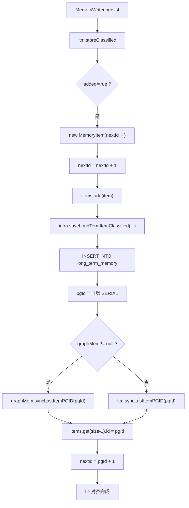
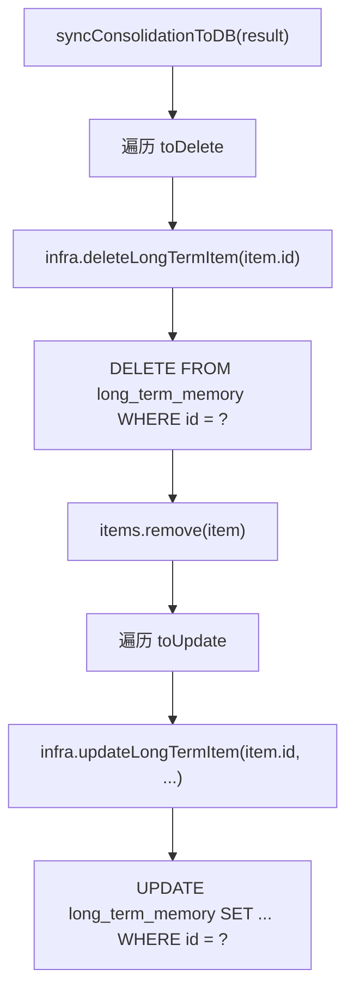

# 20 数据库同步与 ID 对齐

## 1. 一句话结论

ID 对齐解决一个问题：**内存里的临时 ID 和数据库里的真实 ID 需要保持一致。**

写入过程：

```text
nextId=0 → MemoryItem.id=0 (临时) → savePG 返回 pgId=135 → syncLastItemPGID(135) → id=135, nextId=136
```

一句话记住：

```text
写入时用 nextId++ 分配临时 ID，保存到 PostgreSQL 后用 pgId 覆盖，保证内存/数据库/Neo4j 三者的 ID 一致。
```

## 2. 它在主链路里的位置

ID 对齐发生在每次长期记忆写入数据库之后：

```text
MemoryWriter.persist
  ① storeClassified → added=true
  ② infra.saveLongTermItemClassified → 返回 pgId
  ③ ltm.syncLastItemPGID(pgId)   ← 对齐
  ④ 或者 graphMem.syncLastItemPGID(pgId)
```

Consolidation 同步也涉及 ID：

```text
syncConsolidationToDB
  ① infra.deleteLongTermItem(id)     → DELETE WHERE id=?
  ② infra.updateLongTermItem(id, ...)  → UPDATE WHERE id=?
```

## 3. 为什么需要它

### 内存和数据库的 ID 来源不同

```text
内存（LongTermMemory.items）：
  MemoryItem.id = nextId++ → 0, 1, 2, 3...

数据库（PostgreSQL long_term_memory）：
  id = SERIAL → 自增主键 → 135, 136, 137...
```

如果不对齐，会出现：

```text
内存里说：这个 MemoryItem 的 id 是 0
数据库里说：这条记录的主键是 135
两者不一致 → 跨层查询、删除、更新都无法关联
```

### ID 不一致导致的后果

| 场景 | 问题 |
|---|---|
| 删除记忆 | 内存 id=0 → DELETE WHERE id=0 → 删错了（PG 里没有 id=0） |
| 更新记忆 | 同上 |
| Neo4j 节点 | 图节点的 mem_id 属性是 0，但 PG 里是 135 → 两个存储层的同一条记忆指向不同 ID |
| 调用方查询 | 任何通过 ID 查询的操作都可能返回错误结果 |

**ID 对齐保证了三个存储层（内存 + PostgreSQL + Neo4j）的同一条记忆有相同的 ID。**

## 4. 对应源码位置

| 文件 | 方法 | 作用 |
|---|---|---|
| `LongTermMemory.java` | `syncLastItemPGID(pgId)` | 替换 items 最后一条 id |
| `LongTermMemory.java` | `syncConsolidationToDB(result)` | 根据 ID 删除/更新 |
| `GraphMemory.java` | `syncLastItemPGID(pgId)` | 替换 + 重置 nextId + 更新 Neo4j |
| `InfrastructureService.java` | `saveLongTermItemClassified(...)` | 返回 pgId |
| `InfrastructureService.java` | `deleteLongTermItem(int id)` | 按 id 删除 |
| `InfrastructureService.java` | `updateLongTermItem(int id, ...)` | 按 id 更新 |
| `PostgresConnector.java` | `CREATE TABLE long_term_memory` | SERIAL 主键 |

## 5. 先看 ID 长什么样

### 5.1 内存 ID（写入前的临时 ID）

```java
// LongTermMemory.java
private int nextId = 0;

// 创建新的 MemoryItem 时
MemoryItem item = new MemoryItem(nextId++, content, importance, embedding);
```

ID 的值：

```text
第一次创建: item.id = 0, nextId = 1
第二次创建: item.id = 1, nextId = 2
第三次创建: item.id = 2, nextId = 3
```

### 5.2 PostgreSQL ID（写入后的真实 ID）

```sql
CREATE TABLE IF NOT EXISTS long_term_memory (
    id SERIAL PRIMARY KEY,
    content TEXT NOT NULL,
    ...
);
```

SERIAL 自增主键，值可能不是从 0 开始的：

```text
INSERT → 返回 id = 135
INSERT → 返回 id = 136
INSERT → 返回 id = 137
```

### 5.3 对齐后的 ID

```text
syncLastItemPGID(135) 后：
  items.get(size-1).id = 0 → 135
  nextId = 136
```

最终三个存储层的一致性：

```text
内存: MemoryItem{id=135, content="用户姓名: 小李", ...}
PG:  long_term_memory 行 (id=135, content="用户姓名: 小李", ...)
Neo4j: (:Memory {mem_id: 135, content: "用户姓名: 小李"})
```

## 6. 核心流程图



Consolidation 同步流程：



## 7. 源码逐段讲解

### 7.1 nextId 初始值和增长

原文件：`LongTermMemory.java`

```java
private int nextId = 0;
```

**nextId 初始为 0，意味着临时 ID 从 0 开始。**

```text
nextId=0 → 新记忆 id=0, nextId=1
nextId=1 → 新记忆 id=1, nextId=2
...
nextId=134 → 新记忆 id=134, nextId=135
```

**syncLastItemPGID 后 nextId 被改写：**

```java
public void syncLastItemPGID(int pgId) {
    if (items.isEmpty() || pgId <= 0) return;
    MemoryItem last = items.get(items.size() - 1);
    last.setId(pgId);     // 临时 ID → 数据库 ID
    nextId = pgId + 1;    // 下次创建从 pgId+1 开始
}
```

**为什么 nextId 要从 pgId+1 开始？**

```text
假设上一轮 sync 后 nextId=136。

如果保持 nextId=136：
  下一次创建: new MemoryItem(136, ...), nextId=137
  保存 PG: pgId 从数据库自增 → 假设也是 136
  → 内存 ID 和 PG ID 一致 ✅

如果不更新 nextId：
  nextId 继续自增 → 下一次创建: new MemoryItem(135, ...)
  保存 PG: pgId = 136
  → 内存 ID=135，PG ID=136 → 不一致 ❌
```

**如果程序重启了呢？**

```text
重启后 nextId=0（重新初始化）。
restoreFromDB 会从数据库加载所有现有记忆：
  ① 遍历 long_term_memory 表，创建 MemoryItem
  ② setId(pgId) → items 里 id 变成数据库 ID
  ③ nextId = max(items.id) + 1

所以：
  nextId = 初始 0
  restore 后 nextId = maxPGId + 1
  写入新记忆 → ID 和 PG 自增对齐
```

### 7.2 ltm.syncLastItemPGID — 长期记忆对齐

```java
public void syncLastItemPGID(int pgId) {
    if (items.isEmpty() || pgId <= 0) return;  // 没有新增或 pgId 无效 → 跳过
    MemoryItem last = items.get(items.size() - 1);  // 最后一条
    last.setId(pgId);    // 替换为数据库真实 ID
    nextId = pgId + 1;   // 更新 nextId 防止碰撞
}
```

**为什么找最后一条？**

```text
MemoryWriter 是按顺序写入的：
  storeClassified → added=true → items.add(item)
  → savePG → syncLastItemPGID

items 的添加和 syncLastItemPGID 在同一个请求线程里是串行的。
所以 items 的最后一条 = 刚刚新增的那一条 = 刚刚保存 PG 的那一条。
```

**小心并发问题：**

```text
如果多个线程同时写入：
  线程 A: items.add(A) → savePG(A) → syncLastItemPGID(pgIdA)
  线程 B: items.add(B) → savePG(B)

syncLastItemPGID 假设 items.get(size-1) 就是 A。
但如果线程 B 的 add 在 sync 之前执行了：
  items = [..., A, B]
  syncLastItemPGID 修改的是 B 的 id，不是 A 的！

当前单用户场景下并发概率低。生产环境需要加锁。
```

### 7.3 graphMem.syncLastItemPGID — 图记忆对齐

```java
// GraphMemory.java
public void syncLastItemPGID(int pgId) {
    if (items.isEmpty() || pgId <= 0) return;
    MemoryItem last = items.get(items.size() - 1);
    last.setId(pgId);              // 步骤 1：替换内存 ID
    graphNextId = pgId + 1;        // 步骤 2：更新图记忆 nextId
    // 步骤 3：更新 Neo4j 节点的 mem_id
    upsertMemoryNode(pgId, last.getContent(), last.getImportance());
}
```

**比 ltm.syncLastItemPGID 多了两个操作：**

| 操作 | 说明 |
|---|---|
| `graphNextId = pgId + 1` | 图记忆有自己的 nextId |
| `upsertMemoryNode(pgId, ...)` | 用真实 ID 更新 Neo4j 节点 |

**upsertMemoryNode 干什么？**

```text
原来 Neo4j 节点创建时用的是临时 ID（比如 mem_id=0）。
sync 后把 mem_id 改为 pgId（比如 mem_id=135）。

如果同步前就已经创建了节点（异步写 Neo4j）：
  → 覆盖 mem_id 属性
  → 同时更新 content 和 importance

如果还没创建节点：
  → 创建新节点，mem_id 直接用 pgId
```

### 7.4 Consolidation 的 ID 删除

```java
private void syncConsolidationToDB(ConsolidationResult result) {
    for (MemoryItem item : result.getToDelete()) {
        infra.deleteLongTermItem(item.getId());  // DELETE WHERE id = item.getId()
    }
    for (MemoryItem item : result.getToUpdate()) {
        infra.updateLongTermItem(item.getId(), item.getContent(), ...);  // UPDATE WHERE id = item.getId()
    }
    storeCount = 0;
}
```

**为什么要依赖 ID？**

```text
consolidate 处理的是内存里的 MemoryItem。
它的 id 已经是 sync 过的 pgId（因为之前在写入时已经对齐了）。

DELETE WHERE id = 135 → 删除 PG 里 id=135 的行
UPDATE WHERE id = 10  → 更新 PG 里 id=10 的行
```

如果 ID 没有对齐：

```text
consolidate 认为 id=0 要删除 → DELETE WHERE id=0
PG 里没有 id=0 → 删了个寂寞
```

### 7.5 完整的 ID 生命周期

```text
程序启动
  │
  ├── nextId = 0
  │
  ├── restoreFromDB:
  │     load all items from PG
  │     for each: MemoryItem.setId(pgId)
  │     nextId = max(pgId) + 1
  │
  ├── 用户说"我叫小李" → MemoryWriter.persist
  │     │
  │     ├── new MemoryItem(nextId, ...)       id = 136, nextId = 137
  │     ├── items.add(item)                   list: [..., id=136]
  │     │
  │     ├── infra.saveLongTermItemClassified  PG id = 201 (SERIAL 自增)
  │     │
  │     └── syncLastItemPGID(201)
  │           items.get(size-1).id = 136 → 201
  │           nextId = 202
  │
  ├── 用户说"我住上海" → MemoryWriter.persist
  │     ├── new MemoryItem(nextId, ...)       id = 202, nextId = 203
  │     ├── ...savePG... pgId = 202
  │     └── syncLastItemPGID(202)
  │           items.get(size-1).id = 202 (匹配 ✅)
  │           nextId = 203
  │
  ├── 下次启动
  │     restoreFromDB:
  │       加载 id=201(id对齐后), id=202(id对齐后)
  │       nextId = max(201, 202) + 1 = 203
  │
  └── 重新启动后，ID 依然一致 ✅
```

## 8. 真实举例：它在流程中怎么运行

### 8.1 首次写入

```text
① new MemoryItem(nextId=0, "用户姓名: 小李", ...)
   → id = 0, nextId = 1

② items.add(item)
   items = [MemoryItem{id=0, content="用户姓名: 小李"}]

③ saveLongTermItemClassified → pgId = 135

④ syncLastItemPGID(135)
   items.get(size-1).id = 0 → 135
   nextId = 136
```

### 8.2 第二次写入

```text
① new MemoryItem(nextId=136, "用户城市: 上海", ...)
   → id = 136, nextId = 137

② items.add(item)
   items = [..., MemoryItem{id=136, content="用户城市: 上海"}]

③ saveLongTermItemClassified → pgId = 136 (巧合和 nextId 一样)
   或者 pgId = 250 (如果数据库之前有 249 行）
   这里假设 pgId = 136

④ syncLastItemPGID(136)
   items.get(size-1).id = 136 → 136 (已经很一致了 ✅)
   nextId = 137
```

### 8.3 Consolidation 删除

```text
consolidate 决定删除 id=0（某条旧记忆的临时 ID）

等等——不对。consolidate 时 id 已经被 sync 过了。

实际情况：
  MemoryItem{id=135, content="用户姓名: 小李"}  // id 已对齐
  MemoryItem{id=136, content="用户城市: 上海"}   // id 已对齐

consolidate 删除 id=135 → DELETE WHERE id=135 → PG 里删对了 ✅
```

## 9. 用一个完整例子跑一遍

### 初始状态

```text
程序第一次启动。
nextId = 0
items = []
PG long_term_memory 表：empty
graphMem = null（没有图记忆）
```

### 用户说"我叫小李"

```text
MemoryWriter.persist 开始：

① storeClassified → added=true
   new MemoryItem(nextId=0, "用户姓名: 小李", 0.9, emb)
   → item.id = 0, nextId = 1
   → items.add(item)
   → items = [MemoryItem{id=0, content="用户姓名: 小李"}]

② saveLongTermItemClassified
   INSERT INTO long_term_memory (content, importance, embedding, category, tags, slot_hint)
   VALUES ('用户姓名: 小李', 0.9, '[...]', 'identity', '["姓名"]', 'Profile');
   → 返回 pgId = 135

③ ltm.syncLastItemPGID(135)
   → items.get(0).id = 0 → 135
   → nextId = 136

最终状态：
  items = [MemoryItem{id=135, content="用户姓名: 小李"}]
  nextId = 136
  PG: (id=135, content="用户姓名: 小李")
```

### 用户说"我住上海"

```text
① new MemoryItem(nextId=136, "用户城市: 上海", 0.9, emb)
   → item.id = 136, nextId = 137
   → items = [MemoryItem{id=135}, MemoryItem{id=136}]

② saveLongTermItemClassified → pgId = 136

③ syncLastItemPGID(136)
   → items.get(1).id = 136 → 136 (已经一致)
   → nextId = 137

最终状态：
  items = [
    MemoryItem{id=135, content="用户姓名: 小李"},
    MemoryItem{id=136, content="用户城市: 上海"}
  ]
  nextId = 137
  PG: (id=135, ...), (id=136, ...)
```

### 程序重启后

```text
① nextId = 0（重新初始化）

② restoreFromDB:
   加载 PG 所有 long_term_memory:
     MemoryItem{id=135, content="用户姓名: 小李"}
     MemoryItem{id=136, content="用户城市: 上海"}
   遍历设置 id:
     setId(135), setId(136)
   nextId = max(135, 136) + 1 = 137

③ 恢复后：
   items = [MemoryItem{id=135}, MemoryItem{id=136}]
   nextId = 137
```

### 重启后用户再说"我 25 岁"

```text
① new MemoryItem(nextId=137, "用户年龄: 25", 0.9, emb)
   → item.id = 137, nextId = 138

② saveLongTermItemClassified → pgId = 137

③ syncLastItemPGID(137)
   → items.get(2).id = 137 (pgId = nextId = 137，完美对齐 ✅)
```

## 10. 关键判断条件

| 判断点 | 条件 | true 时 | false 时 |
|---|---|---|---|
| syncLastItemPGID | items.isEmpty() | 跳过 | 继续执行 |
| syncLastItemPGID | pgId <= 0 | 跳过 | 继续执行 |
| syncLastItemPGID | 有最后一条 | 替换 id、更新 nextId | — |
| consolidate 删除 | item.getId() | DELETE WHERE id = ? | — |
| consolidate 更新 | item.getId() | UPDATE WHERE id = ? | — |
| restoreFromDB | items 加载完成 | setId + 更新 nextId | — |
| nextId 增长 | 创建新 MemoryItem | id = nextId, nextId++ | — |

## 11. 容易混淆的点

### 11.1 nextId 不是数据库的 sequence

```text
nextId 是 Java 内存里的计数器。
PG 的 SERIAL 是数据库自己的自增序列。

两者互相独立。
syncLastItemPGID 把它们对齐。
```

### 11.2 不是所有 MemoryItem 都需要 sync

```text
syncLastItemPGID 只处理"刚刚新增的那条"。
（items.get(size-1)）

不是遍历全量 items。
```

### 11.3 Consolidation 时的 ID 已经是 sync 过的

```text
consolidate 是在写入之后触发的。
写入时已经 sync 过 ID 了。
所以 consolidate 操作 items 时，所有 id 都是 PG ID。
```

### 11.4 graphMem.syncLastItemPGID 额外更新 Neo4j

```text
不是只改内存 ID。
它还 upsertMemoryNode 用 pgId 更新 Neo4j 节点。
```

### 11.5 如果 savePG 成功但 sync 失败了

```text
后果：
  内存里 MemoryItem.id 还是临时 ID（0, 1, 2...）
  PG 里对应的行是真实 ID（135, 136...）
  → 不一致

例如：
  consolidate 删除 id=0 → PG DELETE WHERE id=0 → 没有 id=0 → 删不掉
  这条记忆永远留在 PG 里了（僵尸数据）
```

## 12. 和其他模块的关系

### 12.1 和 LongTermMemory

`ltm.syncLastItemPGID` 替换 LongTermMemory 里的 MemoryItem.id。

### 12.2 和 GraphMemory

`graphMem.syncLastItemPGID` 替换 + 额外更新 Neo4j 节点。

### 12.3 和 InfrastructureService

`infra.saveLongTermItemClassified` 返回 pgId，这是 ID 对齐的源头。

`infra.deleteLongTermItem(id)` 和 `infra.updateLongTermItem(id, ...)` 依赖对齐后的 ID。

### 12.4 和 PostgreSQL

`long_term_memory` 表的 `id SERIAL PRIMARY KEY` 生成 pgId。

### 12.5 和 Neo4j

GraphMemory 在 sync 时通过 `upsertMemoryNode` 更新 Neo4j 节点的 mem_id。

## 13. 如果要改这个功能，改哪里

| 需求 | 修改位置 | 怎么改 | 风险 |
|---|---|---|---|
| 修复并发写入 ID 错乱 | `syncLastItemPGID` | 加 synchronized | 性能下降 |
| ID 生成改用 UUID | `MemoryItem` + `LongTermMemory` | 改 id 类型为 String | 影响所有关联方法 |
| 不依赖最后一条 | `syncLastItemPGID` | 传 item 引用而不是找 last | 改动较大 |
| 补充 Neo4j 同步 | `syncConsolidationToDB` | 加 Neo4j 删除/更新 | 和 GraphMemory 耦合 |
| restore 时重建 ID | `restoreFromDB` | 重新分配 ID 而不是用 PG ID | 现有引用关系断裂 |
| 重启后 nextId 对齐 | `restoreFromDB` | 确保 nextId = max(pgId) + 1 | 忘了改会导致 ID 碰撞 |

## 14. 面试怎么说

完整说法：

```text
ID 对齐是指内存里的 MemoryItem.id 和 PostgreSQL 自增主键之间的同步。写入时 LongTermMemory 先分配 nextId++ 作为临时 ID，保存到数据库后拿到自增 pgId，通过 syncLastItemPGID 覆盖内存里最后一条 MemoryItem 的 id，同时更新 nextId = pgId + 1。这样后续写入的临时 ID 天然对齐 pgId。如果开启了图记忆，GraphMemory.syncLastItemPGID 还会额外 upsert Neo4j 节点，保证三个存储层 ID 一致。Consolidation 删除和更新时也依赖这个对齐后的 ID 来操作数据库。
```

如果问"不对齐会怎样"：

```text
最直接的问题是 consolidate 无法正确删除或更新数据库记录——它会按内存 ID 去 DELETE/UPDATE，但内存 ID 和数据库 ID 不一致，导致操作错位。此外，Neo4j 的图节点也会和 PG 记录失联。
```

如果问"重启后 ID 会怎么恢复"：

```text
restoreFromDB 会加载所有 PG 长期记忆，用 setId 把数据库 ID 写回 MemoryItem，然后 nextId = max(pgId) + 1。所以重启后 ID 仍然是连续的，和数据库自增序列保持一致。
```

## 15. 自检题

1. `nextId` 和 `pgId` 分别代表什么？
2. `syncLastItemPGID` 为什么找 items 的最后一条？
3. 不对齐 ID 会有什么后果？
4. `graphMem.syncLastItemPGID` 和 `ltm.syncLastItemPGID` 有什么不同？
5. Consolidation 删除时，用的是哪个 ID？
6. 程序重启后，nextId 是怎么恢复的？
7. 如果 savePG 成功但 syncLastItemPGID 失败了，会怎样？
8. 什么情况下 syncLastItemPGID 会跳过（什么都不做）？
9. 为什么 sync 后 nextId 要设为 pgId + 1？
10. 如果要支持 UUID 作为 ID，需要改哪些文件？
