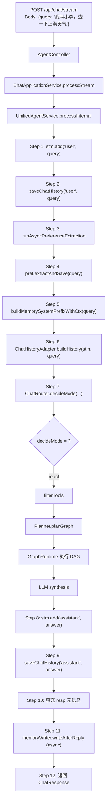

# 21 完整例子跑一遍

## 1. 一句话结论

本文用一个真实请求跟踪全链路：从用户发 POST 到返回 ChatResponse，展示每一步的变量值、中间结果和最终输出。

一句话记住：

```text
从头到尾跟一遍，每个变量的值都记下来，就是最好的学习方式。
```

## 2. 它在主链路里的位置

这是**综合篇** — 它不单独讲解某一个模块，而是把前面 20 篇的模块串起来，展示一次请求的完整流程。

```text
请求进 → Controller 接 → Route 决 → Mode 执 → Memory 写 → Response 出
```

## 3. 为什么需要它

分散学习的每个模块只有局部视角：

```text
ShortTermMemory — 只看消息列表。
ChatRouter — 只看关键词匹配。
ToolModeHandler — 只看单工具调用。
MemoryWriter — 只看异步记忆写入。
```

**但面试官问的是："一个请求从进到出，经历了哪些步骤？"**

没有一篇综合例子，很难把 20 个模块串起来。

**这篇就是用来串的。**

## 4. 对应源码位置

主要入口文件：

| 文件 | 这一轮请求里的角色 |
|---|---|
| `AgentController.java` | 接收 HTTP 请求 |
| `ChatApplicationService.java` | 应用层调度 |
| `UnifiedAgentService.java` | 主链路调度 |
| `ChatRouter.java` | 模式路由 |
| `ToolModeHandler.java` | tool 模式执行 |
| `ShortTermMemory.java` | 短期记忆 |
| `PreferenceMemory.java` | 偏好提取 |
| `LongTermMemory.java` | 长期记忆（用于 storeClassified 和 recall） |
| `MemoryWriter.java` | 回复后异步写入 |
| `ChatHistoryAdapter.java` | 短期记忆转 histMsgs |
| `ContextAssembler.java` | 构建 memPrefix |
| `ChatResponse.java` | 最终返回 |

## 5. 假设条件和初始状态

### 系统配置

```text
shortTermMaxTurns = 5  → 最多保留 10 条消息
triggerInterval = 5     → 每新增 5 条记忆触发 consolidation
dedupThreshold = 0.8    → embedding 相似度 >= 0.8 认为重复
cfg.isRealLLM() = true  → 有真实 API Key
graphMem = null         → 未启用图记忆
```

### 当前系统状态（这条请求来之前）

```text
stm.messages = []                 ← 短期记忆为空（刚启动，第 1 轮）
pref.data = {}                    ← 偏好为空（还没抽过偏好）
ltm.items = []                    ← 长期记忆为空（还没存过）
ltm.nextId = 0                    ← 下一个临时 ID
pref.maxTurns = 5                 ← 偏好不限制窗口
MemoryWriter 还没有启动过         ← 这是个新会话
```

## 6. 核心流程图



## 7. 逐段讲解 — 从请求到响应的每一行

### Step 0: 前端发起 HTTP 请求

```text
请求：
  POST http://localhost:8080/api/chat/stream
  Content-Type: application/json

  Body:
  {
    "query": "我叫小李，查一下上海天气怎么样"
  }
```

### Step 1: AgentController 接收

```text
HTTP 请求到达 Spring Boot 的 Controller 层。

AgentController 或 ChatController 的反序列化：
  String query = body.get("query")
  → query = "我叫小李，查一下上海天气怎么样"
```

### Step 2: ChatApplicationService.processStream

```text
Controller 调用 service：

  ChatApplicationService.processStream(query)
  → 调用 UnifiedAgentService.processInternal(query)
```

`processInternal` 是整个主链路的入口。

### Step 3: stm.add("user", query) — 写入短期记忆

```java
stm.add("user", query);
```

执行过程：

```text
① 创建 ConversationMessage：
   role = "user"
   content = "我叫小李，查一下上海天气怎么样"
   timestamp = "14:30:00"  ← LocalTime.now()

② messages.add(new ConversationMessage(...))
   messages = [
     ConversationMessage{role="user", content="我叫小李，查一下上海天气怎么样", timestamp="14:30:00"}
   ]

③ 裁剪窗口：
   max = maxTurns * 2 = 5 * 2 = 10
   messages.size() = 1
   1 > 10? 否 → 不裁剪
```

此时 STM 状态：

```text
stm.messages = [
  ConversationMessage{role="user", content="我叫小李，查一下上海天气怎么样", timestamp="14:30:00"}
]
stm.size() = 1
```

### Step 4: infra.saveChatHistory("user", query) — 保存聊天历史

```java
infra.saveChatHistory("user", query);
```

执行过程：

```text
infra → ChatHistoryRepository.save("user", "我叫小李，查一下上海天气怎么样")

SQL:
  INSERT INTO chat_history (role, content)
  VALUES ('user', '我叫小李，查一下上海天气怎么样');
```

数据库状态：

```text
chat_history 表：
  | id | role | content                        | created_at          |
  |----|------|--------------------------------|---------------------|
  | 1  | user | 我叫小李，查一下上海天气怎么样  | 2026-06-22 14:30:00 |
```

此时 `infra` 返回给主链路，不返回任何值（void）。

### Step 5: runAsyncPreferenceExtraction — 异步偏好抽取

```java
runAsyncPreferenceExtraction(query);
```

这是一个**异步**操作：`pref.extractAndSave(query)` 在后台线程执行。

异步的意思是：

```text
主线程：调用 runAsyncPreferenceExtraction
       → 启动后台线程
       → 主线程继续走，不等它完成
       ↓
后台线程：pref.extractAndSave(query)
        → 轻量级规则匹配
        → 匹配到 "我叫" → 提取 key="姓名", value="小李"
        → pref.save("姓名", "小李")
        → resp.setExtractedInfo("已记住：姓名 = 小李")
        → 异步 LLM 抽取（如果配置了）
```

**为什么异步？** 因为 LLM 抽取可能慢，不能阻塞主响应。

**但等一下——** 这里有个关键点：`resp.setExtractedInfo` 在后台上执行，而此时 resp 对象被主线程和后台线程共享。主线程构造 ChatResponse 时可能还没看到 extractedInfo。所以：

```text
提取到的 extractedInfo 可能出现在本次响应，也可能出现在下次。
取决于后台线程跑得快不快。
```

我们假设它跑得快（轻量级规则而已），所以 extractedInfo 被设置了。

**pref.extractAndSave(query) 内部执行，轻量级规则部分：**

```text
query = "我叫小李，查一下上海天气怎么样"

匹配规则：
  contains("我叫")
    → true → extract("我叫小李，查一下上海天气怎么样", "我叫")
    → split("我叫", 2) → ["", "小李，查一下上海天气怎么样"]
    → left = "小李，查一下上海天气怎么样"
    → 进一步 split("查") → ["小李，", "一下上海天气怎么样"]
    → key = "姓名", value = "小李"
    → pref.save("姓名", "小李")  ← 写入 PreferenceMemory
    
  pref.data = {"姓名": "小李"}
  
  resp.setExtractedInfo("已记住：姓名 = 小李")
```

**然后异步 LLM 抽取部分**（如果配置了 `llm.extractPreferences`）：

```text
异步线程：llm.extractPreferences(query)
  → LLM 从 query 中识别更多偏好
  → 假设没有更多 → 什么都不做
```

### Step 6: buildMemorySystemPrefixWithCtx(query) — 构建记忆前缀

```java
String memPrefix = buildMemorySystemPrefixWithCtx(query);
```

这个方法内部：

```java
public String buildMemorySystemPrefixWithCtx(String query) {
    // 构建偏好上下文
    String prefCtx = pref.buildContext();
    
    // 长期记忆召回
    List<MemoryItem> recalled = ltm.recall(query, recallLimit);
    
    // 拼接
    StringBuilder sb = new StringBuilder();
    if (prefCtx != null && !prefCtx.isEmpty()) {
        sb.append("【用户偏好】\n").append(prefCtx).append("\n\n");
    }
    if (recalled != null && !recalled.isEmpty()) {
        sb.append("【相关记忆】\n");
        for (MemoryItem item : recalled) {
            sb.append("- ").append(item.getContent()).append("\n");
        }
    }
    return sb.toString().trim();
}
```

**执行过程：**

```text
① pref.buildContext()
   pref.data = {"姓名": "小李"}
   
   buildContext 内部遍历 Map:
     for (Map.Entry<String, String> entry : data.entrySet()):
       sb.append(entry.getKey()).append(": ").append(entry.getValue()).append("\n")
   
   输出：
     "姓名: 小李"

② ltm.recall(query, recallLimit)
   query = "我叫小李，查一下上海天气怎么样"
   假设 recallLimit = 5
   
   recall 内部：
     a. llm.embed(query) → embedding [0.01, -0.02, 0.05, ...]
     b. 遍历 ltm.items = [] → 空列表
     c. 返回 []
   
   没有可召回的长期记忆。

③ 拼接 memPrefix:
   sb = ""
   prefCtx = "姓名: 小李" → 非空 → sb.append("【用户偏好】\n姓名: 小李\n\n")
   recalled = [] → 跳过
   result = "【用户偏好】\n姓名: 小李"
```

最终：

```text
memPrefix = "【用户偏好】\n姓名: 小李"
```

### Step 6.5: 构建 system prompt

```java
String basePrompt = "你是一个简洁的AI助手。结合你掌握的用户信息，使回答更个性化。";
String sp = ChatHistoryAdapter.buildSystemPrompt(memPrefix, basePrompt);
```

```text
buildSystemPrompt:
  memPrefix = "【用户偏好】\n姓名: 小李"
  basePrompt = "你是一个简洁的AI助手。结合你掌握的用户信息，使回答更个性化。"

  if (memPrefix != null && !memPrefix.isEmpty()) {
    return memPrefix + "\n\n" + basePrompt;
  }

  result = "【用户偏好】\n姓名: 小李\n\n你是一个简洁的AI助手。结合你掌握的用户信息，使回答更个性化。"
```

### Step 7: ChatHistoryAdapter.buildHistory — 短期记忆转 histMsgs

```java
List<Map<String, String>> histMsgs = ChatHistoryAdapter.buildHistory(stm, query);
```

执行过程：

```text
① 遍历 stm.getMessages()：
   第 1 条：ConversationMessage{role="user", content="我叫小李，查一下上海天气怎么样"}
     → "user".equals(role) → true → 加入 histMsgs
     → msgs = [{"role": "user", "content": "我叫小李，查一下上海天气怎么样"}]

② 检查最后一条是不是当前 query：
   msgs 不为空，最后一条 content = "我叫小李，查一下上海天气怎么样"
   query = "我叫小李，查一下上海天气怎么样"
   equals → true → 不追加

③ 返回 histMsgs
```

最终：

```text
histMsgs = [
  {"role": "user", "content": "我叫小李，查一下上海天气怎么样"}
]
```

### Step 8: ChatRouter.decideMode — 决定路由模式

```java
String mode = ChatRouter.decideMode(query, explicit, useRag, selectedTools, ragLoaded);
// 参数：query, explicit=false, useRag=false, selectedTools=null, ragLoaded=false
```

`decideMode` 内部执行：

```text
① explicit = false → 走自动判断

② needReAct(query):
   q = "我叫小李，查一下上海天气怎么样"
   count = 0
   "时间"/"几点" → 不包含 → count=0
   "天气" → 包含 → count=1
   "总结"/"汇总" → 不包含 → count=1
   "查"/"搜索" → 包含 "查" → count=2
   count = 2 >= 2 → return true → "react" ✅
```

**所以 mode = "react"。**

### Step 9: ReAct 链路：filterTools

因为 mode 是 react，不走 chat、tool、rag 分支，走 react 分支。

```java
// 伪代码
Map<String, Tool> ts = filterTools(query);
```

`filterTools` 做什么？

```text
遍历所有已注册的工具，匹配 query 里的关键词。

假设项目里有：
  get_weather  → 匹配关键词: ["天气", "温度"]
  search_web   → 匹配关键词: ["搜索", "查", "查找"]
  calculator   → 匹配关键词: ["计算", "加", "减", "乘", "除"]
  send_email   → 不匹配

query = "我叫小李，查一下上海天气怎么样"

匹配结果：
  get_weather: 包含 "天气" → 命中 ✅
  search_web: 包含 "查" → 命中 ✅
  calculator: 不包含任何关键词 → 不命中 ❌
  send_email: 不包含任何关键词 → 不命中 ❌
```

最终：

```text
ts = {
  "get_weather": Tool{name="get_weather", ...},
  "search_web": Tool{name="search_web", ...}
}
```

### Step 10: ReAct 链路：Planner.planGraph

```java
Graph graph = Planner.planGraph(query, ts, histMsgs, sp);
```

Planner 把 query + 工具列表发给 LLM，让 LLM 规划 DAG。

**LLM 的输入 prompt 包含：**

```text
系统：你是一个任务规划器。基于用户问题和可用工具，规划一个 DAG。
可用工具：
  - get_weather: 查询天气，参数 city
  - search_web: 搜索信息，参数 query

用户问题：我叫小李，查一下上海天气怎么样

请返回 JSON 格式的任务图...
```

**LLM 输出（假设）：**

```json
{
  "nodes": [
    {
      "id": "n1",
      "tool": "get_weather",
      "args": {"city": "上海"},
      "description": "查询上海天气"
    },
    {
      "id": "n2",
      "tool": "search_web",
      "args": {"query": "上海天气"},
      "description": "搜索上海天气相关信息"
    }
  ],
  "edges": []
}
```

Planner 解析 JSON → 构建 Graph 对象：

```text
Graph {
  nodes = [
    Node{id="n1", tool="get_weather", args={city="上海"}, dependsOn=[]},
    Node{id="n2", tool="search_web", args={query="上海天气"}, dependsOn=[]}
  ]
  edges = []  // 两个节点没有依赖关系
}
```

**注意：** edges 为空意味着两个节点可以**并行执行**。

### Step 11: ReAct 链路：GraphRuntime 执行 DAG

```java
GraphRuntime runtime = new GraphRuntime(graph, llm, toolExecutor);
runtime.execute();
```

GraphRuntime 使用拓扑排序执行。

**拓扑排序结果：**

```text
Layer 0: [n1, n2]  // 两个节点都没有依赖，可以并行
```

**执行过程：**

```text
① Layer 0 开始：
   n1 和 n2 的 Semaphore 各获得 1 个许可。

② n1 (get_weather, city=上海):
   发送 SSE: nodeStart → {nodeId:"n1", toolName:"get_weather"}
   
   ToolHandler.getExecute() 创建执行器:
     → ExecuteFunction: (args) -> weatherService.query(args.city)
   
   apply({city:"上海"}):
     → HTTP 调用天气 API
     → 返回: "上海天气：小雨，20°C，湿度85%"
   
   发送 SSE: observation → "正在调用 get_weather(city=上海)..."
   发送 SSE: nodeDone → {nodeId:"n1", result:"上海天气：小雨，20°C，湿度85%"}
   
   n1 完成，释放 Semaphore，CountDownLatch countDown。

③ n2 (search_web, query=上海天气):
   发送 SSE: nodeStart → {nodeId:"n2", toolName:"search_web"}
   
   ExecuteFunction: (args) -> webSearchService.search(args.query)
   
   apply({query:"上海天气"}):
     → HTTP 调用搜索 API
     → 返回: "搜索到上海天气相关信息：今天小雨，建议带伞..."
   
   发送 SSE: observation → "正在搜索 上海天气..."
   发送 SSE: nodeDone → {nodeId:"n2", result:"搜索到上海天气相关信息：今天小雨..."}
   
   n2 完成。

④ 所有节点完成：
   发送 SSE: graphReady → {}
   
   LLM synthesis：
     把 n1 和 n2 的结果发给 LLM，让 LLM 合成最终回答。
     
     LLM 输入：
       get_weather 结果：上海天气：小雨，20°C，湿度85%
       search_web 结果：搜索到上海天气相关信息：今天小雨，建议带伞...
     
     LLM 输出：
       "上海今天小雨，20°C，湿度85%。建议出门带伞，穿防滑鞋。你叫小李对吧？我已经记住了！"
```

### Step 12: stm.add("assistant", answer) — 保存助手回答到短期记忆

```java
stm.add("assistant", resp.getAnswer());
```

执行过程：

```text
① 创建 ConversationMessage：
   role = "assistant"
   content = "上海今天小雨，20°C，湿度85%。建议出门带伞，穿防滑鞋。你叫小李对吧？我已经记住了！"
   timestamp = "14:30:15"

② messages.add(new ConversationMessage(...))
   messages = [
     ConversationMessage{role="user", content="我叫小李，查一下上海天气怎么样", timestamp="14:30:00"},
     ConversationMessage{role="assistant", content="上海今天小雨...", timestamp="14:30:15"}
   ]

③ 裁剪窗口：
   max = 10
   messages.size() = 2
   2 > 10? 否 → 不裁剪
```

此时 STM 状态：

```text
stm.messages = [
  ConversationMessage{role="user",   content="我叫小李，查一下上海天气怎么样", timestamp="14:30:00"},
  ConversationMessage{role="assistant", content="上海今天小雨...", timestamp="14:30:15"}
]
stm.size() = 2
```

### Step 13: infra.saveChatHistory("assistant", answer)

```java
infra.saveChatHistory("assistant", resp.getAnswer());
```

```text
SQL:
  INSERT INTO chat_history (role, content)
  VALUES ('assistant', '上海今天小雨，20°C，湿度85%。建议出门带伞，穿防滑鞋。你叫小李对吧？我已经记住了！');
```

数据库状态：

```text
chat_history 表：
  | id | role      | content                                          | created_at          |
  |----|-----------|--------------------------------------------------|---------------------|
  | 1  | user      | 我叫小李，查一下上海天气怎么样                    | 2026-06-22 14:30:00 |
  | 2  | assistant | 上海今天小雨，20°C...你叫小李对吧？我已经记住了！ | 2026-06-22 14:30:15 |
```

### Step 14: 填充响应元信息

```java
resp.setShortTermCount(stm.size());     // stm.size() = 2
resp.setLongTermCount(ltm.size());      // ltm.items.size() = 0
resp.setPreferences(pref.getData());    // {"姓名": "小李"}
```

### Step 15: memoryWriter.writeAfterReply(query, answer) — 异步写记忆

```java
memoryWriter.writeAfterReply(query, resp.getAnswer());
```

**这个调用不阻塞——立即返回。**

后台线程开始执行 `writeNow`：

```text
writeNow 判断：
  answer = "上海今天小雨..." → 非空 ✅
  cfg.isRealLLM() = true → ✅

classify(answer):
  LLM 从 answer 中抽取分类记忆：
  
  LLM 输入：助手回答 + 分类 prompt
  LLM 输出：
  {
    "items": [
      {
        "category": "identity",
        "content": "用户姓名: 小李",
        "tags": ["姓名"]
      }
    ]
  }
  
  items = [Classified{category="identity", content="用户姓名: 小李", tags=["姓名"]}]
  items 不为空 → 继续

persist(Classified{category="identity", content="用户姓名: 小李", tags=["姓名"]}):

 ① importanceFor("identity") → 0.9
    slotHintFor("identity") → "Profile"

 ② identity → 写 PreferenceMemory:
    guessPrefKey("用户姓名: 小李"):
      → indexOf(':') = 4 → left = "用户姓名"
      → startsWith("用户") → left = "姓名"
      → length = 2 <= 12 → key = "姓名"
    → pref.save("姓名", "用户姓名: 小李")  ← 覆盖旧值
    → infra.savePreference("default", "姓名", "用户姓名: 小李")

 ③ llm.embed("用户姓名: 小李") → [0.013, -0.022, ...] (1536 维)

 ④ graphMem 为 null → ltm.storeClassified(...):
    → embedding 维度一致 ✅
    → 去重判断：items 为空 → 不是重复
    → new MemoryItem(nextId=0, "用户姓名: 小李", 0.9, emb)
      → id = 0, nextId = 1
    → items.add(item)
    → storeCount = 1
    → return true (added)

 ⑤ added=true → 保存 PG:
    embJson = "[0.013, -0.022, ...]"
    tagsJson = "[\"姓名\"]"
    pgId = infra.saveLongTermItemClassified(
      "用户姓名: 小李", 0.9, embJson, "identity", tagsJson, "Profile"
    )
    → INSERT INTO long_term_memory ...
    → pgId = 135

 ⑥ ltm.syncLastItemPGID(135):
    items.get(size-1).id = 0 → 135
    nextId = 136

 ⑦ log: "MemoryWriter: identity -> 用户姓名: 小李 (importance=0.9)"
```

### Step 15.5: maybeConsolidation 检查

```java
// storeClassified 内部，返回 true 后：
storeCount++;  // storeCount = 1
if (storeCount >= triggerInterval) {  // 1 >= 5? 否
    // 不触发
}
```

因为 storeCount = 1 < 5，不触发 Consolidation。

### Step 16: 返回 ChatResponse

```java
return ResponseEntity.ok(resp);
```

最终返回给前端的 JSON：

```json
{
  "query": "我叫小李，查一下上海天气怎么样",
  "answer": "上海今天小雨，20°C，湿度85%。建议出门带伞，穿防滑鞋。你叫小李对吧？我已经记住了！",
  "mode": "react",
  "extracted_info": "已记住：姓名 = 小李",
  "steps": [
    {
      "tool": "get_weather",
      "args": {"city": "上海"},
      "result": "上海天气：小雨，20°C，湿度85%",
      "status": "success"
    },
    {
      "tool": "search_web",
      "args": {"query": "上海天气"},
      "result": "搜索到上海天气相关信息：今天小雨，建议带伞...",
      "status": "success"
    }
  ],
  "short_term_count": 2,
  "long_term_count": 1,
  "preferences": {
    "姓名": "小李"
  }
}
```

此时前端已经：

```text
① 通过 SSE 收到了 nodeStart → nodeDone → graphReady 事件
   → 实时显示了 "正在查天气..." → "查完了" → "正在合成回答..."

② 通过 ChatResponse 拿到了最终 JSON
   → 渲染了完整回答
   → 展示了 "已记住：姓名 = 小李"
   → 展示了工具调用 steps
```

同时后台 MemoryWriter 线程可能还在跑（或者已经跑完了）。

## 8. 真实举例：它在流程中的变量全景

### 请求阶段变量

| 变量 | 值 |
|---|---|
| `query` | `"我叫小李，查一下上海天气怎么样"` |
| `explicit` | `false` |
| `useRag` | `false` |
| `selectedTools` | `null` |
| `ragLoaded` | `false` |

### Step 3 后

| 变量 | 值 |
|---|---|
| `stm.messages[0].role` | `"user"` |
| `stm.messages[0].content` | `"我叫小李，查一下上海天气怎么样"` |
| `stm.size()` | `1` |

### Step 5 后

| 变量 | 值 |
|---|---|
| `pref.data` | `{"姓名": "小李"}` |
| `resp.extractedInfo` | `"已记住：姓名 = 小李"` |

### Step 6 后

| 变量 | 值 |
|---|---|
| `memPrefix` | `"【用户偏好】\n姓名: 小李"` |
| `basePrompt` | `"你是一个简洁的AI助手..."` |
| `sp` | `"【用户偏好】\n姓名: 小李\n\n你是一个简洁的AI助手..."` |

### Step 7 后

| 变量 | 值 |
|---|---|
| `histMsgs[0].role` | `"user"` |
| `histMsgs[0].content` | `"我叫小李，查一下上海天气怎么样"` |

### Step 8 后

| 变量 | 值 |
|---|---|
| `mode` | `"react"` |
| `ts` | `{"get_weather": ..., "search_web": ...}` |

### Step 9~11 后

| 变量 | 值 |
|---|---|
| `graph.nodes[0].id` | `"n1"` |
| `graph.nodes[0].tool` | `"get_weather"` |
| `graph.nodes[0].args` | `{"city": "上海"}` |
| `graph.nodes[1].id` | `"n2"` |
| `graph.nodes[1].tool` | `"search_web"` |
| `graph.nodes[1].args` | `{"query": "上海天气"}` |
| `n1.result` | `"上海天气：小雨，20°C，湿度85%"` |
| `n2.result` | `"搜索到上海天气相关信息：今天小雨，建议带伞..."` |
| `resp.getAnswer()` | `"上海今天小雨，20°C，湿度85%。建议出门带伞..."` |

### Step 12~14 后

| 变量 | 值 |
|---|---|
| `stm.messages[1].role` | `"assistant"` |
| `stm.messages[1].content` | `"上海今天小雨..."` |
| `resp.mode` | `"react"` |
| `resp.shortTermCount` | `2` |
| `resp.longTermCount` | `1` (MemoryWriter 写了一条) |
| `resp.preferences` | `{"姓名": "小李"}` |

### MemoryWriter 完成后

| 变量 | 值 |
|---|---|
| `ltm.items[0].id` | `135` |
| `ltm.items[0].content` | `"用户姓名: 小李"` |
| `ltm.items[0].importance` | `0.9` |
| `ltm.nextId` | `136` |
| `ltm.storeCount` | `1` |

## 9. 完整例子中的关键判断条件

| 判断点 | 条件 | 结果 |
|---|---|---|
| needReAct | `count >= 2` | `true` (count=2) |
| needTool | `contains("天气")` | `true`，但因 needReAct 先匹配，走 react |
| filterTools | get_weather 含关键词"天气" | 命中 |
| filterTools | search_web 含关键词"查" | 命中 |
| Planner edges | 两个节点无依赖 | 并行执行 |
| GraphRuntime | edges 为空 | Layer 0: [n1, n2] |
| storeClassified | embedding 去重 | 不重复 → added=true |
| maybeConsolidation | storeCount >= 5 | false (storeCount=1) |

## 10. 容易混淆的点

### 10.1 extractedInfo 可能不会出现在本次响应

因为提取是异步的。如果后台线程没跑完，resp.extractedInfo 还是 null。

### 10.2 短期记忆和长期记忆的 count 不同

```text
shortTermCount = 2（user + assistant 两条）
longTermCount = 1（MemoryWriter 写了一条）
```

两者不同是正常的——短期计消息条数，长期计 MemoryItem 条数。

### 10.3 preferences 在 ChatResponse 和 memPrefix 里的形式

```text
ChatResponse.preferences:
  {"姓名": "小李"}   ← 原始 key-value

memPrefix:
  【用户偏好】
  姓名: 小李           ← 自然语言文本
```

两者来自同一个 prefs，但呈现形式不同。

### 10.4 如果 Planner 规划失败（LLM 返回非法 JSON）

```text
Planner 有 3 层 JSON 解析降级：

① 直接解析 LLM 原始返回
② 清洗后重试（去掉 ```json 等）
③ 降级为简单规划（每个工具一个独立节点）
④ 所有降级都失败 → 降级到 chat 模式
```

### 10.5 回答已经返回给用户，但后台可能还在写记忆

```text
用户看到回答: "上海今天小雨..."
后台可能还在:
  MemoryWriter.classify(answer) ← 没跑完
  或者
  ltm.storeClassified(...)     ← 刚刚写入
```

用户下次请求时，这条记忆已经写好了。

## 11. 和其他模块的关系

### 11.1 和所有模块

这篇例子使用了前面 20 篇的所有模块：

| 模块 | 在哪一步 |
|---|---|
| ShortTermMemory | Step 3, Step 12 |
| PreferenceMemory | Step 5 |
| LongTermMemory | Step 6 (recall), Step 15 (storeClassified) |
| ChatHistoryAdapter | Step 6.5, Step 7 |
| ChatRouter | Step 8 |
| ToolModeHandler | 没用到 (走 react 不走 tool) |
| Planner | Step 10 |
| GraphRuntime | Step 11 |
| MemoryWriter | Step 15 |
| Consolidation | Step 15.5 (检查但未触发) |
| ChatResponse | Step 16 |
| ID 同步 | Step 15 内部 |

### 11.2 和面试

这篇例子就是面试的"walk me through a request"的标准答案。

## 12. 如果要调试/修改，从哪里入手

| 需求 | 改哪里的代码 |
|---|---|
| 改整个请求的入参 | Controller 层（不同的 HTTP 端点） |
| 改路由判断逻辑 | ChatRouter.needReAct / needTool |
| 改 Planner 的规划策略 | Planner.planGraph |
| 改 GraphRuntime 的并发策略 | GraphRuntime.execute |
| 改记忆前缀内容 | buildMemorySystemPrefixWithCtx |
| 改 ChatResponse 字段 | ChatResponse.java |
| 追踪具体变量值 | 在 processInternal 里打断点 |

## 13. 自检题

1. 这个例子走了什么模式？为什么不是 tool 或 chat？
2. Step 5 是异步的，对最终响应有什么影响？
3. `memPrefix` 和 `histMsgs` 在本例中分别包含了什么内容？
4. 为什么 Planner 规划的两个节点可以并行？
5. SSE 事件在本例中按什么顺序发送？
6. `resp.longTermCount` 在什么时候变成 1？
7. `resp.preferences` 里为什么有"姓名"而没有"城市"？
8. MemoryWriter 在本例中写入了什么内容？
9. 如果 Planner 的 LLM 调用失败了，会降级成什么？
10. 如果用户紧接着问"我刚才说了什么？"，系统能答出来吗？靠什么模块？
