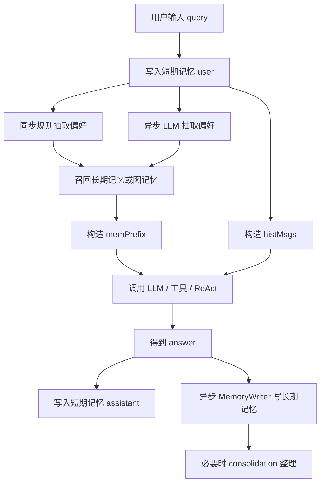

# 00-记忆系统学习路线

## 1. 一句话结论

这套记忆系统要按“主流程顺序”学习：先看一轮对话怎么进来，再看短期记忆、偏好、长期记忆、图记忆、回复后写入和整理。

不要一上来背类名。面试时真正要讲清楚的是：

```text
一轮 query 进来以后，哪些记忆先被读，哪些记忆后被写，哪些是同步，哪些是异步。
```

## 2. 在记忆系统里的位置

学习路线对应真实代码主线：

```text
UnifiedAgentService.processInternal
  ↓
stm.add("user", query)
  ↓
runAsyncPreferenceExtraction(query)
  ↓
pref.extractAndSave(query)
  ↓
buildMemorySystemPrefixWithCtx(query)
  ↓
ChatHistoryAdapter.buildHistory(stm, query)
  ↓
LLM / tool / ReAct / RAG
  ↓
stm.add("assistant", answer)
  ↓
memoryWriter.writeAfterReply(query, answer)
  ↓
consolidation 记忆整理
```

## 3. 源码位置和核心对象

核心入口：

```text
AGI-saber-java/src/main/java/com/agi/assistant/service/agent/UnifiedAgentService.java
```

核心对象：

```text
ShortTermMemory       短期记忆，保存最近几轮原始对话
PreferenceMemory      偏好记忆，保存 key-value 偏好
LongTermMemory        长期记忆，保存 MemoryItem 列表
GraphMemory           图记忆，在长期记忆上叠 Neo4j 节点和边
MemoryWriter          回复后异步抽取长期记忆
ChatHistoryAdapter    把短期记忆转成 LLM messages
```

## 4. 核心流程图



## 5. 源码讲解

主流程里最重要的几行：

```java
stm.add("user", query); // 先把当前用户问题放进短期记忆
infra.saveChatHistory("user", query); // 同时把用户问题落库，便于重启恢复

runAsyncPreferenceExtraction(query); // 开线程，用 LLM 从 query 里抽偏好

String[] extracted = pref.extractAndSave(query); // 主线程用轻量规则抽偏好，例如“我喜欢...”

String memPrefix = buildMemorySystemPrefixWithCtx(query); // 召回偏好和长期记忆，拼成 system prompt 前缀
List<Map<String, String>> histMsgs = ChatHistoryAdapter.buildHistory(stm, query); // 把短期记忆转成 LLM messages

resp.setAnswer(llm.chat(sp, histMsgs)); // 普通 chat 模式下，memPrefix 进 sp，短期历史进 histMsgs

stm.add("assistant", resp.getAnswer()); // 回答结束后，把助手回答写入短期记忆
infra.saveChatHistory("assistant", resp.getAnswer()); // 同时把助手回答保存到数据库

memoryWriter.writeAfterReply(query, resp.getAnswer()); // 回复后异步抽取长期记忆
```

这里要特别注意顺序：

```text
短期记忆 user 写入在 LLM 调用前
短期记忆 assistant 写入在 LLM 调用后
长期记忆写入在回复后异步执行
```

## 6. 真实例子：在流程中怎么运行

用户输入：

```text
我叫小李，我喜欢你用 Java 例子讲解。短期记忆怎么进入 LLM？
```

运行过程：

```text
1. stm.add("user", query)
   短期记忆保存本轮用户原话。

2. pref.extractAndSave(query)
   规则命中“我喜欢”，保存：
   喜好 = 你用 Java 例子讲解。短期记忆怎么进入 LLM？

3. runAsyncPreferenceExtraction(query)
   异步让 LLM 抽取更结构化的偏好，例如：
   姓名 = 小李
   喜好 = Java 例子讲解

4. buildMemorySystemPrefixWithCtx(query)
   把偏好和召回的长期记忆拼进 memPrefix。

5. buildHistory(stm, query)
   把短期记忆转成 histMsgs。

6. llm.chat(sp, histMsgs)
   模型用 system prompt + 最近对话生成回答。

7. stm.add("assistant", answer)
   把回答也放进短期记忆，供下一轮使用。

8. memoryWriter.writeAfterReply(query, answer)
   后台从回答中抽取可长期保存的信息。
```

## 7. 容易混淆的点

记忆系统不是只有一种“记忆”。

它至少有这些存在形式：

```text
短期记忆：ConversationMessage / ShortTermMemory.messages / histMsgs / chat_history 表
偏好记忆：PreferenceMemory.data / system prompt 文本 / preferences 表 / 部分长期记忆副本
长期记忆：MemoryItem / LongTermMemory.items / embedding JSON / long_term_memory 表
图记忆：MemoryItem 对应的 Neo4j Memory 节点 / FOLLOWS、SIMILAR_TO 等边
```

学习时要先问：

```text
我现在看的这段代码，是在读记忆，还是写记忆？
读写的是哪一种存在形式？
```

## 8. 面试怎么说

可以这样说：

```text
这套记忆系统分成短期、偏好、长期和图记忆。
短期记忆负责当前多轮上下文，偏好记忆负责稳定的 key-value 用户信息，长期记忆负责可召回的事实，图记忆负责在长期记忆之间建立顺序和相似关系。
一轮对话中，系统先写入 user 短期记忆，再构造 memPrefix 和 histMsgs 调模型；回答后写入 assistant 短期记忆，并异步通过 MemoryWriter 抽取长期记忆，最后按触发条件做 consolidation。
```

