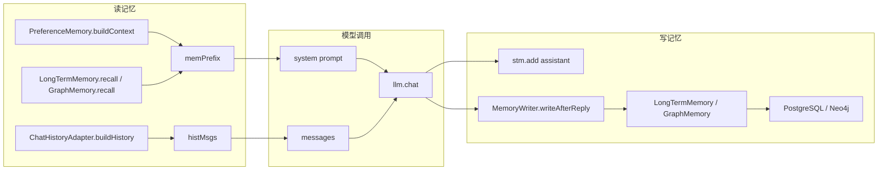

# 01-记忆系统全景图

## 1. 一句话结论

记忆系统全景可以理解成两条线：

```text
读记忆：偏好 + 长期/图召回 + 短期历史，一起进入 LLM 上下文
写记忆：用户消息和助手回答先写短期，回复后再异步沉淀长期/图记忆
```

## 2. 在记忆系统里的位置

全景图对应 `UnifiedAgentService` 的职责：

```text
1. 组织短期记忆
2. 组织偏好抽取
3. 组织长期记忆召回
4. 选择 chat/tool/react/rag 模式
5. 回复后触发长期记忆写入和整理
```

## 3. 源码位置和核心对象

核心文件：

```text
UnifiedAgentService.java      主流程编排
ShortTermMemory.java          短期记忆
PreferenceMemory.java         偏好记忆
LongTermMemory.java           长期记忆
GraphMemory.java              图记忆
MemoryWriter.java             回复后写入
KGStore.java                  Neo4j 节点和边
```

主要存在形式：

```text
内存对象：ShortTermMemory、PreferenceMemory、LongTermMemory、GraphMemory
LLM 上下文：memPrefix、histMsgs
数据库：preferences、long_term_memory、chat_history
图数据库：(:Memory {mem_id, content, importance}) 和边
```

## 4. 核心流程图



## 5. 源码讲解

读记忆入口：

```java
String memPrefix = buildMemorySystemPrefixWithCtx(query); // 偏好 + 相关长期记忆，进入 system prompt
List<Map<String, String>> histMsgs = ChatHistoryAdapter.buildHistory(stm, query); // 最近对话，进入 messages
```

普通 chat 调用：

```java
String sp = ChatHistoryAdapter.buildSystemPrompt(memPrefix,
        "你是一个简洁的AI助手。结合你掌握的用户信息，使回答更个性化。"); // 把记忆前缀拼到基础 system prompt 前
resp.setAnswer(llm.chat(sp, histMsgs)); // 用 system prompt 和短期历史生成回答
```

写记忆入口：

```java
stm.add("assistant", resp.getAnswer()); // 回答进入短期记忆
memoryWriter.writeAfterReply(query, resp.getAnswer()); // 后台抽取长期记忆
```

长期记忆整理：

```java
if (graphMem != null && graphMem.needConsolidation()) { // 有图记忆时走图感知整理
    LongTermMemory.ConsolidationResult result = graphMem.graphAwareConsolidate(); // 整理长期记忆并保护图中心节点
    syncConsolidationToDB(result); // 把删除和更新同步到数据库
} else if (ltm.needConsolidation()) { // 没有图记忆时走普通长期记忆整理
    LongTermMemory.ConsolidationResult result = ltm.consolidate(); // 去重、合并、过期
    syncConsolidationToDB(result); // 同步数据库
}
```

## 6. 真实例子：在流程中怎么运行

用户问：

```text
我下次面试怎么讲这个记忆系统？
```

系统可能读到：

```text
偏好记忆：用户喜欢面试口径
长期记忆：用户已经学完短期记忆和工具调用
短期记忆：上一轮刚问过 histMsgs
```

进入模型时拆成两部分：

```text
system prompt:
【用户偏好】
喜好: 面试口径、Java 代码逐行解释

【相关记忆】
用户已经学完短期记忆和工具调用

messages:
user: 上一轮问题
assistant: 上一轮回答
user: 我下次面试怎么讲这个记忆系统？
```

模型回答后，后台再判断回答里有没有值得长期记住的新信息。

## 7. 容易混淆的点

`memPrefix` 不是短期记忆。

`histMsgs` 也不是长期记忆。

它们都是“进入 LLM 的上下文形式”，来源不同：

```text
memPrefix = 偏好记忆 + 长期/图记忆召回结果
histMsgs  = 短期记忆最近几轮聊天
```

图记忆不是单独替代长期记忆。

`GraphMemory` 里面仍然持有 `LongTermMemory ltm`，是在长期记忆上增加 Neo4j 图结构。

## 8. 面试怎么说

可以这样说：

```text
我会从读写两条线解释。读的时候，系统把 PreferenceMemory 和长期/图召回结果拼成 memPrefix，把 ShortTermMemory 转成 histMsgs，然后一起传给 LLM。写的时候，当前 user 和 assistant 原文先进短期记忆，回复结束后 MemoryWriter 异步抽取结构化长期记忆，并写入 PostgreSQL；如果启用图层，还会在 Neo4j 中建立 Memory 节点和关系边。
```

