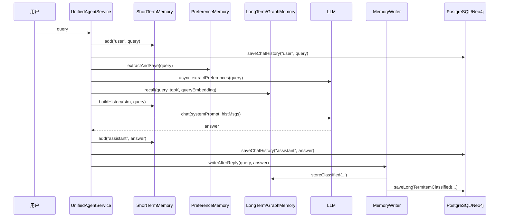

# 02-一次对话中的记忆系统时序图

## 1. 一句话结论

一次对话中，记忆系统不是一次性全部执行，而是分阶段执行：

```text
回答前：写短期 user、抽偏好、召回长期、构造上下文
回答中：LLM 使用 memPrefix 和 histMsgs
回答后：写短期 assistant、异步写长期、异步整理
```

## 2. 在记忆系统里的位置

这个时序图对应：

```text
UnifiedAgentService.processInternal(String query, ChatRequest req, Consumer<StreamEvent> onEvent)
```

它是整个 Agent 一轮对话的核心方法。

## 3. 源码位置和核心对象

源码位置：

```text
AGI-saber-java/src/main/java/com/agi/assistant/service/agent/UnifiedAgentService.java
```

涉及对象：

```text
stm             ShortTermMemory
pref            PreferenceMemory
ltm             LongTermMemory
graphMem        GraphMemory，可为空
memoryWriter    MemoryWriter
infra           InfrastructureService
llm             LlmService
```

存在形式变化：

```text
query 字符串
  → ConversationMessage
  → histMsgs
  → LLM messages
  → answer 字符串
  → ConversationMessage
  → Classified
  → MemoryItem
  → PostgreSQL 行 / Neo4j 节点
```

## 4. 核心流程图



## 5. 源码讲解

回答前：

```java
stm.add("user", query); // 当前用户问题进入短期记忆
infra.saveChatHistory("user", query); // 用户问题进入数据库聊天历史

runAsyncPreferenceExtraction(query); // 异步 LLM 偏好抽取，不阻塞主回答

String[] extracted = pref.extractAndSave(query); // 同步规则偏好抽取，能立刻影响当前响应
```

构造上下文：

```java
String memPrefix = buildMemorySystemPrefixWithCtx(query); // 用当前 query 召回相关长期记忆
List<Map<String, String>> histMsgs = ChatHistoryAdapter.buildHistory(stm, query); // 用 STM 构造短期历史 messages
```

回答后：

```java
stm.add("assistant", resp.getAnswer()); // 把最终回答放入短期记忆
infra.saveChatHistory("assistant", resp.getAnswer()); // 把最终回答落库

memoryWriter.writeAfterReply(query, resp.getAnswer()); // 异步提取长期记忆
```

整理：

```java
new Thread(() -> { // 新线程执行，不阻塞当前接口返回
    if (graphMem != null && graphMem.needConsolidation()) {
        LongTermMemory.ConsolidationResult result = graphMem.graphAwareConsolidate();
        syncConsolidationToDB(result);
    } else if (ltm.needConsolidation()) {
        LongTermMemory.ConsolidationResult result = ltm.consolidate();
        syncConsolidationToDB(result);
    }
}).start();
```

## 6. 真实例子：在流程中怎么运行

用户输入：

```text
我叫小李，以后回答要短一点。帮我总结长期记忆。
```

时序上会发生：

```text
1. user 原话进入 STM。
2. 规则抽取可能命中“我叫”，保存 姓名 = 小李。
3. 异步 LLM 抽取可能识别 policy：以后回答要短一点。
4. 用“帮我总结长期记忆”生成 query embedding。
5. 长期记忆按 score 召回相关 MemoryItem。
6. LLM 用 memPrefix + histMsgs 回答。
7. answer 进入 STM。
8. MemoryWriter 后台从 answer 里抽取可长期保存的信息。
9. 如果 storeCount 达到 triggerInterval，启动 consolidation。
```

## 7. 容易混淆的点

异步不等于随机。

异步表示它不阻塞当前主流程返回，执行先后受线程调度影响。

所以同一个 query 里：

```text
同步规则偏好抽取：当前轮更稳定可见
异步 LLM 偏好抽取：可能当前轮来不及影响，但会影响后续轮次
MemoryWriter 写长期记忆：一定在回答后异步执行
```

如果规则抽取和 LLM 抽取结果冲突，当前代码没有显式冲突解决策略，都是写入 `PreferenceMemory.data`，同 key 会被后写入的值覆盖。

## 8. 面试怎么说

可以这样说：

```text
一次对话里，记忆系统分前中后三段。前段先写 user 短期记忆，并做同步规则偏好抽取和异步 LLM 偏好抽取；中段根据 query 召回长期/图记忆，结合短期 histMsgs 调用模型；后段把 assistant 回答写入短期记忆，并通过 MemoryWriter 异步抽取长期记忆，达到触发条件后再做去重、合并、过期整理。
```

