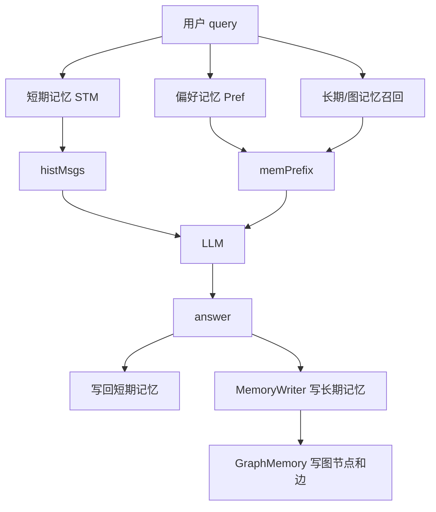

# 03-记忆类型总览-短期偏好长期图记忆

## 1. 一句话结论

这套系统有四类核心记忆：

```text
短期记忆：最近聊了什么
偏好记忆：用户稳定偏好是什么
长期记忆：以后还值得召回的事实是什么
图记忆：长期记忆之间有什么顺序和相似关系
```

## 2. 在记忆系统里的位置

四类记忆在一轮对话中分工不同：

```text
短期记忆：回答前读，回答后写
偏好记忆：回答前读，用户输入时写，回复后也可能写
长期记忆：回答前召回，回复后写入
图记忆：长期记忆写入时建图，召回时扩展邻居
```

## 3. 源码位置和核心对象

```text
短期记忆：
ConversationMessage.java
ShortTermMemory.java
ChatHistoryAdapter.java

偏好记忆：
PreferenceMemory.java
PreferenceFiller.java
UnifiedAgentService.runAsyncPreferenceExtraction

长期记忆：
MemoryItem.java
LongTermMemory.java
MemoryWriter.java

图记忆：
GraphMemory.java
KGStore.java
```

存在形式总表：

```text
短期记忆：
ConversationMessage 对象
ShortTermMemory.messages 内存列表
histMsgs LLM messages
chat_history 数据库行

偏好记忆：
PreferenceMemory.data ConcurrentHashMap
【用户偏好】system prompt 文本
preferences 数据库行
部分 MemoryItem 长期记忆副本

长期记忆：
MemoryItem 对象
LongTermMemory.items 内存列表
embedding List<Double>
long_term_memory 数据库行

图记忆：
Neo4j (:Memory) 节点
FOLLOWS / SIMILAR_TO / CAUSES / BELONGS_TO 边
GraphMemory.prevId 顺序指针
```

## 4. 核心流程图



## 5. 源码讲解

短期记忆：

```java
stm.add("user", query); // user 消息进入短期记忆
List<Map<String, String>> histMsgs = ChatHistoryAdapter.buildHistory(stm, query); // 短期记忆转 LLM messages
stm.add("assistant", resp.getAnswer()); // assistant 回答进入短期记忆
```

偏好记忆：

```java
String[] extracted = pref.extractAndSave(query); // 轻量规则抽偏好
runAsyncPreferenceExtraction(query); // LLM 异步抽偏好
String prefCtx = pref.buildContext(); // 偏好转成 system prompt 文本
```

长期记忆：

```java
List<Double> queryEmb = llm.embed(query); // 对当前问题做 embedding
LongTermFilter filter = LongTermFilter.builder()
        .categories(List.of("identity", "preference", "policy", "general"))
        .topK(cfg.getMemory().getLongTermTopK())
        .minScore(0.4)
        .build(); // 根据当前 mode 构造分类过滤条件
List<MemoryItem> recalled = ltm.recallByFilter(query, queryEmb, filter); // 先按分类过滤，再按 score 召回相关 MemoryItem
```

图记忆：

```java
List<MemoryItem> recalled = graphMem.recall(query, cfg.getMemory().getLongTermTopK(), queryEmb); // 先长期召回，再图扩展邻居
```

## 6. 真实例子：在流程中怎么运行

用户说：

```text
我叫小李，我喜欢 Java 逐行解释。继续讲图记忆。
```

四类记忆分别处理：

```text
短期记忆：
保存完整原话，用于当前和下一轮上下文。

偏好记忆：
规则可能保存 姓名 = 小李 或 喜好 = Java 逐行解释。

长期记忆：
如果 MemoryWriter 从回答中抽到“用户正在学习图记忆”，会写成 MemoryItem。

图记忆：
如果这条 MemoryItem 新增成功，会创建 Neo4j Memory 节点，并和上一条记忆连 FOLLOWS。
```

## 7. 容易混淆的点

偏好记忆和长期记忆会有交集。

例如 LLM 异步偏好抽取里：

```java
String content = "用户" + e.getKey() + ": " + e.getValue();
boolean added = storeMemory(content, 0.8, emb);
```

这表示某些偏好不仅存在 `PreferenceMemory.data` 里，还会以自然语言事实形式进入长期记忆。

图记忆也不是第五种全新内容。

图记忆里的节点内容来自长期记忆，边表示长期记忆之间的关系。

## 8. 面试怎么说

可以这样说：

```text
短期记忆解决多轮上下文，偏好记忆解决用户稳定画像，长期记忆解决跨会话可召回事实，图记忆解决长期记忆之间的结构化关系。
实现上，短期记忆是 ConversationMessage 列表，偏好是 ConcurrentHashMap 和 preferences 表，长期记忆是 MemoryItem 列表和 long_term_memory 表，图记忆是在 Neo4j 中为长期记忆建立 Memory 节点和关系边。
```
