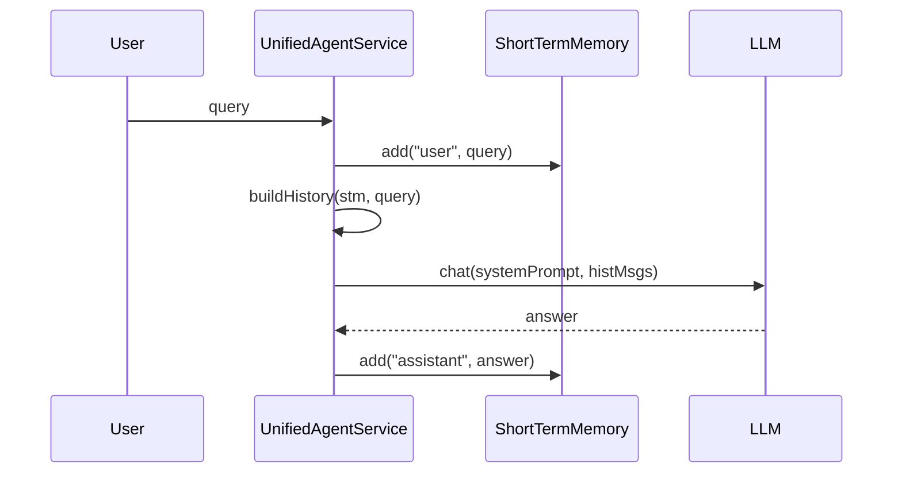

# 06-短期记忆写入-stm-add

## 1. 一句话结论

短期记忆写入就是调用 `stm.add(role, content)`，把一条用户消息或助手消息包装成 `ConversationMessage`，追加到 `ShortTermMemory.messages`。

这一版 Java 代码里，一轮对话会写入两次短期记忆：

```text
回答前：stm.add("user", query)
回答后：stm.add("assistant", resp.getAnswer())
```

## 2. 在记忆系统里的位置

短期记忆写入发生在主流程 `processInternal` 里：

```text
用户 query 进入
  ↓
写入短期记忆 user 消息
  ↓
构造 memPrefix 和 histMsgs
  ↓
调用 LLM / 工具 / ReAct
  ↓
得到 answer
  ↓
写入短期记忆 assistant 消息
```

所以 `stm.add("user", query)` 必须在 `buildHistory` 前面，否则当前用户问题不会出现在 `histMsgs` 里。

## 3. 源码位置和核心对象

主流程源码位置：

```text
AGI-saber-java/src/main/java/com/agi/assistant/service/agent/UnifiedAgentService.java
```

写入方法源码位置：

```text
AGI-saber-java/src/main/java/com/agi/assistant/service/memory/ShortTermMemory.java
```

`UnifiedAgentService.processInternal` 里的真实写入点：

```java
stm.add("user", query);
infra.saveChatHistory("user", query);
```

以及回答完成后的写入点：

```java
stm.add("assistant", resp.getAnswer());
infra.saveChatHistory("assistant", resp.getAnswer());
```

这里同时产生两种存在形式：

```text
1. 内存短期记忆：
   stm.add(...) 写入 ShortTermMemory.messages

2. 数据库聊天历史：
   infra.saveChatHistory(...) 写入 chat_history
```

二者内容接近，但用途不同：

```text
ShortTermMemory.messages：本进程运行时给 LLM 构造上下文
chat_history：持久化保存，服务重启后 restoreFromDB 再恢复到 STM
```

## 4. 核心流程图



## 5. 源码讲解

### 5.1 先说写入解决什么问题

`stm.add(...)` 解决的问题是：

```text
把当前这一句话写进短期记忆，
让后面的 LLM 调用和下一轮对话能看到它。
```

一轮对话通常会写两次：

```text
用户问题写一次。
助手回答写一次。
```

### 5.2 生活类比

可以把主流程想成客服做通话记录：

```text
用户说：我在学短期记忆
客服先记录：客户说了这句话

客服回答：短期记忆保存最近几轮对话
客服再记录：客服自己回答了这句话
```

如果只记录用户问题，不记录助手回答，下一轮模型就不知道自己刚才答过什么。

### 5.3 对应到代码：回答前写入用户问题

```java
stm.add("user", query); // 把当前用户输入写入短期记忆，role 固定为 user，content 就是本轮 query
infra.saveChatHistory("user", query); // 同时把这条用户消息保存到数据库聊天历史，方便重启后恢复
```

逐行解释：

```text
第 1 行：把用户本轮问题写进内存短期记忆。
第 1 行："user" 表示这句话是用户说的。
第 1 行：query 是用户输入的原文。
第 2 行：把同一条用户消息保存到数据库聊天历史。
```

这里要分清两本账：

```text
stm.add(...)              写进内存，主要给当前运行中的上下文用。
infra.saveChatHistory(...) 写进数据库，主要用于持久化和重启恢复。
```

### 5.4 为什么 buildHistory 前必须先 add

```java
List<Map<String, String>> histMsgs = ChatHistoryAdapter.buildHistory(stm, query); // 从短期记忆里拿最近对话，转成 LLM 需要的 messages
```

先说目的：

```text
buildHistory 会从短期记忆里取消息，转换成 LLM messages。
```

所以顺序很重要：

```text
先 stm.add("user", query)
再 buildHistory(stm, query)
```

生活类比：

```text
你要把最近聊天记录复印给大模型。
复印之前，必须先把用户刚说的这句话写到记录本里。
否则复印件里就少了当前问题。
```

当前代码还有补救逻辑：

```text
如果 buildHistory 发现最后一条不是当前 query，会自动补一条 user 消息。
但主链路正常情况下，当前 query 已经通过 stm.add 写进去了。
```

### 5.5 对应到代码：回答后写入助手回答


```java
stm.add("assistant", resp.getAnswer()); // 把助手最终回答写入短期记忆，供下一轮对话使用
infra.saveChatHistory("assistant", resp.getAnswer()); // 同时把助手回答保存到数据库聊天历史
```

逐行解释：

```text
第 1 行：把助手刚生成的回答写入短期记忆。
第 1 行："assistant" 表示这句话是 AI 助手说的。
第 1 行：resp.getAnswer() 是本轮最终回答文本。
第 2 行：把助手回答保存到数据库聊天历史。
```

为什么要写助手回答？

```text
下一轮用户可能会说：“你刚才说的第二点是什么意思？”
如果短期记忆里没有上一轮助手回答，模型就不知道“第二点”指什么。
```

### 5.6 对应到代码：add 方法内部到底做了什么

```java
public void add(String role, String content) { // role 是消息身份，content 是消息正文
    messages.add(new ConversationMessage(role, content, // 创建一条 ConversationMessage 并追加进短期记忆
            LocalTime.now().format(DateTimeFormatter.ofPattern("HH:mm:ss")))); // 写入当前时间，例如 21:30:06
    int max = maxTurns * 2; // 把“轮数上限”换算成“消息条数上限”
    while (messages.size() > max) { // 如果超过上限，就开始裁剪
        messages.remove(0); // 删除最早的一条消息
    }
}
```

先说目的：

```text
add 方法不是直接把字符串塞进去。
它会把 role、content、当前时间包成 ConversationMessage，
再放进 messages 列表。
```

生活类比：

```text
你不是把一句话随便写在纸上。
你会按固定表格记录：
谁说的、说了什么、几点说的。
```

逐行解释：

```text
第 1 行：定义 add 方法，调用方必须告诉它 role 和 content。
第 2-3 行：创建一条 ConversationMessage，里面包含角色、正文、当前时间。
第 2 行：messages.add(...) 把新消息追加到短期记忆列表末尾。
第 4 行：计算最多能保存多少条消息。5 轮就是 10 条。
第 5 行：如果当前消息数量超过上限，就进入裁剪。
第 6 行：删除第 0 条，也就是最早写进去的消息。
```

调用方传参后，变量会变成具体值。

例如：

```java
stm.add("user", query);
```

进入 `add` 后：

```text
role    = "user"
content = query 的具体文本
```

如果 query 是：

```text
短期记忆怎么进入 LLM？
```

那么 add 内部实际处理的就是：

```text
role    = "user"
content = "短期记忆怎么进入 LLM？"
```

## 6. 真实例子：在流程中怎么运行

假设用户输入：

```text
短期记忆怎么进入 LLM？
```

主流程先执行：

```java
stm.add("user", query);
```

短期记忆里新增：

```text
ConversationMessage {
  role = "user",
  content = "短期记忆怎么进入 LLM？",
  timestamp = "21:30:06"
}
```

接着 `ChatHistoryAdapter.buildHistory(stm, query)` 会读取这条消息，生成：

```text
[
  {"role":"user", "content":"短期记忆怎么进入 LLM？"}
]
```

LLM 回答后，假设回答是：

```text
短期记忆会先转成 histMsgs，然后作为 messages 参数传给 llm.chat。
```

主流程执行：

```java
stm.add("assistant", resp.getAnswer());
```

短期记忆变成：

```text
[
  ConversationMessage{role="user", content="短期记忆怎么进入 LLM？", timestamp="21:30:06"},
  ConversationMessage{role="assistant", content="短期记忆会先转成 histMsgs，然后作为 messages 参数传给 llm.chat。", timestamp="21:30:10"}
]
```

下一轮用户继续问：

```text
那 histMsgs 是什么格式？
```

此时上面两条历史就能参与下一轮上下文。

## 7. 容易混淆的点

`stm.add` 不是写长期记忆。

它只写短期记忆容器。

长期记忆写入发生在回复之后的：

```java
memoryWriter.writeAfterReply(query, resp.getAnswer());
```

`stm.add` 也不是只写用户问题。

它既写用户消息，也写助手回答。

区别只在 `role`：

```text
stm.add("user", query)                  写用户消息
stm.add("assistant", resp.getAnswer())  写助手回答
```

## 8. 面试怎么说

可以这样说：

```text
短期记忆写入在 UnifiedAgentService.processInternal 里完成。
用户请求进来后先执行 stm.add("user", query)，保证当前问题能进入 histMsgs。
模型生成回答后再执行 stm.add("assistant", answer)，让下一轮对话能看到上一轮回答。
add 内部会创建 ConversationMessage，并在追加后根据 maxTurns 做裁剪。
```
