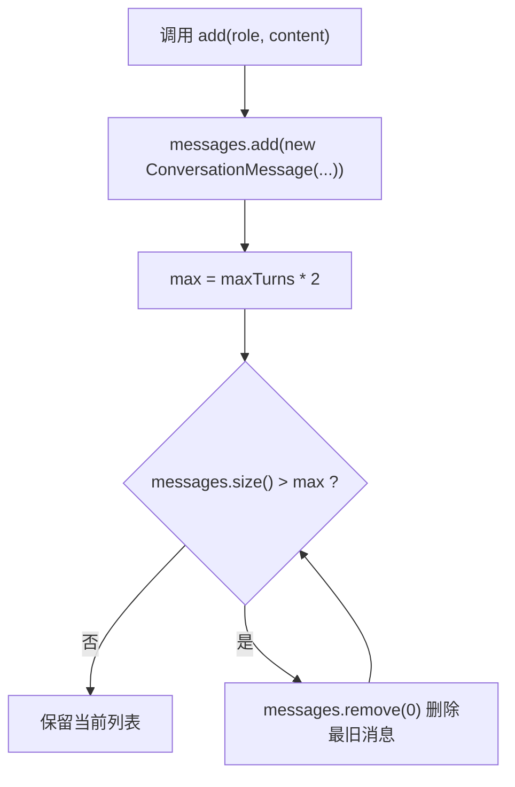

# 07-短期记忆裁剪-maxTurns

## 1. 一句话结论

`maxTurns` 控制短期记忆最多保留几轮对话，源码会把它换算成 `maxTurns * 2` 条消息。

原因是：

```text
一轮对话 = 一条 user 消息 + 一条 assistant 消息
```

所以 `maxTurns = 5` 时，最多保留 10 条 `ConversationMessage`。

## 2. 在记忆系统里的位置

裁剪发生在每次 `ShortTermMemory.add` 的末尾。

```text
新增一条消息
  ↓
计算最多允许多少条消息
  ↓
如果 messages.size() 超过上限
  ↓
从 messages 头部删除最旧消息
```

这个裁剪只影响内存里的短期记忆，不等于删除数据库里的聊天历史。

## 3. 源码位置和核心对象

源码位置：

```text
AGI-saber-java/src/main/java/com/agi/assistant/service/memory/ShortTermMemory.java
```

配置默认值源码位置：

```text
AGI-saber-java/src/main/java/com/agi/assistant/config/AppConfig.java
```

真实配置字段：

```java
public static class MemoryConfig { // 记忆相关配置
    private int shortTermMaxTurns = 5; // 短期记忆默认最多保留 5 轮

    public int getShortTermMaxTurns() { return shortTermMaxTurns; } // 读取短期记忆轮数配置
    public void setShortTermMaxTurns(int shortTermMaxTurns) { this.shortTermMaxTurns = shortTermMaxTurns; } // 外部配置可以覆盖这个值
}
```

启动时设置给 STM：

```java
stm.setMaxTurns(cfg.getMemory().getShortTermMaxTurns());
```

裁剪影响的是短期记忆的内存存在形式：

```text
ShortTermMemory.messages
```

裁剪不会直接删除：

```text
chat_history 数据库记录
长期记忆 MemoryItem
偏好记忆 PreferenceMemory.data
```

所以 `maxTurns` 控制的是“当前 LLM 上下文能看到多少最近聊天”，不是控制所有历史数据保存多久。

## 4. 核心流程图



## 5. 源码讲解

### 5.1 先说裁剪是为了解决什么问题

短期记忆不能无限保存。

如果用户聊了 100 轮，每一轮都塞给大模型，会有两个问题：

```text
1. 上下文太长，LLM 调用成本变高。
2. 很早以前的内容可能已经不重要，还会干扰当前回答。
```

所以 `maxTurns` 的目的就是：

```text
只保留最近几轮对话。
```

### 5.2 生活类比

可以把短期记忆想成一块白板。

白板空间有限，只保留最近内容：

```text
旧内容太多了，就擦掉最早的一行。
新内容继续写在后面。
```

这不是删除长期记忆，也不是删除数据库历史。

它只是在控制“本次给大模型看的最近聊天窗口”。

### 5.3 对应到代码：裁剪逻辑在哪里

```java
public void add(String role, String content) { // 每写入一条 user 或 assistant 消息，都会检查是否需要裁剪
    messages.add(new ConversationMessage(role, content, // 先把新消息追加到列表末尾
            LocalTime.now().format(DateTimeFormatter.ofPattern("HH:mm:ss")))); // 给新消息写入当前时间
    int max = maxTurns * 2; // 把最大轮数换成最大消息数，因为每轮一般有两条消息
    while (messages.size() > max) { // 只要当前消息数超过上限，就继续删除
        messages.remove(0); // 删除第 0 条，也就是最老的一条
    }
}
```

先按人话翻译：

```text
先把新消息写进去。
再算最多能放多少条。
如果现在超过上限，就删除最旧的消息。
一直删到不超过上限为止。
```

逐行解释：

```text
第 1 行：add 每被调用一次，就新增一条 user 或 assistant 消息。
第 2-3 行：把新消息追加到 messages 的最后。
第 4 行：把“轮数”换算成“消息条数”。
第 5 行：判断当前消息数量是否超过允许上限。
第 6 行：删除第 0 条，也就是最早写进去的旧消息。
```

### 5.4 为什么是 maxTurns * 2

先说目的：

```text
maxTurns 表示最多保留几轮对话。
但 messages 里保存的是一条一条消息，不是一轮一轮保存。
```

一轮对话通常长这样：

```text
user      一条
assistant 一条
```

所以：

```text
1 轮 = 2 条消息
5 轮 = 10 条消息
```

对应代码：

```java
int max = maxTurns * 2;
```

技术点：

```text
这里的 max 不是轮数，而是最大消息条数。
如果 maxTurns = 5，那么 max = 10。
```

### 5.5 为什么删除 messages.remove(0)

先画出列表顺序：

```text
下标 0：最早的消息
下标 1：第二早的消息
下标 2：第三早的消息
...
最后一个下标：最新消息
```

所以这句：

```java
messages.remove(0);
```

翻译成人话就是：

```text
删除最老的聊天记录。
```

生活类比：

```text
笔记本满了。
新消息已经写在最后一页。
为了腾空间，就撕掉最前面的旧页。
```

### 5.6 为什么用 while，不只用 if

`if` 只能删一次。

`while` 会一直删，直到不超过上限。

对应代码：

```java
while (messages.size() > max) {
    messages.remove(0);
}
```

人话：

```text
messages.size() <= max
```

什么时候 `while` 更稳？

```text
如果配置变小了，或者恢复历史时一下子塞进来很多消息，
messages 可能不是只多 1 条，而是多很多条。
while 可以一次性裁剪到正确长度。
```

最终保证：

```text
短期记忆最多保留 maxTurns * 2 条消息。
```

## 6. 真实例子：在流程中怎么运行

假设为了容易看懂，配置：

```text
maxTurns = 2
```

那么：

```text
max = maxTurns * 2 = 4
```

最多保存 4 条消息，也就是最近 2 轮。

当前短期记忆已经有：

```text
[
  1. user: "第一轮问题",
  2. assistant: "第一轮回答",
  3. user: "第二轮问题",
  4. assistant: "第二轮回答"
]
```

用户发出第三轮问题：

```java
stm.add("user", "第三轮问题");
```

先追加后，列表暂时变成 5 条：

```text
[
  1. user: "第一轮问题",
  2. assistant: "第一轮回答",
  3. user: "第二轮问题",
  4. assistant: "第二轮回答",
  5. user: "第三轮问题"
]
```

这时 `messages.size() = 5`，超过 `max = 4`。

执行：

```java
messages.remove(0);
```

删除第 1 条后，短期记忆变成：

```text
[
  1. assistant: "第一轮回答",
  2. user: "第二轮问题",
  3. assistant: "第二轮回答",
  4. user: "第三轮问题"
]
```

等第三轮回答写入时：

```java
stm.add("assistant", "第三轮回答");
```

又会先变成 5 条，再删除最旧的一条：

```text
[
  1. user: "第二轮问题",
  2. assistant: "第二轮回答",
  3. user: "第三轮问题",
  4. assistant: "第三轮回答"
]
```

最终保留最近 2 轮。

## 7. 容易混淆的点

`maxTurns = 2` 不代表最多保存 2 条消息。

它代表最多保存 2 轮。

真正消息数上限是：

```text
maxTurns * 2
```

还有一个细节：当第三轮用户消息刚写入、助手还没回答时，短期记忆可能暂时出现半轮结构：

```text
assistant: 第一轮回答
user: 第二轮问题
assistant: 第二轮回答
user: 第三轮问题
```

这是因为代码是按“消息条数”裁剪，不是按“完整轮次对象”裁剪。

等助手回答写入后，结构会重新回到最近两轮。

## 8. 面试怎么说

可以这样说：

```text
短期记忆通过 maxTurns 控制上下文长度。
因为一轮对话通常包含 user 和 assistant 两条消息，所以代码里使用 maxTurns * 2 作为最大消息数。
每次 add 新消息后，如果 messages.size() 超过上限，就用 remove(0) 删除最旧消息，保证 LLM 上下文不会无限增长。
```
