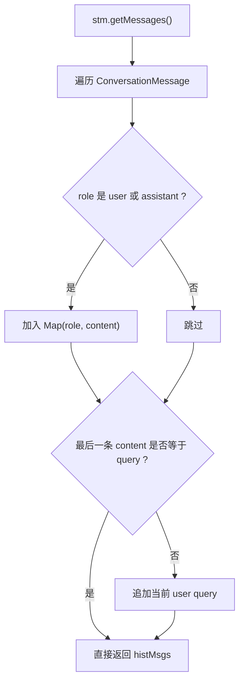

# 08-历史消息适配-ChatHistoryAdapter

## 1. 一句话结论

`ChatHistoryAdapter` 的作用是把短期记忆里的 `ConversationMessage` 列表，转换成 LLM 接口需要的 `List<Map<String, String>> histMsgs`。

短期记忆内部长这样：

```text
ConversationMessage{role="user", content="...", timestamp="..."}
```

LLM messages 需要长这样：

```text
{"role":"user", "content":"..."}
```

所以中间需要一个适配器。

## 2. 在记忆系统里的位置

它处在 `ShortTermMemory` 和 LLM 调用之间：

```text
ShortTermMemory.messages
  ↓
ChatHistoryAdapter.buildHistory(stm, query)
  ↓
histMsgs
  ↓
llm.chat(systemPrompt, histMsgs)
```

它不负责生成回答，也不负责写入长期记忆。

它只做格式转换和当前问题补齐。

## 3. 源码位置和核心对象

源码位置：

```text
AGI-saber-java/src/main/java/com/agi/assistant/application/chat/ChatHistoryAdapter.java
```

核心方法有两个：

```text
buildHistory(stm, query)              把短期记忆转成 histMsgs
buildSystemPrompt(memPrefix, base)    把记忆前缀拼进 system prompt
```

这一篇讲短期记忆的第 3 种存在形式：

```text
histMsgs = List<Map<String, String>>
```

它由 `ConversationMessage` 转换而来：

```text
ConversationMessage{role="user", content="hi", timestamp="21:00:00"}
  ↓
Map.of("role", "user", "content", "hi")
```

转换后 `timestamp` 不存在。

真实源码：

```java
public final class ChatHistoryAdapter { // final 表示这个工具类不打算被继承

    private ChatHistoryAdapter() {} // 私有构造方法，表示不希望外部 new 它，只希望通过静态方法调用

    public static List<Map<String, String>> buildHistory(ShortTermMemory stm, String query) { // 把 STM 转成 LLM messages
        List<Map<String, String>> msgs = new ArrayList<>(); // 准备一个新列表，用来装 LLM 能识别的消息 Map
        for (ConversationMessage m : stm.getMessages()) { // 遍历短期记忆里的每条 ConversationMessage
            if ("user".equals(m.getRole()) || "assistant".equals(m.getRole())) { // 只允许 user 和 assistant 进入 LLM messages
                msgs.add(Map.of("role", m.getRole(), "content", m.getContent())); // 丢掉 timestamp，只保留 role 和 content
            }
        }
        if (msgs.isEmpty() || !msgs.get(msgs.size() - 1).get("content").equals(query)) { // 如果最后一条不是当前 query，就补一条 user 消息
            msgs.add(Map.of("role", "user", "content", query)); // 保证当前问题一定在 LLM messages 末尾
        }
        return msgs; // 返回最终的 histMsgs
    }

    public static String buildSystemPrompt(String memPrefix, String basePrompt) { // 拼接 system prompt
        if (memPrefix == null || memPrefix.isEmpty()) return basePrompt; // 没有记忆前缀时，直接用基础 prompt
        return memPrefix + "\n\n" + basePrompt; // 有记忆前缀时，把记忆放在基础 prompt 前面
    }
}
```

## 4. 核心流程图



## 5. 源码讲解

### 5.1 先说适配器是干什么的

`ChatHistoryAdapter` 解决的问题是：

```text
短期记忆内部保存的是 ConversationMessage 对象，
但 LLM 接口要的是 role/content 这种 messages 格式。
```

所以它要做一次“翻译”：

```text
ConversationMessage 对象列表
  ↓
List<Map<String, String>> histMsgs
```

### 5.2 生活类比

可以把 `ChatHistoryAdapter` 想成“格式转换员”。

内部记录本长这样：

```text
说话人=user，内容=我在学短期记忆，时间=21:40:00
```

大模型只认这种格式：

```text
role=user，content=我在学短期记忆
```

转换员会把时间字段拿掉，只保留大模型需要的字段。

### 5.3 对应到代码：histMsgs 这个对象长什么样

```java
List<Map<String, String>> msgs = new ArrayList<>();
```

先不要急着看泛型语法。

先看它实际装的东西：

```text
[
  {"role":"user", "content":"我在学短期记忆"},
  {"role":"assistant", "content":"短期记忆保存最近几轮对话"}
]
```

拆开看：

```text
外层 List：
  表示很多条消息，按顺序排列。

内层 Map：
  表示一条消息。
  里面用 key/value 保存 role 和 content。
```

对应代码：

```java
List<Map<String, String>> msgs = new ArrayList<>();
```

逐段解释：

```text
List<...>                外面是一个列表，装多条消息。
Map<String, String>      列表里的每一条消息是一个 Map。
String, String           Map 的 key 是字符串，value 也是字符串。
new ArrayList<>()        创建一个空列表，准备往里面放消息。
```

### 5.4 对应到代码：遍历短期记忆

```java
for (ConversationMessage m : stm.getMessages()) {
    if ("user".equals(m.getRole()) || "assistant".equals(m.getRole())) {
        msgs.add(Map.of("role", m.getRole(), "content", m.getContent()));
    }
}
```

先说目的：

```text
从 ShortTermMemory 里取出每一条 ConversationMessage，
把能给 LLM 看的消息转换成 Map。
```

生活类比：

```text
你拿着聊天记录本，从第一页翻到最后一页。
每看到一条 user 或 assistant 的记录，就抄到给大模型的清单里。
如果遇到别的角色，就跳过。
```

逐行解释：

```text
第 1 行：stm.getMessages() 取出短期记忆当前保存的消息副本。
第 1 行：for (...) 表示一条一条遍历。
第 1 行：m 表示当前正在看的那一条 ConversationMessage。
第 2 行：只允许 role 是 user 或 assistant 的消息进入 LLM。
第 3 行：把当前消息转换成 Map，并加入 msgs 列表。
```

为什么写成：

```java
"user".equals(m.getRole())
```

而不是：

```java
m.getRole().equals("user")
```

技术点：

```text
如果 m.getRole() 是 null，m.getRole().equals("user") 会报空指针。
"user".equals(m.getRole()) 更稳，因为 "user" 这个常量不可能是 null。
```

### 5.5 对应到代码：ConversationMessage 怎么变成 Map

```java
msgs.add(Map.of("role", m.getRole(), "content", m.getContent()));
```

先说目的：

```text
把内部消息对象，转换成 LLM 需要的一条 message。
```

转换前：

```text
ConversationMessage {
  role = "user",
  content = "我在学短期记忆",
  timestamp = "21:40:00"
}
```

转换后：

```text
{"role":"user", "content":"我在学短期记忆"}
```

逐段解释：

```text
Map.of(...)              创建一个小 Map。
"role"                  第一个 key，表示消息角色。
m.getRole()              第一个 value，从 ConversationMessage 里取 role。
"content"               第二个 key，表示消息正文。
m.getContent()           第二个 value，从 ConversationMessage 里取 content。
msgs.add(...)            把这条 Map 消息加入 histMsgs 列表。
```

为什么没有 timestamp？

```text
因为当前 LLM messages 只需要 role 和 content。
timestamp 仍然存在于 ConversationMessage 里，但这一步没有传给模型。
```

### 5.6 对应到代码：为什么要补当前 query

```java
if (msgs.isEmpty() || !msgs.get(msgs.size() - 1).get("content").equals(query)) {
    msgs.add(Map.of("role", "user", "content", query));
}
```

先说目的：

```text
保证当前用户问题一定出现在 LLM messages 末尾。
```

生活类比：

```text
你要把聊天记录交给大模型回答问题。
如果复印出来的记录里没有用户刚问的最后一句，
那模型就不知道这轮到底要回答什么。
所以这里检查一下，缺了就补上。
```

逐行解释：

```text
第 1 行：如果 msgs 为空，说明短期记忆里没有可用消息。
第 1 行：或者最后一条消息的 content 不等于当前 query，说明当前问题还没在最后。
第 2 行：补一条 role=user、content=query 的消息。
```

技术点：

```text
msgs.get(msgs.size() - 1) 表示取列表最后一条消息。
get("content") 表示从这条 Map 里取 content 字段。
!xxx.equals(query) 表示“不等于当前 query”。
```

## 6. 真实例子：在流程中怎么运行

假设 `ShortTermMemory.messages` 里有：

```text
[
  ConversationMessage{role="user", content="我在学短期记忆", timestamp="21:40:00"},
  ConversationMessage{role="assistant", content="短期记忆保存最近几轮对话", timestamp="21:40:05"},
  ConversationMessage{role="user", content="histMsgs 是什么", timestamp="21:41:10"}
]
```

当前 `query` 是：

```text
histMsgs 是什么
```

执行：

```java
List<Map<String, String>> histMsgs = ChatHistoryAdapter.buildHistory(stm, query);
```

得到：

```text
[
  {"role":"user", "content":"我在学短期记忆"},
  {"role":"assistant", "content":"短期记忆保存最近几轮对话"},
  {"role":"user", "content":"histMsgs 是什么"}
]
```

因为最后一条已经是当前 `query`，所以不会重复追加。

如果短期记忆为空，执行 `buildHistory(stm, "histMsgs 是什么")` 会得到：

```text
[
  {"role":"user", "content":"histMsgs 是什么"}
]
```

这就是源码里这段判断的作用：

```java
if (msgs.isEmpty() || !msgs.get(msgs.size() - 1).get("content").equals(query)) {
    msgs.add(Map.of("role", "user", "content", query));
}
```

## 7. 容易混淆的点

`histMsgs` 不是 `memPrefix`。

`histMsgs` 是最近聊天记录，进入 LLM 的 messages 参数。

`memPrefix` 是偏好记忆和长期记忆召回结果，进入 system prompt。

两者位置不同：

```text
llm.chat(systemPrompt, histMsgs)
         ↑             ↑
         memPrefix 拼这里  短期历史放这里
```

`ChatHistoryAdapter` 不会把 `timestamp` 传给 LLM。

所以如果用户问“模型是否知道每条短期记忆的时间”，按当前代码答案是：不知道。

## 8. 面试怎么说

可以这样说：

```text
ChatHistoryAdapter 是短期记忆和 LLM messages 之间的适配层。
它遍历 ShortTermMemory 中的 ConversationMessage，只保留 user 和 assistant 角色，并转换成 Map.of("role", role, "content", content)。
如果当前 query 还没有出现在最后一条，它会补一条 user 消息，保证本轮问题进入 LLM。
```
