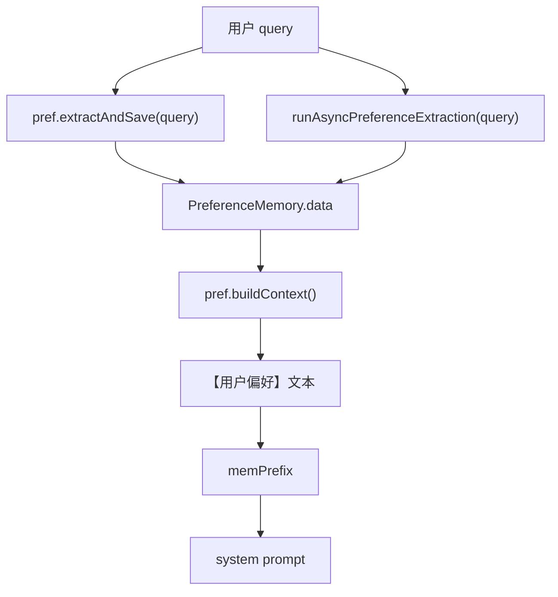

# 10-偏好记忆对象-PreferenceMemory

## 1. 一句话结论

`PreferenceMemory` 是偏好记忆容器，用 `Map<String, String>` 保存用户画像类信息，例如：

```text
姓名 = 小李
喜好 = Java 逐行解释
城市 = 上海
语言 = 中文
```

它和短期记忆不同：短期记忆保存“最近聊天原文”，偏好记忆保存“稳定的 key-value 用户信息”。

## 2. 在记忆系统里的位置

偏好记忆在一轮对话里有两个作用：

```text
回答前：把偏好拼进 memPrefix，进入 system prompt
工具调用前：PreferenceFiller 用偏好补工具参数
```

写入来源有三处：

```text
1. pref.extractAndSave(query) 轻量规则同步抽取
2. runAsyncPreferenceExtraction(query) LLM 异步抽取
3. MemoryWriter.persist(...) 对 identity/preference 分类回写
```

## 3. 源码位置和核心对象

源码位置：

```text
AGI-saber-java/src/main/java/com/agi/assistant/service/memory/PreferenceMemory.java
```

真实核心字段：

```java
private final Map<String, String> data = new ConcurrentHashMap<>(); // 偏好记忆主体，key 是偏好名，value 是偏好值
```

偏好记忆有多种存在形式：

```text
1. 内存 Map 形式：
   PreferenceMemory.data = {"姓名":"小李", "喜好":"Java 逐行解释"}

2. system prompt 文本形式：
   【用户偏好】
   姓名: 小李
   喜好: Java 逐行解释

3. 数据库持久化形式：
   preferences 表中保存 userId/key/value

4. 长期记忆副本形式：
   "用户喜好: Java 逐行解释" 可能作为 MemoryItem 写入 LTM
```

## 4. 核心流程图



## 5. 源码讲解

### 5.1 先说这个类是干什么的

`PreferenceMemory` 可以先理解成：

```text
用户画像小本子。
```

它不保存完整聊天记录。

它只保存比较稳定、之后还能复用的信息：

```text
姓名 = 小李
城市 = 上海
语言 = 中文
喜好 = Java 逐行解释
```

### 5.2 生活类比

短期记忆像聊天记录本。

偏好记忆像用户档案卡：

```text
姓名：小李
常住城市：上海
回答风格：喜欢逐行解释代码
学习语言：Java
```

下次用户问“查天气”，如果用户档案里有“城市=上海”，系统就可能用这个偏好补工具参数。

### 5.3 对应到代码：偏好数据存在哪里

```java
private final Map<String, String> data = new ConcurrentHashMap<>();
```

先说目的：

```text
data 就是偏好记忆真正存数据的地方。
```

它实际长这样：

```text
{
  "姓名": "小李",
  "城市": "上海",
  "喜好": "Java 逐行解释"
}
```

逐段解释：

```text
Map<String, String>       表示 key 和 value 都是字符串。
key                       例如“城市”“语言”“喜好”。
value                     例如“上海”“中文”“Java 逐行解释”。
ConcurrentHashMap         表示这个 Map 支持并发访问，比普通 HashMap 更适合多线程场景。
final                     表示 data 这个变量不能换成另一个 Map，但里面仍然可以 put 新偏好。
```

为什么用并发 Map？

```text
因为当前系统里偏好可能来自同步规则，也可能来自异步 LLM 线程。
ConcurrentHashMap 可以降低多线程同时读写偏好时出问题的风险。
```

### 5.4 对应到代码：保存单个偏好

```java
public void save(String key, String value) { // 保存一条偏好
    if (key != null && !key.isEmpty() && value != null && !value.isEmpty()) { // key 和 value 都不能为空才保存
        data.put(key, value); // 写入 ConcurrentHashMap；如果 key 已存在，会覆盖旧值
    }
}
```

先说目的：

```text
save 用来保存一条 key-value 偏好。
```

生活类比：

```text
用户档案卡上新增一行：
城市：上海
```

逐行解释：

```text
第 1 行：调用 save 时，需要传入 key 和 value。
第 2 行：检查 key 和 value 都不能是 null，也不能是空字符串。
第 3 行：把 key/value 写入 data。
```

真实例子：

```java
pref.save("城市", "上海");
```

保存后：

```text
data = {
  "城市": "上海"
}
```

技术点：

```text
data.put(key, value) 如果 key 已经存在，会覆盖旧值。
例如原来 城市=北京，再 put 城市=上海，最后就是 城市=上海。
```

### 5.5 对应到代码：批量保存偏好

```java
public void saveBatch(Map<String, String> kvs) { // 一次保存多条偏好
    if (kvs != null) { // 防止空 Map 报错
        kvs.forEach((k, v) -> { // 遍历每个 key-value
            if (k != null && !k.isEmpty() && v != null && !v.isEmpty()) { // 过滤空 key 或空 value
                data.put(k, v); // 保存偏好，同 key 覆盖
            }
        });
    }
}
```

先说目的：

```text
saveBatch 用来一次保存多条偏好。
LLM 异步抽取经常会一次返回多个 key-value，所以需要批量保存。
```

生活类比：

```text
不是只填一行档案，而是一次填完整张档案卡：
姓名：小李
语言：中文
喜好：Java 例子
```

逐行解释：

```text
第 1 行：kvs 是外部传进来的一批偏好。
第 2 行：如果 kvs 是 null，就直接跳过，避免报错。
第 3 行：forEach 表示遍历 kvs 里的每一组 key/value。
第 4 行：每一组都检查 key 和 value 不能为空。
第 5 行：检查通过后写入 data。
```

真实例子：

```text
kvs = {
  "姓名": "小李",
  "语言": "中文",
  "喜好": "Java 例子"
}
```

执行后：

```text
PreferenceMemory.data 里会多出这三条偏好。
```

### 5.6 对应到代码：把偏好变成 system prompt 文本

```java
public String buildContext() { // 把偏好 Map 转成 system prompt 可读文本
    if (data.isEmpty()) return ""; // 没有偏好就返回空字符串
    String items = data.entrySet().stream() // 遍历所有偏好项
            .map(e -> e.getKey() + ": " + e.getValue()) // 每条变成 "key: value"
            .collect(Collectors.joining("\n")); // 多条之间用换行拼接
    return "【用户偏好】\n" + items; // 加标题，形成 memPrefix 的一部分
}
```

先说目的：

```text
buildContext 把 Map 形式的偏好，转换成大模型能读懂的文本。
```

生活类比：

```text
Map 是程序内部表格。
system prompt 是给模型看的文字说明。
buildContext 就是把表格整理成一段说明。
```

逐行解释：

```text
第 1 行：定义 buildContext 方法，返回字符串。
第 2 行：如果没有任何偏好，返回空字符串。
第 3 行：把 data 里的每个 key/value 拿出来。
第 4 行：每条偏好转成“key: value”格式。
第 5 行：多条偏好用换行拼起来。
第 6 行：在最前面加“【用户偏好】”标题。
```

真实例子：

```text
data = {
  "姓名": "小李",
  "喜好": "Java 逐行解释"
}
```

`buildContext()` 返回：

```text
【用户偏好】
姓名: 小李
喜好: Java 逐行解释
```

### 5.7 对应到代码：读取偏好

```java
public Map<String, String> getData() { return new LinkedHashMap<>(data); } // 返回副本，避免外部直接操作内部 Map
```

先说目的：

```text
getData 让外部代码读取当前偏好。
```

为什么返回新 Map？

```text
外部要看偏好，给它一份复制件。
这样外部代码不容易直接把 PreferenceMemory 内部的 data 改乱。
```

技术点：

```text
new LinkedHashMap<>(data) 是复制当前 data。
这里复制的是 Map 容器，不是复杂的深拷贝。
```

## 6. 真实例子：在流程中怎么运行

用户说：

```text
我叫小李，我喜欢用 Java 例子讲解
```

偏好记忆可能保存成：

```text
PreferenceMemory.data = {
  "姓名": "小李，我喜欢用 Java 例子讲解",
  "喜好": "用 Java 例子讲解"
}
```

其中规则抽取比较粗，只按字符串切分；LLM 异步抽取可能更精细。

构造 system prompt 时：

```java
String prefCtx = pref.buildContext();
```

得到：

```text
【用户偏好】
姓名: 小李
喜好: 用 Java 例子讲解
```

然后进入：

```text
memPrefix
  ↓
system prompt
  ↓
llm.chat(sp, histMsgs)
```

## 7. 容易混淆的点

偏好记忆不是短期记忆。

偏好记忆只保存 key-value，不保存完整聊天上下文。

偏好记忆也不等于长期记忆，但它可能被同步成长期记忆副本：

```java
String content = "用户" + e.getKey() + ": " + e.getValue();
boolean added = storeMemory(content, 0.8, emb);
```

这表示同一条用户偏好可能同时存在：

```text
PreferenceMemory.data 里一份
LongTermMemory.items 里一份自然语言事实
PostgreSQL preferences 表里一份
PostgreSQL long_term_memory 表里一份
```

## 8. 面试怎么说

可以这样说：

```text
PreferenceMemory 用 ConcurrentHashMap 保存用户偏好 key-value，例如姓名、城市、语言、喜好。
它的主要作用是通过 buildContext 转成【用户偏好】文本，拼进 system prompt。
偏好来源包括同步规则抽取、异步 LLM 抽取，以及 MemoryWriter 对 identity/preference 分类结果的回写。
```
