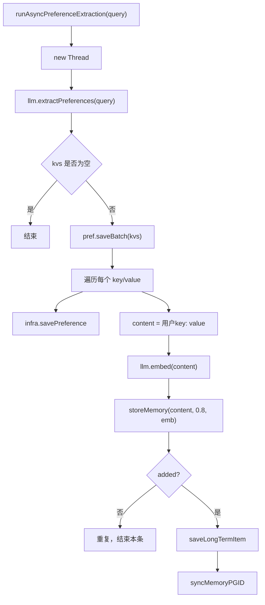

# 12-LLM异步偏好抽取-runAsyncPreferenceExtraction

## 1. 一句话结论

`runAsyncPreferenceExtraction` 会开一个新线程，让 LLM 从用户问题里抽取偏好 key-value，然后同时写入偏好记忆、数据库、长期记忆或图记忆。

它和轻量级规则不是二选一，而是每轮都会被触发。

## 2. 在记忆系统里的位置

它在主流程中这样调用：

```java
runAsyncPreferenceExtraction(query);
```

位置在：

```text
stm.add("user", query) 之后
pref.extractAndSave(query) 之前
```

但它内部是新线程，所以不阻塞当前回答。

## 3. 源码位置和核心对象

源码位置：

```text
AGI-saber-java/src/main/java/com/agi/assistant/service/agent/UnifiedAgentService.java
```

核心方法：

```java
private void runAsyncPreferenceExtraction(String query)
```

存在形式变化：

```text
query
  → llm.extractPreferences(query)
  → Map<String,String> kvs
  → PreferenceMemory.data
  → preferences 表
  → "用户key: value" 自然语言事实
  → MemoryItem / Neo4j Memory 节点
```

## 4. 核心流程图



## 5. 源码讲解

### 5.1 先说这个方法是干什么的

`runAsyncPreferenceExtraction` 做的事是：

```text
让大模型在后台从用户输入里提取偏好。
```

它和轻量级规则不同。

轻量级规则只会看固定关键词。

LLM 抽取会尝试理解一句话里的多个信息，例如：

```text
我叫小李，平时在上海，喜欢中文讲解和 Java 例子。
```

可能抽成：

```text
姓名 = 小李
城市 = 上海
语言 = 中文
喜好 = Java 例子
```

### 5.2 生活类比

轻量级规则像前台登记员，听到固定话术就登记。

LLM 异步抽取像后台助理：

```text
前台先继续服务用户。
后台助理慢慢分析用户这句话里有哪些用户档案信息。
分析完以后，再写入用户档案和长期记忆。
```

所以它不阻塞本轮回答。

### 5.3 对应到代码：开后台线程

```java
new Thread(() -> { // 新建线程，偏好抽取在后台执行
    Map<String, String> kvs = llm.extractPreferences(query); // 调用 LLM，把用户输入抽成 key-value
    if (kvs == null || kvs.isEmpty()) return; // 没抽到偏好就结束
```

先说目的：

```text
创建一个新线程，让偏好抽取在后台执行。
主流程不用等它完成。
```

逐行解释：

```text
第 1 行：new Thread(...) 创建后台线程。
第 1 行：() -> { ... } 是线程要执行的代码。
第 2 行：调用 llm.extractPreferences(query)，让大模型从 query 里抽取偏好 Map。
第 3 行：如果没有抽到任何偏好，就直接结束这个线程。
```

技术点：

```text
Map<String, String> kvs 表示一批偏好 key-value。
kvs 可能长这样：{"姓名":"小李","城市":"上海"}。
```

### 5.4 对应到代码：保存到偏好内存

```java
pref.saveBatch(kvs); // 把 LLM 抽出的多条偏好保存到 PreferenceMemory.data
```

先说目的：

```text
先把 LLM 抽出来的偏好保存到 PreferenceMemory.data。
```

生活类比：

```text
后台助理分析完用户信息后，
先把这些信息填进用户档案卡。
```

例如：

```text
kvs = {
  "姓名": "小李",
  "城市": "上海",
  "喜好": "Java 例子"
}
```

执行后：

```text
PreferenceMemory.data 里就有这三条偏好。
```

### 5.5 对应到代码：每条偏好都做持久化和长期记忆写入

```java
for (Map.Entry<String, String> e : kvs.entrySet()) { // e.getKey 是偏好名，e.getValue 是偏好值
    infra.savePreference("default", e.getKey(), e.getValue()); // 保存到 preferences 表，userId 当前写死为 default
    String content = "用户" + e.getKey() + ": " + e.getValue(); // 把偏好转成自然语言事实
    List<Double> emb = llm.embed(content); // 对这条事实生成 embedding，用于长期记忆召回和去重
    boolean added = storeMemory(content, 0.8, emb); // 写入长期记忆或图记忆，importance 固定为 0.8
```

先说目的：

```text
偏好不只存在内存里。
它还会保存到数据库 preferences 表。
同时会转成一条自然语言事实，写入长期记忆或图记忆。
```

逐行解释：

```text
第 1 行：遍历 LLM 抽到的每一条偏好。
第 2 行：保存到 preferences 表，当前 userId 写的是 default。
第 3 行：把 key/value 改写成一句自然语言事实。
第 4 行：对这句事实做 embedding。
第 5 行：写入长期记忆或图记忆，importance 固定为 0.8。
```

真实例子：

```text
e.getKey() = "喜好"
e.getValue() = "Java 逐行解释"
```

那么：

```java
String content = "用户" + e.getKey() + ": " + e.getValue();
```

得到：

```text
content = "用户喜好: Java 逐行解释"
```

为什么要转成自然语言事实？

```text
PreferenceMemory.data 适合按 key/value 直接取。
LongTermMemory 适合用语义相似度召回。

所以同一条偏好会有两种形态：
1. key/value：喜好 = Java 逐行解释
2. 自然语言事实：用户喜好: Java 逐行解释
```

### 5.6 对应到代码：如果新增成功，保存长期记忆到数据库并同步 ID

```java
if (added) { // 只有新增成功才写 PostgreSQL
    String embJson = "null"; // 默认没有 embedding
    try { if (emb != null) embJson = mapper.writeValueAsString(emb); } catch (Exception ignored) {} // embedding 存在就转 JSON
    int pgId = infra.saveLongTermItem(content, 0.8, embJson); // 保存长期记忆到数据库，并拿到数据库自增 ID
    syncMemoryPGID(pgId); // 把内存里最后新增的 MemoryItem 的 id 改成数据库 ID
}
```

先说目的：

```text
storeMemory 先写内存长期记忆或图记忆。
infra.saveLongTermItem 后写 PostgreSQL。
数据库会生成自己的 ID。
syncMemoryPGID 用来把内存里的那条新记忆 ID 改成数据库 ID。
```

逐行解释：

```text
第 1 行：只有 storeMemory 返回 added=true，才说明不是重复记忆，可以写数据库。
第 2 行：先准备 embedding 的 JSON 字符串，默认是 "null"。
第 3 行：如果 emb 不为空，就把 embedding 序列化成 JSON。
第 4 行：把 content、importance、embedding 保存到 long_term_memory 表，拿到 pgId。
第 5 行：把内存或图里的最后新增记忆 ID 同步成 pgId。
```

生活类比：

```text
你先在草稿本写了一条记录，临时编号是 7。
然后正式录入数据库，数据库给它编号 103。
为了以后查找对得上，就把草稿本里这条记录的编号也改成 103。
```

这里同步的是：

```text
刚刚 storeMemory 新增的最后一条记忆。
```

为什么能找到？

```text
因为 syncMemoryPGID 的语义就是“同步最后新增的那条记忆”。
长期记忆或图记忆内部会记录最近一次新增项，然后把它的 id 改成 pgId。
```

## 6. 真实例子：在流程中怎么运行

用户输入：

```text
我叫小李，喜欢用中文和 Java 例子学习
```

LLM 可能返回：

```text
{
  "姓名": "小李",
  "语言": "中文",
  "喜好": "Java 例子学习"
}
```

线程里保存偏好：

```text
PreferenceMemory.data = {
  "姓名": "小李",
  "语言": "中文",
  "喜好": "Java 例子学习"
}
```

然后每条偏好转成长期记忆内容：

```text
用户姓名: 小李
用户语言: 中文
用户喜好: Java 例子学习
```

每条都会：

```text
1. 做 embedding
2. storeMemory(content, 0.8, emb)
3. 如果不是重复，写入 long_term_memory 表
4. syncMemoryPGID(pgId)
```

## 7. 容易混淆的点

LLM 异步偏好抽取会经过大模型。

轻量级规则不会经过大模型。

当前代码中两者都会跑：

```text
runAsyncPreferenceExtraction(query)  异步 LLM
pref.extractAndSave(query)           同步规则
```

它们可能抽出不同结果。

冲突时当前代码没有专门比较可信度，也没有保留版本历史；同一个 key 在 `ConcurrentHashMap` 中会被后写入的值覆盖。

## 8. 面试怎么说

可以这样说：

```text
LLM 偏好抽取通过 runAsyncPreferenceExtraction 在后台线程执行。它调用 llm.extractPreferences 得到 Map<String,String>，先写 PreferenceMemory 和 preferences 表，再把每条偏好转换成“用户key: value”的自然语言事实，生成 embedding 后写入长期记忆或图记忆。如果新增成功，还会保存到 PostgreSQL 并同步内存 ID 和数据库 ID。
```
