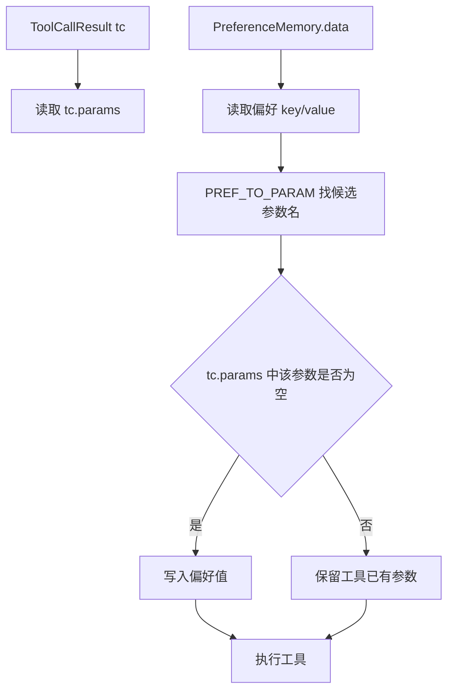

# 13-PreferenceFiller偏好填工具参数

## 1. 一句话结论

`PreferenceFiller` 的作用是：当工具参数缺失时，用用户偏好自动补参数。

例如用户偏好里有：

```text
城市 = 上海
```

工具调用参数里缺少：

```text
city
```

它就会自动补成：

```text
city = 上海
```

## 2. 在记忆系统里的位置

它只在工具模式里使用。

调用位置：

```java
PreferenceFiller.fill(tc, pref);
```

所在流程：

```text
ToolModeHandler.run
  ↓
toolService.decide(query, ts)
  ↓
得到 ToolCallResult tc
  ↓
PreferenceFiller.fill(tc, pref)
  ↓
tool.getExecute().apply(tc.getParams())
```

## 3. 源码位置和核心对象

源码位置：

```text
AGI-saber-java/src/main/java/com/agi/assistant/application/chat/PreferenceFiller.java
```

核心映射：

```java
private static final Map<String, List<String>> PREF_TO_PARAM = Map.of(
        "城市", List.of("city", "location", "location_name"),
        "时区", List.of("timezone", "tz", "time_zone"),
        "姓名", List.of("name", "username", "user_name"),
        "语言", List.of("language", "lang"),
        "国家", List.of("country", "nation")
);
```

这个 Map 的意思是：

```text
偏好 key = "国家"
可能对应工具参数名 = "country" 或 "nation"
```

也就是说，不同工具可能把同一个含义的参数起不同名字。

## 4. 核心流程图



## 5. 源码讲解

### 5.1 先说这个类是干什么的

`PreferenceFiller` 做的事情是：

```text
工具调用参数缺了，就尝试用用户偏好补上。
```

例如用户只说：

```text
查一下天气
```

工具需要：

```text
city
```

但用户这轮没说城市。

如果偏好记忆里有：

```text
城市 = 上海
```

它就把工具参数补成：

```text
city = 上海
```

### 5.2 生活类比

可以把工具调用想成填一张表。

天气工具需要这张表：

```text
city: ______
```

用户这轮没填。

系统翻用户档案，发现：

```text
城市：上海
```

于是帮用户把空格填上。

### 5.3 对应到代码：偏好 key 和工具参数名怎么对应

```java
private static final Map<String, List<String>> PREF_TO_PARAM = Map.of( // key 是偏好名，value 是可能匹配的工具参数名列表
        "城市", List.of("city", "location", "location_name"), // 用户偏好“城市”可以填 city/location/location_name
        "时区", List.of("timezone", "tz", "time_zone"), // 用户偏好“时区”可以填 timezone/tz/time_zone
        "姓名", List.of("name", "username", "user_name"), // 用户偏好“姓名”可以填 name/username/user_name
        "语言", List.of("language", "lang"), // 用户偏好“语言”可以填 language/lang
        "国家", List.of("country", "nation") // 用户偏好“国家”可以填 country/nation
);
```

先说目的：

```text
不同工具对同一个意思可能使用不同参数名。
所以系统需要一张“偏好 key 到工具参数名”的对照表。
```

真实解释：

```text
"城市" -> ["city", "location", "location_name"]
```

意思是：

```text
如果偏好记忆里有“城市=上海”，
它可以用来补 city，
也可以用来补 location，
也可以用来补 location_name。
```

你之前问的：

```java
"国家", List.of("country", "nation")
```

不是表示有两个国家。

它表示：

```text
偏好 key 叫“国家”。
如果某个工具参数名叫 country，可以填。
如果某个工具参数名叫 nation，也可以填。
```

### 5.4 对应到代码：fill 方法整体流程

```java
public static void fill(ToolCallResult tc, PreferenceMemory pref) { // tc 是本次工具调用结果，pref 是偏好记忆
    if (tc == null || pref.getData().isEmpty()) return; // 没有工具调用或没有偏好，就不用填
    for (Map.Entry<String, List<String>> e : PREF_TO_PARAM.entrySet()) { // 遍历每一种偏好到参数名的映射
        String prefVal = pref.getData().get(e.getKey()); // 从偏好记忆里取值，例如 key=城市，prefVal=上海
        if (prefVal == null || prefVal.isEmpty()) continue; // 这个偏好不存在就跳过
        for (String paramName : e.getValue()) { // 遍历可能的工具参数名，例如 city/location
            Object v = tc.getParams().get(paramName); // 看本次工具参数里有没有这个参数
            if (v == null || v.toString().isEmpty()) { // 只有参数缺失或为空时才填
                tc.getParams().put(paramName, prefVal); // 用偏好值补工具参数
            }
        }
    }
}
```

先说目的：

```text
fill 方法拿到本次工具调用 tc，
再拿到偏好记忆 pref，
然后尝试把缺失参数补上。
```

这里的两个对象分别是：

```text
tc:
  本次 LLM/工具决策出来的工具调用。
  里面有 toolName 和 params。

pref:
  当前用户偏好记忆。
  里面是 Map<String,String>，例如 城市=上海。
```

### 5.5 每行代码在流程里负责什么

逐行解释：

```text
第 1 行：定义 fill 方法，传入工具调用结果 tc 和偏好记忆 pref。
第 2 行：如果 tc 是 null，说明没有工具调用，直接结束。
第 2 行：如果偏好是空的，也没有东西可补，直接结束。
第 3 行：遍历 PREF_TO_PARAM 这张映射表。
第 4 行：根据偏好 key 去 PreferenceMemory 里取值。
第 5 行：如果这个偏好不存在，就跳过。
第 6 行：遍历这个偏好可能对应的所有工具参数名。
第 7 行：从 tc.params 里取当前参数值。
第 8 行：只有参数不存在或为空字符串时，才允许补。
第 9 行：把偏好值写进工具参数。
```

真实例子：

```text
PreferenceMemory.data = {
  "城市": "上海"
}

tc = ToolCallResult {
  toolName = "get_weather",
  params = {
    "city": ""
  }
}
```

执行时：

```text
遍历到偏好 key = 城市
prefVal = 上海
候选参数名 = city, location, location_name

检查 city：
tc.params["city"] = ""
为空，所以写入 上海
```

执行后：

```text
tc.params = {
  "city": "上海"
}
```

重要原则：

```text
PreferenceFiller 只补空参数，不覆盖已有参数。
```

如果本轮用户明确说：

```text
查北京天气
```

工具决策已经得到：

```text
city = 北京
```

那么偏好里的“城市=上海”不会覆盖北京。

## 6. 真实例子：在流程中怎么运行

偏好记忆里有：

```text
PreferenceMemory.data = {
  "城市": "上海",
  "语言": "中文"
}
```

用户问：

```text
查一下天气
```

工具决策结果：

```text
ToolCallResult {
  toolName = "get_weather",
  params = {
    "city": ""
  }
}
```

执行填参：

```java
PreferenceFiller.fill(tc, pref);
```

遍历到：

```text
偏好 key = 城市
prefVal = 上海
候选参数名 = city, location, location_name
```

发现：

```text
tc.params["city"] = ""
```

于是填成：

```text
params = {
  "city": "上海"
}
```

后面工具执行：

```java
tool.getExecute().apply(tc.getParams());
```

拿到的就是已经补好的参数。

## 7. 容易混淆的点

`"国家", List.of("country", "nation")` 不是在保存两个国家。

它的意思是：

```text
如果偏好里有 key = 国家，
那么它可以用来填工具参数 country，
也可以用来填工具参数 nation。
```

`PreferenceFiller` 不会覆盖已有参数。

只有当工具参数为空时才填：

```java
if (v == null || v.toString().isEmpty())
```

所以如果用户本轮明确说“查北京天气”，即使偏好城市是上海，也应该以本轮工具决策出的北京为准。

## 8. 面试怎么说

可以这样说：

```text
PreferenceFiller 是偏好记忆和工具调用之间的适配器。
它维护一个偏好 key 到工具参数名列表的映射，例如“城市”可以对应 city、location、location_name。
工具决策生成 ToolCallResult 后，如果参数缺失，PreferenceFiller 会用 PreferenceMemory 中的偏好值补齐，但不会覆盖已经存在的参数。
```
