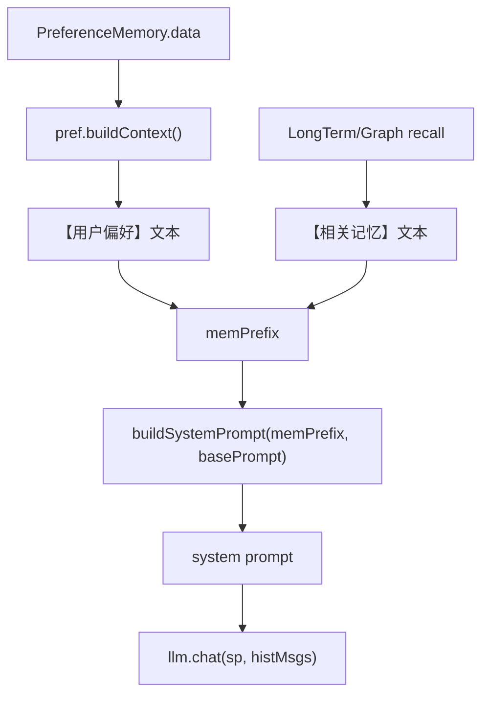

# 14-偏好如何进入systemPrompt

## 1. 一句话结论

偏好进入 LLM 的方式是：`PreferenceMemory.buildContext()` 先把 Map 转成 `【用户偏好】`文本，再放进 `memPrefix`，最后拼到 system prompt 前面。

核心路径：

```text
PreferenceMemory.data
  → pref.buildContext()
  → memPrefix
  → ChatHistoryAdapter.buildSystemPrompt(...)
  → llm.chat(systemPrompt, histMsgs)
```

## 2. 在记忆系统里的位置

它发生在回答前：

```java
String memPrefix = buildMemorySystemPrefixWithCtx(query);
```

普通 chat 模式下：

```java
String sp = ChatHistoryAdapter.buildSystemPrompt(memPrefix, basePrompt);
resp.setAnswer(llm.chat(sp, histMsgs));
```

## 3. 源码位置和核心对象

偏好转文本：

```text
PreferenceMemory.java
```

组装 memPrefix：

```text
UnifiedAgentService.buildMemorySystemPrefixWithCtx
```

拼 system prompt：

```text
ChatHistoryAdapter.buildSystemPrompt
```

存在形式变化：

```text
Map<String,String>
  → "【用户偏好】\nkey: value"
  → memPrefix 字符串
  → system prompt 字符串
```

## 4. 核心流程图



## 5. 源码讲解

### 5.1 先说偏好为什么要进入 system prompt

偏好记忆保存在程序内部是 Map：

```text
{
  "姓名": "小李",
  "喜好": "Java 逐行解释"
}
```

但是大模型不能直接读取 Java 内存里的 Map。

所以系统要把 Map 转成一段文字，放进 system prompt。

目的就是：

```text
让模型回答时知道用户稳定偏好。
```

### 5.2 生活类比

你可以把 system prompt 想成给助手看的工作说明。

在正式回答前，先告诉助手：

```text
这个用户叫小李。
他喜欢 Java 逐行解释。
回答时尽量按这个风格来。
```

这就是偏好进入 system prompt 的意义。

### 5.3 对应到代码：偏好 Map 变成文本

```java
public String buildContext() { // 把偏好 Map 转成 prompt 文本
    if (data.isEmpty()) return ""; // 没有偏好时返回空字符串
    String items = data.entrySet().stream() // 遍历偏好 Map
            .map(e -> e.getKey() + ": " + e.getValue()) // 每条偏好转成 "key: value"
            .collect(Collectors.joining("\n")); // 多条偏好用换行拼起来
    return "【用户偏好】\n" + items; // 加上标题，方便模型识别这部分是用户偏好
}
```

先说目的：

```text
buildContext 把 PreferenceMemory.data 转成“【用户偏好】”文本。
```

逐行解释：

```text
第 1 行：定义 buildContext，返回一段字符串。
第 2 行：如果偏好 Map 是空的，就返回空字符串。
第 3 行：遍历 data 里的每个 key/value。
第 4 行：把每个 key/value 拼成 “key: value”。
第 5 行：多条偏好用换行连接。
第 6 行：加上标题“【用户偏好】”。
```

真实例子：

```text
data = {
  "姓名": "小李",
  "喜好": "Java 逐行解释"
}
```

执行后：

```text
【用户偏好】
姓名: 小李
喜好: Java 逐行解释
```

### 5.4 对应到代码：偏好和长期记忆一起组成 memPrefix

```java
private String buildMemorySystemPrefixWithCtx(String query) { // 构造带当前 query 召回结果的记忆前缀
    List<String> parts = new ArrayList<>(); // 用 parts 收集不同来源的记忆文本
    String prefCtx = pref.buildContext(); // 先取偏好文本
    if (!prefCtx.isEmpty()) parts.add(prefCtx); // 有偏好才放进 parts

    List<Double> queryEmb = llm.embed(query); // 对当前问题做 embedding，用于召回长期记忆
    List<MemoryItem> recalled = (graphMem != null
            ? graphMem.recall(query, cfg.getMemory().getLongTermTopK(), queryEmb)
            : ltm.recall(query, cfg.getMemory().getLongTermTopK(), queryEmb)); // 有图层走图召回，否则走长期记忆召回
    if (!recalled.isEmpty()) { // 有召回结果才加入
        List<String> contents = recalled.stream().map(MemoryItem::getContent).toList(); // 取每条记忆的 content
        parts.add("【相关记忆】\n" + String.join("\n", contents)); // 拼成相关记忆文本
    }
    return String.join("\n\n", parts); // 偏好和相关记忆之间空一行
}
```

先说目的：

```text
memPrefix 是记忆前缀。
它不是只有偏好，也会包含当前 query 召回到的相关长期记忆。
```

生活类比：

```text
给助手的提醒纸条可能有两块：
第一块：用户偏好
第二块：和本轮问题相关的长期记忆
```

逐行解释：

```text
第 1 行：定义方法，传入当前 query，用它召回相关记忆。
第 2 行：parts 是一个文本片段列表，用来收集不同来源的记忆。
第 3 行：先把偏好 Map 转成文本 prefCtx。
第 4 行：如果 prefCtx 不为空，就加入 parts。
第 6 行：对当前问题 query 做 embedding。
第 7-9 行：如果有 graphMem，就走图记忆召回；否则走长期记忆召回。
第 10 行：如果召回结果不为空，才加入 memPrefix。
第 11 行：取出每条 MemoryItem 的 content。
第 12 行：拼成“【相关记忆】”文本。
第 14 行：把 parts 用空行拼成最终 memPrefix。
```

真实例子：

```text
parts[0] =
【用户偏好】
姓名: 小李
喜好: Java 逐行解释

parts[1] =
【相关记忆】
用户正在学习 AGI-saber 的记忆系统
```

最终：

```text
memPrefix =
【用户偏好】
姓名: 小李
喜好: Java 逐行解释

【相关记忆】
用户正在学习 AGI-saber 的记忆系统
```

### 5.5 对应到代码：memPrefix 拼进 system prompt

```java
public static String buildSystemPrompt(String memPrefix, String basePrompt) { // 把记忆前缀和基础 prompt 合并
    if (memPrefix == null || memPrefix.isEmpty()) return basePrompt; // 没有记忆时只返回基础 prompt
    return memPrefix + "\n\n" + basePrompt; // 有记忆时，记忆放在前面
}
```

先说目的：

```text
把记忆前缀放到基础 system prompt 前面。
```

生活类比：

```text
回答规则前面先贴一张用户档案。
模型先看到用户相关信息，再看到“你是一个简洁的AI助手”这类基础规则。
```

逐行解释：

```text
第 1 行：定义 buildSystemPrompt，传入 memPrefix 和 basePrompt。
第 2 行：如果没有记忆前缀，就只返回基础 prompt。
第 3 行：如果有记忆前缀，就把 memPrefix 放前面，basePrompt 放后面，中间空两行。
```

最后进入 LLM：

```java
llm.chat(sp, histMsgs);
```

这里：

```text
sp       = system prompt，里面有偏好和相关记忆
histMsgs = messages，里面是最近几轮短期对话
```

## 6. 真实例子：在流程中怎么运行

偏好内存：

```text
PreferenceMemory.data = {
  "姓名": "小李",
  "喜好": "Java 逐行解释"
}
```

`pref.buildContext()` 得到：

```text
【用户偏好】
姓名: 小李
喜好: Java 逐行解释
```

长期记忆召回得到：

```text
用户正在学习 AGI-saber 的记忆系统
```

`memPrefix` 变成：

```text
【用户偏好】
姓名: 小李
喜好: Java 逐行解释

【相关记忆】
用户正在学习 AGI-saber 的记忆系统
```

最终 system prompt：

```text
【用户偏好】
姓名: 小李
喜好: Java 逐行解释

【相关记忆】
用户正在学习 AGI-saber 的记忆系统

你是一个简洁的AI助手。结合你掌握的用户信息，使回答更个性化。
```

LLM 调用：

```java
llm.chat(sp, histMsgs);
```

## 7. 容易混淆的点

偏好不是作为 `histMsgs` 进入 LLM 的。

偏好是作为 system prompt 的一部分进入：

```text
system prompt = memPrefix + basePrompt
```

短期对话才是 `histMsgs`：

```text
messages = histMsgs
```

所以模型看到的上下文分层是：

```text
system：稳定用户信息 + 相关长期记忆 + 助手行为规则
messages：最近几轮用户和助手对话
```

## 8. 面试怎么说

可以这样说：

```text
偏好记忆通过 buildContext 转换成【用户偏好】文本，然后由 buildMemorySystemPrefixWithCtx 放入 memPrefix。
普通 chat 模式下，ChatHistoryAdapter.buildSystemPrompt 会把 memPrefix 拼到基础 system prompt 前面，最后调用 llm.chat(sp, histMsgs)。
因此偏好进入的是 system prompt，而不是短期历史 messages。
```
