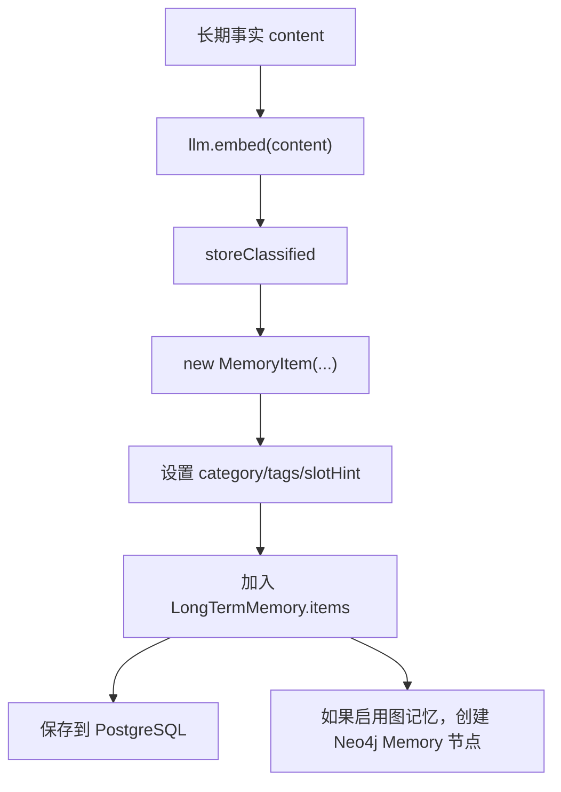

# 15-长期记忆对象-MemoryItem

## 1. 一句话结论

`MemoryItem` 是长期记忆的最小对象，它保存一条可长期召回的事实，以及这条事实的分数、重要性、embedding、分类、标签等元数据。

短期记忆保存“对话原文”，长期记忆保存“以后还值得用的事实”。

## 2. 在记忆系统里的位置

长期记忆链路是：

```text
MemoryWriter / LLM 偏好抽取
  ↓
生成 content + importance + embedding + category/tags
  ↓
LongTermMemory.storeClassified
  ↓
MemoryItem
  ↓
LongTermMemory.items / PostgreSQL / Neo4j
```

## 3. 源码位置和核心对象

源码位置：

```text
AGI-saber-java/src/main/java/com/agi/assistant/model/MemoryItem.java
```

真实字段：

```java
private int id; // 记忆 ID，最终会同步成 PostgreSQL 的 long_term_memory.id
private String content; // 记忆正文，例如“用户喜欢 Java 逐行解释”
private double importance; // 重要性，写入时由类别或调用方决定
private List<Double> embedding; // 向量，用于语义相似度计算
private double score; // 召回时临时写入的综合分数
private LocalDateTime createdAt; // 创建时间
private LocalDateTime lastAccessed; // 最近访问时间
private String category = "general"; // 分类，默认 general
private List<String> tags = new ArrayList<>(); // 标签
private String slotHint; // promptctx 槽位提示，可为空
```

长期记忆有多种存在形式：

```text
1. MemoryItem 对象形式：
   MemoryItem{id, content, importance, embedding, category, tags...}

2. LongTermMemory 内存列表形式：
   List<MemoryItem> items

3. PostgreSQL 行形式：
   long_term_memory 表保存 content/importance/embedding/category/tags/slotHint

4. Neo4j 图节点形式：
   (:Memory {mem_id, content, importance})
```

## 4. 核心流程图



## 5. 源码讲解

### 5.1 先说 MemoryItem 是干什么的

`MemoryItem` 可以先理解成：

```text
长期记忆库里的一张记忆卡片。
```

短期记忆保存的是“刚才聊天原文”。

长期记忆保存的是“以后还值得想起来的事实”。

例如：

```text
用户喜欢 Java 逐行解释。
用户正在学习 AGI-saber 的记忆系统。
用户所在城市是上海。
```

### 5.2 生活类比

可以把长期记忆想成一个档案柜。

每个 `MemoryItem` 就是档案柜里的一张卡片：

```text
编号：37
内容：用户喜欢 Java 逐行解释
重要性：0.8
向量：用于相似度检索
分类：preference
标签：["Java", "学习风格"]
创建时间：2026-06-22 21:00
最近访问时间：2026-06-22 21:30
```

### 5.3 对应到代码：构造方法

```java
public MemoryItem(int id, String content, double importance, List<Double> embedding) { // 创建长期记忆对象
    this.id = id; // 设置记忆 ID
    this.content = content; // 设置记忆正文
    this.importance = importance; // 设置重要性
    this.embedding = embedding; // 设置向量
    this.createdAt = LocalDateTime.now(); // 创建时间使用当前时间
    this.lastAccessed = LocalDateTime.now(); // 初始最近访问时间也设为当前时间
}
```

先说目的：

```text
创建一张新的长期记忆卡片，并填入核心字段。
```

逐行解释：

```text
第 1 行：构造方法，创建 MemoryItem 时传入 id、content、importance、embedding。
第 2 行：保存记忆 ID。
第 3 行：保存记忆正文。
第 4 行：保存重要性。
第 5 行：保存 embedding 向量。
第 6 行：创建时间设为当前时间。
第 7 行：最近访问时间也先设为当前时间。
```

真实例子：

```java
new MemoryItem(37, "用户喜欢 Java 逐行解释", 0.8, emb);
```

创建出来的对象大致是：

```text
MemoryItem {
  id = 37,
  content = "用户喜欢 Java 逐行解释",
  importance = 0.8,
  embedding = emb,
  createdAt = 当前时间,
  lastAccessed = 当前时间
}
```

### 5.4 对应到代码：分类字段怎么兜底

```java
public void setCategory(String category) { // 设置长期记忆分类
    this.category = category == null || category.isEmpty() ? "general" : category; // 空分类统一变成 general
}
```

先说目的：

```text
给长期记忆设置分类。
如果外部没传分类，就默认归到 general。
```

生活类比：

```text
档案卡要放进分类抽屉。
如果不知道属于哪个抽屉，就先放到“通用 general”抽屉。
```

逐行解释：

```text
第 1 行：定义设置分类的方法。
第 2 行：如果 category 是 null 或空字符串，就保存 general。
第 2 行：否则保存外部传进来的 category。
```

### 5.5 对应到代码：标签字段怎么兜底

```java
public void setTags(List<String> tags) { // 设置标签列表
    this.tags = tags == null ? new ArrayList<>() : tags; // tags 为 null 时保存空列表，避免后面空指针
}
```

先说目的：

```text
给长期记忆设置标签列表。
```

真实例子：

```text
tags = ["Java", "学习风格"]
```

表示这条记忆可以从多个角度被理解。

逐行解释：

```text
第 1 行：定义设置标签的方法。
第 2 行：如果外部传进来的 tags 是 null，就保存空列表。
第 2 行：否则保存传进来的标签列表。
```

技术点：

```text
保存空列表比保存 null 更安全。
后面遍历 tags 时，不容易因为 null 报错。
```

### 5.6 score 字段要单独理解

```java
private double score;
```

`score` 不是记忆本身的固定重要性。

它是：

```text
某一次 query 召回时，这条记忆和 query 的综合匹配分数。
```

对应代码：

```java
item.setScore(scored.get(i)[1]);
```

容易混淆：

```text
importance：
  记忆本身的重要程度，写入时就有。

score：
  本次召回临时算出来的相关程度，每次 query 都可能不同。
```

## 6. 真实例子：在流程中怎么运行

假设 MemoryWriter 抽到一条：

```text
category = preference
content = 用户喜欢 Java 代码逐行解释
tags = ["学习风格", "Java"]
importance = 0.7
```

embedding API 返回：

```text
[0.12, -0.03, 0.44, ...]
```

内存里会形成：

```text
MemoryItem {
  id = 15,
  content = "用户喜欢 Java 代码逐行解释",
  importance = 0.7,
  embedding = [0.12, -0.03, 0.44, ...],
  score = 0.0,
  createdAt = "2026-06-22T21:30:00",
  lastAccessed = "2026-06-22T21:30:00",
  category = "preference",
  tags = ["学习风格", "Java"],
  slotHint = "Profile"
}
```

下一次用户问：

```text
这个代码怎么理解？
```

召回时这条记忆可能被打分并设置：

```text
score = 0.73
```

然后进入 `【相关记忆】`。

## 7. 容易混淆的点

`importance` 和 `score` 不是一个东西。

```text
importance：这条记忆本身有多重要，写入时确定
score：这次查询时它和 query 有多相关，召回时计算
```

embedding 维度也不是 `MemoryItem` 写死的。

当前 Java 代码里 `LlmService.embed` 直接返回 API 的 embedding 数组：

```java
for (JsonNode n : embNode) embedding.add(n.asDouble());
```

所以长期记忆向量维度由外部 embedding 模型决定，不在 `MemoryItem` 里固定。

## 8. 面试怎么说

可以这样说：

```text
MemoryItem 是长期记忆的基本单元，包含 content、importance、embedding、createdAt、lastAccessed、category、tags、slotHint 等字段。
写入时 importance 表示记忆本身重要性，召回时 score 表示当前 query 下的相关性。
它既存在于 LongTermMemory.items 内存列表里，也会保存到 PostgreSQL；启用图记忆时，还会对应 Neo4j 的 Memory 节点。
```
