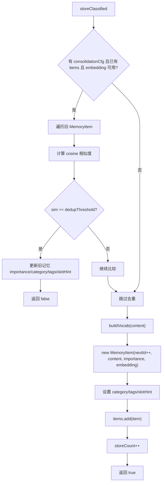

# 16-长期记忆写入-storeClassified

## 1. 一句话结论

`storeClassified` 是长期记忆的核心写入方法：它先判断是否重复，没重复才创建新的 `MemoryItem`，并保存分类、标签和槽位提示。

## 2. 在记忆系统里的位置

它被这些地方调用：

```text
MemoryWriter.persist(...)             回复后分类记忆写入
GraphMemory.storeClassified(...)      图记忆写入时先写 LTM
LongTermMemory.store(...)             普通写入最终也委托到 storeClassified
```

如果启用图记忆，调用路径是：

```text
MemoryWriter.persist
  ↓
graphMem.storeClassified
  ↓
ltm.storeClassified
```

如果没有图记忆：

```text
MemoryWriter.persist
  ↓
ltm.storeClassified
```

## 3. 源码位置和核心对象

源码位置：

```text
AGI-saber-java/src/main/java/com/agi/assistant/service/memory/LongTermMemory.java
```

核心方法：

```java
public boolean storeClassified(String content, double importance, List<Double> embedding,
                               String category, List<String> tags, String slotHint)
```

参数含义：

```text
content     记忆正文
importance 重要性
embedding  语义向量
category   identity / preference / tool_failure / policy / general
tags       自由标签
slotHint   Profile / Constraints / ToolState / null
```

## 4. 核心流程图



## 5. 源码讲解

### 5.1 先说 storeClassified 是干什么的

`storeClassified` 做的事是：

```text
把一条新记忆写入长期记忆库。
写之前先检查是不是重复。
如果重复，就更新旧记忆。
如果不重复，才真正新增。
```

它比普通 `store` 多保存三类信息：

```text
category  分类
tags      标签
slotHint  槽位提示
```

### 5.2 生活类比

可以把它想成图书管理员收一本新书：

```text
先查书架上有没有很像的书。
如果已经有了，就更新旧书的信息，比如重要性、标签。
如果没有，才把新书放进书架。
```

长期记忆也是这样：

```text
先查重，再新增。
```

### 5.3 对应到代码：先做重复检查

```java
if (consolidationCfg != null && !items.isEmpty() && embedding != null && !embedding.isEmpty()) { // 只有配置存在、已有记忆、当前 embedding 可用时才做向量去重
    for (MemoryItem item : items) { // 遍历已有长期记忆
        if (item.getEmbedding() != null && item.getEmbedding().size() == embedding.size()) { // 旧记忆也有同维度 embedding 才能比较
            double sim = cosine(embedding, item.getEmbedding()); // 计算当前记忆和旧记忆的余弦相似度
            if (sim >= consolidationCfg.getDedupThreshold()) { // 相似度超过去重阈值，认为是重复记忆
```

先说目的：

```text
写入前先拿新记忆的 embedding 和已有记忆逐条比较。
如果相似度超过 dedupThreshold，就认为是重复记忆。
```

逐行解释：

```text
第 1 行：只有满足三个条件才去重：
       有 consolidation 配置；
       已经有旧记忆；
       新记忆有 embedding。
第 2 行：遍历已有的每一条 MemoryItem。
第 3 行：旧记忆也必须有 embedding，并且维度和新 embedding 一样。
第 4 行：计算新旧记忆 embedding 的余弦相似度。
第 5 行：如果相似度达到去重阈值，就认为重复。
```

### 5.4 重复时不是新增，而是更新旧项

```java
if (importance > item.getImportance()) { // 如果新记忆更重要
    item.setImportance(importance); // 提高旧记忆的重要性
}
```

先说目的：

```text
如果新记忆和旧记忆重复，不再新增一条。
但如果新记忆更重要，就把旧记忆的重要性提高。
```

真实例子：

```text
旧记忆：用户喜欢 Java 解释，importance=0.6
新记忆：用户非常喜欢 Java 逐行解释，importance=0.8
相似度很高，被认为重复
```

结果：

```text
不新增新记忆。
旧记忆 importance 从 0.6 更新为 0.8。
```

### 5.5 分类更具体时允许覆盖

```java
if (category != null && !category.isEmpty()
        && !"general".equals(category)
        && ("general".equals(item.getCategory()) || item.getCategory() == null)) {
    item.setCategory(category); // 旧分类是 general 时，用更具体的新分类覆盖
}
```

先说目的：

```text
如果旧记忆只是 general，新记忆给出了更具体分类，就把分类补准。
```

生活类比：

```text
一张档案原来放在“通用”抽屉。
后来发现它其实是“偏好 preference”。
那就把分类从 general 改成 preference。
```

### 5.6 标签合并

```java
if (tags != null && !tags.isEmpty()) { // 新记忆有标签
    List<String> merged = new ArrayList<>(item.getTags() == null ? Collections.emptyList() : item.getTags()); // 拿旧标签
    for (String t : tags) { // 遍历新标签
        if (!merged.contains(t)) merged.add(t); // 不重复才加入
    }
    item.setTags(merged); // 写回合并后的标签
}
```

先说目的：

```text
重复记忆虽然不新增，但新记忆带来的标签可以合并到旧记忆上。
```

真实例子：

```text
旧标签：["Java"]
新标签：["学习风格", "Java"]
```

合并后：

```text
["Java", "学习风格"]
```

逐行解释：

```text
第 1 行：新 tags 不为空才处理。
第 2 行：先复制旧标签；如果旧标签是 null，就用空列表。
第 3 行：遍历新标签。
第 4 行：旧标签里没有这个标签，才加入，避免重复。
第 6 行：把合并后的标签写回旧记忆。
```

### 5.7 如果不重复，真正新增长期记忆

```java
buildVocab(content); // 构建本地词袋召回需要的词表
MemoryItem item = new MemoryItem(nextId++, content, importance, embedding); // 创建新的长期记忆对象，id 先用内存 nextId
item.setCategory(category); // 保存分类
item.setTags(tags == null ? new ArrayList<>() : new ArrayList<>(tags)); // 保存标签副本
item.setSlotHint(slotHint); // 保存槽位提示
items.add(item); // 放入长期记忆内存列表
storeCount++; // 新增次数加一，用于触发 consolidation
return true; // true 表示真正新增
```

先说目的：

```text
如果和所有旧记忆都不重复，就创建新的 MemoryItem 并加入 items。
```

逐行解释：

```text
第 1 行：把 content 加入本地词表，embedding 不可用时可用于词袋召回。
第 2 行：创建 MemoryItem，id 先用内存里的 nextId。
第 3 行：设置分类。
第 4 行：设置标签副本。
第 5 行：设置槽位提示。
第 6 行：加入 LongTermMemory.items。
第 7 行：storeCount 加一，用于判断是否触发 consolidation。
第 8 行：返回 true，表示这次真的新增了记忆。
```

技术点：

```text
nextId++ 表示先使用当前 nextId，再把 nextId 加 1。
storeCount 不是总记忆数，它是新增计数，用来触发记忆整理。
```

## 6. 真实例子：在流程中怎么运行

MemoryWriter 抽到：

```text
content = 用户喜欢 Java 逐行解释
category = preference
tags = ["Java", "学习风格"]
slotHint = Profile
importance = 0.7
```

调用：

```java
ltm.storeClassified(content, 0.7, emb, "preference", tags, "Profile");
```

如果没有重复：

```text
items.add(
  MemoryItem{
    id=0,
    content="用户喜欢 Java 逐行解释",
    importance=0.7,
    category="preference",
    tags=["Java", "学习风格"],
    slotHint="Profile"
  }
)
```

返回：

```text
true
```

如果已有非常相似的：

```text
用户偏好: Java 逐行讲解
```

并且余弦相似度超过 `dedupThreshold`，则不新增，返回：

```text
false
```

## 7. 容易混淆的点

`storeClassified` 返回 `false` 不代表失败。

它表示：

```text
这条记忆和已有记忆重复，所以没有新增。
但可能已经更新了旧记忆的重要性、分类、标签或 lastAccessed。
```

只有真正新增时才会：

```text
storeCount++
后续保存到 PostgreSQL
可能创建 Neo4j 节点
```

## 8. 面试怎么说

可以这样说：

```text
storeClassified 是长期记忆写入入口。它先基于 embedding 和 dedupThreshold 判断是否与已有记忆重复；重复时更新旧项元数据并返回 false；不重复时创建 MemoryItem，写入 category、tags、slotHint，加入 items，并增加 storeCount，用于后续触发 consolidation。
```
