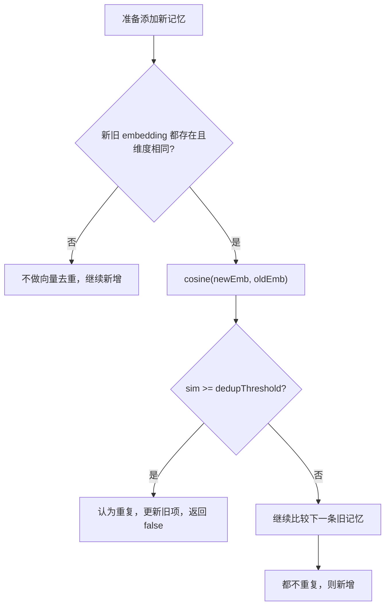

# 17-长期记忆重复判断-dedupThreshold

## 1. 一句话结论

长期记忆添加时会做重复判断：如果新记忆 embedding 和旧记忆 embedding 的余弦相似度大于等于 `dedupThreshold`，就认为重复，不新增。

默认阈值：

```text
dedupThreshold = 0.95
```

## 2. 在记忆系统里的位置

重复判断发生在：

```text
LongTermMemory.storeClassified
```

也就是长期记忆真正写入内存列表之前。

## 3. 源码位置和核心对象

配置位置：

```text
AppConfig.ConsolidationConfig
```

默认值：

```java
private double dedupThreshold = 0.95;
```

判断位置：

```text
LongTermMemory.storeClassified
```

判断需要这些存在形式：

```text
新记忆 embedding：List<Double>
旧记忆 embedding：item.getEmbedding()
阈值：consolidationCfg.getDedupThreshold()
```

## 4. 核心流程图



## 5. 源码讲解

### 5.1 先说重复判断解决什么问题

长期记忆不能同一件事存很多遍。

如果用户多次表达：

```text
我喜欢 Java 逐行解释
我偏好 Java 代码逐行讲解
我希望你用 Java 一行一行解释
```

这些内容意思很接近。

系统应该尽量识别为重复或相似，而不是每次都新增一条完全独立的记忆。

### 5.2 生活类比

像整理名片。

如果同一个人给你三张略有不同的名片：

```text
小李 / Java 学习
李同学 / 喜欢 Java 逐行解释
小李 / Java 代码讲解偏好
```

你不会放三份完全重复档案。

你会判断它们是不是同一个人、同一类信息，然后合并或更新。

### 5.3 对应到代码：什么时候会进行重复判断

```java
if (consolidationCfg != null && !items.isEmpty() && embedding != null && !embedding.isEmpty()) { // 有配置、有旧记忆、新 embedding 可用才去重
    for (MemoryItem item : items) { // 遍历旧记忆
        if (item.getEmbedding() != null && item.getEmbedding().size() == embedding.size()) { // 旧 embedding 存在且维度一致
            double sim = cosine(embedding, item.getEmbedding()); // 计算余弦相似度
            if (sim >= consolidationCfg.getDedupThreshold()) { // 达到去重阈值
                ...
                return false; // 不新增
            }
        }
    }
}
```

先回答你之前问的：

```text
添加记忆的时候，会比较重复度。
```

但有前提：

```text
1. consolidationCfg 不为空
2. items 里已经有旧记忆
3. 新记忆 embedding 不为空
4. 旧记忆 embedding 不为空
5. 新旧 embedding 维度一致
```

逐行解释：

```text
第 1 行：满足配置、旧记忆、新 embedding 三个条件，才进入去重。
第 2 行：遍历已有长期记忆。
第 3 行：旧记忆也要有 embedding，且维度一样，才可以比较。
第 4 行：计算新旧 embedding 的余弦相似度。
第 5 行：如果 sim 大于等于 dedupThreshold，认为重复。
第 7 行：返回 false，表示这次不新增。
```

### 5.4 对应到代码：余弦相似度怎么算

```java
public static double cosine(List<Double> a, List<Double> b) { // 计算两个向量的余弦相似度
    if (a.size() != b.size()) return 0; // 维度不同不能比较，返回 0
    double dot = 0, na = 0, nb = 0; // dot 是点积，na/nb 是两个向量长度平方
    for (int i = 0; i < a.size(); i++) { // 遍历每个维度
        dot += a.get(i) * b.get(i); // 累加点积
        na += a.get(i) * a.get(i); // 累加 a 的平方和
        nb += b.get(i) * b.get(i); // 累加 b 的平方和
    }
    if (na == 0 || nb == 0) return 0; // 任意一个零向量都无法计算相似度
    return dot / (Math.sqrt(na) * Math.sqrt(nb)); // 余弦相似度 = 点积 / 两个向量长度乘积
}
```

先说目的：

```text
用数学方式判断两个 embedding 方向像不像。
方向越像，说明语义越接近。
```

生活类比：

```text
两支箭头如果指向差不多的方向，就说明两个句子意思接近。
两支箭头方向差很多，就说明语义不太像。
```

逐行解释：

```text
第 1 行：定义 cosine 方法，传入两个向量 a 和 b。
第 2 行：如果两个向量维度不同，不能比，返回 0。
第 3 行：准备三个变量：dot 点积，na 是 a 的长度平方，nb 是 b 的长度平方。
第 4 行：逐个维度遍历。
第 5 行：累加点积。
第 6 行：累加 a 每个维度的平方。
第 7 行：累加 b 每个维度的平方。
第 9 行：如果任意一个向量长度为 0，返回 0。
第 10 行：返回余弦相似度。
```

技术点：

```text
余弦相似度通常越接近 1，表示越相似。
越接近 0，表示越不相关。
```

### 5.5 重复时会更新旧记忆

```java
if (importance > item.getImportance()) {
    item.setImportance(importance); // 新记忆更重要，就提高旧记忆 importance
}
item.setLastAccessed(LocalDateTime.now()); // 更新时间，表示这条记忆刚被访问/合并过
return false; // 不新增
```

先说目的：

```text
重复记忆不新增，但会更新旧记忆的某些信息。
```

逐行解释：

```text
第 1 行：如果新记忆 importance 更高。
第 2 行：把旧记忆 importance 提高。
第 4 行：更新旧记忆最近访问时间。
第 5 行：返回 false，告诉调用方“没有新增”。
```

这个 `false` 很重要。

因为后面调用方会根据它判断是否需要写数据库：

```text
added = false
说明只是重复更新，不再新增数据库记录。
```

## 6. 真实例子：在流程中怎么运行

已有记忆：

```text
MemoryItem {
  content = "用户喜欢 Java 逐行解释",
  importance = 0.7,
  embedding = A
}
```

准备新增：

```text
content = "用户偏好 Java 代码逐行讲解"
importance = 0.8
embedding = B
```

计算：

```text
cosine(B, A) = 0.96
dedupThreshold = 0.95
```

因为：

```text
0.96 >= 0.95
```

所以认为重复，不新增。

但因为新 importance 更高：

```text
旧记忆 importance 从 0.7 更新为 0.8
```

返回：

```text
false
```

## 7. 容易混淆的点

添加记忆时会比较重复度，但前提是 embedding 可用。

如果：

```text
embedding == null
embedding 为空
旧记忆没有 embedding
新旧 embedding 维度不一致
```

这段添加时的向量去重就不会执行。

另外，添加时去重和 consolidation 去重不是同一件事：

```text
添加时去重：只处理当前新记忆和已有记忆
consolidation：定期全量两两比较、衰减、合并、过期
```

## 8. 面试怎么说

可以这样说：

```text
长期记忆新增时会基于 embedding 做去重。storeClassified 遍历已有 MemoryItem，只有新旧 embedding 都存在且维度相同才计算 cosine。如果相似度大于等于 dedupThreshold，就认为重复，不新增，而是更新旧记忆的重要性、分类、标签和 lastAccessed。
```
