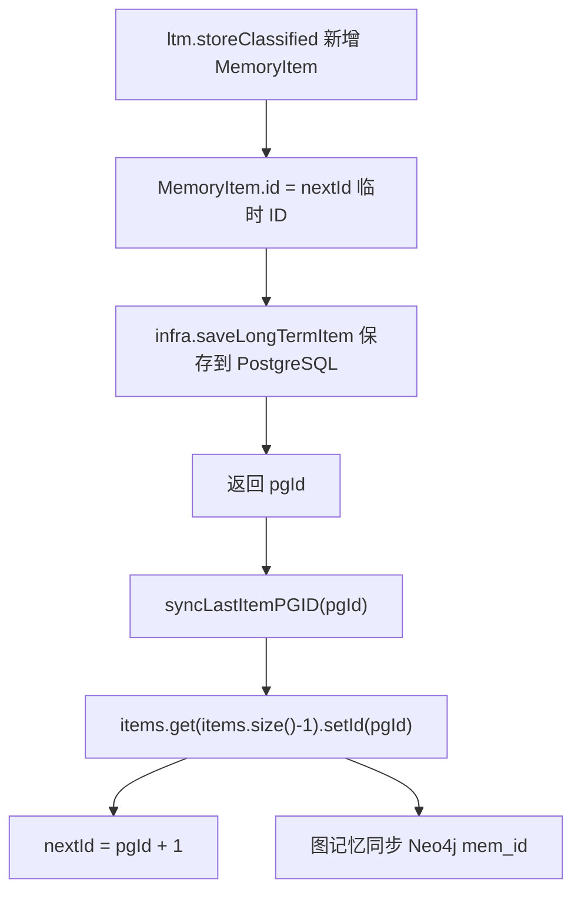

# 18-长期记忆ID同步-syncLastItemPGID

## 1. 一句话结论

`syncLastItemPGID` 的作用是：把内存里“最后新增的那条长期记忆”的 ID，改成 PostgreSQL 保存后返回的真实数据库 ID。

它同步的是 ID，不是同步内容。

## 2. 在记忆系统里的位置

调用位置：

```java
int pgId = infra.saveLongTermItem(...);
syncMemoryPGID(pgId);
```

或在 MemoryWriter 中：

```java
int pgId = infra.saveLongTermItemClassified(...);
if (graphMem != null) graphMem.syncLastItemPGID(pgId);
else ltm.syncLastItemPGID(pgId);
```

## 3. 源码位置和核心对象

普通长期记忆：

```text
LongTermMemory.syncLastItemPGID
```

图记忆：

```text
GraphMemory.syncLastItemPGID
```

涉及的 ID 形式：

```text
内存临时 ID：LongTermMemory.nextId 生成
数据库 ID：PostgreSQL long_term_memory 表保存后返回
图节点 ID：Neo4j Memory.mem_id
```

## 4. 核心流程图



## 5. 源码讲解

### 5.1 先说 syncLastItemPGID 是干什么的

`syncLastItemPGID` 做的事是：

```text
把内存里刚新增的长期记忆 ID，改成 PostgreSQL 数据库生成的 ID。
```

为什么需要改？

因为写入顺序是：

```text
1. 先写内存 LongTermMemory.items
2. 再写 PostgreSQL long_term_memory 表
3. 数据库返回真正的自增 ID
4. 再把内存里那条记忆的 id 改成数据库 ID
```

### 5.2 生活类比

像办业务时先拿临时号，再拿正式编号。

```text
草稿本临时编号：0
数据库正式编号：37
```

为了以后内存、数据库、图节点能对上，最终要统一成：

```text
id = 37
```

### 5.3 对应到代码：普通长期记忆怎么同步

```java
public void syncLastItemPGID(int pgId) { // pgId 是数据库保存后返回的 ID
    if (!items.isEmpty() && pgId > 0) { // 必须有内存记忆，并且数据库 ID 有效
        items.get(items.size() - 1).setId(pgId); // 找到最后一条内存记忆，把它的 id 改成 pgId
        if (pgId >= nextId) nextId = pgId + 1; // 保证下次内存生成 ID 时不会小于数据库 ID
    }
}
```

先说目的：

```text
找到内存列表 items 里的最后一条记忆，
把它的 id 改成数据库返回的 pgId。
```

逐行解释：

```text
第 1 行：pgId 是 PostgreSQL 保存 long_term_memory 后返回的数据库 ID。
第 2 行：只有 items 不为空，并且 pgId 大于 0，才执行同步。
第 3 行：items.get(items.size() - 1) 取最后一条记忆。
第 3 行：setId(pgId) 把最后一条记忆的 id 改成数据库 ID。
第 4 行：如果 pgId 已经大于等于 nextId，就把 nextId 推到 pgId + 1。
```

### 5.4 它怎么找到原来的那条记忆

答案是：

```text
通过 items.get(items.size() - 1) 找最后一条。
```

它依赖一个调用顺序：

```text
1. 先 storeClassified 新增 MemoryItem 到 items 末尾
2. 再 saveLongTermItem 写数据库
3. 再 syncLastItemPGID(pgId)
```

所以它默认“最后一条就是刚才新增的那条”。

真实例子：

```text
storeClassified 新增：
items = [
  MemoryItem{id=0, content="用户喜欢 Java 逐行解释"}
]

saveLongTermItem 写入数据库后返回：
pgId = 37

syncLastItemPGID(37) 执行后：
items = [
  MemoryItem{id=37, content="用户喜欢 Java 逐行解释"}
]
```

这里要注意：

```text
它不是通过 content 搜索，也不是通过 embedding 搜索。
它就是取最后一条。
```

所以这个方法成立的前提是：

```text
新增和同步之间没有插入其他长期记忆。
```

### 5.5 对应到代码：图记忆同步

```java
public void syncLastItemPGID(int pgId) { // 同步图记忆中的最后一条长期记忆 ID
    ltm.syncLastItemPGID(pgId); // 先让 LongTermMemory 同步内存 ID
    List<MemoryItem> items = ltm.getItems(); // 读取长期记忆列表副本
    if (!items.isEmpty()) { // 有记忆才继续
        MemoryItem last = items.get(items.size() - 1); // 取最后一条
        prevId = last.getId(); // 把图记忆的 prevId 更新为数据库 ID
        if (kg != null && kg.available()) { // Neo4j 可用时
            new Thread(() -> { // 后台同步图节点
                try { Thread.sleep(50); } catch (InterruptedException ignored) {} // 等待之前异步建图线程
                kg.upsertMemoryNode(last.getId(), last.getContent(), last.getImportance()); // 用数据库 ID upsert Neo4j Memory 节点
            }, "graph-mem-sync").start();
        }
    }
}
```

先说目的：

```text
如果启用了 GraphMemory，不仅 LongTermMemory.items 里的 ID 要同步，
Neo4j Memory 节点和图记忆里的 prevId 也要尽量对齐。
```

逐行解释：

```text
第 1 行：图记忆也有 syncLastItemPGID 方法。
第 2 行：先调用 ltm.syncLastItemPGID(pgId)，同步底层长期记忆列表。
第 3 行：取出长期记忆列表副本。
第 4 行：如果列表不为空，继续。
第 5 行：取最后一条记忆。
第 6 行：prevId 更新成最后一条记忆的 ID，后续 FOLLOWS 边会用它表示上一条。
第 7 行：如果 Neo4j 可用。
第 8 行：开后台线程同步图节点。
第 9 行：等待 50ms，给之前异步建图一点时间。
第 10 行：用数据库 ID upsert Neo4j Memory 节点。
```

面试要说准确：

```text
syncMemoryPGID 不是在做去重。
它是在内存记忆已经新增、数据库已经保存之后，
把内存和图里的 ID 对齐到数据库 ID。
```

## 6. 真实例子：在流程中怎么运行

新增长期记忆时，内存先生成：

```text
MemoryItem {
  id = 0,
  content = "用户喜欢 Java 逐行解释"
}
```

保存数据库后：

```text
long_term_memory.id = 37
```

调用：

```java
ltm.syncLastItemPGID(37);
```

内存变成：

```text
MemoryItem {
  id = 37,
  content = "用户喜欢 Java 逐行解释"
}
```

如果有图记忆，还会让 Neo4j 节点使用：

```text
(:Memory {mem_id: 37})
```

## 7. 容易混淆的点

`syncLastItemPGID` 不是把数据库内容同步回内存。

它只是同步 ID。

它依赖一个前提：

```text
刚新增的 MemoryItem 位于 items 最后一位。
```

如果并发写入很多长期记忆，这种“最后一条”策略存在竞争风险。

当前代码没有对整个“内存新增 → DB 保存 → ID 同步”过程加事务级锁。

## 8. 面试怎么说

可以这样说：

```text
长期记忆先写入内存时会使用 LongTermMemory.nextId 生成临时 ID；保存到 PostgreSQL 后会得到数据库真实 ID。
syncLastItemPGID 通过 items.get(items.size()-1) 找到刚新增的最后一条记忆，把它的 id 改成 pgId，并更新 nextId。
图记忆版本还会同步 prevId，并异步 upsert Neo4j Memory 节点，保证内存、数据库和图节点 ID 对齐。
```
