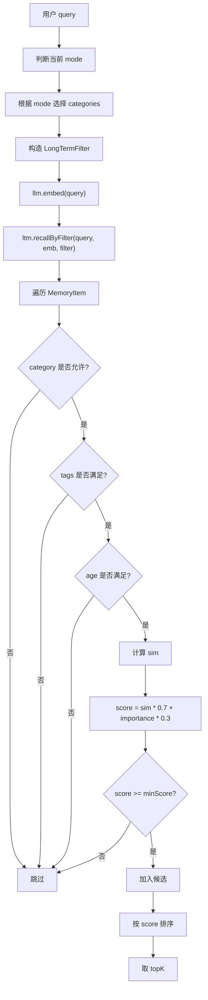

# 19-长期记忆召回-recall

## 1. 一句话结论

长期记忆召回就是：

```text
根据当前用户问题 query，
从长期记忆里找出当前最有用的 MemoryItem，
拼进 memPrefix 的【相关记忆】里，
让 LLM 回答时能参考这些长期事实。
```

改进后的召回不是简单地把所有长期记忆混在一起比相似度，而是：

```text
先根据当前模式选择记忆分类，
再用 recallByFilter 做分类过滤召回，
最后按 score 排序取 topK。
```

核心方法：

```java
ltm.recallByFilter(query, queryEmbedding, filter)
```

如果启用图记忆，则是：

```java
graphMem.recall(query, topK, queryEmbedding)
```

图记忆会先召回 seed，再扩展 Neo4j 邻居。

---

## 2. 它在记忆系统里的位置

召回发生在回答前。

主流程里先构造记忆上下文：

```java
String memPrefix = buildMemorySystemPrefixWithCtx(query);
```

改进后的 `buildMemorySystemPrefixWithCtx` 不再只做：

```java
ltm.recall(query, topK, queryEmb)
```

而是按模式构造过滤器：

```java
LongTermFilter filter = LongTermFilter.builder()
        .categories(categoriesForMode(mode))
        .topK(cfg.getMemory().getLongTermTopK())
        .minScore(0.4)
        .build();

List<MemoryItem> recalled = ltm.recallByFilter(query, queryEmb, filter);
```

大白话：

```text
以前是：所有记忆都拿来比一遍。

现在是：先决定这次应该看哪几类记忆，
比如身份、偏好、规则、工具失败、通用事实，
再只在这些分类里做召回。
```

---

## 3. 源码位置和核心对象

长期记忆召回核心文件：

```text
AGI-saber-java/src/main/java/com/agi/assistant/service/memory/LongTermMemory.java
```

过滤条件对象：

```text
AGI-saber-java/src/main/java/com/agi/assistant/service/memory/LongTermFilter.java
```

上下文装配相关：

```text
AGI-saber-java/src/main/java/com/agi/assistant/domain/promptctx/Schemas.java
AGI-saber-java/src/main/java/com/agi/assistant/domain/promptctx/source/RecallSource.java
AGI-saber-java/src/main/java/com/agi/assistant/service/agent/UnifiedAgentService.java
```

核心对象：

```text
query
当前用户问题。

queryEmbedding
当前问题的 embedding。

LongTermFilter
召回过滤条件，比如 categories、requiredTags、minScore、topK、maxAgeHours。

MemoryItem.category
记忆分类，比如 identity、preference、policy、tool_failure、general。

MemoryItem.tags
记忆标签，比如 Java、面试、天气。

MemoryItem.score
本次召回临时算出来的综合分。
```

---

## 4. 为什么要做分类召回

原始召回的问题是：

```text
把用户整句 query 做 embedding，
然后和所有长期记忆逐条比较。
```

这个实现简单，但是多意图问题会不准。

例子：

```text
用户问：
我下周面试 Java 后端，顺便查一下上海天气
```

这句话有两个意图：

```text
1. Java 后端面试复习
2. 上海天气
```

如果只用整句 embedding 召回，可能出现：

```text
面试相关记忆被召回
天气偏好没召回

或者天气相关召回了，
面试复习背景没召回
```

分类召回的目标是：

```text
不同模式只看更相关的记忆分类。
减少无关长期记忆进入 prompt。
```

但是这里要注意：

```text
过滤不是越细越好。
过滤太粗，会召回一堆无关记忆。
过滤太细，会把本来有用的记忆提前过滤掉。
```

所以更合理的做法是：

```text
category 用来做粗过滤。
tags 只在非常明确时才做细过滤。
embedding 相似度和 score 负责最后排序。
```

也就是说：

```text
第一关：先按大类排除明显不相关的记忆。
第二关：再用向量相似度判断内容到底像不像。
第三关：再结合 importance 算 score，决定最终进入 prompt 的记忆。
```

比如工具调用时：

```text
应该优先看：
preference    用户默认城市、语言偏好、回答风格
policy        用户硬性要求
tool_failure 之前工具调用失败经验
general       兜底事实
```

而不是把所有历史事实都混进来。

### 4.1 为什么不能过滤太细

假设长期记忆里有三条：

```text
Memory A
content = "用户正在准备 Java 后端面试"
category = "general"
tags = ["Java", "面试"]

Memory B
content = "用户希望回答尽量直接，少讲废话"
category = "preference"
tags = ["回答风格"]

Memory C
content = "用户默认查询城市是上海"
category = "preference"
tags = ["城市"]
```

用户现在问：

```text
帮我按面试要求复习一下记忆系统，顺便查一下上海天气
```

如果过滤条件写得太死：

```text
requiredTags = ["Java", "面试", "天气", "上海"]
```

这会出问题。

因为当前 `requiredTags` 是 AND 关系：

```text
一条记忆必须同时包含 Java、面试、天气、上海，
才会通过过滤。
```

上面三条记忆没有任何一条同时满足这 4 个标签。

结果就是：

```text
Memory A 明明对面试有用，却被过滤掉。
Memory C 明明对上海天气有用，也被过滤掉。
```

所以实际设计时不能这么做。

更合适的是：

```text
1. mode 决定 category 粗范围
2. query 拆成多个子意图
3. 每个子意图单独召回
4. tags 作为加分或弱过滤，不要默认当成强制 AND
5. 最后合并结果，按 score 排序
```

例子：

```text
原始 query：
帮我按面试要求复习一下记忆系统，顺便查一下上海天气

拆成两个子 query：
1. 帮我按面试要求复习一下记忆系统
2. 查一下上海天气
```

第一个子 query 可以召回：

```text
category = general / preference / policy
tags 可以偏向 ["面试", "Java", "记忆系统"]
```

第二个子 query 可以召回：

```text
category = preference / general
tags 可以偏向 ["城市", "天气"]
```

这样不会因为一个复杂问题包含多个意图，就把有用记忆提前过滤掉。

---

## 5. LongTermFilter 对象长什么样

源码：

```java
public class LongTermFilter {
    public List<String> categories;
    public List<String> requiredTags;
    public Double minScore;
    public Integer topK;
    public Integer maxAgeHours;

    public static Builder builder() { return new Builder(); }
}
```

逐个解释：

```text
categories
允许召回哪些分类。
例如只召回 identity、preference。

requiredTags
必须包含哪些标签。
例如必须包含 Java、面试。

minScore
最低召回分数。
低于这个分数不要。

topK
最多召回几条。

maxAgeHours
只召回最近多少小时内的记忆。
```

生活类比：

```text
长期记忆像一个资料柜。

categories 是先选抽屉：
身份抽屉、偏好抽屉、规则抽屉、工具失败抽屉。

tags 是再看标签：
Java、面试、天气、上海。

minScore 是最低相关度。
topK 是最多拿几张卡片。
```

---

## 6. 分类召回核心流程图



---

## 7. 不同模式怎么选择分类

改进后的召回会根据当前模式选分类。

建议规则：

| mode | 召回分类 | 原因 |
|---|---|---|
| chat | `identity`, `preference`, `policy`, `general` | 普通聊天需要用户画像、偏好、规则和通用事实 |
| tool | `identity`, `preference`, `policy`, `tool_failure`, `general` | 工具调用需要偏好补参数，也要避免重复工具失败 |
| react | `identity`, `preference`, `policy`, `tool_failure`, `general` | 多步规划需要用户约束、偏好、历史工具经验 |
| rag | `identity`, `preference`, `policy`, `general` | RAG 主要需要用户画像和回答约束 |

例子：

```text
用户问：帮我查一下天气
mode = tool

召回分类：
preference：用户默认城市是上海
policy：用户要求回答简短
tool_failure：之前天气工具缺 city 参数失败
general：用户最近在准备出行
```

---

## 8. recallByFilter 源码逐段讲解

### 8.1 方法入口

```java
public List<MemoryItem> recallByFilter(String query, List<Double> queryEmbedding, LongTermFilter filter) {
    if (items.isEmpty()) return Collections.emptyList();
    if (filter == null) filter = new LongTermFilter();
    final double threshold = filter.minScore != null ? filter.minScore : 0.4;
    final int wantTopK = filter.topK != null ? filter.topK : 5;
    final LocalDateTime now = LocalDateTime.now();
```

先说它干什么：

```text
根据 query 从长期记忆里召回相关记忆，
但是召回前先应用 filter。
```

逐行解释：

```text
第 1 行：方法输入 query、queryEmbedding、filter。
第 2 行：长期记忆为空就直接返回空。
第 3 行：如果外部没传 filter，就创建一个空 filter，表示不过滤。
第 4 行：minScore 没传就默认 0.4。
第 5 行：topK 没传就默认 5。
第 6 行：记录当前时间，用来计算 age。
```

### 8.2 category 过滤

```java
if (filter.categories != null && !filter.categories.isEmpty()) {
    String c = item.getCategory() == null ? "general" : item.getCategory();
    if (!filter.categories.contains(c)) continue;
}
```

先说目的：

```text
只召回指定分类的记忆。
```

例子：

```text
filter.categories = ["identity", "preference"]

MemoryItem A.category = "preference"
通过。

MemoryItem B.category = "tool_failure"
跳过。
```

逐行解释：

```text
第 1 行：如果 filter 里配置了 categories，才执行分类过滤。
第 2 行：如果 item 没有 category，就当成 general。
第 3 行：如果当前记忆分类不在允许列表里，就 continue 跳过。
```

### 8.3 tags 过滤

```java
if (filter.requiredTags != null && !filter.requiredTags.isEmpty()) {
    List<String> have = item.getTags() == null ? Collections.emptyList() : item.getTags();
    boolean ok = true;
    for (String t : filter.requiredTags) {
        if (!have.contains(t)) { ok = false; break; }
    }
    if (!ok) continue;
}
```

先说目的：

```text
如果本次召回要求某些标签，那么记忆必须全部包含这些标签。
```

注意这里是 AND 关系：

```text
requiredTags = ["Java", "面试"]

记忆 tags = ["Java", "面试", "后端"]
通过。

记忆 tags = ["Java"]
不通过，因为缺少“面试”。
```

逐行解释：

```text
第 1 行：如果要求 tags，才进入标签过滤。
第 2 行：取出当前记忆已有 tags，没有就当空列表。
第 3 行：先假设通过。
第 4 行：遍历每个 requiredTag。
第 5 行：只要有一个标签缺失，就设 ok=false 并退出循环。
第 7 行：如果不满足 requiredTags，就跳过这条记忆。
```

### 8.4 age 过滤

```java
if (filter.maxAgeHours != null && item.getCreatedAt() != null) {
    long ageHours = ChronoUnit.HOURS.between(item.getCreatedAt(), now);
    if (ageHours > filter.maxAgeHours) continue;
}
```

先说目的：

```text
只召回最近一段时间内的记忆。
```

例子：

```text
filter.maxAgeHours = 24

记忆 A：3 小时前创建
通过。

记忆 B：3 天前创建
跳过。
```

---

## 9. 过滤后怎么计算 sim 和 score

只有通过分类、标签、时间过滤的记忆，才会进入相似度计算。

```java
double sim;
if (queryEmbedding != null && !queryEmbedding.isEmpty()
        && item.getEmbedding() != null && item.getEmbedding().size() == queryEmbedding.size()) {
    sim = cosine(queryEmbedding, item.getEmbedding());
} else {
    buildVocab(query);
    double[] qv = textToVector(query);
    double[] iv = textToVector(item.getContent());
    sim = cosineArr(qv, iv);
}
double s = sim * 0.7 + item.getImportance() * 0.3;
if (s >= threshold) {
    item.setLastAccessed(now);
    scored.add(new double[]{i, s});
}
```

先说目的：

```text
过滤只是先缩小范围。
真正排序还要看 score。
```

score 公式：

```text
score = sim * 0.7 + importance * 0.3
```

其中：

```text
sim
当前问题和记忆内容的相似度。

importance
这条记忆本身的重要性。
```

---

## 10. 排序取 topK

```java
scored.sort((a, b) -> Double.compare(b[1], a[1]));
int limit = Math.min(wantTopK, scored.size());
List<MemoryItem> result = new ArrayList<>();
for (int i = 0; i < limit; i++) {
    MemoryItem item = items.get((int) scored.get(i)[0]);
    item.setScore(scored.get(i)[1]);
    result.add(item);
}
return result;
```

大白话：

```text
候选记忆可能有很多。
按 score 从高到低排序。
最多只拿 topK 条。
```

注意：

```text
score 是本次 query 下的临时分数。
不是 MemoryItem 固定字段。
下一次 query 不同，score 也会重新计算。
```

---

## 11. 真实例子：分类过滤怎么起作用

长期记忆里有：

```text
1. category=preference
   content="用户默认城市是上海"
   importance=0.8
   tags=["城市", "天气"]

2. category=policy
   content="用户要求回答尽量简短"
   importance=0.8
   tags=["回答风格"]

3. category=tool_failure
   content="天气工具曾因缺少 city 参数失败"
   importance=0.6
   tags=["天气", "工具"]

4. category=general
   content="用户正在准备 Java 后端面试"
   importance=0.7
   tags=["Java", "面试"]

5. category=general
   content="用户之前问过篮球新闻"
   importance=0.3
   tags=["体育"]
```

用户问：

```text
帮我查一下天气
```

当前模式：

```text
mode = tool
```

过滤器：

```text
categories = ["identity", "preference", "policy", "tool_failure", "general"]
topK = 3
minScore = 0.4
```

第一步：先按分类过滤。

```text
上面 5 条分类都允许。
```

第二步：计算 score。

```text
1. 用户默认城市是上海
   sim=0.75, importance=0.8
   score=0.75*0.7 + 0.8*0.3 = 0.765

2. 用户要求回答尽量简短
   sim=0.25, importance=0.8
   score=0.415

3. 天气工具曾因缺少 city 参数失败
   sim=0.80, importance=0.6
   score=0.74

4. 用户正在准备 Java 后端面试
   sim=0.15, importance=0.7
   score=0.315
   低于 0.4，跳过。

5. 用户之前问过篮球新闻
   sim=0.05, importance=0.3
   score=0.125
   低于 0.4，跳过。
```

最终召回：

```text
用户默认城市是上海
天气工具曾因缺少 city 参数失败
用户要求回答尽量简短
```

这比“所有记忆混召回”更合理，因为 Java 面试和篮球新闻不会进入 prompt。

---

## 12. 和普通 recall 的区别

普通 `recall`：

```text
所有 MemoryItem 都参与相似度计算。
```

分类 `recallByFilter`：

```text
先按 category / tags / age 过滤，
通过过滤的 MemoryItem 才参与相似度计算。
```

对比：

| 项目 | recall | recallByFilter |
|---|---|---|
| 是否按分类过滤 | 否 | 是 |
| 是否按标签过滤 | 否 | 是 |
| 是否按时间过滤 | 否 | 是 |
| 是否计算 score | 是 | 是 |
| 是否适合不同模式 | 一般 | 更适合 |

面试时可以说：

```text
recall 是基础召回，recallByFilter 是分类增强召回。
系统主链路改进后优先用 recallByFilter，把 MemoryWriter 写入时生成的 category/tags 真正用于召回。
```

---

## 13. 图记忆模式怎么处理分类召回

图记忆召回还是两步：

```text
1. 先从长期记忆召回 seed
2. 再从 Neo4j 扩展邻居
```

改进后，seed 召回也应该先使用分类过滤：

```text
ltm.recallByFilter(query, queryEmbedding, filter)
```

然后再做图扩展：

```text
seedIds -> kg.expandMemoryNeighbors(seedIds, 1)
```

大白话：

```text
先用分类过滤选出更干净的起点 seed。
再从这些 seed 出发扩展图邻居。
```

这样比原来更稳定：

```text
如果 seed 本身不准，
图扩展会把不相关邻居也带出来。

如果 seed 先经过分类过滤，
图扩展的起点更可靠。
```

---

## 14. 容易混淆的点

### 误区一：有 category 字段就等于已经分类召回

不对。

```text
category 写入只是第一步。
召回时必须使用 recallByFilter，
category 才真正参与过滤。
```

### 误区二：分类过滤会替代 embedding

不会。

```text
分类过滤只是先缩小候选范围。
通过过滤后，仍然要算 embedding 相似度和 score。
```

### 误区三：preference 只存在 PreferenceMemory

不对。

```text
PreferenceMemory 保存结构化 KV。
长期记忆里也可以保存 category=preference 的自然语言事实。
```

### 误区四：tags 是 OR 关系

当前 `requiredTags` 是 AND 关系。

```text
requiredTags = ["Java", "面试"]

记忆必须同时包含 Java 和 面试，才通过。
```

### 误区五：过滤越细越准确

不一定。

```text
过滤太细，准确率可能上升，但是召回率会下降。
```

也就是：

```text
留下来的记忆更“干净”，
但是很多本来有用的记忆可能进不了候选集。
```

在记忆召回里，更推荐：

```text
category 做粗过滤。
tags 做弱约束或加分项。
embedding + score 做最终排序。
```

如果当前实现里 `requiredTags` 是强制 AND，
就不要随便塞很多 tag。

尤其是多意图 query：

```text
查天气，并帮我复习 Java 面试
```

这种问题应该先拆分子 query，
再分别召回，
而不是给一条召回请求加上一堆 requiredTags。

---

## 15. 如果要改这个功能，改哪里

要真正接入分类召回，改动点是：

```text
1. UnifiedAgentService.buildMemorySystemPrefixWithCtx
   构造 LongTermFilter，并调用 recallByFilter。

2. RecallSource
   读取 slot.getFilter().getCategories()，
   把 categories 传给可过滤召回接口。

3. GraphMemory
   seed 召回阶段改成可接收 filter，
   先做分类过滤，再扩展图邻居。
```

最小改法：

```text
先改 UnifiedAgentService.buildMemorySystemPrefixWithCtx。
主链路能用上分类召回即可。
```

更完整改法：

```text
把 RecallSource 的 Recaller 接口从 recall(...) 扩展为 recallByFilter(...)，
让 promptctx schema 里的 categories 真正生效。
```

---

## 16. 面试怎么说

可以这样说：

```text
长期记忆写入时，MemoryWriter 会把记忆分成 identity、preference、policy、tool_failure、general 等类别，并保存 tags 和 slotHint。召回时我不再把所有长期记忆混在一起做向量匹配，而是先根据当前 mode 构造 LongTermFilter，例如 tool/react 模式会优先召回 preference、policy、tool_failure、general，然后调用 recallByFilter。recallByFilter 先按 category、requiredTags、maxAgeHours 过滤候选，再对通过过滤的 MemoryItem 计算 sim 和 score，最终按 score 排序取 topK。这样能让已有分类字段真正参与召回，减少无关记忆进入 prompt。
```
