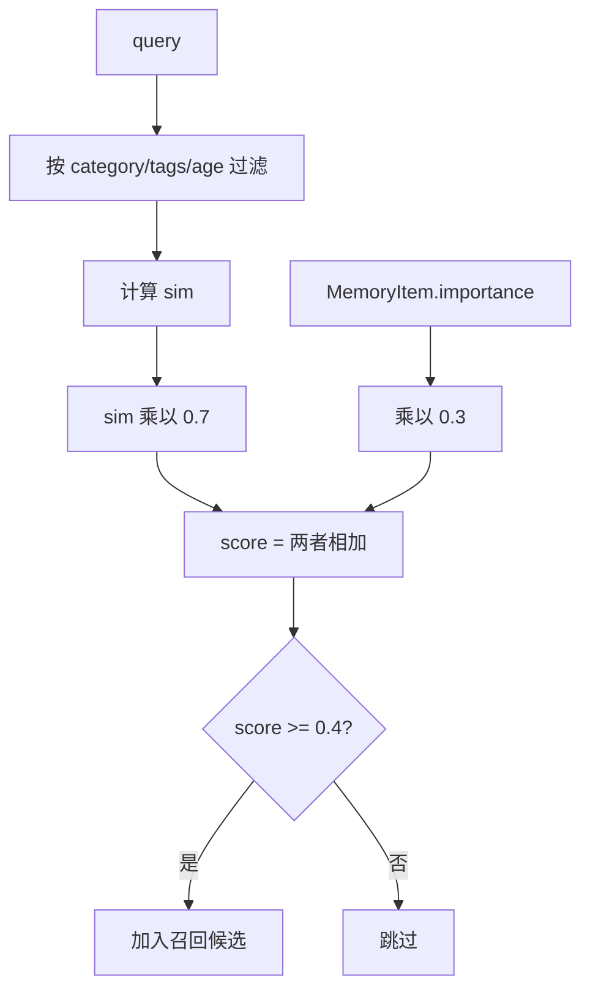

# 20-score计算-sim和importance

## 1. 一句话结论

长期记忆的 `score` 是召回时临时算出来的综合分：

```text
score = sim * 0.7 + importance * 0.3
```

其中：

```text
sim        当前 query 和记忆内容的相似度
importance 这条记忆本身的重要性
```

## 2. 在记忆系统里的位置

`score` 只在召回时使用：

```text
LongTermMemory.recallByFilter
LongTermMemory.recall
GraphMemory.recall
```

改进后的主链路优先使用：

```text
LongTermMemory.recallByFilter
```

也就是先按 `category / tags / age` 过滤，再计算 `sim` 和 `score`。

它决定：

```text
1. 这条记忆是否达到召回阈值
2. 多条记忆之间谁排在前面
3. 哪些内容进入【相关记忆】
```

## 3. 源码位置和核心对象

源码位置：

```text
AGI-saber-java/src/main/java/com/agi/assistant/service/memory/LongTermMemory.java
```

核心代码：

```java
double s = sim * 0.7 + item.getImportance() * 0.3;
```

涉及字段：

```text
MemoryItem.importance  写入时确定
MemoryItem.score       召回时设置
```

## 4. 核心流程图



## 5. 源码讲解

### 5.1 先说 score 是干什么的

`score` 是长期记忆召回时的综合分。

它回答的问题是：

```text
这条记忆值不值得放进本轮 prompt？
```

它不是单纯看“像不像”，也不是单纯看“重不重要”。

它把两者合在一起：

```text
score = sim * 0.7 + importance * 0.3
```

### 5.2 生活类比

找资料时你会同时考虑两件事：

```text
1. 这份资料和当前问题相关吗？
2. 这份资料本身重要吗？
```

如果一份资料非常相关，即使重要性一般，也可能被拿出来。

如果一份资料本身很重要，但和当前问题完全无关，也不应该强行拿出来。

### 5.3 对应到代码：先过滤，再计算 sim

分类召回时，不是所有 `MemoryItem` 都会进入打分。

先经过过滤：

```java
if (filter.categories != null && !filter.categories.isEmpty()) {
    String c = item.getCategory() == null ? "general" : item.getCategory();
    if (!filter.categories.contains(c)) continue;
}
```

大白话：

```text
如果当前模式只允许召回 preference / policy，
那 general 或 tool_failure 可以先跳过。
跳过的记忆不会继续算 sim 和 score。
```

通过过滤后，才计算 sim：

```java
double sim; // sim 表示 query 和 MemoryItem.content 的相关程度
if (queryEmbedding != null && !queryEmbedding.isEmpty()
        && item.getEmbedding() != null && item.getEmbedding().size() == queryEmbedding.size()) {
    sim = cosine(queryEmbedding, item.getEmbedding()); // 有同维度 embedding 时，用语义向量算 sim
} else {
    buildVocab(query); // 没有可用 embedding 时，走本地词袋
    double[] qv = textToVector(query); // query 转词袋向量
    double[] iv = textToVector(item.getContent()); // 记忆内容转词袋向量
    sim = cosineArr(qv, iv); // 算词袋余弦相似度
}
```

先说目的：

```text
sim 表示当前 query 和某条长期记忆的相关程度。
```

有两种算法：

```text
优先：embedding 余弦相似度
兜底：本地词袋余弦相似度
```

逐行解释：

```text
第 1 行：声明 sim，用来保存相似度。
第 2-3 行：如果 queryEmbedding 可用，item 的 embedding 也可用，并且维度一致。
第 4 行：用 embedding 计算语义相似度。
第 6 行：否则走本地词袋。
第 7 行：query 转词袋向量。
第 8 行：记忆正文转词袋向量。
第 9 行：计算词袋余弦相似度。
```

### 5.4 对应到代码：再计算 score

```java
double s = sim * 0.7 + item.getImportance() * 0.3; // 相似度权重 70%，重要性权重 30%
```

先说目的：

```text
把相似度和重要性合成一个最终召回分数。
```

公式拆开：

```text
sim * 0.7:
  当前问题相关性占 70%。

importance * 0.3:
  记忆本身重要性占 30%。
```

真实例子：

```text
sim = 0.90
importance = 0.50

score = 0.90 * 0.7 + 0.50 * 0.3
      = 0.63 + 0.15
      = 0.78
```

### 5.5 对应到代码：达到阈值才进入候选

```java
if (s >= threshold) { // threshold 在 recall 中固定为 0.4
    item.setLastAccessed(LocalDateTime.now()); // 更新访问时间
    scored.add(new double[]{i, s}); // 保存下标和 score
}
```

先说目的：

```text
不是所有记忆都会返回。
score 至少要达到 threshold。
```

逐行解释：

```text
第 1 行：如果 score 大于等于阈值 0.4。
第 2 行：更新最近访问时间。
第 3 行：把当前记忆下标和 score 放进候选列表。
```

### 5.6 对应到代码：把 score 写回 MemoryItem

```java
MemoryItem item = items.get((int) scored.get(i)[0]); // 取出对应 MemoryItem
item.setScore(scored.get(i)[1]); // 把 score 写进对象，方便后续排序和展示
result.add(item); // 返回召回结果
```

先说目的：

```text
召回完成后，把本次计算出来的 score 放到 MemoryItem 上。
```

逐行解释：

```text
第 1 行：根据候选里保存的下标，取回真正的 MemoryItem。
第 2 行：把候选里的 score 写入 item.score。
第 3 行：把这条记忆放进返回结果。
```

注意：

```text
score 是本次召回分数。
同一条 MemoryItem，换一个 query，score 可能完全不同。
```

## 6. 真实例子：在流程中怎么运行

假设 query 是：

```text
怎么讲短期记忆？
```

三条记忆：

```text
A: 用户正在学习短期记忆
   sim = 0.90
   importance = 0.5
   score = 0.90*0.7 + 0.5*0.3 = 0.78

B: 用户喜欢 Java 逐行解释
   sim = 0.45
   importance = 0.7
   score = 0.45*0.7 + 0.7*0.3 = 0.525

C: 用户城市是上海
   sim = 0.10
   importance = 0.9
   score = 0.10*0.7 + 0.9*0.3 = 0.34
```

阈值：

```text
threshold = 0.4
```

结果：

```text
A 被召回
B 被召回
C 不被召回
```

排序：

```text
A score=0.78
B score=0.525
```

## 7. 容易混淆的点

`sim` 不等于 `score`。

```text
sim：只表示语义相关度
score：sim 和 importance 加权后的最终召回分
```

`importance` 高也不是一定召回。

如果 sim 太低，score 仍然可能低于 0.4。

例如：

```text
sim=0.0, importance=1.0
score=0.3
```

仍然低于 0.4，不召回。

## 8. 面试怎么说

可以这样说：

```text
长期记忆召回分数由语义相似度和记忆重要性共同决定，公式是 score = sim * 0.7 + importance * 0.3。
sim 优先来自 embedding 余弦相似度，没有 embedding 时降级到本地词袋余弦相似度。
score 达到 0.4 才进入候选，然后按分数降序取 topK。
```
