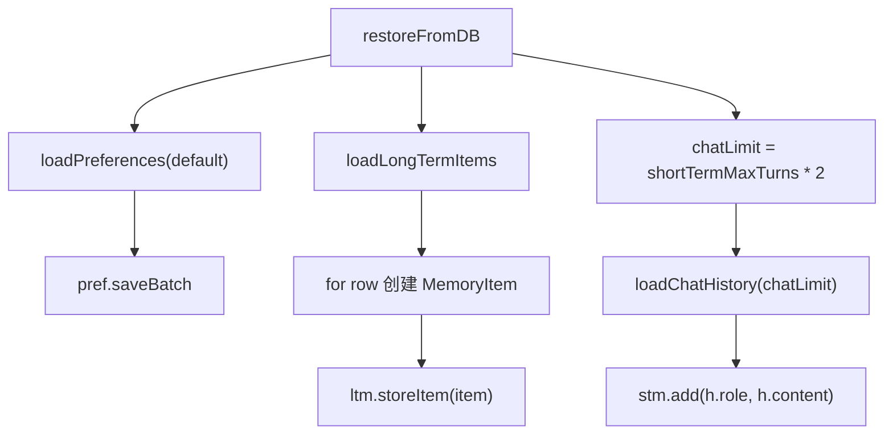

# 21-长期记忆数据库恢复-restoreFromDB

## 1. 一句话结论

`restoreFromDB` 是服务启动时的记忆恢复方法：把数据库里的偏好、长期记忆、聊天历史重新加载到内存对象里。

它解决的问题是：

```text
服务重启后，内存里的 PreferenceMemory / LongTermMemory / ShortTermMemory 不能丢。
```

## 2. 在记忆系统里的位置

调用位置在 `UnifiedAgentService.init()`：

```java
restoreFromDB();
```

它发生在服务初始化阶段，早于用户发起对话。

## 3. 源码位置和核心对象

源码位置：

```text
AGI-saber-java/src/main/java/com/agi/assistant/service/agent/UnifiedAgentService.java
```

涉及数据库读取：

```text
infra.loadPreferences("default")
infra.loadLongTermItems()
infra.loadChatHistory(chatLimit)
```

恢复目标：

```text
PreferenceMemory.data
LongTermMemory.items
ShortTermMemory.messages
```

## 4. 核心流程图



## 5. 源码讲解

### 5.1 先说 restoreFromDB 是干什么的

`restoreFromDB` 做的事情是：

```text
服务启动时，把数据库里保存的记忆重新加载回内存。
```

因为内存里的对象会随着程序停止而消失。

如果不恢复，服务重启后：

```text
PreferenceMemory.data 是空的
LongTermMemory.items 是空的
ShortTermMemory.messages 是空的
```

所以启动时要从数据库把它们补回来。

### 5.2 生活类比

内存像临时白板。

数据库像正式档案柜。

服务运行时，白板上有内容。

服务重启后，白板擦空了。

`restoreFromDB` 就是：

```text
从档案柜把资料拿出来，重新抄回白板。
```

### 5.3 对应到代码：恢复偏好

```java
Map<String, String> prefs = infra.loadPreferences("default"); // 从 preferences 表加载 default 用户的偏好
pref.saveBatch(prefs); // 批量放回 PreferenceMemory.data
```

先说目的：

```text
从 preferences 表读取用户偏好，再放回 PreferenceMemory.data。
```

逐行解释：

```text
第 1 行：读取 default 用户的偏好，得到 Map<String,String>。
第 2 行：批量保存到 PreferenceMemory 内存 Map。
```

真实例子：

```text
数据库 preferences:
姓名 = 小李
喜好 = Java 逐行解释
```

恢复后：

```text
PreferenceMemory.data = {
  "姓名": "小李",
  "喜好": "Java 逐行解释"
}
```

### 5.4 对应到代码：恢复长期记忆

```java
List<InfrastructureService.LongTermRow> rows = infra.loadLongTermItems(); // 从 long_term_memory 表加载所有长期记忆
for (InfrastructureService.LongTermRow row : rows) { // 遍历每一行数据库记录
    MemoryItem item = new MemoryItem(); // 创建空 MemoryItem
    item.setId(row.id); // 设置数据库 ID
    item.setContent(row.content); // 设置记忆正文
    item.setImportance(row.importance); // 设置重要性
    item.setEmbedding(row.embedding); // 设置 embedding
    if (row.createdAt != null) item.setCreatedAt(row.createdAt.toLocalDateTime()); // 恢复创建时间
    if (row.lastAccessed != null) item.setLastAccessed(row.lastAccessed.toLocalDateTime()); // 恢复最近访问时间
    if (row.category != null) item.setCategory(row.category); // 恢复分类
    if (row.tags != null) item.setTags(row.tags); // 恢复标签
    if (row.slotHint != null) item.setSlotHint(row.slotHint); // 恢复槽位提示
    ltm.storeItem(item); // 放回 LongTermMemory.items
}
```

先说目的：

```text
从 long_term_memory 表读取长期记忆记录，
重新组装成 MemoryItem，
再放回 LongTermMemory.items。
```

逐行解释：

```text
第 1 行：从数据库加载所有长期记忆行。
第 2 行：逐行遍历。
第 3 行：先创建一个空 MemoryItem。
第 4 行：恢复数据库 ID、正文、重要性。
第 5 行：恢复 embedding。
第 6 行：如果数据库有 createdAt，就恢复创建时间。
第 7 行：如果数据库有 lastAccessed，就恢复最近访问时间。
第 8 行：恢复 category。
第 9 行：恢复 tags。
第 10 行：恢复 slotHint。
第 11 行：把 MemoryItem 放回 LongTermMemory.items。
```

为什么这里用 `storeItem(item)`，不是 `storeClassified(...)`？

```text
因为这是恢复数据库已有记录，不是新增一条新记忆。
恢复时不应该重新做去重，也不应该重新生成 ID。
storeItem 会保留数据库里的 id，并更新 nextId。
```

### 5.5 对应到代码：恢复短期记忆

```java
int chatLimit = cfg.getMemory().getShortTermMaxTurns() * 2; // 最多恢复短期记忆需要的消息数
List<InfrastructureService.ChatHistoryRow> history = infra.loadChatHistory(chatLimit); // 从 chat_history 表加载最近消息
for (InfrastructureService.ChatHistoryRow h : history) { // 遍历聊天历史
    stm.add(h.role, h.content); // 重新写入 ShortTermMemory
}
```

先说目的：

```text
从 chat_history 表加载最近几条聊天记录，
重新写入 ShortTermMemory。
```

逐行解释：

```text
第 1 行：计算最多恢复多少条聊天消息。
第 1 行：shortTermMaxTurns 是轮数，所以乘以 2 变成消息数。
第 2 行：从数据库读取最近 chatLimit 条聊天历史。
第 3 行：逐条遍历聊天历史。
第 4 行：用 stm.add(h.role, h.content) 放回短期记忆。
```

真实例子：

```text
shortTermMaxTurns = 5
chatLimit = 5 * 2 = 10
```

所以最多恢复最近 10 条消息，也就是最近 5 轮左右。

注意：

```text
恢复短期记忆时，stm.add 会重新生成 timestamp。
也就是说 ShortTermMemory 里的 timestamp 是恢复时的时间，
不是数据库原始聊天发生时间。
```

## 6. 真实例子：在流程中怎么运行

数据库里有：

```text
preferences:
  姓名 = 小李
  喜好 = Java 逐行解释

long_term_memory:
  id=37, content=用户喜欢 Java 逐行解释, importance=0.7

chat_history:
  user: 短期记忆是什么
  assistant: 短期记忆保存最近几轮对话
```

服务启动时：

```text
1. pref.saveBatch 恢复偏好 Map。
2. 为 long_term_memory 每一行创建 MemoryItem。
3. ltm.storeItem 把 MemoryItem 放回内存列表。
4. 根据 shortTermMaxTurns * 2 恢复最近聊天历史到 STM。
```

恢复后内存里有：

```text
PreferenceMemory.data = {"姓名":"小李", "喜好":"Java 逐行解释"}
LongTermMemory.items = [MemoryItem{id=37, content="用户喜欢 Java 逐行解释"}]
ShortTermMemory.messages = 最近几条聊天
```

## 7. 容易混淆的点

恢复短期记忆时会再次经过 `stm.add`。

所以恢复的聊天历史也会受 `maxTurns * 2` 裁剪限制。

长期记忆恢复用的是：

```java
ltm.storeItem(item);
```

不是：

```java
ltm.storeClassified(...)
```

因为数据库里的长期记忆已经是历史事实，不需要再次做去重写入流程。

## 8. 面试怎么说

可以这样说：

```text
restoreFromDB 在服务启动时执行，用 InfrastructureService 从数据库加载 preferences、long_term_memory 和 chat_history。
偏好通过 pref.saveBatch 恢复，长期记忆逐行构造成 MemoryItem 后用 ltm.storeItem 放回内存，短期聊天历史按 shortTermMaxTurns * 2 加载最近记录，再通过 stm.add 恢复到 ShortTermMemory。
```
