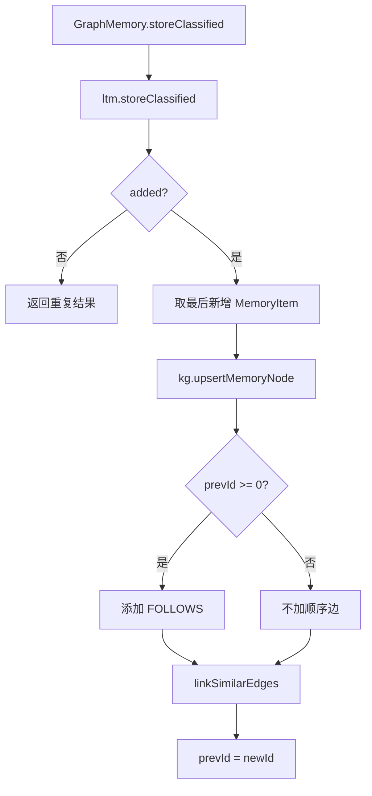

# 22-图记忆对象-GraphMemory

## 1. 一句话结论

`GraphMemory` 不是单独替代长期记忆，而是在 `LongTermMemory` 上加一层 Neo4j 图结构。

它做两件事：

```text
写入时：长期记忆新增后，在 Neo4j 建 Memory 节点和边
召回时：先用长期记忆召回 seed，再用图扩展邻居
```

## 2. 在记忆系统里的位置

初始化位置：

```java
graphMem = new GraphMemory(ltm, kg, cfg.getMemory().getConsolidation().getSimilarityThreshold());
```

它持有：

```text
LongTermMemory ltm
KGStore kg
simThreshold
prevId
```

所以图记忆依赖长期记忆。

## 3. 源码位置和核心对象

源码位置：

```text
AGI-saber-java/src/main/java/com/agi/assistant/service/memory/GraphMemory.java
```

核心字段：

```java
private final LongTermMemory ltm; // 底层长期记忆
private final KGStore kg; // Neo4j 操作封装
private final double simThreshold; // 创建 SIMILAR_TO 边的相似度阈值
private volatile int prevId = -1; // 上一条新增记忆的 ID，用于创建 FOLLOWS 边
```

图记忆存在形式：

```text
1. LongTermMemory.items 里的 MemoryItem
2. Neo4j 中的 (:Memory {mem_id, content, importance}) 节点
3. Neo4j 中的 FOLLOWS / SIMILAR_TO / CAUSES / BELONGS_TO 边
4. GraphMemory.prevId 顺序指针
```

## 4. 核心流程图



## 5. 源码讲解

### 5.1 先说 GraphMemory 是干什么的

`GraphMemory` 不是替代长期记忆。

它是在 `LongTermMemory` 上面加一层图关系：

```text
LongTermMemory 负责保存记忆内容。
GraphMemory 负责把记忆之间的关系连起来。
```

例如：

```text
记忆 A：用户正在学习短期记忆
记忆 B：用户开始学习图记忆

A -> B  可以用 FOLLOWS 表示先后顺序
```

### 5.2 生活类比

长期记忆像一张张卡片。

图记忆像在卡片之间拉线：

```text
卡片 10：用户正在学习短期记忆
卡片 11：用户正在学习长期记忆
卡片 12：用户正在学习图记忆

10 --FOLLOWS--> 11 --FOLLOWS--> 12
10 --SIMILAR_TO--> 12
```

卡片本身仍然在长期记忆里。

图层只负责“它们之间有什么关系”。

### 5.3 对应到代码：构造方法

```java
public GraphMemory(LongTermMemory ltm, KGStore kg, double simThreshold) { // 创建图记忆对象
    this.ltm = ltm; // 保存底层长期记忆
    this.kg = kg; // 保存 Neo4j 操作对象
    this.simThreshold = simThreshold > 0 ? simThreshold : 0.7; // 相似边阈值，配置无效时默认 0.7
}
```

逐行解释：

```text
第 1 行：创建 GraphMemory 时，需要传入长期记忆 ltm、Neo4j 操作对象 kg、相似边阈值 simThreshold。
第 2 行：保存底层 LongTermMemory。
第 3 行：保存 KGStore，用来操作 Neo4j。
第 4 行：如果 simThreshold 配置有效就使用配置，否则默认 0.7。
```

这里的对象关系：

```text
GraphMemory
  里面持有 LongTermMemory
  里面持有 KGStore
```

### 5.4 对应到代码：写入入口先写 LTM

```java
public StoreResult storeClassified(String content, double importance, List<Double> embedding,
                                   String category, List<String> tags, String slotHint) {
    boolean added = ltm.storeClassified(content, importance, embedding, category, tags, slotHint); // 先写长期记忆
    if (!added) { // 如果长期记忆判断重复
        return new StoreResult(false, findMostSimilarId(embedding)); // 不建新节点，返回最相似旧记忆 ID
    }
```

先说目的：

```text
图记忆写入第一步仍然是写 LongTermMemory。
只有长期记忆真正新增了，才需要建 Neo4j 节点和边。
```

逐行解释：

```text
第 1-2 行：storeClassified 接收记忆正文、重要性、embedding、分类、标签、槽位提示。
第 3 行：先调用 ltm.storeClassified，让长期记忆处理去重和新增。
第 4 行：如果 added=false，说明被判断为重复。
第 5 行：重复时不建新节点，只返回最相似旧记忆 ID。
```

### 5.5 对应到代码：怎么拿到刚新增的记忆

```java
List<MemoryItem> items = ltm.getItems(); // 读取长期记忆列表副本
if (items.isEmpty()) return new StoreResult(true, -1); // 没有项目就返回异常 ID
MemoryItem newItem = items.get(items.size() - 1); // 最后一条就是刚新增的记忆
int newId = newItem.getId(); // 新记忆 ID
```

先说目的：

```text
长期记忆新增后，新记忆会在 items 列表最后。
所以这里取最后一条，作为刚新增的 MemoryItem。
```

逐行解释：

```text
第 1 行：读取长期记忆列表。
第 2 行：防御判断，如果列表空了，就返回 -1。
第 3 行：取最后一条记忆。
第 4 行：拿到新记忆 ID。
```

这个逻辑和 ID 同步类似，也依赖：

```text
刚新增的记忆在列表末尾。
```

### 5.6 对应到代码：异步写 Neo4j 节点和边

```java
if (kg != null && kg.available()) { // Neo4j 可用才建图
    new Thread(() -> { // 图写入放到后台线程
        kg.upsertMemoryNode(newId, content, importance); // 创建或更新 Memory 节点
        if (prevId >= 0) { // 如果存在上一条记忆
            kg.addMemoryEdge(prevId, newId, "FOLLOWS", 1.0); // 建立顺序边
        }
        linkSimilarEdges(newItem, newId); // 和相似旧记忆建立 SIMILAR_TO 边
    }, "graph-memory-store").start();
}
```

先说目的：

```text
Neo4j 可用时，在后台创建 Memory 节点，并创建关系边。
```

逐行解释：

```text
第 1 行：只有 kg 不为空，并且 Neo4j 可用，才写图。
第 2 行：开后台线程，避免图写入阻塞主流程。
第 3 行：创建或更新 Neo4j Memory 节点。
第 4 行：如果 prevId 有效，说明之前已经写过一条记忆。
第 5 行：创建 FOLLOWS 顺序边。
第 7 行：检查相似旧记忆，并创建 SIMILAR_TO 边。
```

当前自动创建的关系：

```text
FOLLOWS     新记忆跟上一条记忆的顺序关系
SIMILAR_TO  新记忆和相似旧记忆的相似关系
```

注意：

```text
源码注释列了 BELONGS_TO / CAUSES，
但这段 GraphMemory.storeClassified 自动写入链路没有创建它们。
```

### 5.7 对应到代码：更新顺序指针

```java
prevId = newId; // 当前新增记忆成为下一次写入时的上一条
return new StoreResult(true, newId); // 返回新增成功和新 ID
```

先说目的：

```text
记录当前新增记忆 ID。
下一次新增记忆时，就能用它创建 FOLLOWS 边。
```

逐行解释：

```text
第 1 行：把 prevId 更新成当前新记忆 ID。
第 2 行：返回 StoreResult，告诉调用方新增成功，并给出新记忆 ID。
```

## 6. 真实例子：在流程中怎么运行

先写入：

```text
MemoryItem{id=10, content="用户正在学习短期记忆"}
```

`prevId` 变成：

```text
10
```

下一次写入：

```text
MemoryItem{id=11, content="用户正在学习长期记忆"}
```

Neo4j 会出现：

```text
(:Memory {mem_id:10, content:"用户正在学习短期记忆"})
(:Memory {mem_id:11, content:"用户正在学习长期记忆"})

(10)-[:FOLLOWS {weight:1.0}]->(11)
```

如果新旧 embedding 相似度超过 `simThreshold`，还会创建：

```text
(10)-[:SIMILAR_TO {weight:0.86}]->(11)
```

## 7. 容易混淆的点

`FOLLOWS` 表示发生顺序，不表示因果。

也就是说：

```text
A FOLLOWS B
```

只表示 A 之后写入了 B，不表示 A 导致 B。

`GraphMemory` 当前代码没有自动创建 `BELONGS_TO`。

`KGStore` 支持 `BELONGS_TO` 这种边类型，但 `GraphMemory.storeClassified` 里自动创建的是：

```text
FOLLOWS
SIMILAR_TO
```

## 8. 面试怎么说

可以这样说：

```text
GraphMemory 是 LongTermMemory 的图增强层。写入时先调用 ltm.storeClassified，只有真正新增时才在 Neo4j 中 upsert Memory 节点，并根据 prevId 创建 FOLLOWS 顺序边，根据 embedding 相似度创建 SIMILAR_TO 边。召回时先走长期记忆召回得到 seed，再从图里扩展邻居。
```
