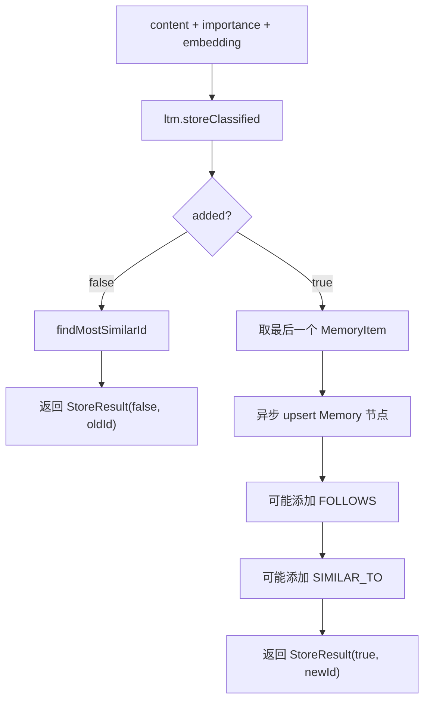

# 23-图记忆写入-storeClassified

## 1. 一句话结论

图记忆写入不是直接写 Neo4j，而是先写长期记忆；只有长期记忆真正新增成功后，才异步写 Neo4j 节点和边。

## 2. 在记忆系统里的位置

调用链：

```text
MemoryWriter.persist
  ↓
graphMem.storeClassified
  ↓
ltm.storeClassified
  ↓
kg.upsertMemoryNode
  ↓
kg.addMemoryEdge
```

如果 `ltm.storeClassified` 返回 `false`，表示重复记忆，不会创建新图节点。

## 3. 源码位置和核心对象

源码位置：

```text
GraphMemory.java
KGStore.java
LongTermMemory.java
```

返回值：

```java
public record StoreResult(boolean added, int itemId) {}
```

含义：

```text
added = true   新增成功
added = false  命中重复，没有新增
itemId         新增或最相似旧记忆 ID
```

## 4. 核心流程图



## 5. 源码讲解

### 5.1 先说图记忆写入做什么

图记忆写入不是直接往 Neo4j 写一条孤立记录。

它分两层：

```text
第一层：写 LongTermMemory，保存记忆本体。
第二层：写 Neo4j，保存记忆节点和记忆之间的边。
```

如果第一层判断重复，没有真正新增记忆，第二层就不会创建新图节点。

### 5.2 生活类比

像整理知识卡片：

```text
先确定这张卡片是不是新卡片。
如果是新卡片，放进卡片盒。
然后再把它和上一张卡片、相似卡片连线。
```

如果发现这张卡片已经有了：

```text
不再放新卡片，也不再拉新线。
```

### 5.3 对应到代码：先写 LTM

```java
boolean added = ltm.storeClassified(content, importance, embedding, category, tags, slotHint); // 先让长期记忆处理去重和新增
if (!added) { // 如果被长期记忆判断为重复
    return new StoreResult(false, findMostSimilarId(embedding)); // 返回 false，并尝试找最相似旧记忆 ID
}
```

逐行解释：

```text
第 1 行：先调用长期记忆写入方法。
第 1 行：长期记忆会负责去重、分类、标签、slotHint。
第 2 行：如果 added=false，说明这条记忆和旧记忆重复。
第 3 行：返回 StoreResult(false, 最相似旧记忆 ID)，不继续建新节点。
```

这里要先记住：

```text
GraphMemory 的新增依赖 LongTermMemory 的新增结果。
```

### 5.4 对应到代码：找到新 MemoryItem

```java
List<MemoryItem> items = ltm.getItems(); // 获取长期记忆副本
if (items.isEmpty()) return new StoreResult(true, -1); // 防御：如果列表为空，返回 -1
MemoryItem newItem = items.get(items.size() - 1); // 新增项位于列表最后
int newId = newItem.getId(); // 取新记忆 ID
```

先说目的：

```text
如果长期记忆新增成功，就从 LTM 里拿到刚新增的那条 MemoryItem。
```

逐行解释：

```text
第 1 行：获取长期记忆列表副本。
第 2 行：如果列表意外为空，就返回 -1。
第 3 行：取最后一条，因为刚新增的记忆位于末尾。
第 4 行：拿到新记忆 ID。
```

### 5.5 对应到代码：写 Neo4j

```java
if (kg != null && kg.available()) { // Neo4j 可用才写图
    new Thread(() -> { // 图写入异步执行
        kg.upsertMemoryNode(newId, content, importance); // 建 Memory 节点
        if (prevId >= 0) { // 有上一条记忆
            kg.addMemoryEdge(prevId, newId, "FOLLOWS", 1.0); // 添加顺序边
        }
        linkSimilarEdges(newItem, newId); // 添加相似边
    }, "graph-memory-store").start();
}
```

先说目的：

```text
把新增的 MemoryItem 映射成 Neo4j 里的 Memory 节点，
再创建 FOLLOWS 和 SIMILAR_TO 边。
```

逐行解释：

```text
第 1 行：Neo4j 操作对象存在且可用，才写图。
第 2 行：创建后台线程执行图写入。
第 3 行：创建或更新 Memory 节点。
第 4-5 行：如果存在上一条记忆，就创建 FOLLOWS 边。
第 7 行：根据 embedding 相似度创建 SIMILAR_TO 边。
```

为什么异步？

```text
Neo4j 写入不是当前回答的必要前置步骤。
放到后台可以减少主流程等待时间。
```

### 5.6 对应到代码：更新 prevId

```java
prevId = newId; // 记录本次新增 ID，供下一条记忆创建 FOLLOWS
return new StoreResult(true, newId); // 返回新增成功
```

先说目的：

```text
把当前新增记忆记为“上一条记忆”，供下一次写入创建顺序边。
```

逐行解释：

```text
第 1 行：prevId 变成当前 newId。
第 2 行：返回新增成功和新记忆 ID。
```

## 6. 真实例子：在流程中怎么运行

MemoryWriter 抽到：

```text
content = 用户正在学习图记忆召回
importance = 0.5
category = general
```

写入图记忆：

```java
graphMem.storeClassified(content, 0.5, emb, "general", tags, null);
```

如果长期记忆不重复：

```text
LongTermMemory.items 新增 MemoryItem{id=20}
Neo4j 新增 (:Memory {mem_id:20})
如果 prevId=19，则新增 (19)-[:FOLLOWS]->(20)
如果和 id=17 相似度超过阈值，则新增 (17)-[:SIMILAR_TO]->(20)
```

如果重复：

```text
不新增 MemoryItem
不新增 Neo4j 节点
返回 StoreResult(false, 最相似旧 ID)
```

## 7. 容易混淆的点

图写入是异步的。

`storeClassified` 返回时，Neo4j 节点和边可能还在后台线程写入中。

这也是为什么后面同步数据库 ID 时，`GraphMemory.syncLastItemPGID` 里有：

```java
try { Thread.sleep(50); } catch (InterruptedException ignored) {}
```

它是在等待前面的异步建图线程。

## 8. 面试怎么说

可以这样说：

```text
GraphMemory.storeClassified 先调用 LongTermMemory.storeClassified 做去重和内存写入。
如果返回 false，说明重复，不创建新图节点。
如果新增成功，就取最后一个 MemoryItem，在后台线程中 upsert Neo4j Memory 节点，并根据 prevId 建 FOLLOWS，根据 embedding 相似度建 SIMILAR_TO。
```
