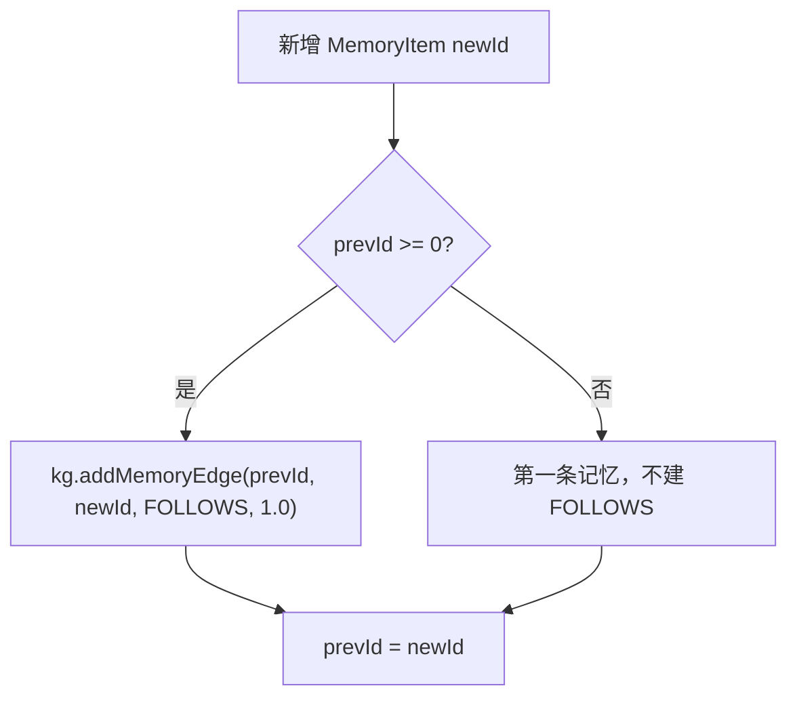

# 24-FOLLOWS边什么时候创建

## 1. 一句话结论

`FOLLOWS` 边在新增图记忆时创建，用来表示“新记忆跟在上一条记忆之后”。

它是顺序边，不是因果边。

## 2. 在记忆系统里的位置

创建位置：

```text
GraphMemory.storeClassified
```

触发条件：

```text
1. 长期记忆新增成功
2. Neo4j 可用
3. prevId >= 0
```

## 3. 源码位置和核心对象

源码位置：

```text
AGI-saber-java/src/main/java/com/agi/assistant/service/memory/GraphMemory.java
```

相关字段：

```java
private volatile int prevId = -1; // 保存上一条新增记忆 ID
```

创建代码：

```java
kg.addMemoryEdge(prevId, newId, "FOLLOWS", 1.0);
```

## 4. 核心流程图



## 5. 源码讲解

### 5.1 先说 FOLLOWS 是什么

`FOLLOWS` 表示：

```text
这条记忆发生在上一条记忆之后。
```

它是顺序关系，不是因果关系。

也就是说：

```text
A FOLLOWS B
```

只能说明：

```text
B 之后写入了 A
```

不能说明：

```text
B 导致了 A
```

### 5.2 生活类比

像日记页码：

```text
第 1 页：用户开始学习短期记忆
第 2 页：用户开始学习长期记忆
第 3 页：用户开始学习图记忆
```

第 2 页跟在第 1 页后面。

第 3 页跟在第 2 页后面。

这只是时间顺序。

### 5.3 对应到代码：什么时候建 FOLLOWS

```java
if (prevId >= 0) { // prevId 初始为 -1，只有已经写过上一条记忆时才满足
    kg.addMemoryEdge(prevId, newId, "FOLLOWS", 1.0); // 从上一条记忆指向当前新记忆
}
```

先说目的：

```text
如果之前已经写过一条记忆，那么新记忆和上一条记忆之间建立 FOLLOWS 边。
```

逐行解释：

```text
第 1 行：prevId >= 0 说明存在上一条记忆。
第 2 行：从 prevId 指向 newId，创建 FOLLOWS 边。
第 2 行：weight=1.0 表示这条顺序边的权重固定为 1.0。
```

第一条记忆不会有 FOLLOWS。

因为：

```text
prevId 初始是 -1。
没有上一条记忆可以连接。
```

### 5.4 对应到代码：更新顺序指针

```java
prevId = newId; // 当前记忆成为下一次写入时的上一条记忆
```

先说目的：

```text
当前新记忆写完后，它就会成为下一次写入时的上一条记忆。
```

真实例子：

```text
第一次新增 id=10：
prevId 原来是 -1，不建 FOLLOWS。
写完后 prevId = 10。

第二次新增 id=11：
prevId 是 10，建 10 -> 11 的 FOLLOWS。
写完后 prevId = 11。
```

### 5.5 对应到代码：Neo4j 怎么写边

```java
public void addMemoryEdge(int fromId, int toId, String edgeType, double weight) { // 添加 Memory 节点之间的边
    if (!available()) return; // Neo4j 不可用就不写
    if (!isValidMemoryEdge(edgeType)) return; // 边类型不合法就不写
    String query = "MATCH (a:Memory {mem_id: $from}), (b:Memory {mem_id: $to}) " +
            "MERGE (a)-[r:" + edgeType + "]->(b) SET r.weight = $weight"; // 找两个节点并创建关系
    ...
}
```

逐行解释：

```text
第 1 行：传入起点 ID、终点 ID、边类型、边权重。
第 2 行：如果 Neo4j 不可用，直接返回。
第 3 行：如果边类型不合法，直接返回。
第 4-5 行：MATCH 找到两个 Memory 节点。
第 5 行：MERGE 创建或复用这条边。
第 5 行：SET r.weight = $weight 设置边权重。
```

注意：

```text
如果两条记忆语义也很相似，它们还可能同时有 SIMILAR_TO。
FOLLOWS 表示顺序。
SIMILAR_TO 表示相似。
两者不冲突。
```

## 6. 真实例子：在流程中怎么运行

第一条记忆：

```text
id=1, content=用户开始学习短期记忆
```

此时：

```text
prevId = -1
```

不会创建 `FOLLOWS`。

写完后：

```text
prevId = 1
```

第二条记忆：

```text
id=2, content=用户开始学习长期记忆
```

此时：

```text
prevId = 1
newId = 2
```

创建：

```text
(1)-[:FOLLOWS {weight:1.0}]->(2)
```

然后：

```text
prevId = 2
```

## 7. 容易混淆的点

如果两条记忆很相似，会不会同时有 `FOLLOWS` 和 `SIMILAR_TO`？

会。

因为它们判断条件不同：

```text
FOLLOWS：只看写入顺序，只要 prevId 存在就建
SIMILAR_TO：看 embedding 相似度，超过 simThreshold 才建
```

所以新记忆和上一条旧记忆既可能有顺序关系，也可能有相似关系。

## 8. 面试怎么说

可以这样说：

```text
FOLLOWS 在图记忆新增成功后创建。GraphMemory 用 prevId 保存上一条新增记忆 ID，如果 prevId >= 0，就在 Neo4j 中创建 prevId -> newId 的 FOLLOWS 边，权重为 1.0。它表达时间或写入顺序，不表达因果关系。
```
