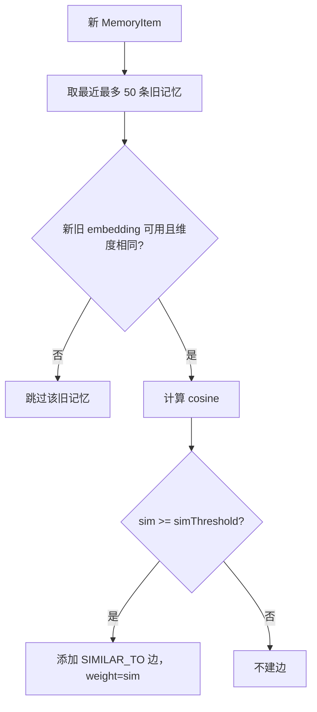

# 25-SIMILAR_TO边什么时候创建

## 1. 一句话结论

`SIMILAR_TO` 边在新记忆和旧记忆 embedding 相似度超过 `simThreshold` 时创建。

它表示两条记忆语义相似，不表示时间顺序。

## 2. 在记忆系统里的位置

创建位置：

```text
GraphMemory.linkSimilarEdges
```

调用位置：

```java
linkSimilarEdges(newItem, newId);
```

触发条件：

```text
1. 新记忆新增成功
2. Neo4j 可用
3. 新旧 embedding 都存在
4. 新旧 embedding 维度相同
5. cosine(old.embedding, new.embedding) >= simThreshold
```

## 3. 源码位置和核心对象

源码位置：

```text
AGI-saber-java/src/main/java/com/agi/assistant/service/memory/GraphMemory.java
```

阈值来源：

```java
cfg.getMemory().getConsolidation().getSimilarityThreshold()
```

默认值在 `AppConfig.ConsolidationConfig`：

```java
private double similarityThreshold = 0.80;
```

## 4. 核心流程图



## 5. 源码讲解

### 5.1 先说 SIMILAR_TO 是什么

`SIMILAR_TO` 表示：

```text
两条记忆语义相似。
```

它不是顺序关系。

它回答的是：

```text
这两条记忆说的是不是接近的事情？
```

### 5.2 生活类比

像给笔记贴关联线。

```text
卡片 10：用户喜欢 Java 逐行解释
卡片 15：用户偏好 Java 代码讲解要细
```

这两张卡片不是前后页也可以相似。

如果 embedding 相似度超过阈值，就连一条：

```text
10 --SIMILAR_TO--> 15
```

### 5.3 对应到代码：先取比较范围

```java
List<MemoryItem> items = ltm.getItems(); // 获取长期记忆列表副本
int start = Math.max(0, items.size() - 51); // 只看最近最多 50 条旧记忆，加上最后的新记忆一共 51 条
for (int i = start; i < items.size() - 1; i++) { // 遍历旧记忆，不包含最后一条新记忆
```

先说目的：

```text
新记忆只和最近最多 50 条旧记忆比较相似度。
```

为什么不是和所有记忆比？

```text
为了控制计算量。
记忆越来越多时，如果每次都和所有历史记忆比较，会越来越慢。
```

逐行解释：

```text
第 1 行：读取长期记忆列表。
第 2 行：计算比较起点，最多回看最近 50 条旧记忆。
第 3 行：遍历旧记忆，不包含最后一条新记忆。
```

### 5.4 对应到代码：跳过不能比较的记忆

```java
MemoryItem old = items.get(i); // 当前旧记忆
if (old.getId() == newId) continue; // 防止和自己比较
if (old.getEmbedding() == null || old.getEmbedding().isEmpty()
        || newItem.getEmbedding() == null || newItem.getEmbedding().isEmpty()) continue; // 新旧任一没有 embedding 就跳过
if (old.getEmbedding().size() != newItem.getEmbedding().size()) continue; // 维度不同不能比较
```

先说目的：

```text
只有新旧记忆都有 embedding，并且维度一致，才能计算相似度。
```

逐行解释：

```text
第 1 行：取当前旧记忆。
第 2 行：如果旧记忆就是新记忆自己，跳过。
第 3-4 行：如果旧记忆或新记忆没有 embedding，跳过。
第 5 行：如果新旧 embedding 维度不同，跳过。
```

技术点：

```text
embedding 维度必须一致，余弦相似度才有意义。
```

### 5.5 对应到代码：计算相似度并建边

```java
double sim = LongTermMemory.cosine(old.getEmbedding(), newItem.getEmbedding()); // 计算新旧记忆的余弦相似度
if (sim >= simThreshold) { // 相似度超过阈值
    kg.addMemoryEdge(old.getId(), newId, "SIMILAR_TO", sim); // 从旧记忆指向新记忆，边权重就是 sim
}
```

先说目的：

```text
如果新旧记忆足够相似，就在 Neo4j 里建立 SIMILAR_TO 边。
```

逐行解释：

```text
第 1 行：用 embedding 余弦相似度计算 sim。
第 2 行：如果 sim 大于等于 simThreshold。
第 3 行：创建 old -> new 的 SIMILAR_TO 边，边权重就是 sim。
```

真实例子：

```text
old.content = "用户喜欢 Java 逐行解释"
new.content = "用户偏好 Java 代码讲解要细"
sim = 0.86
simThreshold = 0.7
```

因为：

```text
0.86 >= 0.7
```

所以创建：

```text
old --SIMILAR_TO {weight: 0.86}--> new
```

如果新记忆刚好也是上一条记忆之后写入的，那么它还可能同时有：

```text
old --FOLLOWS--> new
old --SIMILAR_TO--> new
```

一个表示顺序，一个表示语义相似。

## 6. 真实例子：在流程中怎么运行

已有记忆：

```text
id=10 content=用户喜欢 Java 逐行解释
embedding=A
```

新记忆：

```text
id=15 content=用户偏好 Java 代码讲解要细
embedding=B
```

计算：

```text
cosine(A, B) = 0.86
simThreshold = 0.80
```

因为：

```text
0.86 >= 0.80
```

创建：

```text
(10)-[:SIMILAR_TO {weight:0.86}]->(15)
```

如果同一时间 `prevId=14`，还可能同时创建：

```text
(14)-[:FOLLOWS {weight:1.0}]->(15)
```

## 7. 容易混淆的点

`dedupThreshold` 和 `simThreshold` 不是一个阈值。

```text
dedupThreshold：默认 0.95，用于判断是否重复，不新增记忆
simThreshold：默认 0.80，用于新增后判断是否建立 SIMILAR_TO 边
```

如果相似度非常高，超过 `dedupThreshold`，长期记忆可能直接判重复，不新增新节点，也就不会建新的 `SIMILAR_TO`。

如果相似度中等偏高，低于去重阈值但高于相似边阈值，就会新增记忆并建立 `SIMILAR_TO`。

## 8. 面试怎么说

可以这样说：

```text
SIMILAR_TO 在图记忆新增成功后创建。GraphMemory 会拿新记忆和最近最多 50 条旧记忆比较 embedding 余弦相似度，只有新旧 embedding 都存在且维度一致时才比较。如果 sim 大于等于 similarityThreshold，就在 Neo4j 里创建 old -> new 的 SIMILAR_TO 边，边权重就是 sim。
```
