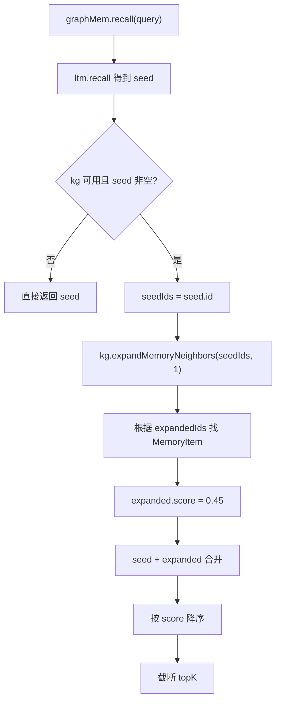

# 26-图记忆召回-邻居扩展

## 1. 一句话结论

图记忆召回是两步：先用长期记忆召回出 seed，再从 Neo4j 图里扩展这些 seed 的邻居。

```text
seed = 向量/词袋召回出的相关 MemoryItem
expanded = 图上和 seed 相连的 MemoryItem
```

## 2. 在记忆系统里的位置

调用位置：

```java
graphMem.recall(query, topK, queryEmbedding)
```

发生在：

```text
buildMemorySystemPrefixWithCtx(query)
```

如果 `graphMem != null`，系统优先走图召回。

## 3. 源码位置和核心对象

源码位置：

```text
GraphMemory.java
KGStore.java
```

涉及对象：

```text
seed        LongTermMemory.recall 返回的 MemoryItem
seedIds     seed 的 id 列表
expandedIds Neo4j 扩展出来的邻居 id
expanded    邻居 MemoryItem
```

扩展边类型：

```text
FOLLOWS
SIMILAR_TO
CAUSES
BELONGS_TO
```

注意：`KGStore` 支持这些边类型；当前自动写入主要创建 `FOLLOWS` 和 `SIMILAR_TO`。

## 4. 核心流程图



## 5. 源码讲解

### 5.1 先说图召回是干什么的

图召回不是直接从 Neo4j 随便拿节点。

它的流程是：

```text
先用长期记忆召回最相关的 seed 记忆。
再从这些 seed 出发，在图里找一跳邻居。
最后把 seed 和邻居合并排序。
```

`seed` 可以理解成：

```text
第一批最相关的种子记忆。
```

### 5.2 生活类比

像查资料：

```text
你先在档案柜里找到最相关的几张卡片。
然后顺着这些卡片上的关联线，
再看看附近有没有相关卡片。
```

第一批直接找到的卡片就是 seed。

顺着线找到的卡片就是图扩展邻居。

### 5.3 对应到代码：先召回 seed

```java
List<MemoryItem> seed = ltm.recall(query, topK, queryEmbedding); // 先用长期记忆召回相关种子记忆
if (kg == null || !kg.available() || seed.isEmpty()) { // 如果没有图层或 seed 为空
    return seed; // 直接返回长期记忆召回结果
}
```

逐行解释：

```text
第 1 行：先调用 LongTermMemory.recall，得到最相关的 seed 记忆。
第 2 行：如果 kg 为空，说明没有图层。
第 2 行：如果 Neo4j 不可用，也不能图扩展。
第 2 行：如果 seed 为空，也没有起点可以扩展。
第 3 行：以上情况直接返回 seed。
```

### 5.4 对应到代码：准备 seedIds

```java
List<Integer> seedIds = new ArrayList<>(); // 准备 seed ID 列表
for (MemoryItem it : seed) seedIds.add(it.getId()); // 取每条 seed 的 ID
```

先说目的：

```text
Neo4j 扩展邻居需要节点 ID。
所以要把 MemoryItem 列表转换成 ID 列表。
```

真实例子：

```text
seed = [
  MemoryItem{id=20, content="用户正在学习图记忆召回"},
  MemoryItem{id=18, content="用户学习过长期记忆召回"}
]
```

转换后：

```text
seedIds = [20, 18]
```

### 5.5 对应到代码：从图里扩展邻居

```java
List<Integer> expandedIds = kg.expandMemoryNeighbors(seedIds, 1); // 从 Neo4j 扩展 1 跳邻居
if (expandedIds.isEmpty()) return seed; // 没有邻居就返回 seed
```

先说目的：

```text
从 seed 节点出发，沿 FOLLOWS / SIMILAR_TO / CAUSES / BELONGS_TO 找 1 跳邻居。
```

这里返回的是：

```text
邻居 Memory 节点的 mem_id 列表
```

不是完整 `MemoryItem` 对象。

### 5.6 对应到代码：把邻居 ID 找回 MemoryItem

```java
Set<Integer> idSet = new HashSet<>(seedIds); // 记录已经有的 seed，避免重复
List<MemoryItem> expanded = new ArrayList<>(); // 准备邻居结果
for (int id : expandedIds) { // 遍历图扩展出的 ID
    if (idSet.contains(id)) continue; // 已经是 seed 的跳过
    for (MemoryItem it : ltm.getItems()) { // 在长期记忆列表里找对应 MemoryItem
        if (it.getId() == id) { // 找到 ID 相同的记忆
            it.setScore(0.45); // 图扩展来的邻居固定给 0.45 分
            expanded.add(it); // 加入扩展结果
            idSet.add(id); // 标记已加入
            break;
        }
    }
}
```

先说目的：

```text
Neo4j 只返回邻居 ID。
最终系统还是要返回 MemoryItem。
所以要回到 LongTermMemory.items 里按 ID 找对象。
```

逐行解释：

```text
第 1 行：把 seedIds 放进 Set，避免重复加入同一条记忆。
第 2 行：准备 expanded 列表，存图扩展出来的 MemoryItem。
第 3 行：遍历 Neo4j 返回的邻居 ID。
第 4 行：如果这个 ID 已经在 seed 里，就跳过。
第 5 行：遍历长期记忆列表。
第 6 行：找到 ID 相同的 MemoryItem。
第 7 行：给图扩展来的邻居固定设置 score=0.45。
第 8 行：加入 expanded。
第 9 行：记录这个 ID 已加入。
```

为什么图邻居固定 0.45？

```text
它不是直接按 query 算出来的强相关 seed。
它是“和 seed 有图关系”的补充记忆。
所以给一个较低但能参与排序的固定分。
```

### 5.7 对应到代码：合并排序并截断 topK

```java
List<MemoryItem> all = new ArrayList<>(seed); // 先放 seed
all.addAll(expanded); // 再放图邻居
all.sort(Comparator.comparingDouble(MemoryItem::getScore).reversed()); // 按 score 降序
if (all.size() > topK) all = all.subList(0, topK); // 截断到 topK
return all; // 返回最终召回结果
```

逐行解释：

```text
第 1 行：先把 seed 放进 all。
第 2 行：再把图扩展邻居放进去。
第 3 行：按 score 从高到低排序。
第 4 行：如果超过 topK，只保留前 topK 条。
第 5 行：返回最终召回结果。
```

面试表达要点：

```text
图召回不是替代向量召回。
它是先向量召回 seed，再用图关系扩展邻居。
```

## 6. 真实例子：在流程中怎么运行

用户问：

```text
图记忆召回是怎么扩展的？
```

长期记忆先召回 seed：

```text
seed:
id=20 content=用户正在学习图记忆召回 score=0.82
```

Neo4j 中有边：

```text
(20)-[:SIMILAR_TO]-(18)
(20)-[:FOLLOWS]-(21)
```

图扩展得到：

```text
expandedIds = [18, 21]
```

系统在 `ltm.getItems()` 里找到：

```text
id=18 content=用户学习过长期记忆召回
id=21 content=用户接下来要学习 Neo4j 节点
```

给扩展项固定分：

```text
score = 0.45
```

最终排序后取 topK。

## 7. 容易混淆的点

图扩展不是直接拿 Neo4j 节点内容回答。

Neo4j 只返回邻居 ID：

```text
expandedIds
```

真正返回给上层的还是 `LongTermMemory.items` 里的 `MemoryItem`。

图扩展来的节点分数固定是：

```java
it.setScore(0.45);
```

这意味着它们通常排在高相关 seed 后面。

## 8. 面试怎么说

可以这样说：

```text
图记忆召回先调用 LongTermMemory.recall 得到语义相关的 seed，然后把 seed 的 ID 交给 KGStore.expandMemoryNeighbors，在 Neo4j 中沿 FOLLOWS、SIMILAR_TO、CAUSES、BELONGS_TO 扩展 1 跳邻居。扩展出的 ID 会回到 LongTermMemory.items 中找 MemoryItem，并给固定 score=0.45，最后与 seed 合并排序取 topK。
```
