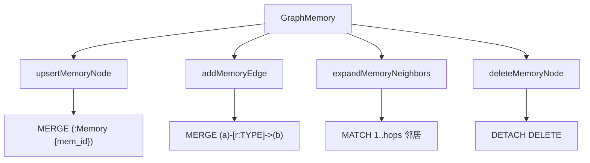

# 27-Neo4j节点和边-KGStore

## 1. 一句话结论

`KGStore` 是 Neo4j 操作封装，记忆图里它负责创建 Memory 节点、创建边、扩展邻居、删除节点、查询中心度。

## 2. 在记忆系统里的位置

`GraphMemory` 不直接写 Cypher，而是调用 `KGStore`：

```text
GraphMemory
  ↓
KGStore
  ↓
Neo4j
```

记忆图相关方法：

```text
upsertMemoryNode
addMemoryEdge
expandMemoryNeighbors
deleteMemoryNode
getHighCentralityMemoryIds
```

## 3. 源码位置和核心对象

源码位置：

```text
AGI-saber-java/src/main/java/com/agi/assistant/service/graph/KGStore.java
```

Memory 节点结构：

```text
(:Memory {
  mem_id: 37,
  content: "用户喜欢 Java 逐行解释",
  importance: 0.7
})
```

支持的边类型：

```java
private static boolean isValidMemoryEdge(String type) {
    return "FOLLOWS".equals(type) || "SIMILAR_TO".equals(type)
            || "CAUSES".equals(type) || "BELONGS_TO".equals(type);
}
```

当前自动创建：

```text
FOLLOWS
SIMILAR_TO
```

当前代码支持但没有在 GraphMemory.storeClassified 中自动创建：

```text
CAUSES
BELONGS_TO
```

## 4. 核心流程图



## 5. 源码讲解

### 5.1 先说 KGStore 是干什么的

`KGStore` 是系统操作 Neo4j 的工具类。

对图记忆来说，它主要做四件事：

```text
1. 创建或更新 Memory 节点
2. 创建 Memory 节点之间的边
3. 从 seed 节点扩展邻居
4. 删除 Memory 节点
```

### 5.2 生活类比

如果 Neo4j 是一张关系网：

```text
节点 = 一张记忆卡片
边   = 两张卡片之间的关系线
```

`KGStore` 就是操作这张网的工具：

```text
新增卡片
连线
顺着线找附近卡片
删除卡片
```

### 5.3 对应到代码：创建或更新 Memory 节点

```java
public void upsertMemoryNode(int memId, String content, double importance) { // 创建或更新记忆节点
    if (!available()) return; // Neo4j 不可用就直接返回
    try (Session s = neo4j.session()) { // 打开 Neo4j session
        s.run("MERGE (m:Memory {mem_id: $id}) SET m.content = $content, m.importance = $importance",
                Values.parameters("id", (long) memId, "content", content, "importance", importance)); // 按 mem_id 合并节点并更新属性
    } catch (Exception e) {
        log.warn("Neo4j UpsertMemoryNode 失败 (id={}): {}", memId, e.getMessage()); // 失败只记录日志
    }
}
```

先说目的：

```text
把 LongTermMemory 里的 MemoryItem 映射成 Neo4j 里的 (:Memory) 节点。
```

Neo4j 节点长这样：

```text
(:Memory {
  mem_id: 37,
  content: "用户喜欢 Java 逐行解释",
  importance: 0.7
})
```

逐行解释：

```text
第 1 行：传入记忆 ID、正文、重要性。
第 2 行：如果 Neo4j 不可用，直接返回。
第 3 行：打开 Neo4j session。
第 4 行：MERGE 根据 mem_id 创建或找到 Memory 节点。
第 4 行：SET 更新 content 和 importance。
第 6 行：如果失败，只记录 warning，不让主流程崩掉。
```

技术点：

```text
MERGE 类似“有就复用，没有就创建”。
这里用 mem_id 保证同一个记忆 ID 对应同一个 Neo4j 节点。
```

### 5.4 对应到代码：创建边

```java
public void addMemoryEdge(int fromId, int toId, String edgeType, double weight) { // 添加记忆边
    if (!available()) return; // Neo4j 不可用就返回
    if (!isValidMemoryEdge(edgeType)) return; // 只允许白名单边类型
    String query = "MATCH (a:Memory {mem_id: $from}), (b:Memory {mem_id: $to}) " +
            "MERGE (a)-[r:" + edgeType + "]->(b) SET r.weight = $weight"; // 边类型不能参数化，所以拼接前必须校验
    ...
}
```

先说目的：

```text
在两个 Memory 节点之间创建关系边。
```

真实例子：

```text
(Memory {mem_id: 10}) -[:FOLLOWS {weight: 1.0}]-> (Memory {mem_id: 11})
```

逐行解释：

```text
第 1 行：传入起点 ID、终点 ID、边类型、权重。
第 2 行：Neo4j 不可用就返回。
第 3 行：边类型不在白名单里就返回。
第 4-5 行：MATCH 找到 from/to 两个 Memory 节点。
第 5 行：MERGE 创建或复用指定类型的边。
第 5 行：SET r.weight 更新边权重。
```

为什么要校验边类型？

```text
Cypher 里关系类型不能像普通值一样参数化。
代码会把 edgeType 拼到查询字符串里。
所以必须先用 isValidMemoryEdge 做白名单校验。
```

### 5.5 对应到代码：扩展邻居

```java
String query = "MATCH (m:Memory) WHERE m.mem_id IN $ids " +
        "MATCH (m)-[:FOLLOWS|SIMILAR_TO|CAUSES|BELONGS_TO*1.." + h + "]-(n:Memory) " +
        "WHERE NOT n.mem_id IN $ids RETURN DISTINCT n.mem_id AS id"; // 从 seed 沿指定边找 1 到 h 跳邻居
```

先说目的：

```text
从 seed Memory 节点出发，沿图关系找邻居节点。
```

逐段解释：

```text
MATCH (m:Memory) WHERE m.mem_id IN $ids
  找到 seed 节点。

MATCH (m)-[:FOLLOWS|SIMILAR_TO|CAUSES|BELONGS_TO*1..h]-(n:Memory)
  从 seed 出发，沿这些边找 1 到 h 跳的邻居。

WHERE NOT n.mem_id IN $ids
  不返回 seed 自己。

RETURN DISTINCT n.mem_id AS id
  返回去重后的邻居 ID。
```

注意：

```text
这里查询支持 BELONGS_TO / CAUSES。
但 GraphMemory.storeClassified 当前自动创建的是 FOLLOWS 和 SIMILAR_TO。
```

### 5.6 对应到代码：删除节点

```java
s.run("MATCH (m:Memory {mem_id: $id}) DETACH DELETE m",
        Values.parameters("id", (long) memId)); // 删除节点及其所有关系
```

先说目的：

```text
当长期记忆整理删除某些记忆时，Neo4j 里的对应 Memory 节点也要删除。
```

逐段解释：

```text
MATCH (m:Memory {mem_id: $id})
  找到指定 mem_id 的 Memory 节点。

DETACH DELETE m
  删除这个节点，并同时删除它相关的所有边。
```

为什么要 `DETACH DELETE`？

```text
Neo4j 里有关系的节点不能直接 DELETE。
DETACH DELETE 会先断开关系，再删除节点。
```

## 6. 真实例子：在流程中怎么运行

新增记忆：

```text
MemoryItem{id=37, content="用户喜欢 Java 逐行解释", importance=0.7}
```

写 Neo4j：

```java
kg.upsertMemoryNode(37, "用户喜欢 Java 逐行解释", 0.7);
```

形成节点：

```text
(:Memory {mem_id:37, content:"用户喜欢 Java 逐行解释", importance:0.7})
```

如果上一条记忆是 36：

```java
kg.addMemoryEdge(36, 37, "FOLLOWS", 1.0);
```

形成：

```text
(:Memory {mem_id:36})-[:FOLLOWS {weight:1.0}]->(:Memory {mem_id:37})
```

如果相似旧记忆是 20，相似度 0.86：

```java
kg.addMemoryEdge(20, 37, "SIMILAR_TO", 0.86);
```

形成：

```text
(:Memory {mem_id:20})-[:SIMILAR_TO {weight:0.86}]->(:Memory {mem_id:37})
```

## 7. 容易混淆的点

`BELONGS_TO` 有没有？

答案要分清：

```text
KGStore 支持 BELONGS_TO 这种边类型。
GraphMemory 当前自动写入逻辑没有创建 BELONGS_TO。
```

所以面试不能说“系统会自动根据 category 创建 BELONGS_TO”，因为源码里没有这个逻辑。

另一个点：边类型不能作为 Cypher 参数传入，所以代码用字符串拼接边类型。

为了避免任意注入，代码先用：

```java
isValidMemoryEdge(edgeType)
```

做白名单校验。

## 8. 面试怎么说

可以这样说：

```text
KGStore 封装 Neo4j 的记忆图操作。Memory 节点用 mem_id、content、importance 表示长期记忆；边类型白名单包括 FOLLOWS、SIMILAR_TO、CAUSES、BELONGS_TO。当前 GraphMemory 自动创建的是 FOLLOWS 和 SIMILAR_TO，BELONGS_TO 只是 KGStore 支持的边类型，并没有在写入长期记忆时自动生成。
```
