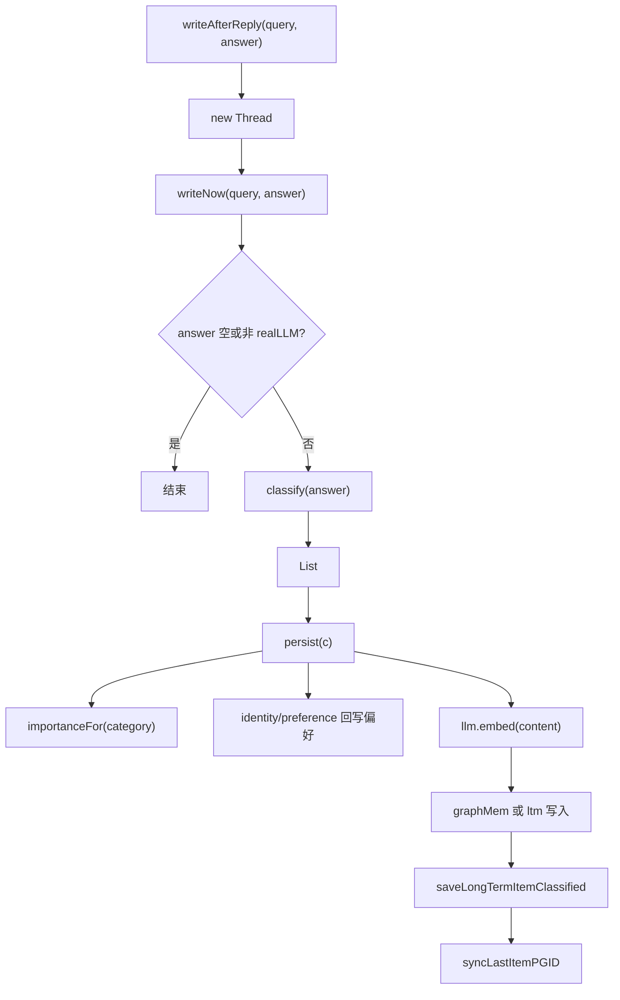

# 28-MemoryWriter回复后写入

## 1. 一句话结论

`MemoryWriter` 负责在助手回答结束后，异步从回答中抽取值得长期保存的信息，并写入偏好、长期记忆、数据库和图记忆。

## 2. 在记忆系统里的位置

调用位置：

```java
memoryWriter.writeAfterReply(query, resp.getAnswer());
```

它发生在：

```text
LLM 已经生成 answer
assistant 回答已经写入短期记忆
之后
```

所以它不参与当前回答生成，而是为后续轮次沉淀记忆。

## 3. 源码位置和核心对象

源码位置：

```text
AGI-saber-java/src/main/java/com/agi/assistant/application/chat/MemoryWriter.java
```

核心对象：

```text
Classified     LLM 分类后的记忆项
PreferenceMemory pref
LongTermMemory ltm
GraphMemory graphMem
InfrastructureService infra
```

存在形式变化：

```text
answer 字符串
  → LLM JSON
  → Classified(category, content, tags)
  → PreferenceMemory.data
  → MemoryItem
  → PostgreSQL
  → Neo4j Memory 节点
```

## 4. 核心流程图



## 5. 源码讲解

### 5.1 先说 MemoryWriter 是干什么的

`MemoryWriter` 做的是：

```text
在助手回答完成之后，从回答内容里提取值得长期记住的信息。
```

它不是在用户刚输入时立即写。

它是在回复之后做后台写入：

```text
用户问题
  ↓
生成助手回答
  ↓
MemoryWriter 从回答中提取长期记忆
```

### 5.2 生活类比

像一次课后整理笔记。

课堂上先正常讲课。

讲完以后，再回头看这次讲了什么：

```text
有没有用户身份？
有没有用户偏好？
有没有硬性规则？
有没有工具失败经验？
有没有一般事实值得记住？
```

整理出来后再放进长期记忆。

### 5.3 对应到代码：异步入口

```java
public void writeAfterReply(String query, String answer) { // 回复后写记忆的入口
    new Thread(() -> { // 新建后台线程，不阻塞主回答
        try { writeNow(query, answer); } // 在线程中执行同步写入逻辑
        catch (Exception e) { log.warn("MemoryWriter 写入失败: {}", e.getMessage()); } // 出错只记录日志，不影响主流程
    }, "memory-writer").start(); // 线程名 memory-writer
}
```

逐行解释：

```text
第 1 行：writeAfterReply 是回复后写记忆入口。
第 2 行：创建后台线程。
第 3 行：在线程里调用 writeNow。
第 4 行：如果写入失败，只记录日志，不影响用户已经拿到的回答。
第 5 行：线程名叫 memory-writer，并启动线程。
```

为什么异步？

```text
记忆抽取和写入不是用户拿到回答的必要前置步骤。
放到后台执行，可以减少主链路等待时间。
```

### 5.4 对应到代码：同步逻辑 writeNow

```java
public void writeNow(String query, String answer) { // 便于单测的同步执行方法
    if (answer == null || answer.isEmpty() || !cfg.isRealLLM()) return; // 没有回答或没有真实 LLM 时不抽取

    List<Classified> items = classify(answer); // 调 LLM 从 answer 中抽取长期记忆候选
    if (items.isEmpty()) return; // 没有值得记忆的信息就结束

    for (Classified c : items) { // 遍历每条分类结果
        persist(c); // 持久化这一条记忆
    }
}
```

逐行解释：

```text
第 1 行：writeNow 是真正执行写入逻辑的方法。
第 2 行：如果 answer 为空，直接返回。
第 2 行：如果 cfg.isRealLLM() 为 false，也不做抽取。
第 4 行：调用 classify(answer)，让 LLM 从回答里抽取记忆候选。
第 5 行：如果没有候选，结束。
第 7-9 行：遍历每条候选，调用 persist 写入。
```

这里要注意：

```text
MemoryWriter 会调用 LLM 分类。
但只有真实 LLM 模式才执行。
```

### 5.5 对应到代码：LLM 分类输出长什么样

分类提示词要求输出：

```text
{"items":[{"category":"...","content":"...","tags":["..."]}]}
```

真实例子：

```text
{
  "items": [
    {
      "category": "preference",
      "content": "用户喜欢 Java 代码逐行解释",
      "tags": ["Java", "讲解风格"]
    }
  ]
}
```

这不是最终 MemoryItem。

它只是 LLM 分类出的中间对象，后面还要进入 `persist`。

### 5.6 对应到代码：持久化时先算 importance 和 slotHint

```java
double importance = importanceFor(c.category); // 根据 category 映射 importance
String slotHint = slotHintFor(c.category); // 根据 category 映射 promptctx 槽位
```

逐行解释：

```text
第 1 行：根据分类给默认重要性。
第 2 行：根据分类给 promptctx 槽位提示。
```

例如：

```text
category = preference
importance = 0.7
slotHint = Profile
```

### 5.7 对应到代码：写长期记忆或图记忆

```java
List<Double> emb;
try { emb = llm.embed(c.content); } catch (Exception e) { emb = null; } // 给 content 做 embedding，失败就用 null

boolean added;
if (graphMem != null) {
    added = graphMem.storeClassified(c.content, importance, emb, c.category, c.tags, slotHint).added(); // 有图层就走图记忆写入
} else {
    added = ltm.storeClassified(c.content, importance, emb, c.category, c.tags, slotHint); // 没图层就只写长期记忆
}
if (!added) return; // 重复记忆不再写数据库
```

逐行解释：

```text
第 1-2 行：对记忆 content 做 embedding，失败时 emb=null。
第 4 行：准备 added，表示是否真的新增。
第 5-6 行：如果启用了 graphMem，就走图记忆写入。
第 7-8 行：否则走普通长期记忆写入。
第 10 行：如果 added=false，说明重复，不写数据库。
```

### 5.8 对应到代码：写数据库并同步 ID

```java
int pgId = infra.saveLongTermItemClassified(c.content, importance, embJson, c.category, tagsJson, slotHint); // 保存到 PostgreSQL
if (graphMem != null) graphMem.syncLastItemPGID(pgId); // 图记忆同步 ID
else ltm.syncLastItemPGID(pgId); // 普通长期记忆同步 ID
```

逐行解释：

```text
第 1 行：保存到 PostgreSQL long_term_memory 表，并拿到数据库 ID。
第 2 行：如果有图记忆，同步图记忆里的最后一条 ID。
第 3 行：否则同步普通长期记忆里的最后一条 ID。
```

完整人话：

```text
内存先新增一条记忆。
数据库再保存这条记忆并生成 pgId。
最后把内存里的 ID 改成 pgId。
```

## 6. 真实例子：在流程中怎么运行

助手回答：

```text
以后我会尽量用 Java 代码逐行解释，并把复杂概念拆成面试能说清楚的版本。
```

LLM 分类可能输出：

```text
{
  "items": [
    {
      "category": "preference",
      "content": "用户喜欢 Java 代码逐行解释",
      "tags": ["Java", "讲解风格"]
    }
  ]
}
```

MemoryWriter 会：

```text
1. importanceFor("preference") 得到 0.7
2. slotHintFor("preference") 得到 Profile
3. 写 PreferenceMemory 和 preferences 表
4. 对 content 做 embedding
5. 写 LongTermMemory 或 GraphMemory
6. 保存 long_term_memory 表
7. 同步内存 ID 和数据库 ID
```

## 7. 容易混淆的点

MemoryWriter 是从“助手回复 answer”里抽取，不是直接从用户 query 里抽取。

用户 query 的偏好抽取在：

```text
pref.extractAndSave(query)
runAsyncPreferenceExtraction(query)
```

MemoryWriter 的优势是它可以基于模型回答后的总结内容抽取更规范的长期记忆。

## 8. 面试怎么说

可以这样说：

```text
MemoryWriter 在回复后异步执行。它调用 LLM 对 answer 做分类抽取，得到 category、content、tags，再按 category 映射 importance 和 slotHint。identity/preference 会回写 PreferenceMemory；所有新增项会生成 embedding 后写入 LongTermMemory 或 GraphMemory，并保存到 PostgreSQL，最后同步数据库 ID。
```
