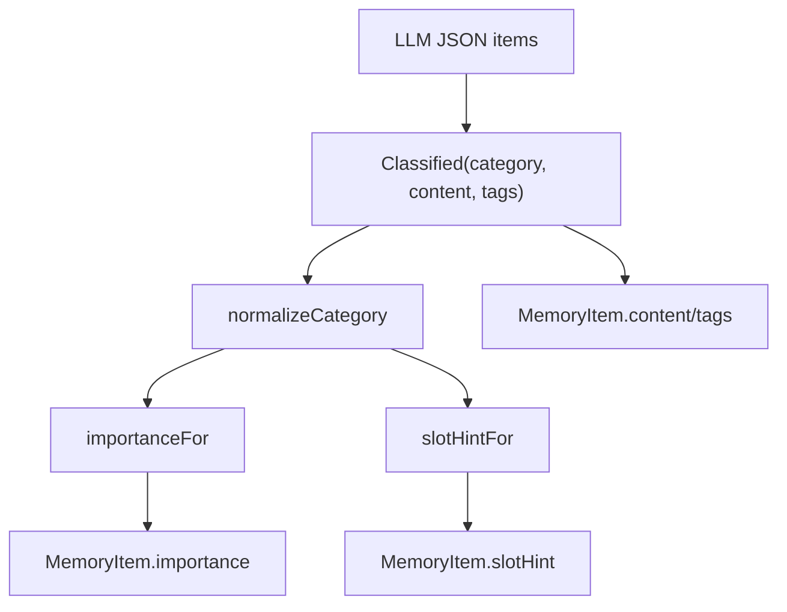

# 29-Classified分类对象和importance映射

## 1. 一句话结论

`Classified` 是 MemoryWriter 内部的分类结果对象，表示 LLM 认为某条信息属于哪一类、内容是什么、有哪些标签。

不同分类会映射到不同 importance。

## 2. 在记忆系统里的位置

它存在于：

```text
MemoryWriter.classify(answer)
  ↓
List<Classified>
  ↓
MemoryWriter.persist(c)
```

它不是数据库表，也不是长期记忆最终对象。

它是从 LLM 输出 JSON 到 MemoryItem 之间的中间对象。

## 3. 源码位置和核心对象

源码位置：

```text
AGI-saber-java/src/main/java/com/agi/assistant/application/chat/MemoryWriter.java
```

真实定义：

```java
private record Classified(String category, String content, List<String> tags) {}
```

分类范围：

```text
identity
preference
tool_failure
policy
general
```

importance 映射：

```java
private static double importanceFor(String category) {
    return switch (category) {
        case "identity" -> 0.9;
        case "policy" -> 0.8;
        case "preference" -> 0.7;
        case "tool_failure" -> 0.6;
        default -> 0.5;
    };
}
```

## 4. 核心流程图



## 5. 源码讲解

### 5.1 先说 Classified 是干什么的

`Classified` 可以理解成：

```text
LLM 抽出来的一条“待写入记忆候选”。
```

它还不是最终数据库记录。

它主要包含三块：

```text
category  这条记忆属于哪类
content   这条记忆的正文
tags      标签列表
```

### 5.2 生活类比

像课后整理笔记时，先给每条笔记贴分类标签：

```text
身份信息：用户姓名是小李
偏好信息：用户喜欢 Java 例子
硬性规则：用户要求以后用中文回答
工具失败：某工具参数缺失导致失败
普通事实：用户正在学习记忆系统
```

分类以后，系统才能决定这条记忆有多重要、放到哪里。

### 5.3 对应到代码：分类归一化

```java
private static String normalizeCategory(String c) { // 把 LLM 输出的 category 清洗成系统支持的分类
    if (c == null) return "general"; // 空分类归为 general
    String s = c.trim().toLowerCase(); // 去空格并转小写
    return switch (s) {
        case "identity", "preference", "tool_failure", "policy", "general" -> s; // 只允许这五类
        default -> "general"; // 其他未知分类统一降级为 general
    };
}
```

先说目的：

```text
LLM 输出的 category 可能不规范。
normalizeCategory 把它清洗成系统支持的 5 类之一。
```

逐行解释：

```text
第 1 行：定义分类归一化方法。
第 2 行：如果 category 是 null，就归为 general。
第 3 行：去掉前后空格，并转成小写。
第 4-5 行：只允许 identity、preference、tool_failure、policy、general。
第 6 行：其他未知分类都降级为 general。
```

为什么要做这一步？

```text
因为 LLM 输出不一定稳定。
它可能输出 Preference、偏好、profile 等。
系统只接受固定枚举，未知值统一兜底成 general。
```

### 5.4 对应到代码：importance 映射

```java
private static double importanceFor(String category) { // 根据记忆类别给默认重要性
    return switch (category) {
        case "identity" -> 0.9; // 身份信息最重要
        case "policy" -> 0.8; // 用户硬性规则很重要
        case "preference" -> 0.7; // 偏好较重要
        case "tool_failure" -> 0.6; // 工具失败经验中等重要
        default -> 0.5; // 普通事实默认 0.5
    };
}
```

先说目的：

```text
不同类型的记忆重要性不同。
identity、policy 通常比 general 更重要。
```

逐行解释：

```text
identity      -> 0.9  用户身份信息最重要
policy        -> 0.8  用户硬性规则很重要
preference    -> 0.7  用户偏好较重要
tool_failure  -> 0.6  工具失败经验中等重要
general       -> 0.5  普通事实默认重要性
```

真实例子：

```text
content = "用户要求以后都用中文回答"
category = policy
importance = 0.8
```

### 5.5 对应到代码：slotHint 映射

```java
private static String slotHintFor(String category) { // 给 promptctx 装配器的槽位提示
    return switch (category) {
        case "identity", "preference" -> "Profile"; // 身份和偏好进入用户画像槽
        case "policy" -> "Constraints"; // 硬性规则进入约束槽
        case "tool_failure" -> "ToolState"; // 工具失败进入工具状态槽
        default -> null; // 普通事实不指定槽位
    };
}
```

先说目的：

```text
slotHint 是给后续 prompt 上下文装配器看的提示。
它告诉系统这条记忆更适合进入哪个槽位。
```

逐行解释：

```text
identity / preference -> Profile
  身份和偏好属于用户画像。

policy -> Constraints
  硬性规则属于约束。

tool_failure -> ToolState
  工具失败经验属于工具状态。

general -> null
  普通事实不指定槽位。
```

### 5.6 分类、重要性、槽位放在一起看

一个完整例子：

```text
LLM 输出：
category = "preference"
content = "用户喜欢 Java 例子"
tags = ["Java"]
```

系统处理后：

```text
category = preference
importance = 0.7
slotHint = Profile
content = 用户喜欢 Java 例子
tags = ["Java"]
```

最后这些字段会进入：

```text
MemoryItem.category
MemoryItem.importance
MemoryItem.slotHint
MemoryItem.content
MemoryItem.tags
```

## 6. 真实例子：在流程中怎么运行

LLM 输出：

```text
{
  "items": [
    {"category":"identity", "content":"用户姓名是小李", "tags":["姓名"]},
    {"category":"policy", "content":"用户要求回答尽量简短", "tags":["回答风格"]},
    {"category":"preference", "content":"用户喜欢 Java 例子", "tags":["Java"]}
  ]
}
```

变成：

```text
Classified("identity", "用户姓名是小李", ["姓名"])
Classified("policy", "用户要求回答尽量简短", ["回答风格"])
Classified("preference", "用户喜欢 Java 例子", ["Java"])
```

importance：

```text
identity   → 0.9
policy     → 0.8
preference → 0.7
```

slotHint：

```text
identity   → Profile
policy     → Constraints
preference → Profile
```

## 7. 容易混淆的点

importance 不是 LLM 输出的。

当前代码里 importance 是 Java 代码根据 category 固定映射出来的。

也就是说：

```text
LLM 决定 category/content/tags
Java 代码决定 importance/slotHint
```

`Classified` 也不是最终长期记忆。

最终长期记忆是：

```text
MemoryItem
```

## 8. 面试怎么说

可以这样说：

```text
MemoryWriter 先让 LLM 输出 category、content、tags，然后封装成 Classified record。
系统只接受 identity、preference、tool_failure、policy、general 五类，未知分类降级为 general。
importance 由代码按类别映射：identity 0.9、policy 0.8、preference 0.7、tool_failure 0.6、general 0.5。
```
