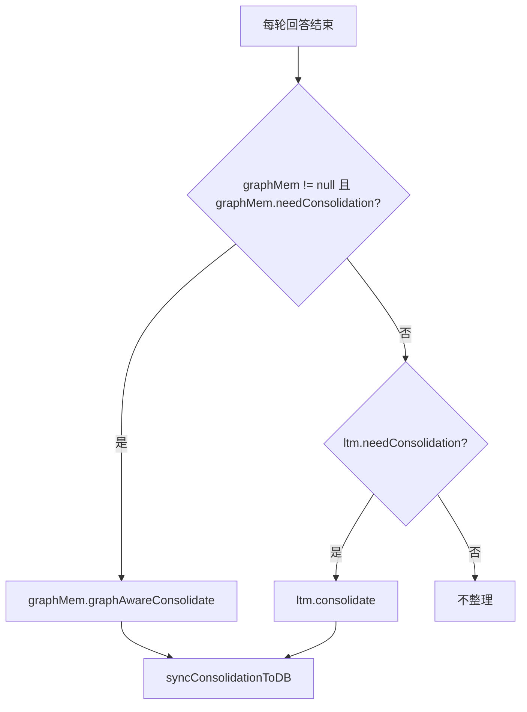

# 30-Consolidation记忆整理触发条件

## 1. 一句话结论

`Consolidation` 是长期记忆整理机制，触发条件是：

```text
consolidationCfg 不为空
triggerInterval > 0
storeCount >= triggerInterval
```

只有长期记忆新增次数达到阈值，才会整理。

## 2. 在记忆系统里的位置

触发检查发生在每轮回答结束后：

```java
new Thread(() -> {
    if (graphMem != null && graphMem.needConsolidation()) {
        ...
    } else if (ltm.needConsolidation()) {
        ...
    }
}).start();
```

也就是说，它是异步后台整理，不阻塞用户当前回答。

## 3. 源码位置和核心对象

配置位置：

```text
AppConfig.ConsolidationConfig
```

默认值：

```java
private double similarityThreshold = 0.80;
private double dedupThreshold = 0.95;
private int ttlDays = 30;
private double decayRate = 0.995;
private double minImportance = 0.3;
private int triggerInterval = 5;
```

触发判断：

```text
LongTermMemory.needConsolidation
GraphMemory.needConsolidation
```

## 4. 核心流程图



## 5. 源码讲解

### 5.1 先说 consolidation 是干什么的

`consolidation` 是记忆整理。

它不是添加记忆时的简单去重。

它会定期对已有长期记忆做全局整理：

```text
1. 重要性随时间衰减
2. 重复记忆删除
3. 相似记忆合并
4. 过期且不重要的记忆删除
5. 数据库同步删除和更新
```

### 5.2 生活类比

添加记忆时去重，像你每次放新文件前看一眼：

```text
这个文件夹里是不是已经有一份差不多的？
```

consolidation 像每隔一段时间大扫除：

```text
把整个文件柜重新整理一遍。
重复的删掉。
相似的合并。
太旧又不重要的扔掉。
```

所以即使添加时已经做了相似度计算，后面仍然需要 consolidation。

### 5.3 对应到代码：触发条件

```java
public boolean needConsolidation() { // 判断是否需要整理长期记忆
    return consolidationCfg != null // 必须已经配置 consolidation
            && consolidationCfg.getTriggerInterval() > 0 // triggerInterval 必须大于 0
            && storeCount >= consolidationCfg.getTriggerInterval(); // 新增计数达到阈值
}
```

逐行解释：

```text
第 1 行：定义 needConsolidation，用来判断是否需要整理长期记忆。
第 2 行：consolidationCfg != null，说明系统有记忆整理配置。
第 3 行：triggerInterval > 0，说明启用按新增次数触发。
第 4 行：storeCount >= triggerInterval，说明新增次数已经达到阈值。
```

三个条件必须同时满足。

### 5.4 三个参数具体是什么意思

```text
consolidationCfg 不为空
```

意思是：

```text
系统已经配置了记忆整理规则。
如果它是 null，说明整理功能没有配置，直接不整理。
```

```text
triggerInterval > 0
```

意思是：

```text
每新增多少条长期记忆后触发一次整理。
如果 triggerInterval <= 0，就不按新增次数触发。
```

```text
storeCount >= triggerInterval
```

意思是：

```text
storeCount 是“真正新增成功”的长期记忆计数。
当它达到 triggerInterval，才需要整理。
```

真实例子：

```text
triggerInterval = 5
storeCount = 4   不整理
storeCount = 5   触发整理
```

### 5.5 对应到代码：主流程怎么触发整理

```java
new Thread(() -> { // 后台线程执行整理
    if (graphMem != null && graphMem.needConsolidation()) { // 有图层时优先图感知整理
        LongTermMemory.ConsolidationResult result = graphMem.graphAwareConsolidate(); // 整理并保护图中心节点
        syncConsolidationToDB(result); // 同步 DB 删除和更新
    } else if (ltm.needConsolidation()) { // 没有图层或图层不需要整理时，检查普通 LTM
        LongTermMemory.ConsolidationResult result = ltm.consolidate(); // 普通整理
        syncConsolidationToDB(result); // 同步 DB
    }
}).start();
```

先说目的：

```text
整理在后台线程执行，不阻塞主回答。
```

逐行解释：

```text
第 1 行：启动后台线程。
第 2 行：如果启用了图记忆，并且图记忆需要整理。
第 3 行：执行图感知整理，保护图中心度高的节点。
第 4 行：把整理结果同步到数据库。
第 5 行：如果没有图层要整理，再检查普通长期记忆。
第 6 行：执行普通长期记忆整理。
第 7 行：同步数据库。
```

注意：

```text
needConsolidation 只判断是否该整理。
真正整理规则在 consolidate 里。
```

## 6. 真实例子：在流程中怎么运行

配置：

```text
triggerInterval = 5
```

每次长期记忆真正新增成功：

```java
storeCount++;
```

新增过程：

```text
第 1 条新增：storeCount = 1，不整理
第 2 条新增：storeCount = 2，不整理
第 3 条新增：storeCount = 3，不整理
第 4 条新增：storeCount = 4，不整理
第 5 条新增：storeCount = 5，触发整理
```

整理开始时：

```java
storeCount = 0;
```

然后重新累计下一轮。

## 7. 容易混淆的点

`storeCount` 只在真正新增长期记忆时增加。

如果添加时被重复判断拦截：

```text
storeClassified 返回 false
```

就不会：

```text
storeCount++
```

因此重复记忆不会推动 consolidation 计数。

另外，consolidation 不只是去重，它还包括：

```text
importance 衰减
重复删除
相似合并
低重要性过期
数据库同步
```

## 8. 面试怎么说

可以这样说：

```text
长期记忆整理通过 needConsolidation 判断触发，要求 consolidationCfg 不为空、triggerInterval 大于 0、storeCount 达到 triggerInterval。storeCount 只在长期记忆真正新增时增加。每轮回答后系统会开后台线程检查，如果有 GraphMemory 就走 graphAwareConsolidate，否则走 LongTermMemory.consolidate，并把删除和更新同步到数据库。
```
