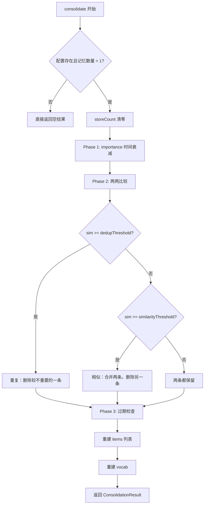
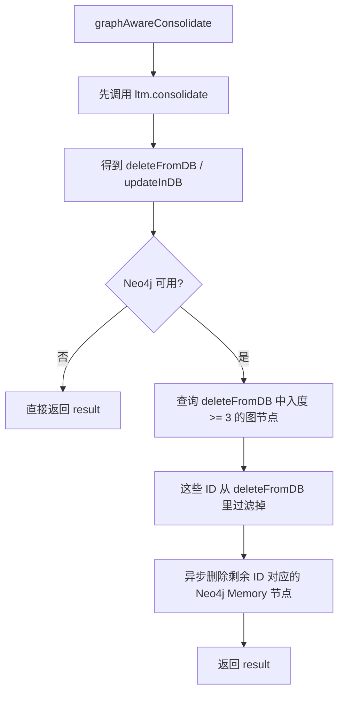

# 31-Consolidation去重合并过期规则

## 1. 一句话结论

`Consolidation` 是长期记忆的后台整理。

它做三件事：

```text
1. 去重：两条记忆几乎一样，只保留一条
2. 合并：两条记忆相似但不完全重复，合成一条更完整的记忆
3. 过期删除：太旧且重要性太低的记忆，删掉
```

如果启用了图记忆，入口会变成：

```java
graphMem.graphAwareConsolidate()
```

但要注意：**当前 Java 版图模式不是重新写一套整理算法，而是在普通长期记忆整理之后，再处理 Neo4j 图节点删除，并尝试保护图中心度高的节点。**

---

## 2. 它在记忆系统里的位置

一轮对话结束后，系统会异步判断是否需要整理记忆。

源码位置：

```text
AGI-saber-java/src/main/java/com/agi/assistant/service/agent/UnifiedAgentService.java
```

对应代码：

```java
new Thread(() -> {
    if (graphMem != null && graphMem.needConsolidation()) {
        LongTermMemory.ConsolidationResult result = graphMem.graphAwareConsolidate();
        syncConsolidationToDB(result);
    } else if (ltm.needConsolidation()) {
        LongTermMemory.ConsolidationResult result = ltm.consolidate();
        syncConsolidationToDB(result);
    }
}).start();
```

大白话：

```text
每次回复结束后，系统开一个后台线程。

如果有图记忆 graphMem：
就走 graphAwareConsolidate。

如果没有图记忆：
就走普通 ltm.consolidate。

整理完以后，再把删除和更新同步到 PostgreSQL。
```

---

## 3. 什么时候触发整理

源码位置：

```text
AGI-saber-java/src/main/java/com/agi/assistant/service/memory/LongTermMemory.java
```

对应代码：

```java
public boolean needConsolidation() {
    return consolidationCfg != null
            && consolidationCfg.getTriggerInterval() > 0
            && storeCount >= consolidationCfg.getTriggerInterval();
}
```

逐行解释：

```text
consolidationCfg != null
说明配置存在，系统允许记忆整理。

triggerInterval > 0
说明设置了触发间隔。

storeCount >= triggerInterval
说明新增记忆数量达到阈值，可以整理一次。
```

例子：

```text
triggerInterval = 5
storeCount = 4
不整理。

triggerInterval = 5
storeCount = 5
开始整理。
```

`GraphMemory.needConsolidation()` 本质上也是调用长期记忆的判断：

```java
public boolean needConsolidation() { return ltm.needConsolidation(); }
```

所以：

```text
图模式不会单独维护一个整理计数器。
它复用 LongTermMemory 的 storeCount。
```

---

## 4. 整理结果对象长什么样

源码：

```java
public static class ConsolidationResult {
    public int deduped;
    public int merged;
    public int expired;
    public List<Integer> deleteFromDB = new ArrayList<>();
    public List<MemoryItem> updateInDB = new ArrayList<>();
}
```

它不是记忆本身，而是“整理报告”。

里面装的是：

```text
deduped
去重删除了几条。

merged
合并了几次。

expired
因为过期删除了几条。

deleteFromDB
哪些长期记忆 ID 后面要从 PostgreSQL 删除。

updateInDB
哪些长期记忆被合并后，需要更新回 PostgreSQL。
```

例子：

```text
deleteFromDB = [102, 105]
意思是 PostgreSQL long_term_memory 表里 id=102 和 id=105 后面要删除。

updateInDB = [MemoryItem{id=101, content="用户喜欢上海；用户常查上海天气"}]
意思是 id=101 这条记忆内容变了，后面要更新数据库。
```

---

## 5. 普通长期记忆整理总流程

源码位置：

```text
AGI-saber-java/src/main/java/com/agi/assistant/service/memory/LongTermMemory.java
```

核心入口：

```java
public ConsolidationResult consolidate() {
    ConsolidationResult result = new ConsolidationResult();
    if (consolidationCfg == null || items.size() <= 1) return result;
    storeCount = 0;
    Set<Integer> removed = new HashSet<>();
    ...
}
```

流程图：



---

## 6. Phase 1：importance 衰减

对应代码：

```java
for (MemoryItem item : items) {
    double days = ChronoUnit.HOURS.between(item.getCreatedAt(), LocalDateTime.now()) / 24.0;
    item.setImportance(item.getImportance() * Math.pow(consolidationCfg.getDecayRate(), days));
}
```

先说它干什么：

```text
记忆放得越久，如果没有再次被使用，重要性会慢慢降低。
```

生活类比：

```text
像复习笔记。
刚写下来的笔记你觉得很重要。
过了很久都没用过，说明它可能没那么重要。
```

逐行解释：

```text
第 1 行：遍历所有长期记忆。

第 2 行：计算这条记忆从创建到现在经过了多少天。

第 3 行：用 decayRate 按时间降低 importance。
```

例子：

```text
原 importance = 0.8
decayRate = 0.99
days = 10

新 importance = 0.8 * 0.99^10
```

---

## 7. Phase 2：两两比较在哪里做

对应代码：

```java
for (int i = 0; i < items.size(); i++) {
    if (removed.contains(i)) continue;
    for (int j = i + 1; j < items.size(); j++) {
        if (removed.contains(j)) continue;
        double sim = itemSimilarity(items.get(i), items.get(j));
        ...
    }
}
```

这就是“两两比较”的位置。

大白话：

```text
拿第 i 条记忆，和它后面的每一条记忆比较。

i = 0 时，比较 0-1、0-2、0-3。
i = 1 时，比较 1-2、1-3。

不会比较 1-0，因为 0-1 已经比过了。
```

例子：

```text
items 有 4 条：

0 用户喜欢上海
1 用户常查上海天气
2 用户喜欢上海
3 用户讨厌太长回答

比较顺序：
0 和 1
0 和 2
0 和 3
1 和 2
1 和 3
2 和 3
```

`removed` 装的是“内存列表下标”，不是数据库 ID。

```text
removed.add(2)
意思是：当前 items 列表里第 2 条后面要从内存中删掉。
```

---

## 8. 相似度 sim 怎么算

对应方法：

```java
private double itemSimilarity(MemoryItem a, MemoryItem b) {
    if (a.getEmbedding() != null && b.getEmbedding() != null
            && !a.getEmbedding().isEmpty() && a.getEmbedding().size() == b.getEmbedding().size()) {
        return cosine(a.getEmbedding(), b.getEmbedding());
    }
    buildVocab(a.getContent());
    buildVocab(b.getContent());
    return cosineArr(textToVector(a.getContent()), textToVector(b.getContent()));
}
```

判断顺序：

```text
优先用 embedding 算余弦相似度。

如果没有 embedding，或者两条 embedding 维度不一致，
就退回到简单文本向量相似度。
```

大白话：

```text
先用大模型生成的语义向量比较。
如果没有语义向量，就用词频向量粗略比较。
```

---

## 9. 去重规则：相似度非常高就删一条

对应代码：

```java
if (sim >= consolidationCfg.getDedupThreshold()) {
    if (items.get(j).getImportance() >= items.get(i).getImportance()) {
        removed.add(i);
        result.deduped++;
        result.deleteFromDB.add(items.get(i).getId());
    } else {
        removed.add(j);
        result.deduped++;
        result.deleteFromDB.add(items.get(j).getId());
    }
}
```

先说目的：

```text
如果两条记忆太像，达到 dedupThreshold，就认为重复。
重复记忆不需要保留两份。
```

删除谁：

```text
保留 importance 更高的那条。
如果 j 的 importance 大于等于 i，就删 i。
否则删 j。
```

例子：

```text
i = MemoryItem{id=101, content="用户喜欢上海", importance=0.6}
j = MemoryItem{id=102, content="用户偏好上海", importance=0.8}
sim = 0.95
dedupThreshold = 0.9

因为 sim >= 0.9，认为重复。
因为 j 更重要，所以删除 i。

removed 加入 i 的下标。
deleteFromDB 加入 101。
deduped 加 1。
```

注意：

```text
这里不是马上删数据库。
这里只是把要删的数据库 ID 放进 deleteFromDB。

真正删 PostgreSQL 在 syncConsolidationToDB。
```

---

## 10. 合并规则：相似但不是重复就合成一条

对应代码：

```java
else if (sim >= consolidationCfg.getSimilarityThreshold()) {
    MemoryItem merged = mergeItems(items.get(i), items.get(j));
    items.set(i, merged);
    removed.add(j);
    result.merged++;
    result.deleteFromDB.add(items.get(j).getId());
    result.updateInDB.add(merged);
}
```

先说目的：

```text
如果两条记忆相关，但没有相似到完全重复，
系统会把它们合成一条更完整的记忆。
```

例子：

```text
i = id=101, content="用户喜欢上海", importance=0.8
j = id=105, content="用户常查上海天气", importance=0.7
sim = 0.78
similarityThreshold = 0.7
dedupThreshold = 0.9

0.78 没到 0.9，所以不是重复。
0.78 到了 0.7，所以可以合并。
```

合并后：

```text
items[i] 变成：
id=101
content="用户喜欢上海；用户常查上海天气"
importance=0.8

j 被标记删除。
deleteFromDB 加入 105。
updateInDB 加入合并后的 id=101。
```

逐行解释：

```text
MemoryItem merged = mergeItems(...)
把 i 和 j 合成一个新 MemoryItem。

items.set(i, merged)
用合并后的记忆替换原来的 i。

removed.add(j)
j 这条旧记忆后面要从内存列表删掉。

result.deleteFromDB.add(items.get(j).getId())
j 的数据库记录后面也要删。

result.updateInDB.add(merged)
i 对应的数据库记录要更新成合并后的内容。
```

---

## 11. mergeItems 到底怎么合并

对应代码：

```java
private MemoryItem mergeItems(MemoryItem a, MemoryItem b) {
    MemoryItem base = a.getImportance() >= b.getImportance() ? a : b;
    MemoryItem other = base == a ? b : a;

    MemoryItem merged = new MemoryItem();
    merged.setId(base.getId());
    merged.setImportance(Math.max(base.getImportance(), other.getImportance()));
    merged.setEmbedding(base.getEmbedding());
    merged.setCreatedAt(base.getCreatedAt());
    merged.setLastAccessed(LocalDateTime.now());
    ...
}
```

第一步：先选 base。

```text
base = 更重要的那条记忆。
other = 另一条记忆。
```

为什么要选 base：

```text
合并后要保留一个数据库 ID。
代码选择保留 base 的 ID。
另一条 other 的 ID 会进入 deleteFromDB。
```

例子：

```text
a.id = 101, importance = 0.8
b.id = 105, importance = 0.7

base = a
other = b

合并后的 id = 101
105 后面删除
```

---

## 12. 内容怎么合并

对应代码：

```java
if (!base.getContent().contains(other.getContent()) && !other.getContent().contains(base.getContent())) {
    merged.setContent(base.getContent() + "；" + other.getContent());
} else if (other.getContent().length() > base.getContent().length()) {
    merged.setContent(other.getContent());
} else {
    merged.setContent(base.getContent());
}
```

分三种情况。

### 情况一：互不包含

```text
base.content = "用户喜欢上海"
other.content = "用户常查上海天气"

两句话谁也不包含谁。
所以拼接：
"用户喜欢上海；用户常查上海天气"
```

对应判断：

```java
!base.getContent().contains(other.getContent())
&& !other.getContent().contains(base.getContent())
```

大白话：

```text
第一句话里没有完整包含第二句话。
第二句话里也没有完整包含第一句话。
这说明两条信息各有内容，所以用分号拼起来。
```

### 情况二：other 更长

```text
base.content = "用户喜欢上海"
other.content = "用户喜欢上海，尤其关注天气"

other 包含 base，而且 other 更长。
所以保留 other。
```

### 情况三：base 更长或一样长

```text
base.content = "用户喜欢上海，尤其关注天气"
other.content = "用户喜欢上海"

base 已经包含 other。
所以保留 base。
```

---

## 13. embedding 怎么合并

先说结论：

```text
两条记忆合并成一条后，
它们的 embedding 也要合并成一个新的 embedding。

代码不是重新调用大模型生成 embedding，
而是把两个旧 embedding 按 importance 做加权平均。
```

生活类比：

```text
两条记忆像两份笔记。

A 笔记很重要，权重 0.8。
B 笔记没那么重要，权重 0.2。

合并新笔记时，内容和方向要更靠近 A，
不能 A 和 B 各占一半。
```

对应代码：

```java
if (base.getEmbedding() != null && other.getEmbedding() != null
        && !base.getEmbedding().isEmpty() && base.getEmbedding().size() == other.getEmbedding().size()) {
    double wA = base.getImportance(), wB = other.getImportance();
    double total = wA + wB;
    if (total > 0) {
        List<Double> mergedEmb = new ArrayList<>();
        for (int i = 0; i < base.getEmbedding().size(); i++) {
            mergedEmb.add((base.getEmbedding().get(i) * wA + other.getEmbedding().get(i) * wB) / total);
        }
        merged.setEmbedding(mergedEmb);
    }
}
```

这段代码先判断能不能合并：

```text
base.getEmbedding() != null
base 有 embedding。

other.getEmbedding() != null
other 也有 embedding。

!base.getEmbedding().isEmpty()
base 的 embedding 不是空数组。

base.getEmbedding().size() == other.getEmbedding().size()
两条 embedding 维度一样。
只有维度一样，才能逐位相加。
```

如果一条是 3 维，一条是 4 维，就不能这样算：

```text
[0.6, 0.2, 0.4]
[0.1, 0.8, 0.6, 0.9]

第 4 位没有对应位置，所以代码不会合并。
```

然后取权重：

```java
double wA = base.getImportance(), wB = other.getImportance();
double total = wA + wB;
```

翻译：

```text
wA = base 这条记忆的重要性
wB = other 这条记忆的重要性
total = 两条记忆的重要性总和
```

完整例子：

```text
记忆 A：
content = "用户喜欢上海"
importance = 0.8
embedding = [0.6, 0.2, 0.4]

记忆 B：
content = "用户常查上海天气"
importance = 0.2
embedding = [0.1, 0.8, 0.6]
```

合并公式是：

```text
新 embedding 第 i 位 =
(A 的第 i 位 * A 的重要性 + B 的第 i 位 * B 的重要性)
/ (A 的重要性 + B 的重要性)
```

对应代码就是这一行：

```java
mergedEmb.add((base.getEmbedding().get(i) * wA + other.getEmbedding().get(i) * wB) / total);
```

现在逐位算。

第 1 位：

```text
(0.6 * 0.8 + 0.1 * 0.2) / (0.8 + 0.2)
= (0.48 + 0.02) / 1.0
= 0.5
```

第 2 位：

```text
(0.2 * 0.8 + 0.8 * 0.2) / (0.8 + 0.2)
= (0.16 + 0.16) / 1.0
= 0.32
```

第 3 位：

```text
(0.4 * 0.8 + 0.6 * 0.2) / (0.8 + 0.2)
= (0.32 + 0.12) / 1.0
= 0.44
```

所以合并后的 embedding 是：

```text
[0.5, 0.32, 0.44]
```

再对应循环：

```java
for (int i = 0; i < base.getEmbedding().size(); i++) {
    mergedEmb.add((base.getEmbedding().get(i) * wA + other.getEmbedding().get(i) * wB) / total);
}
```

循环怎么跑：

```text
i = 0
算第 1 位，得到 0.5，放进 mergedEmb。

i = 1
算第 2 位，得到 0.32，放进 mergedEmb。

i = 2
算第 3 位，得到 0.44，放进 mergedEmb。
```

最后：

```java
merged.setEmbedding(mergedEmb);
```

翻译：

```text
把新算出来的 embedding 放到合并后的 MemoryItem 里。
以后这条合并记忆再参与召回、去重、相似度计算，
用的就是这个新 embedding。
```

为什么不用普通平均：

```text
普通平均是：
(A + B) / 2

加权平均是：
(A * A重要性 + B * B重要性) / 总重要性
```

区别：

```text
普通平均认为 A 和 B 一样重要。
加权平均认为 importance 高的记忆更重要。

在例子里 A 的 importance 是 0.8，B 是 0.2，
所以合并后的 embedding 会更靠近 A。
```

---

## 14. Phase 3：过期删除规则

对应代码：

```java
for (int i = 0; i < items.size(); i++) {
    if (removed.contains(i)) continue;
    double days = ChronoUnit.HOURS.between(items.get(i).getCreatedAt(), LocalDateTime.now()) / 24.0;
    if (consolidationCfg.getTtlDays() > 0
            && days > consolidationCfg.getTtlDays()
            && items.get(i).getImportance() < consolidationCfg.getMinImportance()) {
        removed.add(i);
        result.expired++;
        result.deleteFromDB.add(items.get(i).getId());
    }
}
```

删除条件必须同时满足：

```text
1. ttlDays > 0
说明启用了过期删除。

2. days > ttlDays
说明这条记忆已经超过存活时间。

3. importance < minImportance
说明这条记忆已经不重要。
```

例子：

```text
ttlDays = 30
minImportance = 0.3

记忆 A：
创建 40 天前
importance = 0.2
删除。

记忆 B：
创建 40 天前
importance = 0.8
不删除，因为还重要。

记忆 C：
创建 5 天前
importance = 0.2
不删除，因为还没过期。
```

---

## 15. 内存里到底怎么删除

前面所有删除都只是标记：

```java
removed.add(i);
```

真正从内存列表删除是在最后重建列表：

```java
List<MemoryItem> newItems = new ArrayList<>();
for (int i = 0; i < items.size(); i++) {
    if (!removed.contains(i)) newItems.add(items.get(i));
}
items.clear();
items.addAll(newItems);
rebuildVocab();
```

大白话：

```text
代码不是一边遍历一边 remove。
而是先记下来哪些下标要删除。

最后新建一个 newItems，
只把没被删除的记忆放进去。

然后清空旧 items，
再把 newItems 放回 items。
```

为什么这样做：

```text
因为遍历 List 时直接删除元素，容易导致下标变化和漏比较。
```

---

## 16. PostgreSQL 里怎么删除和更新

`consolidate()` 只整理内存，并返回整理结果。

数据库同步在：

```text
AGI-saber-java/src/main/java/com/agi/assistant/service/agent/UnifiedAgentService.java
```

对应代码：

```java
private void syncConsolidationToDB(LongTermMemory.ConsolidationResult result) {
    if (!result.deleteFromDB.isEmpty()) {
        infra.deleteLongTermItems(result.deleteFromDB);
        log.info("记忆合并：删除 {} 条（去重={}, 合并={}, 过期={}）",
                result.deduped + result.merged + result.expired,
                result.deduped, result.merged, result.expired);
    }
    for (MemoryItem item : result.updateInDB) {
        String embJson = "null";
        try { if (item.getEmbedding() != null) embJson = mapper.writeValueAsString(item.getEmbedding()); } catch (Exception ignored) {}
        infra.updateLongTermItem(item.getId(), item.getContent(), item.getImportance(), embJson);
    }
}
```

分两步：

```text
第一步：
deleteFromDB 里的 ID，调用 infra.deleteLongTermItems 删除数据库记录。

第二步：
updateInDB 里的 MemoryItem，调用 infra.updateLongTermItem 更新数据库记录。
```

例子：

```text
deleteFromDB = [105]
updateInDB = [MemoryItem{id=101, content="用户喜欢上海；用户常查上海天气"}]

数据库操作就是：
1. 删除 id=105
2. 更新 id=101 的 content / importance / embedding
```

---

## 17. 图模式 graphAwareConsolidate 做什么

源码位置：

```text
AGI-saber-java/src/main/java/com/agi/assistant/service/memory/GraphMemory.java
```

对应代码：

```java
public LongTermMemory.ConsolidationResult graphAwareConsolidate() {
    LongTermMemory.ConsolidationResult result = ltm.consolidate();
    if (kg == null || !kg.available()) return result;

    List<Integer> protectedIds = kg.getHighCentralityMemoryIds(result.deleteFromDB, 3);
    if (!protectedIds.isEmpty()) {
        Set<Integer> protSet = new HashSet<>(protectedIds);
        List<Integer> filtered = new ArrayList<>();
        for (int id : result.deleteFromDB) {
            if (!protSet.contains(id)) filtered.add(id);
        }
        log.info("图中心度保护：{} 条记忆免于删除（入度≥3）",
                result.deleteFromDB.size() - filtered.size());
        result.deleteFromDB = filtered;
    }

    List<Integer> toDelete = new ArrayList<>(result.deleteFromDB);
    new Thread(() -> {
        for (int id : toDelete) kg.deleteMemoryNode(id);
    }, "graph-mem-delete").start();
    return result;
}
```

图模式流程：



---

## 18. 图模式的“保护”到底保护什么

这点非常容易误解。

当前 Java 版代码顺序是：

```java
LongTermMemory.ConsolidationResult result = ltm.consolidate();
```

也就是说：

```text
先执行普通长期记忆整理。
普通整理已经把内存 items 里的删除项删掉了。
```

后面图模式做的是：

```text
从 result.deleteFromDB 中移除高中心度 ID。
```

这实际保护的是：

```text
1. 不从 PostgreSQL 删除这些 ID
2. 不从 Neo4j 删除这些节点
```

但它当前没有把已经从 `ltm.items` 中删除的记忆重新放回内存。

所以要准确理解为：

```text
当前 Java 版图保护主要保护 DB / Neo4j 删除动作，
不是完整保护内存中的 MemoryItem。
```

面试时可以这样说：

```text
图模式在 consolidate 之后，会对待删除 ID 做一次图中心度检查。
如果某些待删除记忆在 Neo4j 中入度较高，说明它被很多记忆关联，系统会从 deleteFromDB 中过滤掉，避免数据库和图节点被删。
但当前实现里 ltm.consolidate 已经先重建了内存列表，所以这是一个需要改进的点：如果要真正保护中心节点，应该在 LTM 删除前就把 protectedIds 纳入删除决策。
```

---

## 19. 图中心度是怎么判断的

对应代码：

```java
List<Integer> protectedIds = kg.getHighCentralityMemoryIds(result.deleteFromDB, 3);
```

意思是：

```text
只检查本次准备删除的那些 ID。
如果某个 ID 在图里的入度 >= 3，就认为它比较重要，需要保护。
```

KGStore 代码：

```java
public List<Integer> getHighCentralityMemoryIds(List<Integer> candidates, int threshold) {
    if (!available() || candidates == null || candidates.isEmpty()) return List.of();
    ...
    String query = "MATCH (m:Memory) WHERE m.mem_id IN $ids " +
            "WITH m, size([(m)<-[]-() | 1]) AS indegree " +
            "WHERE indegree >= $threshold RETURN m.mem_id AS id";
    ...
}
```

大白话：

```text
Neo4j 里每条记忆是一个 Memory 节点。

如果很多边指向这个节点，
说明它被很多记忆引用或关联。

入度越高，说明它越像“中心记忆”。
```

例子：

```text
deleteFromDB = [101, 105, 108]

Neo4j 中：
101 入度 = 4
105 入度 = 1
108 入度 = 0

threshold = 3

protectedIds = [101]

最后：
deleteFromDB 从 [101,105,108]
变成 [105,108]
```

---

## 20. 图模式怎么删除 Neo4j 节点

对应代码：

```java
List<Integer> toDelete = new ArrayList<>(result.deleteFromDB);
new Thread(() -> {
    for (int id : toDelete) kg.deleteMemoryNode(id);
}, "graph-mem-delete").start();
```

大白话：

```text
把最终仍然要删除的 ID 复制到 toDelete。
开一个后台线程。
对每个 ID 调用 kg.deleteMemoryNode。
```

KGStore 删除节点：

```java
public void deleteMemoryNode(int memId) {
    if (!available()) return;
    try (Session s = neo4j.session()) {
        s.run("MATCH (m:Memory {mem_id: $id}) DETACH DELETE m",
                Values.parameters("id", (long) memId));
    } catch (Exception e) {
        log.warn("Neo4j DeleteMemoryNode 失败 (id={}): {}", memId, e.getMessage());
    }
}
```

`DETACH DELETE` 的意思：

```text
删除这个 Memory 节点。
同时删除它连接的边。
```

例子：

```text
删除 mem_id = 105 的 Memory 节点。

如果它有：
101 -[:SIMILAR_TO]-> 105
105 -[:FOLLOWS]-> 108

这些边也会一起删掉。
```

---

## 21. 图模式和普通模式的区别

| 对比项 | 普通 LTM consolidate | 图模式 graphAwareConsolidate |
|---|---|---|
| 整理入口 | `ltm.consolidate()` | `graphMem.graphAwareConsolidate()` |
| 去重 | 有 | 复用 LTM 的去重 |
| 合并 | 有 | 复用 LTM 的合并 |
| 过期删除 | 有 | 复用 LTM 的过期删除 |
| 图中心度保护 | 没有 | 有，但当前主要保护 DB / Neo4j 删除 |
| 删除 Neo4j 节点 | 没有 | 有，调用 `kg.deleteMemoryNode` |
| 是否重新计算 FOLLOWS / SIMILAR_TO | 没有 | 没有 |
| 是否重连合并后的图边 | 没有 | 当前没有 |

所以图模式不是：

```text
重新按图算法合并所有记忆。
```

而是：

```text
普通 LTM 整理 + 图中心度过滤 + Neo4j 节点删除同步。
```

---

## 22. 一个完整例子跑一遍

假设内存里有 4 条记忆：

```text
items[0] = id=101, content="用户喜欢上海", importance=0.8
items[1] = id=102, content="用户偏好上海", importance=0.6
items[2] = id=105, content="用户常查上海天气", importance=0.7
items[3] = id=110, content="用户以前问过一次篮球新闻", importance=0.1, createdAt=60天前
```

配置：

```text
dedupThreshold = 0.9
similarityThreshold = 0.7
ttlDays = 30
minImportance = 0.3
```

### 第一步：两两比较

```text
101 和 102：
sim = 0.95
超过 dedupThreshold。
认为重复。
保留 importance 更高的 101，删除 102。

101 和 105：
sim = 0.78
没有超过 dedupThreshold，但超过 similarityThreshold。
合并成：
101 = "用户喜欢上海；用户常查上海天气"
删除 105。

110：
过期 60 天，importance=0.1，小于 minImportance。
删除。
```

### 第二步：内存变化

整理后内存里只剩：

```text
id=101, content="用户喜欢上海；用户常查上海天气"
```

### 第三步：整理结果

```text
deduped = 1
merged = 1
expired = 1
deleteFromDB = [102, 105, 110]
updateInDB = [id=101, content="用户喜欢上海；用户常查上海天气"]
```

### 第四步：如果启用图模式

假设 Neo4j 里：

```text
102 入度 = 0
105 入度 = 4
110 入度 = 0
```

图保护阈值是 3：

```text
protectedIds = [105]
```

那么：

```text
deleteFromDB 从 [102,105,110]
变成 [102,110]
```

然后：

```text
PostgreSQL 删除 102、110。
Neo4j 删除 102、110 节点。
PostgreSQL 更新 101。
```

重要提醒：

```text
当前 Java 实现里，105 在 LTM 内存列表中已经被普通 consolidate 删除。
图保护只阻止 105 从 DB / Neo4j 删除。
这就是当前实现的边界。
```

---

## 23. 容易混淆的点

### 误区一：deleteFromDB 就是已经删了数据库

不是。

```text
deleteFromDB 只是待删除 ID 列表。
真正删除数据库在 syncConsolidationToDB。
```

### 误区二：removed 里放的是数据库 ID

不是。

```text
removed 放的是 items 列表下标。
deleteFromDB 放的才是数据库 ID。
```

### 误区三：合并就是直接拼字符串

不完全是。

```text
内容互不包含时才拼接。
如果一条包含另一条，就保留更完整的那条。
embedding 会按 importance 做加权平均。
```

### 误区四：图模式会重新合并图关系

当前不会。

```text
图模式当前没有重连边，也没有重新计算 SIMILAR_TO。
它主要做图中心度保护和 Neo4j 删除同步。
```

### 误区五：图保护完全阻止记忆删除

当前 Java 版不是完全阻止。

```text
因为 ltm.consolidate 先执行，内存 items 已经重建。
后面的图保护只过滤 deleteFromDB。
```

---

## 24. 如果要改这个功能，改哪里

### 想改触发频率

改配置：

```text
triggerInterval
```

影响：

```text
多少次新增记忆后整理一次。
```

### 想改重复判断严格程度

改：

```text
dedupThreshold
```

越高：

```text
越不容易判定重复。
```

越低：

```text
越容易删掉相似记忆。
```

### 想改合并判断严格程度

改：

```text
similarityThreshold
```

越低：

```text
越容易把相关记忆合并。
```

### 想改过期删除

改：

```text
ttlDays
minImportance
```

### 想让图保护真正保护内存

当前要改代码结构。

建议方向：

```text
不要先 ltm.consolidate 再查图保护。

应该在删除前，先计算候选删除 ID，
再查 Neo4j protectedIds，
最后只删除未受保护的记忆。
```

也就是把“图保护”提前到 LTM 删除决策之前。

---

## 25. 合并后怎么保证内存、数据库、图记忆一致

先给结论：

```text
当前 Java 版不是强事务一致。
它是“内存先整理，生成变更清单，然后同步 PostgreSQL 和 Neo4j”。
```

也就是说，它不是这样：

```text
内存删除
PostgreSQL 删除
Neo4j 删除

三件事放在一个事务里同时成功或同时失败。
```

而是这样：

```text
1. LongTermMemory.consolidate() 先改内存 items
2. consolidate() 返回 ConsolidationResult
3. syncConsolidationToDB(result) 根据 result 同步 PostgreSQL
4. graphAwareConsolidate() 根据 result 异步删除 Neo4j 节点
```

### 25.1 ConsolidationResult 就是“同步清单”

可以把 `ConsolidationResult` 理解成一张整理后的任务单。

源码对象是：

```java
public static class ConsolidationResult {
    public int deduped;                         // 去重删除了几条
    public int merged;                          // 合并了几组
    public int expired;                         // 过期删除了几条
    public List<Integer> deleteFromDB = new ArrayList<>(); // 需要从数据库删除的记忆 ID
    public List<MemoryItem> updateInDB = new ArrayList<>(); // 需要更新到数据库的合并后记忆
}
```

新人可以这样理解：

```text
内存整理完以后，不能只改内存。
数据库和图数据库也要跟着改。

那怎么告诉它们要改什么？

就靠 ConsolidationResult。
```

它里面主要有两类信息：

```text
deleteFromDB：
哪些旧记忆要删除。

updateInDB：
哪些保留下来的记忆内容变了，需要更新。
```

### 25.2 普通长期记忆模式怎么同步

普通模式没有 Neo4j，只需要同步两份：

```text
1. Java 内存里的 items
2. PostgreSQL 里的 long_term_memory 表
```

代码入口在：

```java
LongTermMemory.ConsolidationResult result = ltm.consolidate();
syncConsolidationToDB(result);
```

执行顺序是：

```text
第一步：ltm.consolidate() 直接修改内存 items。
第二步：返回 result。
第三步：syncConsolidationToDB(result) 根据 result 修改 PostgreSQL。
```

对应到代码：

```java
private void syncConsolidationToDB(LongTermMemory.ConsolidationResult result) {
    if (!result.deleteFromDB.isEmpty()) {
        infra.deleteLongTermItems(result.deleteFromDB);
    }

    for (MemoryItem item : result.updateInDB) {
        String embJson = "null";
        try {
            if (item.getEmbedding() != null) {
                embJson = mapper.writeValueAsString(item.getEmbedding());
            }
        } catch (Exception ignored) {}

        infra.updateLongTermItem(
                item.getId(),
                item.getContent(),
                item.getImportance(),
                embJson
        );
    }
}
```

逐步解释：

```text
result.deleteFromDB 不为空：
说明有旧记忆被去重、合并或过期删除。
这些 ID 要从 PostgreSQL 删除。

result.updateInDB：
说明有记忆被合并后内容变了。
这些 MemoryItem 要更新回 PostgreSQL。
```

举例：

```text
内存里原来有：

ID=10 content="用户喜欢 Java"
ID=12 content="用户喜欢 Java 后端"

合并后保留 ID=12：

ID=12 content="用户喜欢 Java 后端；用户喜欢 Java"

那么 result 里会有：

deleteFromDB = [10]
updateInDB = [MemoryItem(id=12, content="用户喜欢 Java 后端；用户喜欢 Java")]
```

同步到数据库时：

```text
PostgreSQL 删除 ID=10。
PostgreSQL 更新 ID=12 的 content、importance、embedding。
```

这样普通模式下：

```text
内存 items 里只有 ID=12。
PostgreSQL 里也只有更新后的 ID=12。
```

### 25.3 图记忆模式怎么同步

图记忆模式有三份数据：

```text
1. Java 内存：LongTermMemory.items
2. PostgreSQL：长期记忆表
3. Neo4j：Memory 节点和关系边
```

代码入口是：

```java
LongTermMemory.ConsolidationResult result = graphMem.graphAwareConsolidate();
syncConsolidationToDB(result);
```

`graphAwareConsolidate()` 做三件事：

```java
public LongTermMemory.ConsolidationResult graphAwareConsolidate() {
    LongTermMemory.ConsolidationResult result = ltm.consolidate();
    if (kg == null || !kg.available()) return result;

    List<Integer> protectedIds = kg.getHighCentralityMemoryIds(result.deleteFromDB, 3);

    if (!protectedIds.isEmpty()) {
        Set<Integer> protSet = new HashSet<>(protectedIds);
        List<Integer> filtered = new ArrayList<>();
        for (int id : result.deleteFromDB) {
            if (!protSet.contains(id)) filtered.add(id);
        }
        result.deleteFromDB = filtered;
    }

    List<Integer> toDelete = new ArrayList<>(result.deleteFromDB);
    new Thread(() -> {
        for (int id : toDelete) kg.deleteMemoryNode(id);
    }, "graph-mem-delete").start();

    return result;
}
```

逐步解释：

```text
第一步：
先调用 ltm.consolidate()。
这一步已经把 Java 内存 items 整理好了。

第二步：
拿 result.deleteFromDB 去 Neo4j 查这些节点的入度。
如果某个节点入度 >= 3，说明它在图里被很多记忆指向，属于中心节点。

第三步：
中心节点从 deleteFromDB 里拿掉。
也就是不删除 PostgreSQL 和 Neo4j 里的这个节点。

第四步：
剩下的 deleteFromDB 里的 ID，异步调用 kg.deleteMemoryNode(id) 删除 Neo4j 节点。

第五步：
外层再调用 syncConsolidationToDB(result)，删除 PostgreSQL，并更新合并后的记忆。
```

Neo4j 删除节点的代码是：

```java
public void deleteMemoryNode(int memId) {
    if (!available()) return;
    try (Session s = neo4j.session()) {
        s.run("MATCH (m:Memory {mem_id: $id}) DETACH DELETE m",
                Values.parameters("id", (long) memId));
    } catch (Exception e) {
        log.warn("Neo4j DeleteMemoryNode 失败 (id={}): {}", memId, e.getMessage());
    }
}
```

这里的关键是：

```text
DETACH DELETE 会删除 Memory 节点，
也会一起删除连在这个节点上的边。
```

所以 Neo4j 不需要手动先删边再删点。

### 25.4 一致性靠什么保证

当前代码靠三个东西保证基本一致：

```text
第一，统一 ID。
MemoryItem.id、PostgreSQL id、Neo4j mem_id 使用同一个 ID。

第二，ConsolidationResult。
内存整理时把“要删除谁、要更新谁”记录下来。

第三，同一份 result。
PostgreSQL 和 Neo4j 都根据同一个 result.deleteFromDB 做删除。
```

也就是说：

```text
内存负责先做决策。
result 负责记录决策。
DB 和图负责执行这个决策。
```

### 25.5 当前代码的真实边界

这里必须说清楚：

```text
它不是严格强一致。
它是最终一致。
```

原因有三个。

第一，consolidation 是后台线程执行：

```java
new Thread(() -> {
    if (graphMem != null && graphMem.needConsolidation()) {
        LongTermMemory.ConsolidationResult result = graphMem.graphAwareConsolidate();
        syncConsolidationToDB(result);
    }
}).start();
```

这说明：

```text
用户请求不会等待整理完全完成。
整理在后台慢慢做。
```

第二，Neo4j 删除也是异步线程：

```java
new Thread(() -> {
    for (int id : toDelete) kg.deleteMemoryNode(id);
}, "graph-mem-delete").start();
```

这说明：

```text
PostgreSQL 可能已经删了，
但 Neo4j 节点可能还在后台删除中。
短时间内可能存在不一致。
```

第三，当前图保护只过滤 `deleteFromDB`：

```text
graphAwareConsolidate() 先 ltm.consolidate()
再查 Neo4j protectedIds
再从 result.deleteFromDB 里过滤 protectedIds
```

问题是：

```text
ltm.consolidate() 已经把内存 items 重建完了。
如果某个 ID 已经从内存 items 删除，
后面再把它从 deleteFromDB 里过滤掉，
只能保护它不从 PostgreSQL / Neo4j 删除，
不能自动把它恢复到内存 items。
```

所以当前 Java 版图保护的准确说法是：

```text
图保护主要保护数据库和 Neo4j 节点不被删除。
它不严格保证被保护节点仍然留在当前 JVM 内存 items 中。
```

### 25.6 如果面试官问怎么改得更一致

可以这样回答：

```text
我会把 consolidation 改成“先计划，后执行”的两阶段结构。
```

现在是：

```text
边判断，边修改内存。
```

更好的结构是：

```text
第一阶段：plan
只计算哪些记忆要删除、哪些要合并、哪些是图中心节点。
不修改内存、不删 DB、不删 Neo4j。

第二阶段：apply
根据最终 plan，同时更新内存、PostgreSQL 和 Neo4j。
```

更具体一点：

```text
1. 先两两比较，生成 candidatesToDelete 和 candidatesToUpdate。
2. 如果启用图记忆，先查 Neo4j 中心度，过滤 protectedIds。
3. 得到 finalDeleteIds 和 finalUpdateItems。
4. 更新内存 items。
5. 更新 PostgreSQL。
6. 删除 Neo4j 节点。
7. 如果 DB 或 Neo4j 失败，记录补偿任务，后续重试。
```

这样图保护就能真正影响内存删除决策。

---

## 26. 面试怎么说

可以这样回答：

```text
长期记忆会在新增数量达到 triggerInterval 后触发后台整理。
整理分三阶段：先按时间衰减 importance，然后两两比较记忆相似度，超过 dedupThreshold 的认为重复，只保留 importance 更高的；超过 similarityThreshold 但没达到去重阈值的会调用 mergeItems 合并，保留更重要记忆的 ID，删除另一条，并把合并后的内容加入 updateInDB；最后对超过 ttlDays 且 importance 低于 minImportance 的记忆做过期删除。

删除分三层：removed 只是内存列表下标，最后通过重建 items 从内存删除；deleteFromDB 是数据库 ID，后续由 syncConsolidationToDB 删除 PostgreSQL；如果启用图记忆，graphAwareConsolidate 会在 LTM 整理结果基础上检查 Neo4j 中待删除节点的入度，入度大于等于 3 的节点会从 deleteFromDB 过滤掉，剩余 ID 会异步调用 deleteMemoryNode 从 Neo4j 删除。

当前 Java 版图模式需要注意一个边界：它先调用 ltm.consolidate，所以图保护主要保护 DB 和 Neo4j 删除，并没有把已经从内存 items 删除的节点恢复回来。如果要更严格的图感知整理，应该把中心度保护提前到删除决策前。
```
